# AutoProjectManagement - راهنمای شروع سریع

## 🚀 راهنمای شروع سریع

به **AutoProjectManagement** خوش آمدید - راه حل جامع مدیریت پروژه خودکار شما با **داشبوردهای پیشرفته زمان واقعی**. این راهنما شما را در عرض چند دقیقه با توضیحات دقیق، نمودارها، مثال‌های عملی و **مدیریت بصری پروژه از طریق داشبوردهای هوشمند** راه‌اندازی می‌کند.

> 💡 **نکته کلیدی**: داشبوردهای AutoProjectManagement قلب سیستم مدیریت پروژه شما هستند و دید کاملی از سلامت، پیشرفت و عملکرد پروژه ارائه می‌دهند.

---

## 📋 فهرست مطالب
1. [پیش‌نیازها](#پیش‌نیازها)
2. [نصب](#نصب)
3. [راه‌اندازی اولین پروژه](#راه‌اندازی-اولین-پروژه)
4. [پیکربندی](#پیکربندی)
5. [استفاده پایه](#استفاده-پایه)
6. [درک سیستم](#درک-سیستم)
7. [گردش کارهای رایج](#گردش-کارهای-رایج)
8. [عیب‌یابی](#عیب‌یابی)
9. [مراحل بعدی](#مراحل-بعدی)

---

## 🔧 پیش‌نیازها

### نیازمندی‌های سیستم

| مؤلفه              | حداقل            | توصیه شده |
| ------------------ | ---------------- | --------- |
| **پایتون**         | 3.8+             | 3.9+      |
| **گیت**            | 2.20+            | 2.30+     |
| **سیستم عامل**     | لینوکس/مک/ویندوز | لینوکس/مک |
| **رم**             | 4GB              | 8GB+      |
| **فضای ذخیره‌سازی** | 1GB آزاد         | 5GB+ آزاد |

### ابزارهای مورد نیاز

```bash
# بررسی نسخه پایتون
python --version  # باید 3.8+ باشد

# بررسی نسخه گیت
git --version     # باید 2.20+ باشد

# بررسی pip
pip --version
```

---

## 📦 نصب

### گزینه 1: نصب از PyPI (توصیه شده)

```bash
# نصب از PyPI
pip install autoprojectmanagement

# تأیید نصب
autoproject --version
```

### گزینه 2: از منبع

```bash
# کلون کردن مخزن
git clone https://github.com/autoprojectmanagement/autoprojectmanagement.git
cd autoprojectmanagement

# نصب وابستگی‌ها
pip install -r requirements.txt

# نصب در حالت توسعه
pip install -e .
```

### گزینه 3: نصب داکر

```bash
# کشیدن تصویر داکر
docker pull autoprojectmanagement/autoprojectmanagement:latest

# اجرای کانتینر
docker run -v $(pwd):/workspace autoprojectmanagement/autoprojectmanagement
```

---

## 🎯 راه‌اندازی اولین پروژه

### مرحله 1: مقداردهی اولیه پروژه شما

```bash
# ایجاد دایرکتوری پروژه جدید
mkdir my-first-project && cd my-first-project

# مقداردهی اولیه مخزن گیت
git init

# مقداردهی اولیه AutoProjectManagement
autoproject init
```

### مرحله 2: ساختار پروژه

پس از مقداردهی اولیه، پروژه شما این ساختار را خواهد داشت:


### مرحله 3: پیکربندی پایه

اولین پیکربندی پروژه خود را ایجاد کنید:

```json
// .auto_project/config/auto_config.json
{
  "project": {
    "name": "اولین پروژه من با مدیریت خودکار",
    "description": "یادگیری AutoProjectManagement",
    "version": "1.0.0",
    "team_size": 1,
    "start_date": "2024-08-14",
    "target_date": "2024-09-14"
  },
  "automation": {
    "auto_commit": true,
    "commit_threshold": 5,
    "check_interval": 300,
    "generate_reports": true
  },
  "modules": {
    "enabled": ["all"]
  }
}
```

---

## ⚙️ پیکربندی

### نمای کلی پیکربندی

```mermaid
graph LR
    A[فایل‌های پیکربندی] --> B[تنظیمات سیستم]
    A --> C[تنظیمات ماژول]
    A --> D[ترجیحات کاربر]
    A --> E[🆕 تنظیمات داشبورد]
    
    B --> F[قوانین کامیت خودکار]
    B --> G[فواصل نظارت]
    B --> H[تولید گزارش]
    
    C --> I[ریسک ارتباطی]
    C --> J[مدیریت کیفیت]
    C --> K[تخصیص منابع]
    
    D --> L[ترجیحات اعلان]
    D --> M[تم‌های رابط کاربری]
    D --> N[تنظیمات زبان]
    
    E --> O[ویجت‌های داشبورد]
    E --> P[نرخ به‌روزرسانی]
    E --> Q[آستانه هشدار]
    E --> R[طرح‌بندی سفارشی]
    E --> S[ادغام‌های خارجی]
```

### بخش‌های کلیدی پیکربندی

#### 1. پیکربندی پروژه
```json
{
  "project": {
    "name": "string",
    "description": "string",
    "version": "string",
    "team_members": ["member1", "member2"],
    "milestones": [
      {
        "name": "فاز 1",
        "target_date": "2024-09-01",
        "deliverables": ["feature1", "feature2"]
      }
    ]
  }
}
```

#### 2. تنظیمات اتوماسیون
```json
{
  "automation": {
    "auto_commit": {
      "enabled": true,
      "threshold": 5,
      "exclude_patterns": ["*.log", "*.tmp"]
    },
    "monitoring": {
      "check_interval": 300,
      "file_extensions": ["*.py", "*.js", "*.md"]
    },
    "reporting": {
      "frequency": "daily",
      "format": "markdown",
      "recipients": ["team@company.com"]
    }
  }
}
```

#### 3. پیکربندی ماژول
```json
{
  "modules": {
    "communication_risk": {
      "enabled": true,
      "risk_threshold": 7,
      "notification_channels": ["slack", "email"]
    },
    "quality_management": {
      "enabled": true,
      "code_quality_threshold": 80,
      "test_coverage_minimum": 70
    }
  }
}
```

#### 4. 🆕 پیکربندی داشبورد
```json
{
  "dashboard": {
    "enabled": true,
    "port": 3000,
    "refresh_rate": 3000,
    "default_layout": "standard",
    
    "widgets": {
      "project_health": {
        "enabled": true,
        "position": "top-left",
        "refresh_interval": 5000,
        "metrics": ["completion", "quality", "risk"]
      },
      "task_progress": {
        "enabled": true,
        "position": "top-right",
        "show_burndown": true,
        "show_velocity": true
      },
      "team_performance": {
        "enabled": true,
        "position": "bottom-left",
        "show_individual_stats": true,
        "privacy_mode": false
      },
      "risk_assessment": {
        "enabled": true,
        "position": "bottom-right",
        "alert_threshold": 7,
        "notification_channels": ["dashboard", "email"]
      },
      "quality_metrics": {
        "enabled": true,
        "position": "center",
        "include": ["test_coverage", "code_quality", "bug_density"]
      }
    },
    
    "alerts": {
      "enabled": true,
      "risk_above_threshold": true,
      "progress_stalled": true,
      "quality_below_minimum": true,
      "milestone_approaching": true,
      "team_performance_issues": true
    },
    
    "integrations": {
      "slack": {
        "enabled": false,
        "webhook_url": "",
        "channel": "#project-alerts"
      },
      "email": {
        "enabled": true,
        "recipients": ["pm@company.com", "team@company.com"],
        "frequency": "daily"
      },
      "teams": {
        "enabled": false,
        "webhook_url": ""
      }
    },
    
    "appearance": {
      "theme": "light",
      "chart_style": "modern",
      "animation_enabled": true,
      "high_contrast_mode": false
    },
    
    "access_control": {
      "public_access": false,
      "allowed_ips": ["192.168.1.0/24"],
      "require_authentication": true,
      "session_timeout": 3600
    }
  }
}
```

### سفارشی‌سازی داشبورد

برای سفارشی‌سازی سریع داشبورد از دستورات زیر استفاده کنید:

```bash
# تغییر طرح‌بندی پیش‌فرض
autoproject config --set dashboard.default_layout="minimal"

# فعال‌سازی ویجت خاص
autoproject config --set dashboard.widgets.team_performance.enabled=true


autoproject config --set dashboard.refresh_rate=2000

# تغییر پورت داشبورد
autoproject config --set dashboard.port=8080

# اعمال تغییرات
autoproject config --apply
```
---

## 🎮 استفاده پایه

### رابط خط فرمان

#### دستورات ضروری

```bash
# مقداردهی اولیه پروژه جدید
autoproject init

# شروع نظارت
autoproject start

# توقف نظارت
autoproject stop

# بررسی وضعیت
autoproject status

# تولید گزارش
autoproject report --type daily

# به‌روزرسانی پیکربندی
autoproject config --edit

# مشاهده لاگ‌ها
autoproject logs --follow

# 🆕 دستورات داشبورد
autoproject dashboard --start    # راه‌اندازی سرور داشبورد
autoproject dashboard --stop     # توقف سرور داشبورد
autoproject dashboard --status   # بررسی وضعیت داشبورد
autoproject dashboard --open     # باز کردن داشبورد در مرورگر
autoproject dashboard --export   # خروجی گرفتن از داده‌های داشبورد
```

#### حالت تعاملی
```bash
# راه‌اندازی CLI تعاملی
autoproject interactive

# دستورات موجود:
# - create-project
# - add-task
# - view-progress
# - generate-report
# - configure-modules
# - 🆕 open-dashboard    # باز کردن داشبورد تعاملی
# - 🆕 customize-dashboard # سفارشی‌سازی داشبورد
# - 🆕 dashboard-metrics # مشاهده معیارهای داشبورد
```

### استفاده از API

#### مثال‌های REST API

```bash
# راه‌اندازی سرور API
autoproject api --port 8000

# دریافت وضعیت پروژه
curl http://localhost:8000/api/v1/projects/status

# افزودن تسک جدید
curl -X POST http://localhost:8000/api/v1/tasks \
  -H "Content-Type: application/json" \
  -d '{
    "title": "پیاده‌سازی ویژگی جدید",
    "description": "افزودن احراز هویت کاربر",
    "priority": "high",
    "estimated_hours": 8
  }'

# دریافت گزارش پیشرفت
curl http://localhost:8000/api/v1/reports/progress

# 🆕 APIهای داشبورد
curl http://localhost:8000/api/v1/dashboard/overview      # نمای کلی داشبورد
curl http://localhost:8000/api/v1/dashboard/metrics      # معیارهای زمان واقعی
curl http://localhost:8000/api/v1/dashboard/alerts       # هشدارهای فعال
curl http://localhost:8000/api/v1/dashboard/health       # سلامت پروژه
curl http://localhost:8000/api/v1/dashboard/team-performance # عملکرد تیم

# دریافت داده‌های داشبورد به صورت جریان
curl http://localhost:8000/api/v1/dashboard/stream

# سفارشی‌سازی داشبورد
curl -X POST http://localhost:8000/api/v1/dashboard/layout \
  -H "Content-Type: application/json" \
  -d '{
    "layout": "custom",
    "widgets": ["health", "progress", "risks", "team"],
    "refresh_rate": 5000
  }'
```

### دسترسی به داشبورد وب

پس از راه‌اندازی سرور داشبورد، می‌توانید از طریق مرورگر به آدرس زیر دسترسی پیدا کنید:

```bash
# آدرس پیش‌فرض داشبورد
http://localhost:3000/dashboard

# یا استفاده از دستور داخلی
autoproject dashboard --open
```

ویژگی‌های داشبورد وب:
- ✅ به‌روزرسانی زنده هر 3 ثانیه
- ✅ نمودارهای تعاملی و قابل کلیک
- ✅ فیلترهای پیشرفته بر اساس تاریخ، تسک، اعضا
- ✅ قابلیت ذخیره و اشتراک‌گذاری نمای سفارشی
- ✅ هشدارهای بصری و اعلان‌های push
- ✅ پشتیبانی از تم‌های تاریک و روشن

---

## 🧠 درک سیستم

### نمای کلی معماری سیستم

```mermaid
graph TB
    subgraph "هسته AutoProjectManagement"
        A[رابط CLI] --> B[موتور AutoRunner]
        C[سرور API] --> B
        B --> D[سیستم مدیریت پروژه]
        
        D --> E[9 ماژول اصلی]
        E --> F[ریسک ارتباطی]
        E --> G[پردازش داده]
        E --> H[برنامه‌ریزی و تخمین]
        E --> I[گزارش‌دهی پیشرفت]
        E --> J[مدیریت کیفیت]
        E --> K[مدیریت منابع]
        E --> L[گردش کار تسک]
        E --> M[ماژول‌های ابزار]
        
        F --> N[سرویس‌های گیت]
        G --> O[ذخیره‌سازی JSON]
        H --> P[الگوریتم‌های ML]
        I --> Q[تولیدکننده گزارش]
        J --> R[کامیت خودکار]
        K --> S[بهینه‌ساز منابع]
        L --> T[موتور گردش کار]
        
        %% افزودن مؤلفه‌های داشبورد
        Q --> U[موتور داشبورد]
        U --> V[داشبورد زمان واقعی]
        U --> W[گزارش‌های بصری]
        U --> X[هشدارها و اعلان‌ها]
    end
    
    subgraph "ادغام‌های خارجی"
        N --> Y[API گیت‌هاب]
        R --> Z[مخزن گیت]
        Q --> AA[گزارش‌های Markdown]
        V --> AB[مرورگر وب]
        V --> AC[اپلیکیشن موبایل]
    end
    
    subgraph "ارائه داشبورد"
        V --> AD[📊 سلامت پروژه]
        V --> AE[📈 پیشرفت تسک]
        V --> AF[⚠️ ارزیابی ریسک]
        V --> AG[👥 عملکرد تیم]
        V --> AH[🔧 معیارهای کیفیت]
    end
```

### معماری داشبورد

```mermaid
graph LR
    subgraph "لایه داده"
        A[ذخیره‌سازی JSON] --> B[پردازش داده زمان واقعی]
        B --> C[محاسبه معیارها و KPIها]
    end
    
    subgraph "لایه منطق کسب‌وکار"
        C --> D[موتور تجسم داده]
        D --> E[تولید ویجت‌های داشبورد]
        E --> F[سیستم هشدار هوشمند]
    end
    
    subgraph "لایه ارائه"
        F --> G[API داشبورد]
        G --> H[وب‌سرویس زمان واقعی]
        H --> I[رابط وب تعاملی]
        H --> J[گزارش‌های PDF/Excel]
        H --> K[ادغام با ابزارهای سوم]
    end
    
    subgraph "ویژگی‌های داشبورد"
        I --> L[به‌روزرسانی زنده]
        I --> M[فیلترها و جستجوی پیشرفته]
        I --> N[سفارشی‌سازی طرح‌بندی]
        I --> O[اشتراک‌گذاری و همکاری]
    end
```

### جریان داده

```mermaid
sequenceDiagram
    participant User
    participant CLI
    participant AutoRunner
    participant PMS as ProjectManagementSystem
    participant Modules
    participant Storage
    
    User->>CLI: شروع پروژه
    CLI->>AutoRunner: مقداردهی اولیه
    AutoRunner->>PMS: بارگذاری پیکربندی
    PMS->>Storage: بارگذاری داده پروژه
    
    loop نظارت پیوسته
        AutoRunner->>Modules: تحلیل تغییرات
        Modules->>Storage: به‌روزرسانی داده
        Storage-->>AutoRunner: بازگرداندن به‌روزرسانی‌ها
        AutoRunner->>Storage: تولید گزارش‌ها
    end
    
    AutoRunner-->>CLI: به‌روزرسانی وضعیت
    CLI-->>User: نمایش پیشرفت
```

### مؤلفه‌های کلیدی توضیح داده شده

#### 1. موتور AutoRunner
- **هدف**: نظارت پیوسته و اتوماسیون
- **فرکانس**: هر 5 دقیقه (قابل پیکربندی)
- **اقدامات**: اسکن فایل، محاسبه پیشرفت، کامیت خودکار، تولید گزارش

#### 2. سیستم مدیریت پروژه
- **هدف**: هماهنگ‌کننده مرکزی برای تمام عملیات پروژه
- **ویژگی‌ها**: مدیریت تسک، تخصیص منابع، ردیابی پیشرفت
- **ادغام**: اتصال تمام ماژول‌ها و سرویس‌ها

#### 3. سرویس AutoCommit
- **هدف**: کامیت‌های گیت خودکار بر اساس پیشرفت
- **تریگرها**: تغییرات فایل، تکمیل تسک، فواصل زمانی
- **پیکربندی**: تریگرهای مبتنی بر آستانه و زمان

---

## 🔄 گردش کارهای رایج

### گردش کار 1: راه‌اندازی پروژه جدید با داشبورد

```mermaid
graph LR
    A[ایجاد دایرکتوری پروژه] --> B[مقداردهی اولیه گیت]
    B --> C[نصب AutoProjectManagement]
    C --> D[اجرای autoproject init]
    D --> E[تنظیم تنظیمات]
    E --> F[🆕 پیکربندی داشبورد]
    F --> G[شروع نظارت]
    G --> H[🆕 راه‌اندازی داشبورد]
    H --> I[شروع توسعه با نظارت بصری]
```

### گردش کار 2: چرخه توسعه روزانه با استفاده از داشبورد

```mermaid
graph TD
    A[شروع روز] --> B[بررسی داشبورد زمان واقعی]
    B --> C[مرور هشدارها و معیارهای کلیدی]
    C --> D[برنامه‌ریزی تسک‌های روزانه بر اساس داده‌ها]
    D --> E[شروع کدنویسی با نظارت فعال]
    E --> F[🆕 مشاهده تأثیر بلافاصله در داشبورد]
    F --> G[کامیت خودکار هنگام رسیدن به آستانه]
    G --> H[🆕 به‌روزرسانی زنده داشبورد]
    H --> I[خلاصه پایان روز با گزارش‌های یکپارچه]
```

### گردش کار 3: برنامه‌ریزی اسپرینت با تحلیل داشبورد

```mermaid
graph LR
    A[مرور اسپرینت قبلی در داشبورد] --> B[تحلیل معیارهای سرعت و بهره‌وری]
    B --> C[برنامه‌ریزی تسک‌های اسپرینت جدید]
    C --> D[به‌روزرسانی پیکربندی پروژه]
    D --> E[تنظیم اهداف اسپرینت در داشبورد]
    E --> F[نظارت پیوسته در طول اسپرینت]
    F --> G[تولید گزارش‌های اسپرینت از داده‌های داشبورد]
```

### گردش کار 4: بررسی وضعیت پروژه با ذی‌نفعان

```mermaid
graph TB
    A[آماده‌سازی برای جلسه] --> B[باز کردن داشبورد در حالت ارائه]
    B --> C[فیلتر کردن داده‌ها برای دوره مورد نظر]
    C --> D[استفاده از نمودارهای تعاملی برای توضیح]
    D --> E[اشتراک‌گذاری نمای سفارشی با تیم]
    E --> F[ذخیره snapshot از وضعیت فعلی]
    F --> G[برنامه‌ریزی اقدامات بعدی بر اساس بینش‌ها]
```

### گردش کار 5: پاسخ به هشدارهای داشبورد

```mermaid
graph LR
    A[دریافت هشدار از داشبورد] --> B[بررسی جزئیات هشدار]
    B --> C[تحلیل ریشه مسئله با داده‌های تاریخی]
    C --> D[تعیین اولویت و اقدام فوری]
    D --> E[اعلام وضعیت به تیم از طریق ادغام‌ها]
    E --> F[پیگیری رفع مسئله در داشبورد]
    F --> G[بایگانی هشدار و ثبت درس‌آموخته‌ها]
```

### گردش کار 6: سفارشی‌سازی و بهینه‌سازی داشبورد

```mermaid
graph TD
    A[شناسایی نیازهای نظارت خاص] --> B[ایجاد ویجت‌های سفارشی]
    B --> C[تنظیم آستانه‌های هشدار شخصی‌سازی شده]
    C --> D[پیکربندی ادغام‌های خارجی]
    D --> E[تست و اعتبارسنجی نمای جدید]
    E --> F[اشتراک‌گذاری با تیم]
    F --> G[بازخورد و تکرار برای بهبود]
```

### نکات کلیدی استفاده از داشبورد در گردش کارها

#### 1. نظارت پیوسته
- **همیشه باز**: داشبورد را روی مانیتور دوم نگه دارید
- **بررسی منظم**: حداقل 3 بار در روز وضعیت را چک کنید
- **واکنش سریع**: به هشدارها در اسرع وقت پاسخ دهید

#### 2. تصمیم‌گیری داده‌محور
```bash
# استفاده از داده‌های داشبورد برای تصمیم‌گیری
autoproject dashboard metrics --period "7d" --format json
# خروجی: داده‌های معیارهای 7 روز گذشته برای تحلیل

autoproject dashboard trends --metric "velocity" --window "4sprints"
# خروجی: ترند سرعت تیم در 4 اسپرینت گذشته
```

#### 3. ارتباط و شفافیت
- **اشتراک‌گذاری خودکار**: گزارش‌های روزانه برای تیم و مدیریت
- **دسترسی کنترل شده**: تنظیم سطوح دسترسی مختلف برای نقش‌های مختلف
- **مستندسازی**: ذخیره snapshot‌های تاریخی برای مرجع آینده

#### 4. بهبود مستمر
```bash
# تحلیل عملکرد گذشته
autoproject dashboard analyze --period "last-month"

# شناسایی الگوها و نقاط بهبود
autoproject dashboard insights --category "efficiency"

# برنامه‌ریزی بهبود بر اساس داده‌ها
autoproject dashboard plan-improvements --based-on "last-quarter"
```

### مثال عملی: جلسه بررسی اسپرینت با داشبورد

```markdown
# جلسه بررسی اسپرینت - با استفاده از داشبورد

## 1. مرور کلی اسپرینت
- باز کردن داشبورد در حالت ارائه
- نمایش امتیاز سلامت پروژه: 82% → 88% 📈
- بررسی تکمیل تسک‌ها: 18/20 (90%)
- تحلیل سرعت تیم: 22 نقطه (هدف: 25)

## 2. بررسی معیارهای کیفیت
- پوشش تست: 78% → 82% 📈
- کیفیت کد: 85% → 88% 📈
- ترند باگ‌ها: ↓ 40% 📉

## 3. مدیریت ریسک
- ریسک‌های فعال: 2 مورد (پایین 🟢)
- هشدارها: 1 مورد حل‌شده ✅
- وابستگی‌ها: همه تحت کنترل

## 4. برنامه‌ریزی اسپرینت بعدی
- هدف سرعت: 24 نقطه (بر اساس داده‌های تاریخی)
- تمرکز بر بهبود پوشش تست به 85%
- کاهش وابستگی‌های خارجی

## 5. اقدامات
- [ ] بهبود مستندات (تیم توسعه)
- [ ] بهینه‌سازی تست‌ها (تیم QA)
- [ ] بررسی امنیتی (تیم امنیت)
```

### گردش کار 7: یکپارچه‌سازی با ابزارهای موجود

```mermaid
graph LR
    A[اتصال به GitHub] --> B[همگام‌سازی commitها و PRها]
    B --> C[اتصال به JIRA] 
    C --> D[همگام‌سازی تسک‌ها و وضعیت‌ها]
    D --> E[اتصال به Slack]
    E --> F[ارسال اعلان‌های زمان واقعی]
    F --> G[اتصال به Email]
    G --> H[ارسال گزارش‌های برنامه‌ریزی شده]
    H --> I[داشبورد یکپارچه و کامل]
```

### دستورات مفید برای گردش کارهای داشبورد

```bash
# راه‌اندازی سریع برای جلسه
autoproject dashboard --start --port 8080 --theme presentation

# ایجاد snapshot از وضعیت فعلی
autoproject dashboard snapshot --name "sprint-review-2024-08"

# اشتراک‌گذاری با تیم
autoproject dashboard share --view "executive" --recipients "team@company.com"

# برنامه‌ریزی گزارش خودکار
autoproject dashboard schedule --report "daily-summary" --time "09:00"

# بررسی عملکرد تاریخی
autoproject dashboard history --period "30d" --metric "velocity"
```

#### معیارهای کلیدی عملکرد (KPI) در داشبورد

```mermaid
graph LR
    A[KPIهای اصلی] --> B[🎯 سلامت پروژه]
    A --> C[📊 پیشرفت تسک]
    A --> D[⚠️ سطح ریسک]
    A --> E[👥 عملکرد تیم]
    A --> F[🔧 کیفیت فنی]
    
    B --> G[امتیاز کلی: 85%]
    B --> H[تحقق اهداف: 78%]
    B --> I[رضایت ذی‌نفعان: 90%]
    
    C --> J[تسک‌های تکمیل شده: 15/20]
    C --> K[سرعت اسپرینت: 25 نقطه]
    C --> L[تأخیر: 2 روز]
    
    D --> M[ریسک فعال: 3 مورد]
    D --> N[امتیاز ریسک: 2/10]
    D --> O[هشدارها: 1 فعال]
    
    E --> P[بهره‌وری: +15%]
    E --> Q[همکاری: 92%]
    E --> R[رضایت تیم: 88%]
    
    F --> S[پوشش تست: 75%]
    F --> T[کیفیت کد: 82%]
    F --> U[ترند باگ: ↓ 30%]
```

#### انواع داشبوردهای موجود

##### 1. داشبورد اجرایی
```json
{
  "type": "executive",
  "focus": ["health", "progress", "risks", "budget"],
  "refresh_rate": 10000,
  "widgets": [
    "project_health_score",
    "milestone_timeline", 
    "risk_heatmap",
    "budget_vs_actual"
  ]
}
```

##### 2. داشبورد تیم توسعه
```json
{
  "type": "development",
  "focus": ["tasks", "code", "quality", "velocity"],
  "refresh_rate": 5000,
  "widgets": [
    "sprint_burndown",
    "code_contributions",
    "test_coverage",
    "pull_request_metrics"
  ]
}
```

##### 3. داشبورد مدیریت ریسک
```json
{
  "type": "risk",
  "focus": ["issues", "dependencies", "blockers", "mitigation"],
  "refresh_rate": 3000,
  "widgets": [
    "risk_matrix",
    "dependency_map",
    "issue_trends",
    "mitigation_progress"
  ]
}
```

##### 4. داشبورد کیفیت
```json
{
  "type": "quality",
  "focus": ["testing", "bugs", "performance", "security"],
  "refresh_rate": 8000,
  "widgets": [
    "test_results",
    "bug_triage",
    "performance_metrics",
    "security_scans"
  ]
}
```

### ویژگی‌های پیشرفته داشبورد

#### 1. تجسم داده‌های زمان واقعی
- **به‌روزرسانی زنده**: هر 3 ثانیه بدون نیاز به رفرش
- **نمودارهای تعاملی**: امکان زوم، پان و فیلتر مستقیم روی نمودارها
- **داده‌های تاریخی**: مقایسه با دوره‌های قبلی و ترندها

#### 2. هشدارهای هوشمند
```json
{
  "alerts": {
    "risk_threshold": {
      "enabled": true,
      "threshold": 7,
      "notify": ["dashboard", "email", "slack"]
    },
    "progress_stall": {
      "enabled": true,
      "hours_without_progress": 24,
      "notify": ["dashboard", "sms"]
    },
    "quality_drop": {
      "enabled": true,
      "drop_percentage": 10,
      "time_window": "24h",
      "notify": ["dashboard", "email"]
    }
  }
}
```

#### 3. سفارشی‌سازی پیشرفته
```bash
# ایجاد نمای سفارشی
autoproject dashboard create-view --name "MyCustomView" \
  --widgets "health,progress,risks,team" \
  --layout "grid-2x2" \
  --refresh-rate 2000

# اشتراک‌گذاری نمای داشبورد
autoproject dashboard share-view --name "MyCustomView" \
  --recipients "team@company.com" \
  --access-level "view"

# برنامه‌ریزی گزارش‌های خودکار
autoproject dashboard schedule-report --name "DailyExecutive" \
  --time "08:00" \
  --recipients "executives@company.com" \
  --format "pdf"
```

#### 4. ادغام‌های خارجی
- **Slack**: اعلان‌های زمان واقعی در کانال‌های تیمی
- **Email**: گزارش‌های برنامه‌ریزی شده و هشدارها
- **Microsoft Teams**: ادغام کامل با محیط Teams
- **JIRA**: همگام‌سازی خودکار تسک‌ها و وضعیت‌ها
- **GitHub**: نمایش فعالیت‌های commit و pull request

### دسترسی به داشبورد

```bash
# راه‌اندازی سرور داشبورد
autoproject dashboard --start --port 3000

# دسترسی از طریق مرورگر
open http://localhost:3000/dashboard

# یا استفاده از دستور داخلی
autoproject dashboard --open

# مشاهده وضعیت داشبورد
autoproject dashboard --status

# توقف سرور داشبورد
autoproject dashboard --stop
```

### نکات حرفه‌ای استفاده از داشبورد

1. **نصب روی مانیتور دوم**: داشبورد را همیشه باز نگه دارید برای نظارت پیوسته
2. **استفاده از حالت تمام‌صفحه**: برای جلسات بررسی و نمایش به ذی‌نفعان
3. **تنظیم هشدارهای شخصی**: برای معیارهای خاص پروژه خود
4. **ادغام با ابزارهای موجود**: برای جریان کار یکپارچه
5. **بررسی روزانه**: حداقل 5 دقیقه در روز برای بررسی وضعیت پروژه

---

## 🔍 عیب‌یابی

### مشکلات رایج

#### مشکل 1: "Command not found"
```bash
# راه حل
pip install autoprojectmanagement
# یا
export PATH=$PATH:~/.local/bin
```

#### مشکل 2: "Permission denied"
```bash
# راه حل
chmod +x ~/.local/bin/autoproject
# یا استفاده از محیط مجازی
python -m venv venv
source venv/bin/activate
pip install autoprojectmanagement
```

#### مشکل 3: "Git repository not found"
```bash
# راه حل
git init
git config user.name "نام شما"
git config user.email "ایمیل.شما@example.com"
```

#### مشکل 4: "Configuration errors"
```bash
# اعتبارسنجی پیکربندی
autoproject config --validate

# بازنشانی به پیش‌فرض
autoproject config --reset

# ویرایش پیکربندی
autoproject config --edit
```

### حالت دیباگ

فعال‌سازی لاگ‌گیری دقیق:
```bash
# فعال‌سازی حالت دیباگ
export AUTOPROJECT_DEBUG=1
autoproject start

# مشاهده لاگ‌ها
autoproject logs --level debug --follow
```

---

## 🎯 مراحل بعدی

### مسیر یادگیری

#### مبتدی (هفته 1-2)
1. ✅ تکمیل این راهنمای شروع سریع
2. راه‌اندازی اولین پروژه شما
3. درک دستورات پایه
4. مرور گزارش‌های روزانه

#### متوسط (هفته 3-4)
1. پیکربندی ماژول‌های پیشرفته
2. راه‌اندازی همکاری تیمی
3. سفارشی‌سازی گزارش‌ها
4. ادغام با ابزارهای خارجی

#### پیشرفته (ماه 2+)
1. ایجاد ماژول‌های سفارشی
2. راه‌اندازی ادغام CI/CD
3. پیاده‌سازی گردش کارهای سفارشی
4. مشارکت در پروژه

### منابع برای یادگیری ادامه

| منبع                 | توضیحات                      | لینک                                                                     |
| -------------------- | ---------------------------- | ------------------------------------------------------------------------ |
| **مستندات کامل**     | مستندات کامل سیستم           | [ReadTheDocs](https://autoprojectmanagement.readthedocs.io)              |
| **مرجع API**         | مستندات دقیق API             | [API Docs](https://autoprojectmanagement.readthedocs.io/api)             |
| **آموزش‌های ویدیویی** | راهنماهای گام به گام ویدیویی | [کانال یوتیوب](https://youtube.com/autoprojectmanagement)                |
| **انجمن جامعه**      | دریافت کمک از جامعه          | [Discord](https://discord.gg/autoprojectmanagement)                      |
| **مخزن گیت‌هاب**      | کد منبع و issues             | [GitHub](https://github.com/autoprojectmanagement/autoprojectmanagement) |

### مرجع سریع دستورات

```bash
# برگه تقلب دستورات ضروری
autoproject init              # مقداردهی اولیه پروژه جدید
autoproject start             # شروع نظارت
autoproject status            # بررسی وضعیت فعلی
autoproject report --daily    # تولید گزارش روزانه
autoproject config --edit     # ویرایش پیکربندی
autoproject logs --follow     # مشاهده لاگ‌های زنده
autoproject stop              # توقف نظارت
autoproject --help            # نمایش تمام دستورات
```

---

## 🎉 تبریک!

شما با موفقیت راهنمای شروع سریع AutoProjectManagement را تکمیل کردید! سیستم شما اکنون آماده است تا پروژه‌های شما را با اتوماسیون هوشمند به صورت خودکار مدیریت کند.

### چک‌لیست سریع
- [ ] سیستم نصب و پیکربندی شده
- [ ] اولین پروژه مقداردهی اولیه شده
- [ ] پیکربندی پایه تنظیم شده
- [ ] نظارت شروع شده
- [ ] اولین گزارش‌ها تولید شده

### پشتیبانی
اگر نیاز به کمک دارید:
- بخش [عیب‌یابی](#عیب‌یابی) را بررسی کنید
- به [جامعه Discord](https://discord.gg/autoprojectmanagement) ما بپیوندید
- یک issue در [GitHub](https://github.com/autoprojectmanagement/issues) باز کنید

---

*اتوماسیون موفق! 🚀*

---
*آخرین به‌روزرسانی: 2025-08-14*
