# AutoProjectManagement - راهنمای شروع سریع

## 🚀 راهنمای شروع سریع

به **AutoProjectManagement** خوش آمدید - راه حل جامع مدیریت پروژه خودکار شما. این راهنما شما را در عرض چند دقیقه با توضیحات دقیق، نمودارها و مثال‌های عملی راه‌اندازی می‌کند.

---

## 📋 فهرست مطالب
1. [پیش‌نیازها](#پیش‌نیازها)
2. [نصب](#نصب)
3. [راه‌اندازی اولین پروژه](#راه‌اندازی-اولین-پروژه)
4. [پیکربندی](#پیکربندی)
5. [استفاده پایه](#استفاده-پایه)
6. [درک سیستم](#درک-سیستم)
7. [گردش کارهای رایج](#گردش-کارهای-رایج)
8. [عیب‌یابی](#عیب‌یابی)
9. [مراحل بعدی](#مراحل-بعدی)

---

## 🔧 پیش‌نیازها

### نیازمندی‌های سیستم

| مؤلفه | حداقل | توصیه شده |
|-----------|---------|-------------|
| **پایتون** | 3.8+ | 3.9+ |
| **گیت** | 2.20+ | 2.30+ |
| **سیستم عامل** | لینوکس/مک/ویندوز | لینوکس/مک |
| **رم** | 4GB | 8GB+ |
| **فضای ذخیره‌سازی** | 1GB آزاد | 5GB+ آزاد |

### ابزارهای مورد نیاز

```bash
# بررسی نسخه پایتون
python --version  # باید 3.8+ باشد

# بررسی نسخه گیت
git --version     # باید 2.20+ باشد

# بررسی pip
pip --version
```

---

## 📦 نصب

### گزینه 1: نصب از PyPI (توصیه شده)

```bash
# نصب از PyPI
pip install autoprojectmanagement

# تأیید نصب
autoproject --version
```

### گزینه 2: از منبع

```bash
# کلون کردن مخزن
git clone https://github.com/autoprojectmanagement/autoprojectmanagement.git
cd autoprojectmanagement

# نصب وابستگی‌ها
pip install -r requirements.txt

# نصب در حالت توسعه
pip install -e .
```

### گزینه 3: نصب داکر

```bash
# کشیدن تصویر داکر
docker pull autoprojectmanagement/autoprojectmanagement:latest

# اجرای کانتینر
docker run -v $(pwd):/workspace autoprojectmanagement/autoprojectmanagement
```

---

## 🎯 راه‌اندازی اولین پروژه

### مرحله 1: مقداردهی اولیه پروژه شما

```bash
# ایجاد دایرکتوری پروژه جدید
mkdir my-first-project && cd my-first-project

# مقداردهی اولیه مخزن گیت
git init

# مقداردهی اولیه AutoProjectManagement
autoproject init
```

### مرحله 2: ساختار پروژه

پس از مقداردهی اولیه، پروژه شما این ساختار را خواهد داشت:


### مرحله 3: پیکربندی پایه

اولین پیکربندی پروژه خود را ایجاد کنید:

```json
// .auto_project/config/auto_config.json
{
  "project": {
    "name": "اولین پروژه من با مدیریت خودکار",
    "description": "یادگیری AutoProjectManagement",
    "version": "1.0.0",
    "team_size": 1,
    "start_date": "2024-08-14",
    "target_date": "2024-09-14"
  },
  "automation": {
    "auto_commit": true,
    "commit_threshold": 5,
    "check_interval": 300,
    "generate_reports": true
  },
  "modules": {
    "enabled": ["all"]
  }
}
```

---

## ⚙️ پیکربندی

### نمای کلی پیکربندی

```mermaid
graph LR
    A[فایل‌های پیکربندی] --> B[تنظیمات سیستم]
    A --> C[تنظیمات ماژول]
    A --> D[ترجیحات کاربر]
    
    B --> E[قوانین کامیت خودکار]
    B --> F[فواصل نظارت]
    B --> G[تولید گزارش]
    
    C --> H[ریسک ارتباطی]
    C --> I[مدیریت کیفیت]
    C --> J[تخصیص منابع]
    
    D --> K[ترجیحات اعلان]
    D --> L[تم‌های رابط کاربری]
    D --> M[تنظیمات زبان]
```



### بخش‌های کلیدی پیکربندی

#### 1. پیکربندی پروژه
```json
{
  "project": {
    "name": "string",
    "description": "string",
    "version": "string",
    "team_members": ["member1", "member2"],
    "milestones": [
      {
        "name": "فاز 1",
        "target_date": "2024-09-01",
        "deliverables": ["feature1", "feature2"]
      }
    ]
  }
}
```

#### 2. تنظیمات اتوماسیون
```json
{
  "automation": {
    "auto_commit": {
      "enabled": true,
      "threshold": 5,
      "exclude_patterns": ["*.log", "*.tmp"]
    },
    "monitoring": {
      "check_interval": 300,
      "file_extensions": ["*.py", "*.js", "*.md"]
    },
    "reporting": {
      "frequency": "daily",
      "format": "markdown",
      "recipients": ["team@company.com"]
    }
  }
}
```

#### 3. پیکربندی ماژول
```json
{
  "modules": {
    "communication_risk": {
      "enabled": true,
      "risk_threshold": 7,
      "notification_channels": ["slack", "email"]
    },
    "quality_management": {
      "enabled": true,
      "code_quality_threshold": 80,
      "test_coverage_minimum": 70
    }
  }
}
```

---

## 🎮 استفاده پایه

### رابط خط فرمان

#### دستورات ضروری

```bash
# مقداردهی اولیه پروژه جدید
autoproject init

# شروع نظارت
autoproject start

# توقف نظارت
autoproject stop

# بررسی وضعیت
autoproject status

# تولید گزارش
autoproject report --type daily

# به‌روزرسانی پیکربندی
autoproject config --edit

# مشاهده لاگ‌ها
autoproject logs --follow
```

#### حالت تعاملی
```bash
# راه‌اندازی CLI تعاملی
autoproject interactive

# دستورات موجود:
# - create-project
# - add-task
# - view-progress
# - generate-report
# - configure-modules
```

### استفاده از API

#### مثال‌های REST API

```bash
# راه‌اندازی سرور API
autoproject api --port 8000

# دریافت وضعیت پروژه
curl http://localhost:8000/api/v1/projects/status

# افزودن تسک جدید
curl -X POST http://localhost:8000/api/v1/tasks \
  -H "Content-Type: application/json" \
  -d '{
    "title": "پیاده‌سازی ویژگی جدید",
    "description": "افزودن احراز هویت کاربر",
    "priority": "high",
    "estimated_hours": 8
  }'

# دریافت گزارش پیشرفت
curl http://localhost:8000/api/v1/reports/progress
```

---

## 🧠 درک سیستم

### نمای کلی معماری سیستم

```mermaid
graph TB
    subgraph "هسته AutoProjectManagement"
        A[رابط CLI] --> B[موتور AutoRunner]
        C[سرور API] --> B
        B --> D[سیستم مدیریت پروژه]
        
        D --> E[9 ماژول اصلی]
        E --> F[ریسک ارتباطی]
        E --> G[پردازش داده]
        E --> H[برنامه‌ریزی و تخمین]
        E --> I[گزارش‌دهی پیشرفت]
        E --> J[مدیریت کیفیت]
        E --> K[مدیریت منابع]
        E --> L[گردش کار تسک]
        E --> M[ماژول‌های ابزار]
        
        F --> N[سرویس‌های گیت]
        G --> O[ذخیره‌سازی JSON]
        H --> P[الگوریتم‌های ML]
        I --> Q[تولیدکننده گزارش]
        J --> R[کامیت خودکار]
        K --> S[بهینه‌ساز منابع]
        L --> T[موتور گردش کار]
    end
    
    subgraph "ادغام‌های خارجی"
        N --> U[API گیت‌هاب]
        R --> V[مخزن گیت]
        Q --> W[گزارش‌های Markdown]
    end
```



### جریان داده

```mermaid
sequenceDiagram
    participant User
    participant CLI
    participant AutoRunner
    participant PMS as ProjectManagementSystem
    participant Modules
    participant Storage
    
    User->>CLI: شروع پروژه
    CLI->>AutoRunner: مقداردهی اولیه
