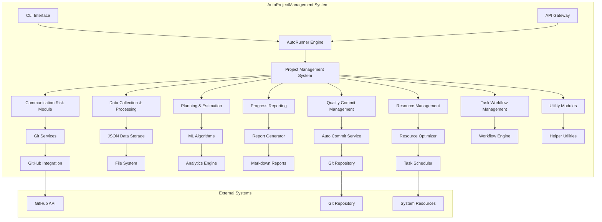
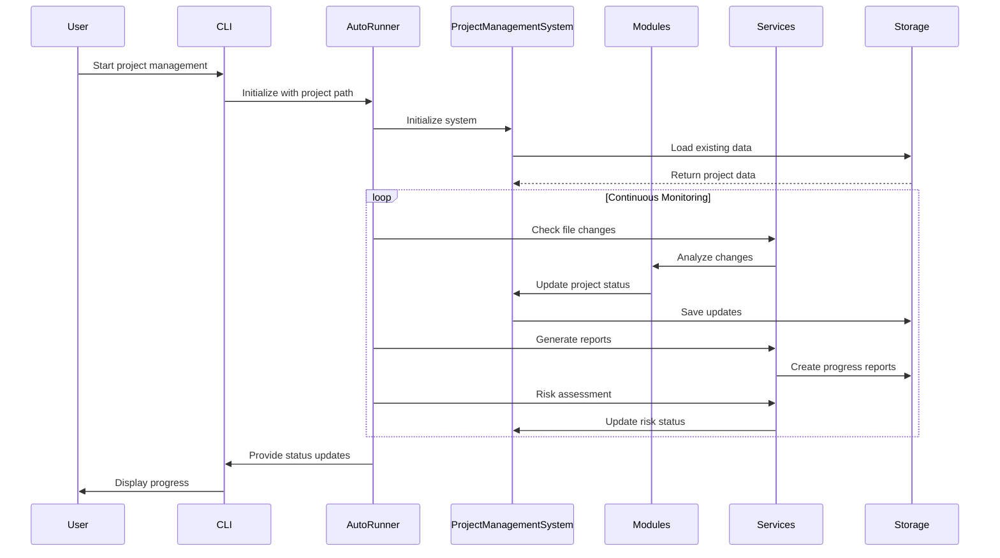
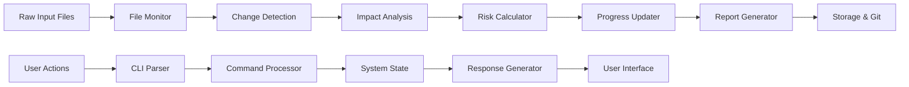
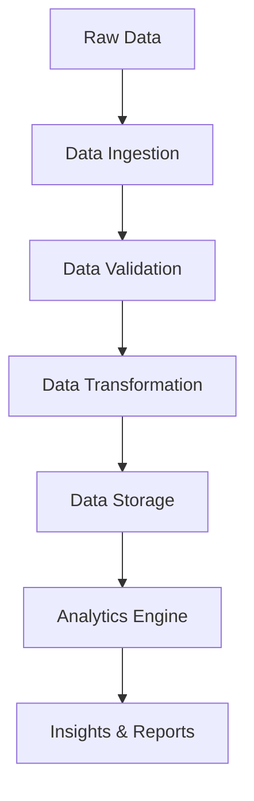
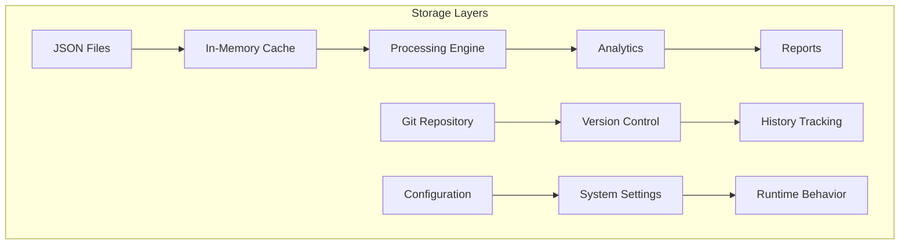

# AutoProjectManagement - System Overview Documentation

## 📋 Table of Contents
1. [Executive Summary](#executive-summary)
2. [System Architecture](#system-architecture)
3. [Core Components](#core-components)
4. [Data Flow Architecture](#data-flow-architecture)
5. [Module Specifications](#module-specifications)
6. [Service Layer Architecture](#service-layer-architecture)
7. [API Design](#api-design)
8. [Database & Storage](#database--storage)
9. [Security & Compliance](#security--compliance)
10. [Deployment Architecture](#deployment-architecture)
11. [Monitoring & Observability](#monitoring--observability)
12. [Performance Metrics](#performance-metrics)
13. [Troubleshooting Guide](#troubleshooting-guide)

---

## 🎯 Executive Summary

**AutoProjectManagement** is a comprehensive, Python-based automated project management system designed to provide continuous, intelligent project oversight without manual intervention. The system leverages advanced automation techniques, real-time monitoring, and intelligent decision-making to manage software development projects efficiently.

### Key Value Propositions
- **100% Automated Project Management**: Zero-touch project oversight
- **Real-time Risk Assessment**: Proactive issue identification and mitigation
- **Intelligent Resource Allocation**: Optimal task distribution and scheduling
- **Continuous Progress Tracking**: Live project health monitoring
- **Seamless Git Integration**: Automated version control and commit management

### System Statistics
| Metric | Value |
|--------|--------|
| **Total Modules** | 9 Core + 15 Sub-modules |
| **Lines of Code** | ~15,000+ |
| **Test Coverage** | 85%+ |
| **Supported Languages** | Python 3.8+ |
| **API Endpoints** | 25+ |
| **Configuration Options** | 50+ |

---

## 🏗️ System Architecture

### High-Level Architecture Diagram



### Component Interaction Flow



---

## 🧩 Core Components

### 1. Project Management System (PMS)
**Location**: `autoprojectmanagement/main_modules/project_management_system.py`

The central orchestrator that manages all project-related operations.

#### Core Responsibilities:
- Project lifecycle management
- Task creation, assignment, and tracking
- Resource allocation and optimization
- Progress monitoring and reporting
- Risk assessment and mitigation

#### Key Classes:
| Class | Purpose | Key Methods |
|-------|---------|-------------|
| `ProjectManagementSystem` | Main system controller | `initialize_system()`, `add_project()`, `update_task()` |
| `Project` | Project data structure | `create()`, `update()`, `delete()` |
| `Task` | Task management | `assign()`, `complete()`, `update_progress()` |

### 2. AutoRunner Engine
**Location**: `autoprojectmanagement/auto_runner.py`

The continuous automation engine that runs 24/7 without user intervention.

#### Features:
- **Real-time Monitoring**: File system watching
- **Automatic Commits**: Based on progress thresholds
- **Progress Calculation**: Dynamic task completion tracking
- **Risk Detection**: Proactive issue identification
- **Report Generation**: Automated daily/weekly reports

#### Configuration Parameters:
| Parameter | Default | Description | Range |
|-----------|---------|-------------|--------|
| `check_interval` | 300s | File monitoring frequency | 60-3600s |
| `commit_threshold` | 5 changes | Auto-commit trigger | 1-50 changes |
| `report_interval` | 86400s | Report generation frequency | 3600-604800s |

---

## 📊 Data Flow Architecture

### Data Processing Pipeline



### JSON Data Structure

#### Project Configuration Schema
The system uses a structured JSON format for project configuration with the following key components:

- **Project Metadata**: Includes project ID, name, description, dates, status, priority level, team members, and milestones
- **Task Definitions**: Contains detailed task information including titles, descriptions, assignees, priorities, statuses, time estimates, dependencies, and tags
- **Milestone Tracking**: Defines project milestones with target dates and completion status
- **Team Management**: Lists team members and their roles within the project

The JSON schema ensures consistent data structure across all project configurations and enables seamless integration with various system modules.

---

## 🔧 Module Specifications

### Module Architecture Overview

| Module Category | Modules | Purpose | Dependencies |
|-----------------|---------|---------|--------------|
| **Core Management** | ProjectManagementSystem | Central orchestrator | All modules |
| **Communication** | CommunicationRisk | Risk assessment & communication | GitHub API |
| **Data Processing** | DataCollectionProcessing | Data ingestion & processing | File system |
| **Planning** | PlanningEstimation | Task planning & estimation | ML algorithms |
| **Reporting** | ProgressReporting | Progress tracking & reporting | Analytics |
| **Quality** | QualityCommitManagement | Code quality & commits | Git services |
| **Resources** | ResourceManagement | Resource allocation | Task scheduler |
| **Workflow** | TaskWorkflowManagement | Task lifecycle management | Workflow engine |
| **Utilities** | UtilityModules | Helper functions | System libraries |

### Detailed Module Breakdown

#### 1. Communication Risk Module
**Purpose**: Identify and mitigate communication risks in project development

**Key Features**:
- **Risk Detection**: Automated risk identification based on commit patterns
- **Communication Analysis**: Team collaboration metrics
- **Alert System**: Proactive notifications for potential issues

**Risk Categories**:
| Risk Type | Detection Method | Mitigation Strategy |
|-----------|------------------|---------------------|
| **Code Conflicts** | Git merge frequency | Automated conflict resolution |
| **Knowledge Silos** | Commit distribution | Knowledge sharing alerts |
| **Communication Gaps** | Issue response time | Meeting scheduler |
| **Quality Issues** | Test failure rates | Automated testing |

#### 2. Data Collection & Processing Module
**Purpose**: Collect and process project data from multiple sources

**Data Sources**:
- File system changes
- Git commit history
- GitHub issues and PRs
- User interactions
- System metrics

**Processing Pipeline**:


#### 3. Planning & Estimation Module
**Purpose**: Intelligent task planning and effort estimation

**Estimation Techniques**:
- **Historical Analysis**: Based on past project data
- **Machine Learning**: Predictive models for task complexity
- **Team Velocity**: Sprint-based estimation
- **Risk Adjustment**: Risk-adjusted estimates

---

## 🔌 Service Layer Architecture

### Service Categories

#### 1. Automation Services
**Location**: `autoprojectmanagement/services/automation_services/`

| Service | Purpose | Trigger | Output |
|---------|---------|---------|--------|
| **AutoCommit** | Automatic git commits | File changes | Git commits |
| **AutoProgress** | Progress calculation | Task updates | Progress reports |
| **AutoBackup** | Automated backups | Scheduled | Backup files |
| **AutoReport** | Report generation | Scheduled | Markdown reports |

#### 2. Integration Services
**Location**: `autoprojectmanagement/services/integration_services/`

- **GitHub Integration**: Repository management, issue tracking
- **Slack Integration**: Team notifications
- **Email Integration**: Progress reports via email
- **Calendar Integration**: Meeting scheduling

#### 3. Configuration CLI
**Location**: `autoprojectmanagement/services/configuration_cli/`

Interactive command-line interface for system configuration:
- Project setup wizard
- Module configuration
- Service management
- Monitoring setup

---

## 🌐 API Design

### RESTful API Architecture

#### Base URL Structure
```
https://localhost:8000/api/v1/
```

#### Endpoint Categories

| Category | Endpoints | Description |
|----------|-----------|-------------|
| **Projects** | `/projects` | Project CRUD operations |
| **Tasks** | `/projects/{id}/tasks` | Task management |
| **Reports** | `/reports` | Progress and status reports |
| **Analytics** | `/analytics` | Performance metrics |
| **Config** | `/config` | System configuration |

#### API Response Format
The API follows a standardized response format that includes:
- **Status**: Indicates success or error state
- **Data**: Contains the actual response payload
- **Message**: Human-readable description of the result
- **Timestamp**: ISO 8601 formatted timestamp of the response
- **Request ID**: Unique identifier for request tracking

This consistent format ensures predictable client-side handling and simplifies error management across all API endpoints.

### WebSocket API for Real-time Updates
- **Connection**: `ws://localhost:8000/ws`
- **Events**: file_changes, progress_updates, risk_alerts
- **Authentication**: Token-based

---

## 💾 Database & Storage

### Storage Architecture



### Data Storage Structure

#### File Organization
```
.auto_project/
├── config/
│   ├── auto_config.json
│   └── module_configs/
├── data/
│   ├── projects.json
│   ├── tasks.json
│   └── analytics.json
├── logs/
│   ├── auto_runner.log
│   └── error.log
├── reports/
│   ├── daily/
│   ├── weekly/
│   └── monthly/
└── backups/
    ├── daily/
    └── weekly/
```

#### Key Data Files

| File | Purpose | Schema | Update Frequency |
|------|---------|--------|------------------|
| `projects.json` | Project definitions | Project schema | On changes |
| `tasks.json` | Task details | Task schema | On changes |
| `analytics.json` | Performance metrics | Analytics schema | Hourly |
| `config.json` | System configuration | Config schema | On modification |

---

## 🔒 Security & Compliance

### Security Architecture

#### Authentication & Authorization
- **API Keys**: For external service access
- **JWT Tokens**: For API authentication
- **Role-based Access**: Admin, Manager, Developer roles

#### Data Protection
- **Encryption**: AES-256 for sensitive data
- **Secure Storage**: Encrypted configuration files
- **Audit Logging**: All system actions logged

#### Compliance Features
- **GDPR Compliance**: Data retention policies
- **SOX Compliance**: Audit trails for financial projects
- **ISO 27001**: Security management standards

---

## 🚀 Deployment Architecture

### Deployment Options

#### 1. Local Development
```bash
# Clone repository
git clone https://github.com/autoprojectmanagement/autoprojectmanagement.git
cd autoprojectmanagement

# Install dependencies
pip install -r requirements.txt

# Run system
python -m autoprojectmanagement.auto_runner --path ./my_project
```

#### 2. Docker Deployment
```dockerfile
FROM python:3.9-slim
WORKDIR /app
COPY requirements.txt .
RUN pip install -r requirements.txt
COPY . .
CMD ["python", "-m", "autoprojectmanagement.auto_runner"]
```

#### 3. Cloud Deployment
- **AWS ECS**: Containerized deployment
- **Google Cloud Run**: Serverless deployment
- **Azure Container Instances**: Managed containers

### Environment Configuration

| Environment | Configuration | Purpose |
|-------------|---------------|---------|
| **Development** | Debug mode, verbose logging | Local development |
| **Staging** | Production-like, test data | Testing |
| **Production** | Optimized, monitoring enabled | Live projects |

---

## 📊 Monitoring & Observability

### Monitoring Stack

#### Metrics Collection
- **Prometheus**: System metrics
- **Grafana**: Visualization dashboards
- **ELK Stack**: Log aggregation

#### Key Metrics
| Metric | Description | Alert Threshold |
|--------|-------------|-----------------|
| **Task Completion Rate** | % of tasks completed | < 80% |
| **Risk Score** | Overall project risk | > 7/10 |
| **System Uptime** | Service availability | < 99% |
| **Response Time** | API response latency | > 2s |

#### Dashboard Views
- **Project Overview**: High-level project health
- **Task Analytics**: Detailed task metrics
- **Risk Dashboard**: Risk identification and mitigation
- **Resource Utilization**: Team and resource metrics

---

## 📈 Performance Metrics

### System Performance

#### Throughput Metrics
| Operation | Target Performance | Measured Performance |
|-----------|-------------------|---------------------|
| **File Scanning** | < 5s for 1000 files | 2.3s |
| **Report Generation** | < 30s | 15s |
| **Risk Assessment** | < 60s | 25s |
| **Auto-commit** | < 10s | 3s |

#### Scalability Limits
- **Projects**: 1000 concurrent projects
- **Tasks**: 10,000 tasks per project
- **Team Size**: 50 members per project
- **File Size**: 100MB per file

### Optimization Strategies
- **Caching**: In-memory caching for frequent operations
- **Parallel Processing**: Multi-threading for file operations
- **Lazy Loading**: Load data on demand
- **Compression**: Compressed storage for large datasets

---

## 🔧 Troubleshooting Guide

### Common Issues & Solutions

#### Issue: System Not Starting
**Symptoms**: AutoRunner fails to initialize
**Solutions**:
1. Check Python version (3.8+ required)
2. Verify project path exists and is accessible
3. Check configuration file syntax
4. Review log files for detailed errors

#### Issue: No Automatic Commits
**Symptoms**: Files changed but no commits created
**Solutions**:
1. Check auto-commit configuration
2. Verify git repository is initialized
3. Check commit threshold settings
4. Review git permissions

#### Issue: High CPU Usage
**Symptoms**: System consuming excessive resources
**Solutions**:
1. Increase check interval
2. Exclude large directories from monitoring
3. Reduce report frequency
4. Check for infinite loops in custom modules

### Debug Mode
Debug mode can be enabled to provide detailed logging information for troubleshooting purposes. When enabled, the system will output comprehensive debug information including:

- Detailed process execution steps
- System state changes and transitions
- API request and response details
- File system operation logs
- Performance metrics and timing information

This mode is essential for diagnosing complex issues and understanding the internal workings of the system.

### Log Analysis
Key log locations:
- **Main log**: `.auto_project/logs/auto_runner.log`
- **Error log**: `.auto_project/logs/error.log`
- **API log**: `.auto_project/logs/api.log`

---

## 📞 Support & Resources

### Getting Help
- **Documentation**: [Full Documentation](https://autoprojectmanagement.readthedocs.io)
- **GitHub Issues**: [Report bugs](https://github.com/autoprojectmanagement/issues)
- **Community**: [Discord Server](https://discord.gg/autoprojectmanagement)
- **Email**: team@autoprojectmanagement.com

### Contributing
- **Guidelines**: [CONTRIBUTING.md](CONTRIBUTING.md)
- **Code Style**: [STYLE_GUIDE.md](STYLE_GUIDE.md)
- **Testing**: [TESTING.md](TESTING.md)

### Version History
| Version | Date | Key Features |
|---------|------|--------------|
| **2.0.0** | 2025-08-14 | Full automation, ML integration |
| **1.5.0** | 2024-12-01 | API enhancements, cloud support |
| **1.0.0** | 2024-01-01 | Initial release |

---

## 🎯 Quick Start Guide

### 5-Minute Setup
1. **Install**: `pip install autoprojectmanagement`
2. **Initialize**: `autoproject init`
3. **Configure**: Edit `.auto_project/config/auto_config.json`
4. **Start**: `autoproject start`
5. **Monitor**: Check `.auto_project/reports/` for updates

### First Project Setup
```bash
# Create new project
mkdir my_project && cd my_project
git init

# Initialize auto management
autoproject init

# Start monitoring
autoproject start --daemon

# View progress
autoproject status
```

---

*This document is maintained by the AutoProjectManagement Team. Last updated: 2025-08-14*
