# 📋 AutoProjectManagement - System Requirements Specification (SRS)

**Version**: 1.0.0  
**Date**: 2025-08-14  
**Status**: Final  
**Classification**: Public  

---

## 📖 Table of Contents

1. [Executive Summary](#executive-summary)
2. [System Overview](#system-overview)
3. [Functional Requirements](#functional-requirements)
4. [Non-Functional Requirements](#non-functional-requirements)
5. [System Architecture](#system-architecture)
6. [Use Case Diagrams](#use-case-diagrams)
7. [Data Requirements](#data-requirements)
8. [Interface Requirements](#interface-requirements)
9. [Security Requirements](#security-requirements)
10. [Performance Requirements](#performance-requirements)
11. [Design Constraints](#design-constraints)
12. [Testing Requirements](#testing-requirements)
13. [Deployment Requirements](#deployment-requirements)
14. [Maintenance Requirements](#maintenance-requirements)
15. [Appendices](#appendices)

---

## 🎯 Executive Summary

### Purpose
The **AutoProjectManagement** system is a comprehensive, Python-based automated project management solution designed to provide continuous, intelligent project oversight without manual intervention. This system leverages advanced automation techniques, real-time monitoring, and intelligent decision-making to manage software development projects efficiently.

### Scope
This SRS covers the complete system requirements for the AutoProjectManagement platform, including:
- Automated project lifecycle management
- Real-time task tracking and progress monitoring
- Intelligent resource allocation and risk assessment
- Seamless Git integration and version control
- Comprehensive reporting and analytics
- API-driven architecture for extensibility

### Key Stakeholders
| Stakeholder | Role | Interest |
|-------------|------|----------|
| **Development Teams** | Primary Users | Automated project management |
| **Project Managers** | Secondary Users | Progress monitoring and reporting |
| **DevOps Engineers** | System Administrators | Deployment and maintenance |
| **Product Owners** | Decision Makers | Project insights and metrics |
| **QA Teams** | Quality Assurance | Testing and validation |

---

## 🏗️ System Overview

### System Context Diagram


### System Components

| Component | Description | Key Features |
|-----------|-------------|--------------|
| **Project Management System** | Core orchestrator | Project CRUD, task management |
| **AutoRunner Engine** | Continuous automation | 24/7 monitoring, auto-commits |
| **API Gateway** | RESTful API layer | Endpoints for all operations |
| **Service Layer** | Business logic | GitHub integration, reporting |
| **Data Storage** | JSON-based storage | Project data, task data |
| **Monitoring** | System observability | Metrics, logs, alerts |

---

## ✅ Functional Requirements

### FR-1: Project Management
| ID | Requirement | Priority | Acceptance Criteria |
|----|-------------|----------|---------------------|
| **FR-1.1** | Create new projects | High | Project created with unique ID |
| **FR-1.2** | Update project details | High | Changes reflected immediately |
| **FR-1.3** | Delete projects | Medium | Soft delete with confirmation |
| **FR-1.4** | List all projects | High | Returns complete project list |
| **FR-1.5** | Search projects | Medium | Filter by name, status, date |

### FR-2: Task Management
| ID | Requirement | Priority | Acceptance Criteria |
|----|-------------|----------|---------------------|
| **FR-2.1** | Create tasks within projects | High | Task linked to project |
| **FR-2.2** | Update task status | High | Status change tracked |
| **FR-2.3** | Assign tasks to team members | Medium | Assignment recorded |
| **FR-2.4** | Set task priorities | Medium | Priority levels supported |
| **FR-2.5** | Track task progress | High | Progress percentage updated |

### FR-3: Automation Features
| ID | Requirement | Priority | Acceptance Criteria |
|----|-------------|----------|---------------------|
| **FR-3.1** | Auto-commit changes | High | Commits based on thresholds |
| **FR-3.2** | Generate progress reports | High | Daily/weekly reports created |
| **FR-3.3** | Risk assessment alerts | Medium | Alerts for high-risk items |
| **FR-3.4** | Resource optimization | Medium | Optimal task distribution |
| **FR-3.5** | Continuous monitoring | High | 24/7 system monitoring |

### FR-4: Integration Requirements
| ID | Requirement | Priority | Acceptance Criteria |
|----|-------------|----------|---------------------|
| **FR-4.1** | GitHub integration | High | Repository sync working |
| **FR-4.2** | VSCode extension | Medium | Extension functional |
| **FR-4.3** | CLI interface | High | All commands working |
| **FR-4.4** | API endpoints | High | RESTful API complete |
| **FR-4.5** | Web dashboard | Medium | Dashboard accessible |

### FR-5: Reporting & Analytics
| ID | Requirement | Priority | Acceptance Criteria |
|----|-------------|----------|---------------------|
| **FR-5.1** | Progress reports | High | Markdown reports generated |
| **FR-5.2** | Performance metrics | Medium | KPIs calculated |
| **FR-5.3** | Risk analysis | Medium | Risk scores computed |
| **FR-5.4** | Team productivity | Medium | Productivity metrics |
| **FR-5.5** | Historical data | Low | Trend analysis available |

---

## ⚡ Non-Functional Requirements

### NFR-1: Performance Requirements

#### Response Time
| Operation | Target | Measured |
|-----------|--------|----------|
| **Project Creation** | < 1s | < 500ms |
| **Task Update** | < 500ms | < 200ms |
| **Report Generation** | < 30s | < 15s |
| **File Scanning** | < 5s | < 2s |

#### Throughput
- **Concurrent Projects**: 1000+
- **Tasks per Project**: 10,000+
- **API Requests**: 1000 requests/minute
- **File Monitoring**: 1000 files/second

### NFR-2: Scalability Requirements

#### Horizontal Scaling


#### Vertical Scaling
| Resource | Minimum | Recommended | Maximum |
|----------|---------|-------------|---------|
| **CPU** | 2 cores | 4 cores | 8+ cores |
| **RAM** | 4GB | 8GB | 16GB+ |
| **Storage** | 10GB | 50GB | 500GB+ |

### NFR-3: Reliability Requirements

#### Availability
- **Target Uptime**: 99.9%
- **Maintenance Window**: 2 hours/month
- **Recovery Time**: < 5 minutes
- **Backup Frequency**: Every 4 hours

#### Error Handling
| Error Type | Handling Strategy | Notification |
|------------|-----------------|--------------|
| **System Errors** | Graceful degradation | Email alert |
| **Data Errors** | Validation + rollback | Log entry |
| **Network Errors** | Retry with backoff | Dashboard alert |
| **Storage Errors** | Failover to backup | SMS alert |

### NFR-4: Security Requirements

#### Authentication & Authorization


#### Data Protection
| Aspect | Requirement | Implementation |
|--------|-------------|----------------|
| **Data at Rest** | AES-256 encryption | Encrypted JSON files |
| **Data in Transit** | TLS 1.3 | HTTPS endpoints |
| **Access Control** | Role-based | RBAC system |
| **Audit Trail** | Complete logs | Immutable audit log |

---

## 🏛️ System Architecture

### High-Level Architecture


### Component Architecture

#### Project Management System


### Data Flow Architecture


---

## 🎭 Use Case Diagrams

### Primary Use Cases


### Detailed Use Case: Create Project


### Use Case Specification: Auto-Commit

| Field | Description |
|-------|-------------|
| **Use Case ID** | UC-AUTO-COMMIT-001 |
| **Use Case Name** | Automatic Git Commit |
| **Primary Actor** | AutoRunner Engine |
| **Preconditions** | Git repository initialized, files changed |
| **Main Flow** | 1. Monitor file changes<br>2. Check commit threshold<br>3. Create commit message<br>4. Execute git commit<br>5. Update progress |
| **Postconditions** | Commit created, progress updated |
| **Alternative Flows** | Threshold not met - skip commit |

---

## 📊 Data Requirements

### Data Models

#### Project Schema
The project data structure includes comprehensive metadata for project management:

- **Identification**: Unique numeric identifier and descriptive name
- **Classification**: Status, priority levels, and categorization
- **Timeline**: Start and end dates with ISO 8601 datetime formatting
- **Team Management**: List of team members and their roles
- **Milestone Tracking**: Project milestones with target dates and completion status
- **Metadata**: Creation and update timestamps with version tracking

#### Task Schema
The task data structure provides detailed task management capabilities:

- **Task Identification**: Unique identifier within project context
- **Descriptive Information**: Title, description, and detailed requirements
- **Assignment & Tracking**: Assignee information and progress monitoring
- **Priority & Status**: Multiple priority levels and comprehensive status tracking
- **Time Management**: Estimated and actual hours with progress percentage
- **Dependencies & Relationships**: Task dependencies and categorization tags
- **Timeline Management**: Due dates with creation and update timestamps

These structured data formats ensure consistent data organization and enable seamless integration across all system components.

### Data Storage Structure

#### File Organization
```
.auto_project/
├── data/
│   ├── projects.json          # Project definitions
│   ├── tasks.json             # Task details
│   ├── progress.json          # Progress tracking
│   ├── analytics.json         # Performance metrics
│   └── config.json            # System configuration
├── logs/
│   ├── auto_runner.log        # System logs
│   ├── error.log              # Error logs
│   └── audit.log              # Audit trail
├── reports/
│   ├── daily/
│   ├── weekly/
│   └── monthly/
└── backups/
    ├── daily/
    └── weekly/
```

### Data Relationships


---

## 🔌 Interface Requirements

### API Interface

#### RESTful API Specification

| Endpoint | Method | Description | Request Body | Response |
|----------|--------|-------------|--------------|----------|
| `/api/v1/projects` | GET | List all projects | - | `{"projects": [...]}` |
| `/api/v1/projects` | POST | Create project | `{"name": "...", ...}` | `{"id": 1, ...}` |
| `/api/v1/projects/{id}` | GET | Get project | - | `{"project": {...}}` |
| `/api/v1/projects/{id}` | PUT | Update project | `{"name": "...", ...}` | `{"success": true}` |
| `/api/v1/projects/{id}` | DELETE | Delete project | - | `{"success": true}` |
| `/api/v1/projects/{id}/tasks` | GET | List tasks | - | `{"tasks": [...]}` |
| `/api/v1/projects/{id}/tasks` | POST | Create task | `{"title": "...", ...}` | `{"id": 1, ...}` |

#### WebSocket API
The WebSocket API provides real-time event notifications for system updates:

- **Event Types**: Task updates, project changes, progress notifications, and system alerts
- **Data Structure**: Comprehensive event data including project and task identifiers, change details, and timestamps
- **Real-time Delivery**: Instant notification delivery for time-sensitive updates
- **Event History**: Complete event history with ISO 8601 timestamp formatting

This real-time communication channel enables immediate updates and enhances user experience with live project monitoring capabilities.

### CLI Interface

#### Command Structure
The CLI interface provides a comprehensive set of commands for system management:

- **System Initialization**: Initialize new projects and system configuration
- **Monitoring Control**: Start, stop, and check system monitoring status
- **Project Management**: Create, update, and delete projects with detailed options
- **Task Operations**: Add, update, and manage tasks within projects
- **Reporting Functions**: Generate various types of progress and status reports
- **Backup & Recovery**: Create system backups and restore from previous states

This command-line interface enables efficient system administration and project management through intuitive command syntax and comprehensive option support.

### Configuration Interface

#### Configuration File Structure
The system uses a comprehensive YAML-based configuration format with the following sections:

- **System Settings**: Core system parameters including check intervals, commit thresholds, and report frequencies
- **Monitoring Configuration**: File monitoring settings with included extensions and excluded directories
- **Notification Settings**: Email and messaging platform integration for alerts and updates
- **Integration Options**: External service integrations including GitHub API tokens and development environment settings

This flexible configuration system allows for environment-specific customization and ensures consistent system behavior across different deployment scenarios.

---

## 🔒 Security Requirements

### Security Architecture


### Security Controls

#### Authentication
| Control | Implementation | Details |
|---------|----------------|---------|
| **API Keys** | Bearer tokens | 32-character random strings |
| **JWT Tokens** | HS256 algorithm | 1-hour expiration |
| **OAuth 2.0** | GitHub integration | Scope-based permissions |
| **Basic Auth** | Username/password | BCrypt hashing |

#### Authorization
| Role | Permissions | Scope |
|------|-------------|--------|
| **Admin** | Full system access | All projects |
| **Manager** | Project management | Assigned projects |
| **Developer** | Task management | Own tasks |
| **Viewer** | Read-only access | Public projects |

#### Data Protection
| Aspect | Requirement | Implementation |
|--------|-------------|----------------|
| **Encryption at Rest** | AES-256 | File-level encryption |
| **Encryption in Transit** | TLS 1.3 | HTTPS endpoints |
| **Key Management** | Secure storage | Environment variables |
| **Data Masking** | PII protection | Field-level masking |

### Security Testing Requirements

| Test Type | Frequency | Tools | Coverage |
|-----------|-----------|-------|----------|
| **Static Analysis** | Every commit | SonarQube | 100% code |
| **Dynamic Testing** | Weekly | OWASP ZAP | API endpoints |
| **Penetration Testing** | Quarterly | Custom tools | Full system |
| **Compliance Scan** | Monthly | OpenVAS | Security posture |

---

## ⚡ Performance Requirements

### Performance Metrics

#### Response Time SLAs


#### Throughput Requirements
| Metric | Target | Measurement |
|--------|--------|-------------|
| **Projects** | 1000 concurrent | Load testing |
| **Tasks** | 10,000 per project | Stress testing |
| **API Requests** | 1000/minute | Benchmarking |
| **File Operations** | 1000/second | Performance testing |

### Performance Optimization

#### Caching Strategy
| Cache Type | Purpose | TTL | Storage |
|------------|---------|-----|---------|
| **Memory Cache** | API responses | 5 minutes | Redis |
| **File Cache** | Static assets | 1 hour | Local disk |
| **Database Cache** | Query results | 30 minutes | In-memory |
| **CDN Cache** | Web assets | 24 hours | Cloud CDN |

#### Database Optimization
- **Indexing**: Primary keys, foreign keys
- **Partitioning**: By project ID
- **Archiving**: Old data to cold storage
- **Compression**: JSON compression for storage

---

## 🎯 Design Constraints

### Technical Constraints

#### Platform Requirements
| Constraint | Specification | Rationale |
|------------|---------------|-----------|
| **Python Version** | 3.8+ | Compatibility with libraries |
| **Operating System** | Linux, macOS, Windows | Cross-platform support |
| **Memory** | 4GB minimum | System requirements |
| **Storage** | 10GB minimum | Data retention |
| **Network** | Internet connection | GitHub integration |

#### Development Constraints
| Constraint | Impact | Mitigation |
|------------|--------|------------|
| **JSON Storage** | Limited query capabilities | In-memory indexing |
| **Single-threaded** | Performance bottlenecks | Async operations |
| **File-based** | I/O limitations | Caching layer |
| **No database** | Scalability limits | Sharding strategy |

### Business Constraints

#### Resource Limitations
| Resource | Limit | Strategy |
|----------|--------|----------|
| **Development Team** | 3-5 developers | Agile methodology |
| **Budget** | Open source | Community contributions |
| **Timeline** | 6-month release cycle | MVP approach |
| **Support** | Community-based | Documentation focus |

---

## 🧪 Testing Requirements

### Testing Strategy

#### Test Pyramid

```mermaid
graph TD
    A[Unit Tests] --> B[Integration Tests]
    B --> C[System Tests]
    C --> D[Acceptance Tests]
    
    A --> E[70% Coverage]
    B --> F[50% Coverage]
    C --> G[30% Coverage]
    D --> H[10% Coverage]
```


#### Test Categories

| Test Type | Scope | Tools | Frequency |
|-----------|--------|-------|-----------|
| **Unit Tests** | Individual functions | pytest | Every commit |
| **Integration Tests** | Module interactions | pytest-asyncio | Daily |
| **System Tests** | End-to-end | Selenium | Weekly |
| **Performance Tests** | Load testing | Locust | Monthly |
| **Security Tests** | Vulnerability scanning | OWASP ZAP | Quarterly |

### Test Coverage Requirements

| Component | Coverage Target | Current Status |
|-----------|-----------------|----------------|
| **Project Management** | 90% | 85% |
| **AutoRunner** | 85% | 80% |
| **API Layer** | 95% | 90% |
| **Service Layer** | 80% | 75% |
| **Overall** | 85% | 82% |

### Test Data Requirements

#### Test Scenarios
1. **Happy Path**: Normal operation
2. **Edge Cases**: Boundary conditions
3. **Error Handling**: Invalid inputs
4. **Performance**: Load testing
5. **Security**: Penetration testing

#### Test Data Sets
| Dataset | Size | Purpose |
|---------|------|---------|
| **Small Projects** | 1-10 tasks | Unit testing |
| **Medium Projects** | 100-500 tasks | Integration testing |
| **Large Projects** | 1000+ tasks | System testing |
| **Edge Cases** | Various | Boundary testing |

---

## 🚀 Deployment Requirements

### Deployment Architecture

#### Environment Stages


### Deployment Specifications

#### Container Requirements
The system containerization follows industry best practices for security and performance:

- **Base Image**: Optimized Python runtime with minimal dependencies
- **System Requirements**: Essential system packages for Git operations and network connectivity
- **Dependency Management**: Efficient Python package installation with caching optimization
- **Security Hardening**: Non-root user execution and minimal privilege principles
- **Health Monitoring**: Comprehensive health checks with configurable intervals and retry policies
- **Port Configuration**: Standardized port exposure for service accessibility
- **Execution Environment**: Proper environment variable configuration for consistent runtime behavior

This container specification ensures secure, reliable, and performant deployment across various container orchestration platforms.

#### Kubernetes Deployment
```yaml
apiVersion: apps/v1
kind: Deployment
metadata:
  name: autoprojectmanagement
spec:
  replicas: 3
  selector:
    matchLabels:
      app: autoprojectmanagement
  template:
    metadata:
      labels:
        app: autoprojectmanagement
    spec:
      containers:
      - name: autoprojectmanagement
        image: autoprojectmanagement:latest
        ports:
        - containerPort: 8000
        env:
        - name: AUTO_PROJECT_HOME
          value: "/app"
        resources:
          requests:
            memory: "512Mi"
            cpu: "250m"
          limits:
            memory: "1Gi"
            cpu: "500m"
        volumeMounts:
        - name: data-volume
          mountPath: /app/data
      volumes:
      - name: data-volume
        persistentVolumeClaim:
          claimName: autoproject-pvc
```

### Deployment Checklist

| Item | Status | Notes |
|------|--------|--------|
| **Environment Variables** | ✅ | All required variables set |
| **Database Migration** | ✅ | JSON schema updated |
| **SSL Certificates** | ✅ | TLS 1.3 configured |
| **Monitoring Setup** | ✅ | Prometheus/Grafana ready |
| **Backup Strategy** | ✅ | Daily automated backups |
| **Rollback Plan** | ✅ | Previous version available |
| **Load Testing** | ✅ | 1000 concurrent users tested |

---

## 🔧 Maintenance Requirements

### Maintenance Schedule

#### Daily Tasks
- [ ] Check system health
- [ ] Review error logs
- [ ] Monitor performance metrics
- [ ] Verify backup completion

#### Weekly Tasks
- [ ] Update dependencies
- [ ] Security scan
- [ ] Performance review
- [ ] Documentation updates

#### Monthly Tasks
- [ ] Full system backup
- [ ] Security audit
- [ ] Performance optimization
- [ ] Capacity planning

### Maintenance Procedures

#### System Health Check
```bash
#!/bin/bash
# health_check.sh

# Check system status
systemctl status autoprojectmanagement

# Check disk usage
df -h /app/data

# Check memory usage
free -h

# Check API health
curl -f http://localhost:8000/health

# Check recent logs
tail -n 100 /var/log/autoprojectmanagement/auto_runner.log
```

#### Update Process
1. **Preparation**: Backup current system
2. **Testing**: Test in staging environment
3. **Deployment**: Deploy to production
4. **Verification**: Confirm all services working
5. **Rollback**: Plan available if needed

### Support Procedures

#### Issue Escalation
| Severity | Response Time | Resolution Time |
|----------|---------------|-----------------|
| **Critical** | 15 minutes | 2 hours |
| **High** | 1 hour | 8 hours |
| **Medium** | 4 hours | 24 hours |
| **Low** | 24 hours | 72 hours |

---

## 📎 Appendices

### Appendix A: Glossary

| Term | Definition |
|------|------------|
| **AutoProjectManagement** | Automated project management system |
| **PMS** | Project Management System |
| **AutoRunner** | Continuous automation engine |
| **Task** | Individual work item within a project |
| **Milestone** | Significant project checkpoint |
| **Sprint** | Time-boxed development iteration |
| **Commit** | Git repository change |
| **Webhook** | HTTP callback for real-time updates |

### Appendix B: References

#### Standards
- [ISO/IEC 25010:2011](https://www.iso.org/standard/35733.html) - Software Quality
- [IEEE 830-1998](https://standards.ieee.org/standard/830-1998.html) - SRS Standard
- [OWASP Top 10](https://owasp.org/www-project-top-ten/) - Security Guidelines

#### Tools & Technologies
- **Python**: https://www.python.org/
- **FastAPI**: https://fastapi.tiangolo.com/
- **Git**: https://git-scm.com/
- **Docker**: https://www.docker.com/
- **Kubernetes**: https://kubernetes.io/

### Appendix C: Change Log

| Version | Date | Changes |
|---------|------|---------|
| **1.0.0** | 2025-08-14 | Initial SRS release |
| **1.0.1** | TBD | TBD |

---

## 📞 Contact Information

**AutoProjectManagement Team**  
Email: team@autoprojectmanagement.com  
GitHub: https://github.com/autoprojectmanagement/autoprojectmanagement  
Documentation: https://autoprojectmanagement.readthedocs.io  
Support: support@autoprojectmanagement.com

---

*This System Requirements Specification is a living document and will be updated as the system evolves.*
