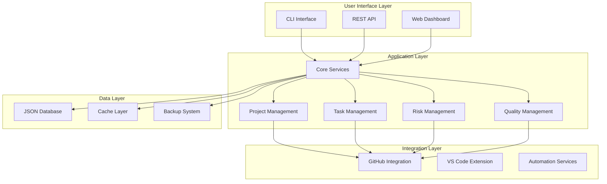
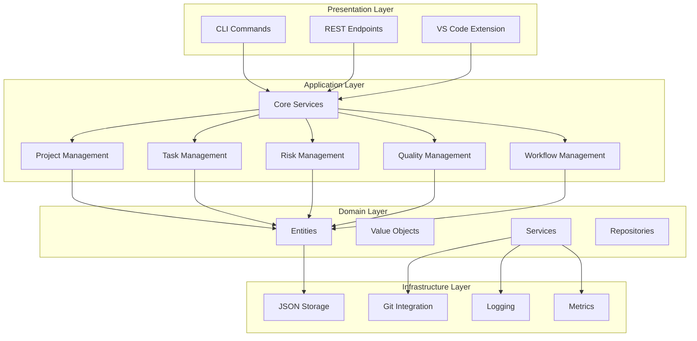
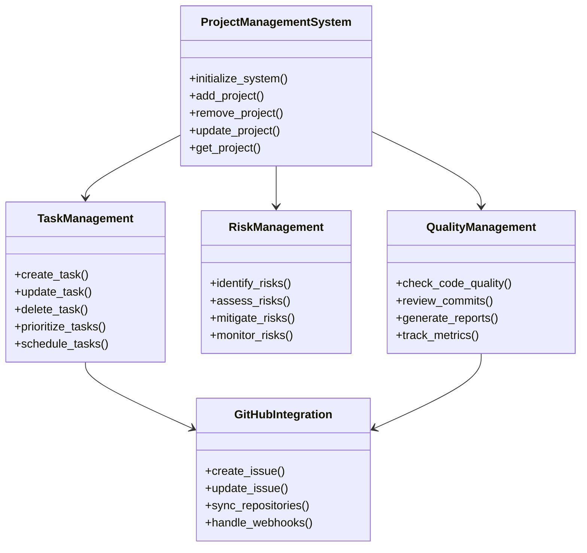
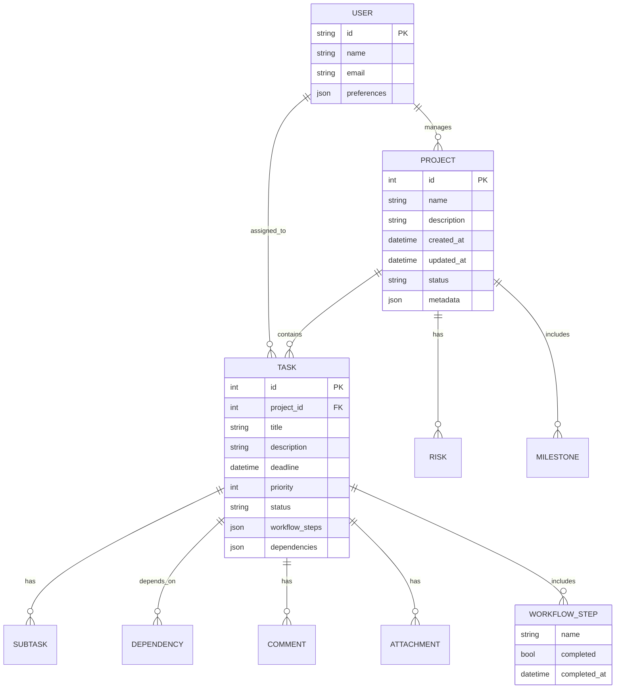
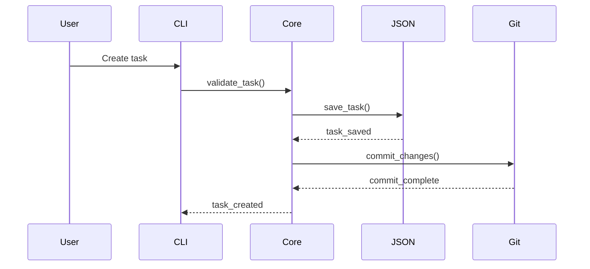
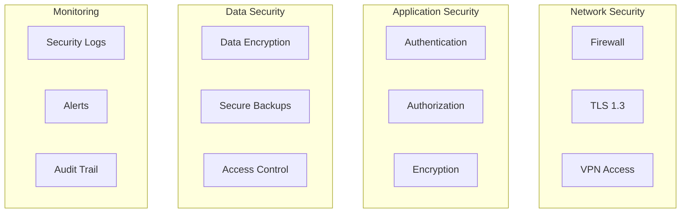
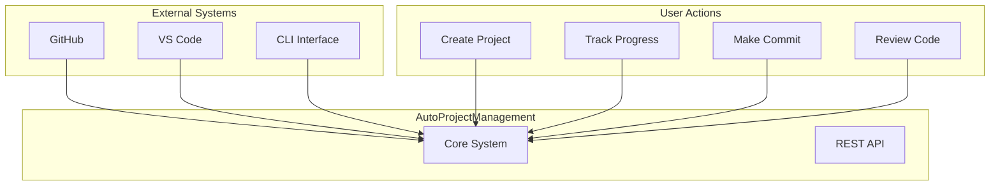
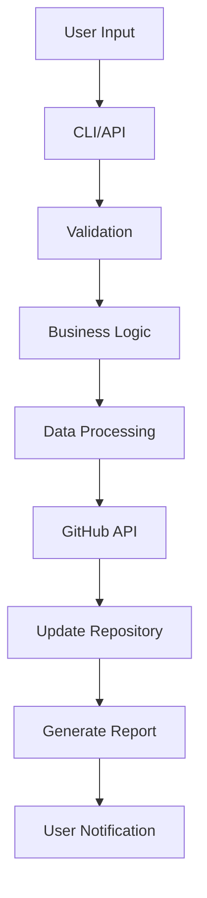
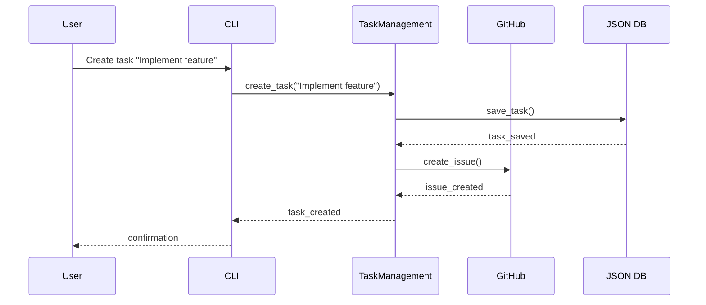
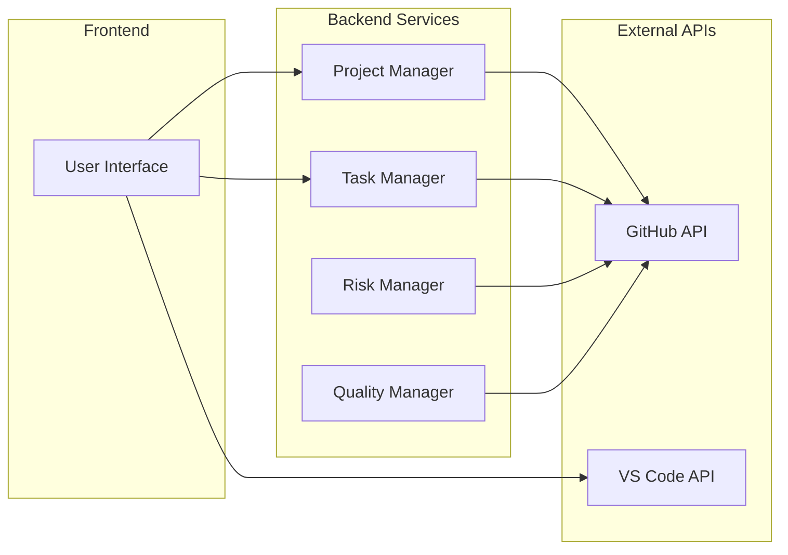

# Technical Architecture Document
## AutoProjectManagement System

**Version:** 2.0.0  
**Last Updated:** 2025-08-14  
**Document Status:** Production Ready

---

## Table of Contents

1. [Executive Summary](#executive-summary)
2. [System Overview](#system-overview)
3. [Architecture Principles](#architecture-principles)
4. [Technical Stack](#technical-stack)
5. [System Architecture](#system-architecture)
6. [Component Architecture](#component-architecture)
7. [Data Architecture](#data-architecture)
8. [API Architecture](#api-architecture)
9. [Security Architecture](#security-architecture)
10. [Deployment Architecture](#deployment-architecture)
11. [Performance Considerations](#performance-considerations)
12. [Monitoring & Observability](#monitoring--observability)
13. [Diagrams & Visualizations](#diagrams--visualizations)
14. [Appendices](#appendices)

---

## Executive Summary

The **AutoProjectManagement** system is a comprehensive automated project management solution designed for software development workflows. It provides end-to-end project lifecycle management with intelligent automation, real-time progress tracking, and seamless GitHub integration.

### Key Features
- **Automated Task Management**: Intelligent task creation, prioritization, and workflow management
- **GitHub Integration**: Seamless integration with GitHub repositories and issues
- **Real-time Progress Tracking**: Live progress monitoring with automated reporting
- **Risk Management**: Proactive risk identification and mitigation strategies
- **Resource Optimization**: Intelligent resource allocation and leveling
- **Quality Assurance**: Automated commit quality checks and code review workflows

### Target Audience
- Software development teams
- Project managers
- DevOps engineers
- Agile development teams
- Open source maintainers

---

## System Overview

### High-Level Architecture

The AutoProjectManagement system follows a **modular microservices architecture** with clear separation of concerns:



### System Boundaries
- **Internal**: Core business logic, data processing, workflow management
- **External**: GitHub API, VS Code Extension, CLI interfaces, web services
- **Integration Points**: GitHub webhooks, commit hooks, issue tracking

---

## Architecture Principles

### 1. **Modularity**
- Each component is self-contained and independently deployable
- Clear interfaces between modules
- Plugin-based architecture for extensibility

### 2. **Scalability**
- Horizontal scaling support through stateless services
- Efficient caching mechanisms
- Asynchronous processing for long-running operations

### 3. **Resilience**
- Graceful degradation under load
- Circuit breaker patterns for external dependencies
- Comprehensive error handling and recovery

### 4. **Security**
- Principle of least privilege
- Secure by design
- Regular security audits and updates

### 5. **Observability**
- Comprehensive logging at all levels
- Metrics collection and monitoring
- Distributed tracing capabilities

---

## Technical Stack

### Core Technologies

| Component | Technology | Version | Purpose |
|-----------|------------|---------|---------|
| **Language** | Python | 3.8+ | Primary development language |
| **Framework** | FastAPI | 0.100.0+ | REST API framework |
| **CLI** | Click | 8.0.0+ | Command-line interface |
| **Database** | JSON File | N/A | Primary data storage |
| **Cache** | In-memory | N/A | Performance optimization |
| **HTTP Client** | httpx | 0.24.0+ | HTTP requests |
| **Git Integration** | GitPython | 3.1.0+ | Git operations |

### Development Tools

| Tool | Purpose | Configuration |
|------|---------|---------------|
| **Black** | Code formatting | Line length: 88 |
| **Flake8** | Linting | PEP 8 compliance |
| **MyPy** | Type checking | Strict mode |
| **Pytest** | Testing | Coverage reporting |
| **Pre-commit** | Git hooks | Automated checks |

### External Services

| Service | Integration Type | Purpose |
|---------|------------------|---------|
| **GitHub API** | REST API | Repository management |
| **GitHub Issues** | REST API | Task tracking |
| **GitHub Actions** | Webhooks | CI/CD automation |
| **VS Code Extension** | Extension API | IDE integration |

---

## System Architecture

### Layered Architecture



### Component Relationships



---

## Component Architecture

### 1. Project Management System

**Responsibilities:**
- Project lifecycle management
- Task organization and tracking
- Resource allocation
- Progress monitoring

**Key Classes:**
The Project Management System includes comprehensive class structures for managing the complete project lifecycle:

- **ProjectManagementSystem**: Core orchestrator class handling project creation, modification, and deletion operations
- **Project Data Structures**: Typed dictionaries for project metadata storage and management
- **CRUD Operations**: Complete set of create, read, update, and delete methods for project management
- **Type Safety**: Strong typing with Python type hints for reliable data handling
- **Error Handling**: Comprehensive exception handling for all project operations

This class architecture ensures robust project management capabilities with proper data validation and error handling.

### 2. Task Management System

**Responsibilities:**
- Task creation and lifecycle management
- Workflow step tracking
- Priority calculation
- Dependency management

**Key Classes:**
```python
class TaskManagement:
    def create_task(self, title: str, **kwargs) -> Task:
        """Create a new task"""
        
    def update_workflow_steps(self, task_id: int, step: str) -> bool:
        """Update workflow step completion"""
        
    def prioritize_tasks(self) -> List[Task]:
        """Return prioritized task list"""
```

### 3. Risk Management System

**Responsibilities:**
- Risk identification
- Risk assessment
- Mitigation strategies
- Risk monitoring

**Key Classes:**
```python
class RiskManagement:
    def identify_risks(self, project_id: int) -> List[Risk]:
        """Identify risks for a project"""
        
    def assess_risks(self, risks: List[Risk]) -> List[RiskAssessment]:
        """Assess identified risks"""
        
    def mitigate_risks(self, risks: List[Risk]) -> bool:
        """Apply mitigation strategies"""
```

### 4. Quality Management System

**Responsibilities:**
- Code quality checks
- Commit review
- Quality metrics
- Automated testing

**Key Classes:**
```python
class QualityManagement:
    def check_code_quality(self, commit_hash: str) -> QualityReport:
        """Check code quality for a commit"""
        
    def review_commit(self, commit: Commit) -> ReviewResult:
        """Review a commit"""
        
    def generate_quality_report(self) -> QualityReport:
        """Generate comprehensive quality report"""
```

---

## Data Architecture

### Data Model Overview



### Data Storage Strategy

| Data Type | Storage Method | Location | Backup Strategy |
|-----------|----------------|----------|-----------------|
| **Projects** | JSON File | `JSonDataBase/Projects/` | Daily automated backup |
| **Tasks** | JSON File | `JSonDataBase/Tasks/` | Real-time sync |
| **Configuration** | JSON File | `config/` | Version controlled |
| **Logs** | Rotating File | `logs/` | 30-day retention |
| **Cache** | In-memory | RAM | Ephemeral |

### Data Flow



---

## API Architecture

### REST API Design

#### Base URL
```
https://api.autoprojectmanagement.com/api/v1/
```

#### Authentication
- **Method**: API Key (X-API-Key header)
- **Rate Limiting**: 100 requests/minute per key
- **Token Expiry**: 24 hours

### API Endpoints

| Endpoint | Method | Description | Parameters |
|----------|--------|-------------|------------|
| `/projects` | GET | List all projects | limit, offset |
| `/projects` | POST | Create new project | project_data |
| `/projects/{id}` | GET | Get project details | project_id |
| `/projects/{id}` | PUT | Update project | project_id, data |
| `/projects/{id}/tasks` | GET | Get project tasks | project_id |
| `/tasks` | GET | List all tasks | limit, offset |
| `/tasks` | POST | Create new task | task_data |
| `/tasks/{id}` | GET | Get task details | task_id |
| `/tasks/{id}/status` | PUT | Update task status | task_id, status |
| `/tasks/{id}/workflow` | PUT | Update workflow step | task_id, step |

### API Response Format

```json
{
  "success": true,
  "data": {
    "id": 123,
    "title": "Implement new feature",
    "status": "in_progress",
    "priority": 90,
    "deadline": "2025-08-20"
  },
  "meta": {
    "timestamp": "2025-08-14T10:30:00Z",
    "version": "1.0.0"
  }
}
```

### Error Handling

```json
{
  "success": false,
  "error": {
    "code": "TASK_NOT_FOUND",
    "message": "Task with ID 123 not found",
    "details": "Please check the task ID and try again"
  },
  "meta": {
    "timestamp": "2025-08-14T10:30:00Z"
  }
}
```

---

## Security Architecture

### Security Layers



### Security Measures

| Security Aspect | Implementation | Details |
|-----------------|----------------|---------|
| **Authentication** | API Key + OAuth | GitHub OAuth for user authentication |
| **Authorization** | Role-based | Project-level permissions |
| **Data Encryption** | AES-256 | At rest and in transit |
| **API Security** | Rate limiting | 100 requests/minute |
| **Input Validation** | Pydantic models | Request/response validation |
| **Audit Logging** | Comprehensive | All actions logged with timestamps |

### Security Best Practices

1. **Principle of Least Privilege**
2. **Secure by Design**
3. **Regular Security Audits**
4. **Dependency Scanning**
5. **Vulnerability Management**

---

## Deployment Architecture

### Deployment Options

#### 1. Local Development
```bash
# Clone repository
git clone https://github.com/autoprojectmanagement/autoprojectmanagement.git
cd autoprojectmanagement

# Install dependencies
pip install -r requirements.txt

# Run locally
python -m autoprojectmanagement.cli
```

#### 2. Docker Deployment
```dockerfile
FROM python:3.8-slim

WORKDIR /app
COPY requirements.txt .
RUN pip install -r requirements.txt

COPY . .
CMD ["python", "-m", "autoprojectmanagement.cli"]
```

#### 3. Cloud Deployment
```yaml
# docker-compose.yml
version: '3.8'
services:
  apm:
    build: .
    ports:
      - "8000:8000"
    volumes:
      - ./data:/app/data
    environment:
      - APM_ENV=production
```

### Environment Configuration

| Environment | Configuration | Purpose |
|-------------|---------------|---------|
| **Development** | Debug mode, hot reload | Local development |
| **Staging** | Production-like, test data | Testing |
| **Production** | Optimized, monitoring | Live system |

### Scaling Considerations

1. **Horizontal Scaling**: Stateless services
2. **Vertical Scaling**: Resource optimization
3. **Caching**: Redis for performance
4. **Load Balancing**: Nginx for API distribution

---

## Performance Considerations

### Performance Metrics

| Metric | Target | Monitoring |
|--------|--------|------------|
| **API Response Time** | < 200ms | Prometheus |
| **Task Processing** | < 1s | Custom metrics |
| **Memory Usage** | < 500MB | System monitoring |
| **CPU Usage** | < 70% | System monitoring |

### Optimization Strategies

1. **Caching**
   - In-memory caching for frequently accessed data
   - Git commit caching
   - API response caching

2. **Database Optimization**
   - Efficient JSON parsing
   - Lazy loading
   - Index optimization

3. **Code Optimization**
   - Async/await patterns
   - Connection pooling
   - Efficient algorithms

### Performance Monitoring

```python
# Example monitoring setup
from prometheus_client import Counter, Histogram, Gauge

# Metrics
api_requests = Counter('api_requests_total', 'Total API requests')
task_processing_time = Histogram('task_processing_seconds', 'Task processing time')
active_tasks = Gauge('active_tasks', 'Number of active tasks')
```

---

## Monitoring & Observability

### Monitoring Stack

| Component | Tool | Purpose |
|-----------|------|---------|
| **Metrics** | Prometheus | System metrics |
| **Logging** | Python logging | Application logs |
| **Tracing** | Jaeger | Distributed tracing |
| **Dashboard** | Grafana | Visualization |
| **Alerting** | AlertManager | Notifications |

### Key Metrics

```yaml
# Monitoring configuration
metrics:
  - name: api_requests_total
    type: counter
    description: Total API requests
    
  - name: task_processing_duration
    type: histogram
    description: Task processing time
    
  - name: active_projects
    type: gauge
    description: Number of active projects
    
  - name: error_rate
    type: counter
    description: Error rate
```

### Alerting Rules

```yaml
alerts:
  - name: HighErrorRate
    condition: error_rate > 0.05
    severity: warning
    
  - name: HighResponseTime
    condition: response_time > 500ms
    severity: critical
```

---

## Diagrams & Visualizations

### System Context Diagram



### Data Flow Diagram



### Sequence Diagram - Task Creation



### Component Interaction Diagram



---

## Appendices

### Appendix A: Glossary

| Term | Definition |
|------|------------|
| **APM** | AutoProjectManagement system |
| **WBS** | Work Breakdown Structure |
| **CLI** | Command Line Interface |
| **API** | Application Programming Interface |
| **CI/CD** | Continuous Integration/Continuous Deployment |
| **JSON** | JavaScript Object Notation |
| **REST** | Representational State Transfer |

### Appendix B: Configuration Examples

#### Environment Variables
```bash
# Required
export APM_GITHUB_TOKEN="your_github_token"
export APM_PROJECT_PATH="/path/to/project"

# Optional
export APM_LOG_LEVEL="INFO"
export APM_CACHE_SIZE="1000"
export APM_BACKUP_INTERVAL="3600"
```

#### Configuration File
```json
{
  "project": {
    "name": "MyProject",
    "description": "Project description",
    "settings": {
      "auto_commit": true,
      "quality_checks": true,
      "risk_monitoring": true
    }
  }
}
```

### Appendix C: Troubleshooting

#### Common Issues

| Issue | Solution |
|-------|----------|
| **GitHub API Rate Limit** | Increase rate limit or use token |
| **Permission Denied** | Check GitHub token permissions |
| **Task Not Found** | Verify task ID exists |
| **JSON Parse Error** | Validate JSON format |

#### Debug Mode
```bash
# Enable debug logging
export APM_LOG_LEVEL=DEBUG

# Run with verbose output
apm --verbose command
```

### Appendix D: Performance Tuning

#### Memory Optimization
```python
# Use generators for large datasets
def get_tasks_generator():
    for task in tasks:
        yield task

# Implement caching
from functools import lru_cache

@lru_cache(maxsize=128)
def get_project_cached(project_id):
    return get_project(project_id)
```

#### Database Optimization
```python
# Batch operations
def batch_update_tasks(tasks):
    for task in tasks:
        update_task(task)
```

---

## Conclusion

The AutoProjectManagement system provides a comprehensive, scalable, and secure solution for automated project management. Its modular architecture ensures flexibility and maintainability while providing powerful features for modern software development workflows.

### Next Steps

1. **Implementation**: Follow the deployment guide for your environment
2. **Customization**: Adapt configuration to your specific needs
3. **Integration**: Connect with your existing tools and workflows
4. **Monitoring**: Set up monitoring and alerting
5. **Training**: Onboard team members with documentation

### Support

- **Documentation**: [GitHub Wiki](https://github.com/autoprojectmanagement/autoprojectmanagement/wiki)
- **Issues**: [GitHub Issues](https://github.com/autoprojectmanagement/autoprojectmanagement/issues)
- **Discussions**: [GitHub Discussions](https://github.com/autoprojectmanagement/autoprojectmanagement/discussions)
- **Email**: team@autoprojectmanagement.com

---

**Document Version:** 2.0.0  
**Last Updated:** 2025-08-16 
**Next Review Date:** 2025-11-16
