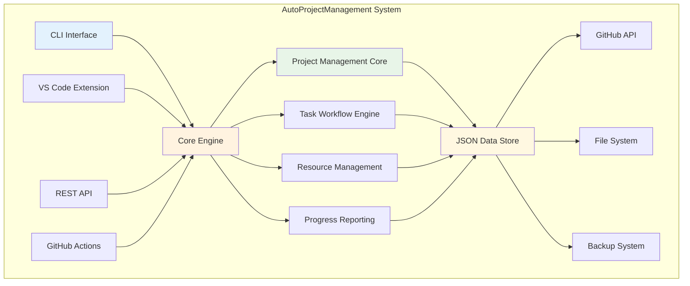
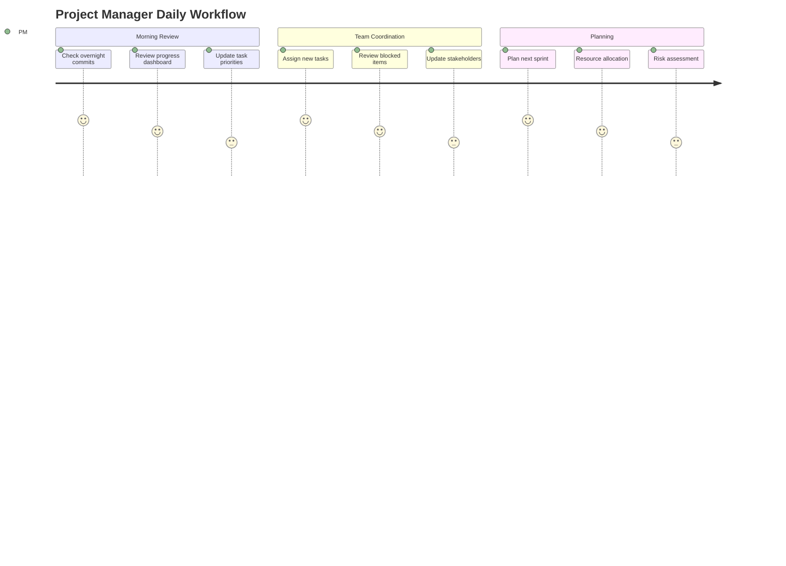
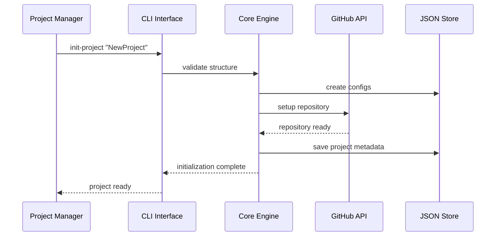

# AutoProjectManagement System - Use Cases Documentation

## Executive Summary

This document provides comprehensive use case documentation for the AutoProjectManagement system, a sophisticated automated project management solution designed for software development workflows. The system integrates GitHub-native workflows, JSON-driven configurations, and intelligent automation to revolutionize project management through real-time progress tracking, automated task management, and seamless integration capabilities.

## Table of Contents

1. [System Overview](#system-overview)
2. [User Personas](#user-personas)
3. [Core Use Cases](#core-use-cases)
4. [Detailed Use Case Specifications](#detailed-use-case-specifications)
5. [Workflow Diagrams](#workflow-diagrams)
6. [Data Flow Diagrams](#data-flow-diagrams)
7. [State Diagrams](#state-diagrams)
8. [Activity Diagrams](#activity-diagrams)
9. [Sequence Diagrams](#sequence-diagrams)
10. [Use Case Tables](#use-case-tables)
11. [Integration Scenarios](#integration-scenarios)
12. [Error Handling Scenarios](#error-handling-scenarios)

---

## System Overview

The AutoProjectManagement system provides end-to-end project lifecycle management with the following key capabilities:

- **Automated Task Management**: Intelligent task creation, prioritization, and workflow orchestration
- **GitHub Integration**: Seamless integration with GitHub repositories, issues, and Actions
- **Real-time Progress Tracking**: Automated progress monitoring via Git commits and JSON configurations
- **Resource Optimization**: Intelligent resource allocation and leveling algorithms
- **Quality Assurance**: Automated commit quality checks and code review workflows
- **Multi-project Support**: Scalable architecture supporting unlimited concurrent projects

### System Architecture Overview



---

## User Personas

### Primary User Types

| Persona | Role | Technical Level | Primary Goals | Key Pain Points |
|---------|------|-----------------|---------------|-----------------|
| **Project Manager** | PM/Team Lead | Intermediate | Project oversight, resource allocation, progress tracking | Manual status updates, scattered information |
| **Senior Developer** | Lead Developer | Advanced | Code quality, team coordination, technical decisions | Review bottlenecks, inconsistent processes |
| **Junior Developer** | Developer | Beginner-Intermediate | Task completion, learning, contribution | Unclear requirements, overwhelming complexity |
| **DevOps Engineer** | Infrastructure | Advanced | Automation, deployment, system reliability | Manual deployments, configuration drift |
| **Stakeholder** | Business/User | Basic | Progress visibility, delivery timelines | Lack of transparency, delayed updates |

### User Journey Maps



---

## Core Use Cases

### UC-001: Initialize New Project

**Primary Actor**: Project Manager  
**Goal**: Set up a new project with proper structure and configuration  
**Preconditions**: Git repository exists, user has appropriate permissions  

**Main Flow**:
1. User runs initialization command
2. System validates project structure
3. JSON configuration files are created
4. GitHub repository is configured
5. Initial backup is created
6. Project dashboard is initialized

**Alternative Flows**:
- **AF-1**: Repository doesn't exist → System creates new repository
- **AF-2**: Configuration exists → System offers to update or reset

**Postconditions**: Project is ready for team collaboration



### UC-002: Automated Task Creation

**Primary Actor**: Senior Developer  
**Goal**: Create tasks from requirements or code changes  
**Preconditions**: Project is initialized, requirements are defined  

**Main Flow**:
1. Developer commits code changes
2. System analyzes commit content
3. Tasks are automatically created/updated
4. Task priorities are calculated
5. Resources are allocated
6. Progress is tracked

**Task Creation Process**:

```mermaid
flowchart TD
