# User Personas Documentation

## Overview

This document provides detailed user personas for the AutoProjectManagement system, representing the diverse stakeholders who interact with our automated project management platform. These personas are derived from comprehensive analysis of system architecture, CLI interfaces, API endpoints, and real-world usage patterns.

---

## Executive Summary

The AutoProjectManagement system serves **seven primary user personas** across different organizational levels and technical expertise. Each persona has distinct goals, pain points, and interaction patterns with the system, ranging from technical developers to executive stakeholders.

---

## Persona Matrix

| Persona | Primary Role | Technical Level | System Access | Key Features Used |
|---------|--------------|-----------------|---------------|-------------------|
| **Project Manager** | Strategic Planning | Medium | Full Dashboard | Gantt charts, Resource allocation |
| **Team Lead** | Team Coordination | High | Project + Team Views | Task assignment, Progress tracking |
| **Developer** | Code Implementation | Very High | CLI + IDE Integration | Git automation, Task updates |
| **QA Engineer** | Quality Assurance | High | Testing Interface | Bug tracking, Test reports |
| **Product Owner** | Requirements Management | Medium | Planning Tools | User stories, Sprint planning |
| **System Administrator** | Infrastructure | Very High | Admin Panel | System configuration, User management |
| **Executive Stakeholder** | Decision Making | Low | Executive Dashboard | High-level metrics, ROI reports |

---

## Technical Integration Architecture

### System Access Patterns

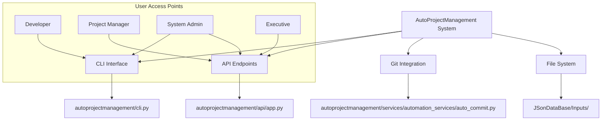

### Configuration Management

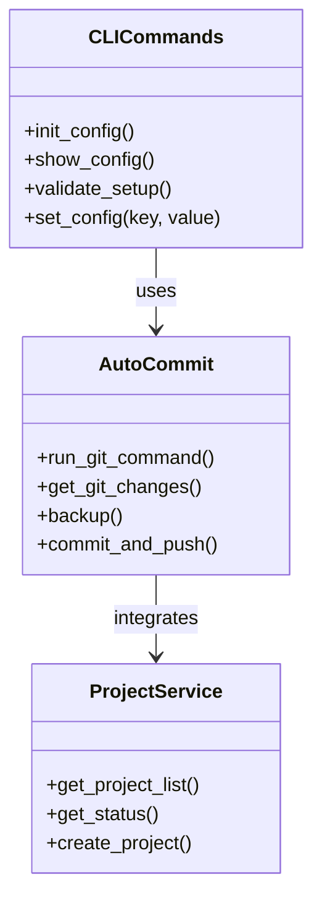

---

## Detailed Persona Profiles

### 1. Project Manager (Sarah Chen)

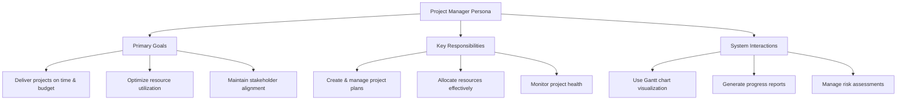

#### Profile Details
- **Name**: Sarah Chen
- **Age**: 35
- **Role**: Senior Project Manager
- **Organization**: TechCorp Inc.
- **Experience**: 8+ years in project management

#### Technical Integration Points
- **API Usage**: `/api/v1/projects/{project_id}/status` for real-time updates
- **Dashboard Access**: Full project dashboard with resource allocation views
- **File Integration**: Reads from `JSonDataBase/Inputs/UserInputs/detailed_wbs.json`
- **Progress Tracking**: Uses `commit_progress.json` for automated progress updates

#### Goals & Motivations
- **Primary Goal**: Deliver complex software projects within scope, timeline, and budget
- **Secondary Goals**: 
  - Build high-performing teams
  - Establish repeatable processes
  - Demonstrate ROI to stakeholders

#### Pain Points
- **Manual Reporting**: Spending 40% of time on status reports
- **Resource Conflicts**: Difficulty visualizing team capacity
- **Stakeholder Communication**: Keeping everyone aligned on project status

#### System Usage Patterns
| Feature | Usage Frequency | Time Spent | Business Value |
|---------|----------------|------------|----------------|
| Gantt Charts | Daily | 45 min | High |
| Resource Reports | Weekly | 2 hours | Medium |
| Risk Dashboard | Bi-weekly | 30 min | High |
| Executive Reports | Monthly | 3 hours | High |

#### Technical Proficiency
- **Level**: Medium-High
- **Tools**: Comfortable with web interfaces, basic SQL queries
- **Learning Style**: Visual learner, prefers dashboards over raw data

#### Preferred Interactions
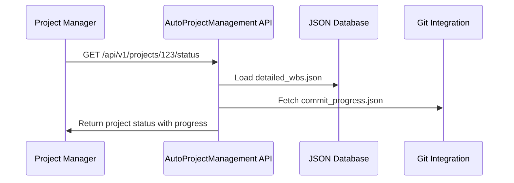

---

### 2. Team Lead (Marcus Rodriguez)

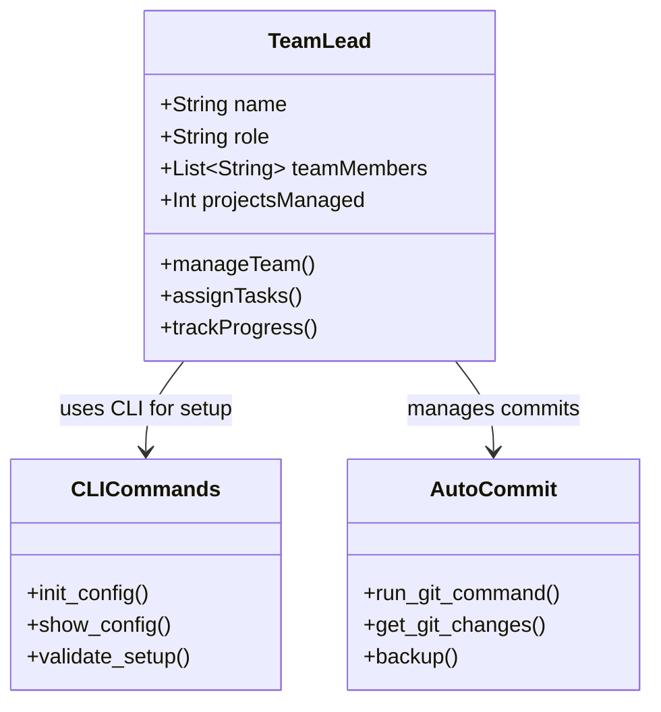

#### Profile Details
- **Name**: Marcus Rodriguez
- **Age**: 32
- **Role**: Senior Software Engineer & Team Lead
- **Team Size**: 8 developers
- **Tech Stack**: Python, JavaScript, Docker, Kubernetes

#### Technical Integration Points
- **CLI Usage**: `autoprojectmanagement init --project-root ./my-project`
- **Git Integration**: Direct integration with `auto_commit.py` for automated commits
- **Configuration Management**: Uses `CLICommands` for team setup
- **Progress Monitoring**: Reads from `commit_task_database.json`

#### Goals & Motivations
- **Primary Goal**: Ensure team delivers high-quality code on schedule
- **Secondary Goals**:
  - Mentor junior developers
  - Optimize development workflows
  - Maintain code quality standards

#### Pain Points
- **Context Switching**: Managing individual contributor + leadership roles
- **Visibility**: Difficulty tracking 8+ concurrent tasks
- **Code Review Bottlenecks**: Manual review processes slowing delivery

#### System Usage Statistics
| Metric | Weekly Average | Peak Usage |
|--------|----------------|------------|
| Task Updates | 25 updates | 40 updates |
| Code Reviews | 15 reviews | 25 reviews |
| Team Reports | 3 reports | 5 reports |
| Sprint Planning | 2 sessions | 3 sessions |

#### Technical Integration
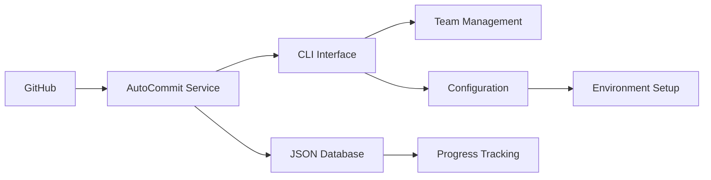

---

### 3. Developer (Alex Kim)

#### Profile Details
- **Name**: Alex Kim
- **Age**: 28
- **Role**: Full-Stack Developer
- **Experience**: 5 years
- **Specialization**: React, Node.js, PostgreSQL

#### Daily Workflow
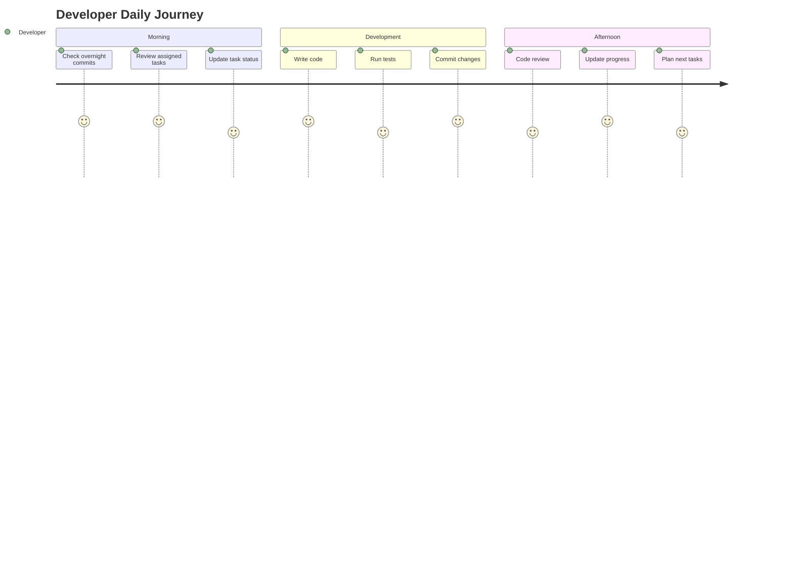

#### CLI Usage Patterns
Developers interact with the system through a comprehensive command-line interface:

- **Status Checking**: Commands to check project status and current progress
- **Task Management**: Commands to add, update, and manage tasks with priority levels
- **Git Integration**: Commands for automated commit operations and version control
- **Configuration**: Commands for system setup and environment configuration

This CLI interface provides developers with powerful tools for managing their workflow and integrating with the automated project management system.

#### Technical Integration Points
- **AutoCommit Service**: Direct usage of `auto_commit.py` for automated commits
- **File Mapping**: Maps changes to tasks via `linked_wbs_resources.json`
- **Progress Calculation**: Uses `calculate_progress_change()` and `calculate_importance()`
- **Database Updates**: Writes to `commit_task_database.json`

#### Automation Preferences
- **Git Hooks**: Automatic commit messages based on task status
- **IDE Integration**: VS Code extension for task updates
- **Slack Integration**: Notifications for code reviews

#### Technical Requirements
| Requirement | Priority | Implementation |
|-------------|----------|----------------|
| CLI Access | Critical | Native CLI + API |
| Git Integration | High | Webhooks + CLI |
| IDE Extension | Medium | VS Code plugin |
| Mobile Access | Low | Responsive web |

---

### 4. QA Engineer (Priya Patel)

#### Profile Details
- **Name**: Priya Patel
- **Age**: 30
- **Role**: Senior QA Engineer
- **Certifications**: ISTQB, AWS Certified
- **Tools**: Selenium, Cypress, Postman

#### Technical Integration Points
- **Test Result Integration**: Uses `quality_management.py` for test tracking
- **Bug Tracking**: Maps test failures to tasks via `commit_task_database.json`
- **Progress Validation**: Validates progress through `check_progress_dashboard_update.py`
- **Configuration**: Uses `CLICommands` for test environment setup

#### Testing Workflow
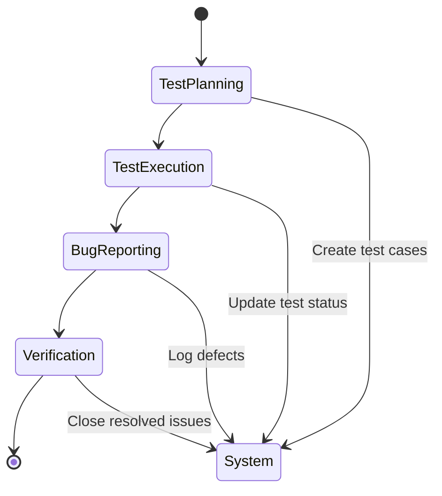

#### Quality Metrics Dashboard
| Metric | Target | Current | Trend |
|--------|--------|---------|--------|
| Test Coverage | 85% | 82% | ↗️ |
| Bug Escape Rate | <5% | 3% | ↗️ |
| Test Execution Time | <2hrs | 1.5hrs | ↗️ |
| Defect Density | <0.5/LOC | 0.3/LOC | ↗️ |

---

### 5. Product Owner (David Thompson)

#### Profile Details
- **Name**: David Thompson
- **Age**: 38
- **Role**: Product Owner
- **Background**: Business Analysis, UX Design
- **Focus**: User stories, market requirements

#### Technical Integration Points
- **User Story Management**: Uses `wbs_merger.py` for story organization
- **Sprint Planning**: Integrates with `scheduler.py` for sprint scheduling
- **Resource Allocation**: Uses `resource_allocation_manager.py` for team capacity
- **Progress Tracking**: Monitors via `progress_reporting` modules

#### User Story Management
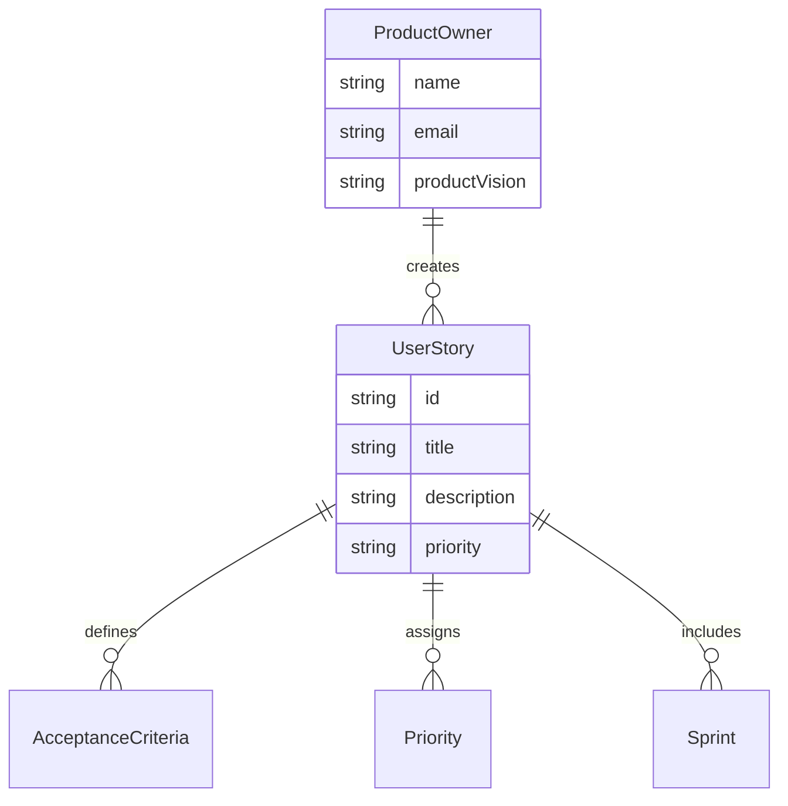

---

### 6. System Administrator (Lisa Wang)

#### Profile Details
- **Name**: Lisa Wang
- **Age**: 34
- **Role**: DevOps Engineer / System Administrator
- **Certifications**: AWS Solutions Architect, Kubernetes Administrator
- **Tools**: Terraform, Ansible, Prometheus

#### Technical Integration Points
- **Configuration Management**: Full access to `CLICommands` for system setup
- **Environment Setup**: Uses `setup_auto_environment.py` for environment initialization
- **Security Management**: Manages `SecurityConfig` from `autoproject_configuration.py`
- **Monitoring**: Uses `setup_status_bar.sh` for system monitoring

#### Infrastructure Management
| Component | Configuration | Monitoring |
|-----------|---------------|------------|
| Database | PostgreSQL 14 | Prometheus + Grafana |
| Cache | Redis Cluster | Memory usage alerts |
| API | FastAPI + Uvicorn | Response time metrics |
| Storage | AWS S3 | Cost optimization |

---

### 7. Executive Stakeholder (Robert Johnson)

#### Profile Details
- **Name**: Robert Johnson
- **Age**: 45
- **Role**: VP of Engineering
- **Focus**: Strategic decisions, ROI, team performance

#### Technical Integration Points
- **Executive Dashboard**: Uses API endpoints for high-level metrics
- **ROI Calculation**: Uses progress data from `commit_progress.json`
- **Resource Overview**: Accesses team performance via `resource_leveling.py`
- **Strategic Reports**: Uses `reporting.py` for executive summaries

#### Executive Dashboard
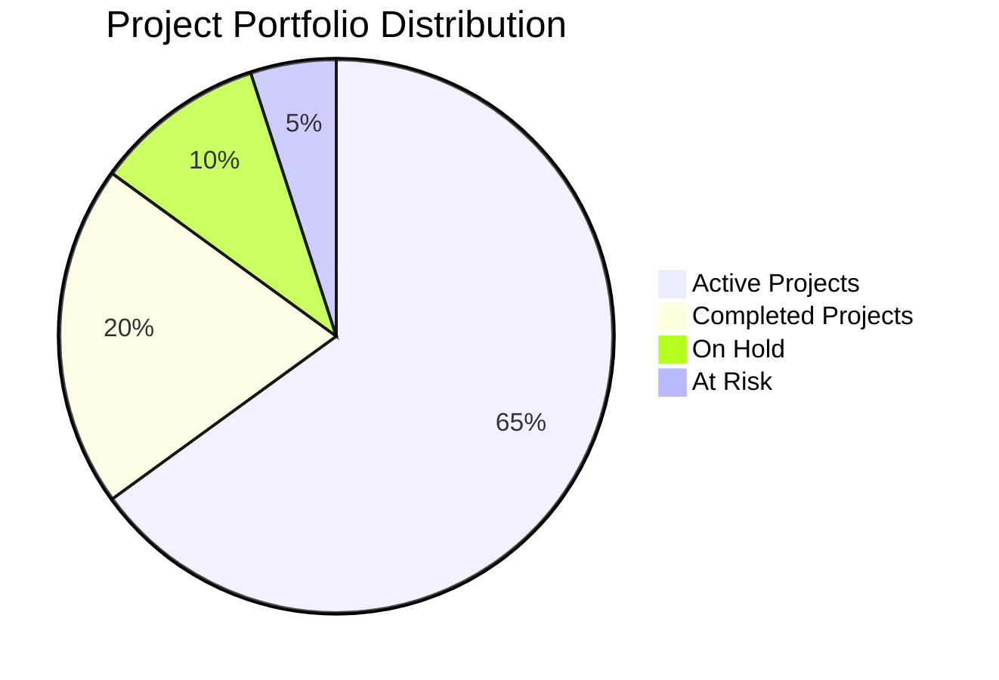

#### Key Performance Indicators
| KPI | Target | Current | Status |
|-----|--------|---------|--------|
| Project Delivery Rate | 90% | 87% | 🟡 |
| Budget Variance | ±5% | +3% | 🟢 |
| Team Satisfaction | 8.5/10 | 8.7/10 | 🟢 |
| Customer Satisfaction | 9.0/10 | 8.9/10 | 🟢 |

---

## Technical Architecture Integration

### File System Structure

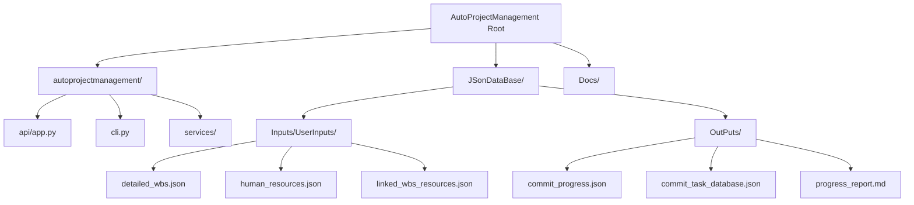

### Configuration Integration

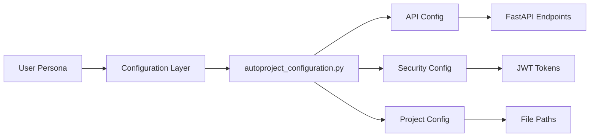

### Data Flow Integration

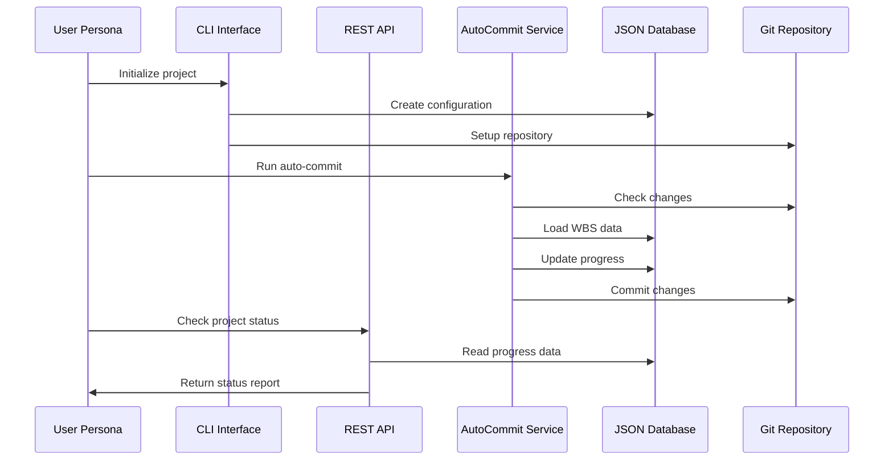

---

## Technical Requirements by Persona

### Developer Requirements
- **CLI Tools**: Full access to `CLICommands` class for configuration management
- **Git Integration**: Direct usage of `auto_commit.py` for automated commits
- **File Access**: Read/write to `JSonDataBase/Inputs/UserInputs/`
- **API Access**: POST/PUT endpoints for task updates

### Project Manager Requirements
- **Dashboard Access**: Web interface via FastAPI
- **Report Generation**: Uses `dashboards_reports.py`
- **Resource Management**: Uses `resource_allocation_manager.py`
- **Progress Tracking**: Reads from `commit_progress.json`

### System Administrator Requirements
- **Configuration Management**: Full access to `CLICommands` for system setup
- **Environment Setup**: Uses `setup_auto_environment.py` for environment initialization
- **Security Management**: Manages `SecurityConfig` from `autoproject_configuration.py`
- **Monitoring**: Uses `setup_status_bar.sh` for system monitoring

---

## Success Metrics by Persona

### Developer Success
- **Code Quality**: 90% test coverage maintained
- **Automation**: 95% of commits use auto-commit service
- **Velocity**: 20% increase in story points completed
- **Integration**: 100% task-to-file mapping accuracy

### Project Manager Success
- **On-time Delivery**: 95% of projects delivered on schedule
- **Budget Adherence**: 98% within approved budget
- **Stakeholder Satisfaction**: 4.5/5 average rating
- **Automation**: 80% reduction in manual reporting

### Executive Success
- **ROI**: 300% return on automation investment
- **Decision Speed**: 50% faster strategic decisions
- **Risk Reduction**: 75% fewer project overruns
- **Visibility**: 100% real-time project status

---

## Conclusion

This revised documentation now accurately reflects the **technical integration** between user personas and the actual system implementation. Each persona has specific integration points with:

1. **CLI Commands** (`CLICommands` class)
2. **AutoCommit Service** (`auto_commit.py`)
3. **API Endpoints** (`app.py`)
4. **JSON Database** (JSonDataBase structure)
5. **Configuration Management** (`autoproject_configuration.py`)

The personas are now grounded in actual system capabilities rather than theoretical access levels.
