# AutoProjectManagement - Actual System Architecture

## Overview
This document provides an accurate overview of the **AutoProjectManagement** tool's actual architecture. This is a **Command-Line Interface (CLI) application** built with Python, featuring both a Click-based CLI and an optional FastAPI REST API. The system uses JSON files for data persistence and provides GitHub integration capabilities.

---

## 1. Actual System Architecture

### 1.1. High-Level Overview

```mermaid
graph TD
    linkStyle default stroke:#000,stroke-width:1.5px

    subgraph UserInteraction
        style UserInteraction fill:#d6eaf8,stroke:#333,stroke-width:2px,color:#2874a6
        CLIUser([👤 CLI User])
        APIUser([🌐 API User])
    end

    subgraph ApplicationCore
        style ApplicationCore fill:#e8f8f5,stroke:#333,stroke-width:2px,color:#117a65
        CLI("autoprojectmanagement/cli.py<br/>Click Framework")
        API("autoprojectmanagement/api/main.py<br/>FastAPI")
        Services("autoprojectmanagement/services/cli_commands.py<br/>argparse-based")
        MainModules("autoprojectmanagement/main_modules/")
        DataStorage("JSonDataBase/<br/>JSON File Storage")
    end

    CLIUser --> CLI
    APIUser --> API
    CLI --> Services
    API --> Services
    Services --> MainModules
    MainModules --> DataStorage
```



### 1.2. Component Descriptions

- **CLI Interface**: `autoprojectmanagement/cli.py` - Uses Click framework for command-line interactions
- **API Interface**: `autoprojectmanagement/api/main.py` - FastAPI-based REST API for programmatic access
- **Services Layer**: `autoprojectmanagement/services/cli_commands.py` - Uses argparse for command parsing and orchestration
- **Main Modules**: `autoprojectmanagement/main_modules/` - Contains actual business logic implementations
- **Data Storage**: `JSonDataBase/` - JSON file-based persistence system

---

## 2. Detailed Component Analysis

### 2.1. CLI Interface (Click-based)
**File**: `autoprojectmanagement/cli.py`
**Technology**: Python Click framework

**Actual Commands**:
- `init` - Initialize system
- `create_project` - Create new project
- `status` - Show project status
- `add_task` - Add task to project
- `report` - Generate project reports

### 2.2. Services Layer (argparse-based)
**File**: `autoprojectmanagement/services/cli_commands.py`
**Technology**: Python argparse

**Key Functions**:
- `setup_project()` - Project initialization
- `create_github_project()` - GitHub project creation
- `sync_with_github()` - GitHub synchronization
- `status()` - System status checking

### 2.3. Main Business Logic
**File**: `autoprojectmanagement/main_modules/project_management_system.py`
**Core Class**: `ProjectManagementSystem`

**Actual Capabilities**:
- Project creation/management
- Task management within projects
- JSON-based data storage
- Basic CRUD operations for projects and tasks

### 2.4. Data Storage System
**Location**: `JSonDataBase/`
**Format**: JSON files

**Structure**:
```
JSonDataBase/
├── Inputs/
│   ├── UserInputs/
│   └── SystemGeneratorInputs/
└── OutPuts/
    ├── commit_progress.json
    ├── commit_task_database.json
    └── progress_report.md
```

---

## 3. Actual Data Flow

### 3.1. CLI Command Flow

```mermaid
sequenceDiagram
    participant User
    participant CLI
    participant Services
    participant MainModules
    participant JSONFiles

    User->>CLI: apm create-project "MyProject"
    CLI->>Services: create_project("MyProject")
    Services->>MainModules: add_project(project_data)
    MainModules->>JSONFiles: Write to JSON files
    JSONFiles-->>MainModules: Success
    MainModules-->>Services: Project created
    Services-->>CLI: Success response
    CLI-->>User: "✅ Project created successfully!"
```



### 3.2. API Flow


---

## 4. GitHub Integration

**File**: `autoprojectmanagement/services/github_project_manager.py`
**Capabilities**:
- Create GitHub repositories
- Create project boards
- Sync project data with GitHub issues
- Generate GitHub reports

---

## 5. Testing Strategy

**Framework**: pytest
**Structure**:
- Unit tests for individual modules
- Integration tests for CLI/API flows
- JSON file I/O testing

**Test Locations**:
- `tests/code_tests/UnitTests/`
- `tests/code_tests/IntegrationTests/`
- `tests/api/`

---

## 6. Summary

The AutoProjectManagement tool is a **Python CLI application** with:
- **Click-based CLI** for terminal interactions
- **FastAPI REST API** for programmatic access
- **argparse-based services** for command orchestration
- **JSON file storage** for data persistence
- **GitHub integration** for repository management
- **Modular architecture** with clear separation of concerns

This architecture is simpler and more focused than previously documented, accurately reflecting the actual implementation rather than over-engineered designs.
