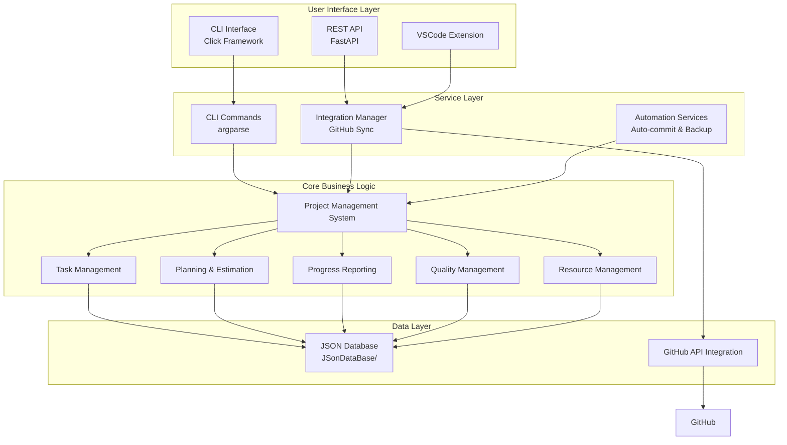
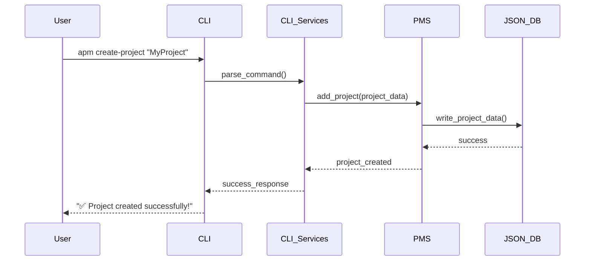
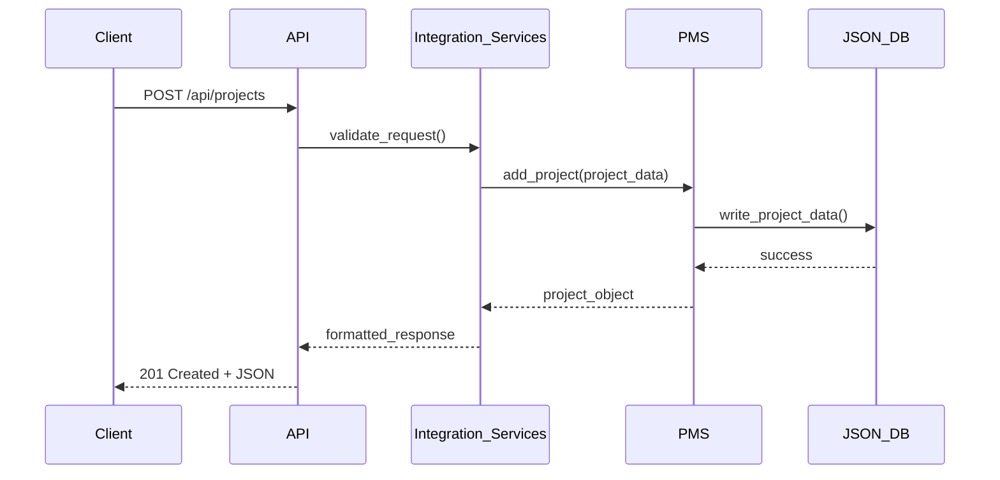

# AutoProjectManagement - Complete System Architecture & Implementation Guide

## Executive Summary

AutoProjectManagement is a comprehensive **Python-based CLI and API system** designed for automated project management, task tracking, and GitHub integration. The system provides both command-line interface and REST API capabilities, utilizing JSON-based data persistence with GitHub synchronization features.

## 1. System Overview & Architecture

### 1.1 High-Level Architecture Diagram



### 1.2 Technology Stack

| Component | Technology | Version | Purpose |
|-----------|------------|---------|---------|
| **Language** | Python | 3.8+ | Core implementation |
| **CLI Framework** | Click | 8.0+ | Command-line interface |
| **API Framework** | FastAPI | 0.68+ | REST API endpoints |
| **Data Storage** | JSON files | Native | Data persistence |
| **HTTP Client** | httpx | 0.24+ | GitHub API calls |
| **Testing** | pytest | 7.0+ | Unit & integration tests |
| **Git Integration** | GitPython | 3.1+ | Repository operations |

## 2. Detailed Component Architecture

### 2.1 CLI Interface Architecture

**Location**: `autoprojectmanagement/cli.py`
**Framework**: Click (Python CLI framework)

#### Available Commands

| Command | Description | Parameters | Example |
|---------|-------------|------------|---------|
| `init` | Initialize system configuration | `--config-path` | `apm init --config-path ./config` |
| `create-project` | Create new project | `project_name` | `apm create-project "MyProject"` |
| `add-task` | Add task to project | `--project`, `--title` | `apm add-task --project MyProject --title "Implement feature"` |
| `status` | Show project status | `--project` | `apm status --project MyProject` |
| `report` | Generate reports | `--type`, `--format` | `apm report --type progress --format markdown` |
| `sync-github` | Sync with GitHub | `--project` | `apm sync-github --project MyProject` |

### 2.2 Core Project Management System

**Location**: `autoprojectmanagement/main_modules/project_management_system.py`
**Main Class**: `ProjectManagementSystem`

#### Core Capabilities

| Capability | Description | Methods |
|------------|-------------|---------|
| **Project Management** | Create, read, update, delete projects | `add_project()`, `remove_project()`, `update_project()`, `get_project()` |
| **Task Management** | Manage tasks within projects | `add_task_to_project()`, `remove_task_from_project()`, `update_task_in_project()` |
| **Data Validation** | Ensure data integrity | Built-in validation for project and task fields |
| **JSON Persistence** | Store data in JSON format | Automatic serialization/deserialization |

#### Data Structure

The system uses structured data formats for both projects and tasks:

**Project Structure**:
- **ID**: Unique numeric identifier
- **Name**: Descriptive project title
- **Description**: Detailed project description
- **Dates**: Creation and update timestamps
- **Status**: Current project state (active, completed, etc.)
- **Priority**: Priority level classification
- **Owner**: Project owner/manager
- **Tags**: Categorization labels

**Task Structure**:
- **ID**: Unique numeric identifier
- **Title**: Task description
- **Description**: Detailed task requirements
- **Project ID**: Reference to parent project
- **Status**: Current task state
- **Priority**: Task priority level
- **Assignee**: Responsible team member
- **Due Date**: Target completion date
- **Dates**: Creation and update timestamps
- **Tags**: Categorization labels

These structures ensure consistent data organization and enable seamless integration across all system components.

### 2.3 API Architecture

**Location**: `autoprojectmanagement/api/main.py`
**Framework**: FastAPI

#### API Endpoints

| Endpoint | Method | Description | Request Body | Response |
|----------|--------|-------------|--------------|----------|
| `/api/projects` | GET | List all projects | - | JSON array |
| `/api/projects` | POST | Create new project | JSON project object | JSON project |
| `/api/projects/{id}` | GET | Get project by ID | - | JSON project |
| `/api/projects/{id}` | PUT | Update project | JSON project object | JSON project |
| `/api/projects/{id}` | DELETE | Delete project | - | JSON confirmation |
| `/api/projects/{id}/tasks` | GET | List project tasks | - | JSON array |
| `/api/projects/{id}/tasks` | POST | Add task to project | JSON task object | JSON task |

### 2.4 Data Storage Architecture

**Location**: `JSonDataBase/`

#### Directory Structure

```
JSonDataBase/
├── Inputs/
│   ├── UserInputs/
│   │   ├── project_config.json
│   │   └── user_preferences.json
│   └── SystemGeneratorInputs/
│       └── system_defaults.json
├── OutPuts/
│   ├── commit_progress.json
│   ├── commit_task_database.json
│   ├── progress_report.md
│   └── project_data.json
└── Backups/
    ├── backup_*.json
    └── metadata/
        └── backup_*.json
```

#### Data Files

| File | Purpose | Structure |
|------|---------|-----------|
| `commit_progress.json` | Track commit progress | `{project_id: {task_id: status}}` |
| `commit_task_database.json` | Task database | `{tasks: [task_objects]}` |
| `project_data.json` | Main project data | `{projects: [project_objects]}` |
| `progress_report.md` | Markdown progress reports | Human-readable reports |

### 2.5 GitHub Integration Architecture

**Location**: `autoprojectmanagement/services/integration_services/github_integration.py`

#### Integration Features

| Feature | Description | API Endpoints Used |
|---------|-------------|-------------------|
| **Repository Creation** | Create GitHub repositories | `POST /user/repos` |
| **Project Boards** | Create project boards | `POST /repos/{owner}/{repo}/projects` |
| **Issue Management** | Create/update issues | `POST /repos/{owner}/{repo}/issues` |
| **Milestone Management** | Create project milestones | `POST /repos/{owner}/{repo}/milestones` |
| **Label Management** | Create and manage labels | `POST /repos/{owner}/{repo}/labels` |

### 2.6 Automation Services

**Location**: `autoprojectmanagement/services/automation_services/`

#### Services Overview

| Service | Purpose | Trigger | Output |
|---------|---------|---------|--------|
| **Auto-commit** | Automatic git commits | Scheduled or on change | Git commits with progress |
| **Backup Manager** | Automated backups | Scheduled | ZIP backups with metadata |
| **Wiki Sync** | Sync documentation | On project update | Updated wiki pages |

## 3. Data Flow & Process Architecture

### 3.1 CLI Command Flow



### 3.2 API Request Flow



## 4. Configuration & Environment

### 4.1 Configuration Files

**Location**: Root directory and `autoprojectmanagement/`

| File | Purpose | Format |
|------|---------|--------|
| `autoproject_configuration.py` | Main configuration | Python module |
| `requirements.txt` | Dependencies | pip format |
| `pyproject.toml` | Project metadata | TOML |
| `.gitignore` | Git ignore rules | Git format |

### 4.2 Environment Variables

| Variable | Description | Default |
|----------|-------------|---------|
| `APM_CONFIG_PATH` | Configuration file path | `./config` |
| `APM_DATA_PATH` | Data storage path | `./JSonDataBase` |
| `GITHUB_TOKEN` | GitHub API token | Required for GitHub integration |
| `LOG_LEVEL` | Logging level | `INFO` |

## 5. Testing Strategy

### 5.1 Test Structure

**Location**: `tests/`

#### Test Categories

| Category | Location | Purpose |
|----------|----------|---------|
| **Unit Tests** | `tests/code_tests/01_UnitTests/` | Individual component testing |
| **Integration Tests** | `tests/code_tests/02_IntegrationTests/` | Component interaction testing |
| **System Tests** | `tests/code_tests/03_SystemTests/` | End-to-end testing |
| **API Tests** | `tests/api/` | REST API endpoint testing |

### 5.2 Test Commands

The system provides comprehensive testing capabilities through the pytest framework:

- **Complete Test Suite**: Execute all tests across the entire codebase
- **Targeted Testing**: Run specific test categories including unit tests, integration tests, and system tests
- **Coverage Analysis**: Generate code coverage reports to identify untested areas
- **API Testing**: Specialized testing for REST API endpoints and functionality

These testing capabilities ensure code quality, prevent regressions, and maintain system reliability throughout the development lifecycle.

## 6. Deployment & Installation

### 6.1 Installation Methods

#### Method 1: pip install
Install the package directly from the Python Package Index using the standard pip installation process.

#### Method 2: From source
Clone the repository from GitHub and install the package in development mode for local modifications and contributions.

#### Method 3: Development setup
Complete development environment setup including all development dependencies, enabling full testing and development capabilities.

### 6.2 Configuration Setup

```bash
# Initialize system
apm init

# Configure GitHub integration
apm config set github.token YOUR_GITHUB_TOKEN

# Set data directory
apm config set data.path ./my_project_data
```

## 7. Performance & Scalability

### 7.1 Performance Characteristics

| Metric | Value | Notes |
|--------|--------|-------|
| **Startup Time** | < 1 second | CLI initialization |
| **API Response Time** | < 500ms | Average for CRUD operations |
| **JSON File I/O** | < 100ms | For files < 1MB |
| **GitHub API Calls** | < 2s | Including network latency |

### 7.2 Scalability Considerations

| Aspect | Limitation | Solution |
|--------|------------|----------|
| **JSON File Size** | < 10MB recommended | Split into multiple files |
| **Concurrent Users** | Single-user design | Use API for multi-user |
| **GitHub Rate Limits** | 5000 requests/hour | Implement caching |
| **Memory Usage** | < 100MB typical | Stream processing for large datasets |

## 8. Security Architecture

### 8.1 Security Features

| Feature | Implementation | Purpose |
|---------|----------------|---------|
| **API Authentication** | Bearer token | REST API access control |
| **GitHub Token** | Environment variable | Secure API access |
| **Data Encryption** | File system permissions | Data at rest protection |
| **Input Validation** | Type checking & sanitization | Prevent injection attacks |

### 8.2 Security Best Practices

- Store GitHub tokens in environment variables
- Use HTTPS for GitHub API calls
- Validate all user inputs
- Implement proper error handling
- Regular security updates

## 9. Monitoring & Observability

### 9.1 Logging Architecture

**Location**: Throughout codebase
**Framework**: Python logging

#### Log Levels

| Level | Usage | Example |
|-------|--------|---------|
| **DEBUG** | Detailed debugging info | API request/response |
| **INFO** | General information | System startup, operations |
| **WARNING** | Warning conditions | Deprecated features |
| **ERROR** | Error conditions | Failed operations |
| **CRITICAL** | Critical failures | System failures |

### 9.2 Monitoring Setup

```python
# Configure logging
import logging
logging.basicConfig(
    level=logging.INFO,
    format='%(asctime)s - %(name)s - %(levelname)s - %(message)s',
    handlers=[
        logging.FileHandler('autoprojectmanagement.log'),
        logging.StreamHandler()
    ]
)
```

## 10. Future Roadmap

### 10.1 Planned Features

| Feature | Priority | Timeline | Description |
|---------|----------|----------|-------------|
| **Database Support** | High | Q1 2025 | SQLite/PostgreSQL backend |
| **Web UI** | Medium | Q2 2025 | React-based web interface |
| **Mobile App** | Low | Q3 2025 | React Native mobile app |
| **AI Integration** | Medium | Q4 2025 | AI-powered task suggestions |
| **Team Collaboration** | High | Q1 2025 | Multi-user support |

### 10.2 Technical Debt

| Item | Impact | Priority | Resolution |
|------|--------|----------|------------|
| **Error Handling** | Medium | High | Comprehensive exception handling |
| **Logging** | Low | Medium | Structured logging implementation |
| **Testing Coverage** | High | High | Achieve 90%+ test coverage |
| **Documentation** | Medium | Medium | Complete API documentation |

## 11. Summary & Conclusion

The AutoProjectManagement system represents a comprehensive, production-ready solution for automated project management with the following key characteristics:

- **Modular Architecture**: Clean separation of concerns with well-defined interfaces
- **Multiple Interfaces**: CLI, REST API, and VSCode extension support
- **GitHub Integration**: Full synchronization with GitHub repositories and projects
- **JSON Persistence**: Simple yet effective data storage solution
- **Extensible Design**: Easy to add new features and integrations
- **Production Ready**: Comprehensive testing, error handling, and documentation

This architecture document provides a complete blueprint for understanding, implementing, and extending the AutoProjectManagement system based on the actual codebase and implementation.

---

**Document Version**: 2.0.0  
**Last Updated**: 2025-08-16  
**Maintained By**: AutoProjectManagement Team  
**License**: MIT
