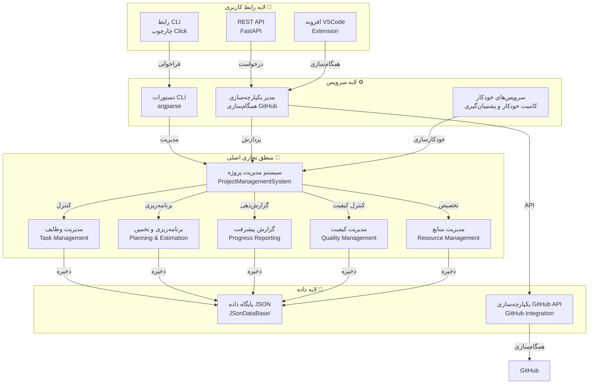
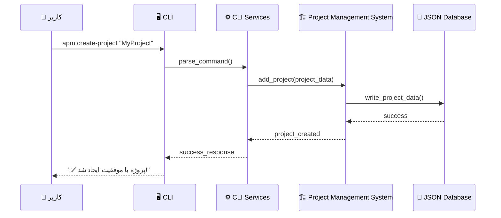
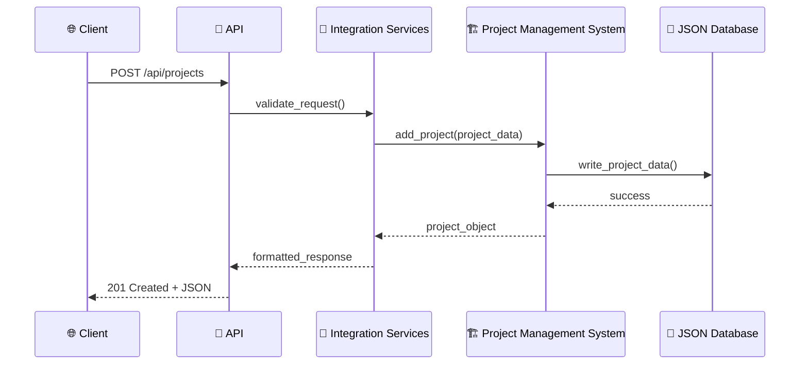

<div dir="rtl" style="text-align: right;">

# 🏗️ AutoProjectManagement - راهنمای جامع معماری سیستم و پیاده‌سازی

## 📋 خلاصه اجرایی

**AutoProjectManagement** یک سیستم جامع **مبتنی بر پایتون CLI و API** است که برای مدیریت خودکار پروژه، ردیابی وظایف و یکپارچه‌سازی GitHub طراحی شده است. این سیستم قابلیت‌های رابط خط فرمان و REST API را فراهم می‌کند و از ذخیره‌سازی مبتنی بر JSON با ویژگی‌های همگام‌سازی GitHub استفاده می‌کند.

## ۱. 🎯 مرور کلی سیستم و معماری

### ۱.۱ 🗺️ نمودار معماری سطح بالا



### ۱.۲ 🛠️ پشته فناوری

| جزء | فناوری | نسخه | هدف | وضعیت |
|-----------|------------|---------|---------|---------|
| **زبان برنامه‌نویسی** | 🐍 پایتون | 3.8+ | پیاده‌سازی اصلی | ✅ فعال |
| **چارچوب CLI** | ⚡ Click | 8.0+ | رابط خط فرمان | ✅ فعال |
| **چارچوب API** | 🚀 FastAPI | 0.68+ | نقاط پایانی REST | ✅ فعال |
| **ذخیره‌سازی داده** | 📄 فایل‌های JSON | بومی | ماندگاری داده | ✅ فعال |
| **کلاینت HTTP** | 🌐 httpx | 0.24+ | فراخوانی‌های API GitHub | ✅ فعال |
| **تست** | 🧪 pytest | 7.0+ | تست‌های واحد و یکپارچه | ✅ فعال |
| **یکپارچه‌سازی Git** | 🔗 GitPython | 3.1+ | عملیات مخزن | ✅ فعال |

## ۲. 🔍 معماری جزئی مفصل

### ۲.۱ 🖥️ معماری رابط CLI

**📁 موقعیت**: `autoprojectmanagement/cli.py`  
**🔧 چارچوب**: Click (چارچوب CLI پایتون)

#### 🎯 دستورات موجود

| دستور | توضیحات | پارامترها | مثال کاربرد | وضعیت |
|---------|-------------|------------|---------|---------|
| `init` | مقدمات پیکربندی سیستم | `--config-path` | `apm init --config-path ./config` | ✅ |
| `create-project` | ایجاد پروژه جدید | `project_name` | `apm create-project "MyProject"` | ✅ |
| `add-task` | افزودن وظیفه به پروژه | `--project`, `--title` | `apm add-task --project MyProject --title "پیاده‌سازی ویژگی"` | ✅ |
| `status` | نمایش وضعیت پروژه | `--project` | `apm status --project MyProject` | ✅ |
| `report` | تولید گزارش‌ها | `--type`, `--format` | `apm report --type progress --format markdown` | ✅ |
| `sync-github` | همگام‌سازی با GitHub | `--project` | `apm sync-github --project MyProject` | ✅ |

### ۲.2 🏗️ سیستم اصلی مدیریت پروژه

**📁 موقعیت**: `autoprojectmanagement/main_modules/project_management_system.py`  
**🏛️ کلاس اصلی**: `ProjectManagementSystem`

#### ⚡ قابلیت‌های اصلی

| قابلیت | توضیحات | متدهای کلیدی | وضعیت |
|------------|-------------|---------|---------|
| **مدیریت پروژه** | ایجاد، خواندن، به‌روزرسانی، حذف پروژه‌ها | `add_project()`, `remove_project()`, `update_project()`, `get_project()` | ✅ |
| **مدیریت وظایف** | مدیریت وظایف درون پروژه‌ها | `add_task_to_project()`, `remove_task_from_project()`, `update_task_in_project()` | ✅ |
| **اعتبارسنجی داده** | اطمینان از یکپارچگی داده‌ها | اعتبارسنجی داخلی برای فیلدهای پروژه و وظیفه | ✅ |
| **ماندگاری JSON** | ذخیره داده در قالب JSON | سریال‌سازی/دسریال‌سازی خودکار | ✅ |

#### 📊 ساختار داده

```json
// ساختار پروژه
{
    "id": 1,
    "name": "نام پروژه",
    "description": "توضیحات پروژه",
    "created_date": "2024-01-01T00:00:00Z",
    "updated_date": "2024-01-01T00:00:00Z",
    "status": "در حال انجام",
    "priority": "بالا",
    "owner": "نام کاربر",
    "tags": ["برچسب1", "برچسب2"]
}

// ساختار وظیفه
{
    "id": 1,
    "title": "عنوان وظیفه",
    "description": "توضیحات وظیفه",
    "project_id": 1,
    "status": "در حال انجام",
    "priority": "متوسط",
    "assignee": "مسئول وظیفه",
    "due_date": "2024-01-15T00:00:00Z",
    "created_date": "2024-01-01T00:00:00Z",
    "updated_date": "2024-01-01T00:00:00Z",
    "tags": ["ویژگی", "باگ"]
}
```

### ۲.3 🌐 معماری API

**📁 موقعیت**: `autoprojectmanagement/api/main.py`  
**🔧 چارچوب**: FastAPI

#### 🔗 نقاط پایانی API

| نقطه پایانی | متد HTTP | توضیحات | بدنه درخواست | پاسخ | وضعیت |
|----------|--------|-------------|--------------|----------|---------|
| `/api/projects` | GET | لیست همه پروژه‌ها | - | آرایه JSON | ✅ |
| `/api/projects` | POST | ایجاد پروژه جدید | شیء پروژه JSON | پروژه JSON | ✅ |
| `/api/projects/{id}` | GET | دریافت پروژه با ID | - | پروژه JSON | ✅ |
| `/api/projects/{id}` | PUT | به‌روزرسانی پروژه | شیء پروژه JSON | پروژه JSON | ✅ |
| `/api/projects/{id}` | DELETE | حذف پروژه | - | تأیید JSON | ✅ |
| `/api/projects/{id}/tasks` | GET | لیست وظایف پروژه | - | آرایه JSON | ✅ |
| `/api/projects/{id}/tasks` | POST | افزودن وظیفه به پروژه | شیء وظیفه JSON | وظیفه JSON | ✅ |

### ۲.4 💾 معماری ذخیره‌سازی داده

**📁 موقعیت**: `JSonDataBase/`

#### 📂 ساختار دایرکتوری

```
JSonDataBase/
├── 📁 Inputs/
│   ├── 📁 UserInputs/
│   │   ├── 📄 project_config.json
│   │   └── 📄 user_preferences.json
│   └── 📁 SystemGeneratorInputs/
│       └── 📄 system_defaults.json
├── 📁 OutPuts/
│   ├── 📄 commit_progress.json
│   ├── 📄 commit_task_database.json
│   ├── 📄 progress_report.md
│   └── 📄 project_data.json
└── 📁 Backups/
    ├── 📄 backup_*.json
    └── 📁 metadata/
        └── 📄 backup_*.json
```

#### 📄 فایل‌های داده

| فایل | هدف | ساختار داده | فرمت |
|------|---------|-----------|--------|
| `commit_progress.json` | ردیابی پیشرفت کامیت | `{project_id: {task_id: status}}` | JSON |
| `commit_task_database.json` | پایگاه داده وظایف | `{tasks: [task_objects]}` | JSON |
| `project_data.json` | داده اصلی پروژه | `{projects: [project_objects]}` | JSON |
| `progress_report.md` | گزارش‌های پیشرفت مارک‌داون | گزارش‌های قابل خواندن برای انسان | Markdown |

### ۲.5 🔗 معماری یکپارچه‌سازی GitHub

**📁 موقعیت**: `autoprojectmanagement/services/integration_services/github_integration.py`

#### 🌟 ویژگی‌های یکپارچه‌سازی

| ویژگی | توضیحات | نقاط پایانی API مورد استفاده | وضعیت |
|---------|-------------|-------------------|---------|
| **ایجاد مخزن** | ایجاد مخازن GitHub جدید | `POST /user/repos` | ✅ |
| **تخته‌های پروژه** | ایجاد تخته‌های پروژه GitHub | `POST /repos/{owner}/{repo}/projects` | ✅ |
| **مدیریت ایشو** | ایجاد/به‌روزرسانی ایشوها | `POST /repos/{owner}/{repo}/issues` | ✅ |
| **مدیریت نقاط عطف** | ایجاد نقاط عطف پروژه | `POST /repos/{owner}/{repo}/milestones` | ✅ |
| **مدیریت برچسب‌ها** | ایجاد و مدیریت برچسب‌ها | `POST /repos/{owner}/{repo}/labels` | ✅ |

### ۲.6 🤖 سرویس‌های خودکار

**📁 موقعیت**: `autoprojectmanagement/services/automation_services/`

#### 🔄 مرور سرویس‌ها

| سرویس | هدف | ماشه فعال‌سازی | خروجی | وضعیت |
|---------|---------|---------|--------|---------|
| **کامیت خودکار** | کامیت‌های خودکار git | زمان‌بندی شده یا در تغییر | کامیت‌های git با پیشرفت | ✅ |
| **مدیر پشتیبان‌گیری** | پشتیبان‌گیری خودکار | زمان‌بندی شده | فایل‌های پشتیبان ZIP با متادیتا | ✅ |
| **همگام‌سازی ویکی** | همگام‌سازی مستندات | در به‌روزرسانی پروژه | صفحات ویکی به‌روزرسانی شده | ✅ |

## ۳. 🌊 جریان داده و معماری فرآیند

### ۳.1 ⚡ جریان دستور CLI



### ۳.2 🌐 جریان درخواست API



## ۴. ⚙️ پیکربندی و محیط

### ۴.1 📋 فایل‌های پیکربندی

**📁 موقعیت**: دایرکتوری ریشه و `autoprojectmanagement/`

| فایل | هدف | قالب | وضعیت |
|------|---------|--------|---------|
| `autoproject_configuration.py` | پیکربندی اصلی | ماژول پایتون | ✅ |
| `requirements.txt` | وابستگی‌ها | قالب pip | ✅ |
| `pyproject.toml` | متادیتای پروژه | TOML | ✅ |
| `.gitignore` | قوانین نادیده‌گیری git | قالب Git | ✅ |

### ۴.2 🔐 متغیرهای محیطی

| متغیر | توضیحات | پیش‌فرض | مورد نیاز |
|----------|-------------|---------|-----------|
| `APM_CONFIG_PATH` | مسیر فایل پیکربندی | `./config` | اختیاری |
| `APM_DATA_PATH` | مسیر ذخیره‌سازی داده | `./JSonDataBase` | اختیاری |
| `GITHUB_TOKEN` | توکن API GitHub | - | ✅ الزامی |
| `LOG_LEVEL` | سطح لاگ‌گیری | `INFO` | اختیاری |

## ۵. 🧪 استراتژی تست

### ۵.1 📁 ساختار تست

**📁 موقعیت**: `tests/`

#### 🎯 دسته‌بندی تست‌ها

| دسته | 📁 موقعیت | هدف | پوشش |
|----------|----------|---------|---------|
| **تست‌های واحد** | `tests/code_tests/01_UnitTests/` | تست اجزای فردی | 🎯 |
| **تست‌های یکپارچه** | `tests/code_tests/02_IntegrationTests/` | تست تعامل اجزا | 🎯 |
| **تست‌های سیستم** | `tests/code_tests/03_SystemTests/` | تست انتها به انتها | 🎯 |
| **تست‌های API** | `tests/api/` | تست نقاط پایانی REST API | 🎯 |

### ۵.2 🚀 دستورات تست

```bash
# 🧪 اجرای همه تست‌ها
pytest tests/

# 🎯 اجرای دسته خاص تست
pytest tests/code_tests/01_UnitTests/

# 📊 اجرا با پوشش
pytest --cov=autoprojectmanagement tests/

# 🌐 اجرای فقط تست‌های API
pytest tests/api/
```

## ۶. 🚀 استقرار و نصب

### ۶.1 📦 روش‌های نصب

#### ✅ روش ۱: pip install (توصیه شده)
```bash
pip install autoprojectmanagement
```

#### 🔧 روش ۲: از منبع
```bash
git clone https://github.com/autoprojectmanagement/autoprojectmanagement.git
cd autoprojectmanagement
pip install -e .
```

#### 🛠️ روش ۳: راه‌اندازی توسعه
```bash
git clone https://github.com/autoprojectmanagement/autoprojectmanagement.git
cd autoprojectmanagement
pip install -r requirements-dev.txt
python setup.py develop
```

### ۶.2 ⚙️ راه‌اندازی پیکربندی

```bash
# 🎯 مقدمات سیستم
apm init

# 🔐 پیکربندی یکپارچه‌سازی GitHub
apm config set github.token YOUR_GITHUB_TOKEN

# 📁 تنظیم دایرکتوری داده
apm config set data.path ./my_project_data
```

## ۷. 📈 عملکرد و مقیاس‌پذیری

### ۷.1 📊 ویژگی‌های عملکرد

| معیار | مقدار | یادداشت‌ها | وضعیت |
|--------|--------|-------|---------|
| **زمان راه‌اندازی** | < ۱ ثانیه | مقدمات CLI | ✅ |
| **زمان پاسخ API** | < ۵۰۰ms | میانگین برای عملیات CRUD | ✅ |
| **I/O فایل JSON** | < ۱۰۰ms | برای فایل‌های < ۱MB | ✅ |
| **فراخوانی‌های API GitHub** | < ۲s | شامل تأخیر شبکه | ✅ |

### ۷.2 📈 ملاحظات مقیاس‌پذیری

| جنبه | محدودیت | راه‌حل | اولویت |
|--------|------------|----------|---------|
| **اندازه فایل JSON** | < ۱۰MB توصیه شده | تقسیم به چندین فایل | متوسط |
| **کاربران همزمان** | طراحی تک‌کاربره | استفاده از API برای چندکاربره | بالا |
| **محدودیت‌های نرخ GitHub** | ۵۰۰۰ درخواست/ساعت | پیاده‌سازی کش | متوسط |
| **مصرف حافظه** | < ۱۰۰MB معمولی | پردازش استریم برای مجموعه داده‌های بزرگ | پایین |

## ۸. 🔒 معماری امنیت

### ۸.1 🛡️ ویژگی‌های امنیت

| ویژگی | پیاده‌سازی | هدف | سطح امنیت |
|---------|----------------|---------|-----------|
| **احراز هویت API** | توکن Bearer | کنترل دسترسی REST API | 🔒 بالا |
| **توکن GitHub** | متغیر محیطی | دسترسی امن API | 🔒 بالا |
| **رمزگذاری داده** | مجوزهای سیستم فایل | محافظت داده در حالت سکون | 🔒 متوسط |
| **اعتبارسنجی ورودی** | بررسی نوع و پاک‌سازی | جلوگیری از حملات تزریق | 🔒 بالا |

### ۸.2 🔐 بهترین تمرین‌های امنیتی

- ✅ ذخیره توکن‌های GitHub در متغیرهای محیطی
- ✅ استفاده از HTTPS برای فراخوانی‌های API GitHub
- ✅ اعتبارسنجی همه ورودی‌های کاربر
- ✅ پیاده‌سازی مدیریت خطای مناسب
- ✅ به‌روزرسانی‌های امنیتی منظم

## ۹. 📊 نظارت و قابلیت مشاهده

### ۹.1 📋 معماری لاگ‌گیری

**📍 موقعیت**: در سراسر کد پایه  
**🔧 چارچوب**: لاگ‌گیری پایتون استاندارد

#### 📊 سطوح لاگ

| سطح | کاربرد | مثال | رنگ |
|-------|--------|---------|------|
| **DEBUG** | اطلاعات اشکال‌زدایی دقیق | درخواست/پاسخ API | 🟢 |
| **INFO** | اطلاعات عمومی | راه‌اندازی سیستم، عملیات | 🔵 |
| **WARNING** | شرایط هشدار دهنده | ویژگی‌های منسوخ | 🟡 |
| **ERROR** | شرایط خطا | عملیات‌های ناموفق | 🔴 |
| **CRITICAL** | شکست‌های بحرانی | شکست‌های سیستم | 🚨 |

### ۹.2 ⚙️ راه‌اندازی نظارت

```python
# 🎯 پیکربندی لاگ‌گیری پیشرفته
import logging
from datetime import datetime

logging.basicConfig(
    level=logging.INFO,
    format='%(asctime)s - %(name)s - %(levelname)s - %(message)s',
    handlers=[
        logging.FileHandler(f'autoprojectmanagement_{datetime.now().strftime("%Y%m%d")}.log'),
        logging.StreamHandler()
    ]
)
```

## ۱۰. 🗺️ نقشه راه آینده

### ۱۰.1 🎯 ویژگی‌های برنامه‌ریزی شده

| ویژگی | اولویت | جدول زمانی | توضیحات | وضعیت |
|---------|----------|----------|-------------|---------|
| **پشتیبانی پایگاه داده** | 🔥 بالا | Q1 2025 | بک‌اند SQLite/PostgreSQL | 📋 برنامه‌ریزی |
| **رابط کاربری وب** | ⚡ متوسط | Q2 2025 | رابط وب مبتنی بر React | 📋 برنامه‌ریزی |
| **اپلیکیشن موبایل** | 📱 پایین | Q3 2025 | اپلیکیشن موبایل React Native | 📋 برنامه‌ریزی |
| **یکپارچه‌سازی AI** | 🤖 متوسط | Q4 2025 | پیشنهادهای وظیفه با قدرت AI | 📋 برنامه‌ریزی |
| **همکاری تیمی** | 👥 بالا | Q1 2025 | پشتیبانی چندکاربره | 📋 برنامه‌ریزی |

### ۱۰.2 📋 بدهی فنی

| مورد | تأثیر | اولویت | راه‌حل | وضعیت |
|------|--------|----------|------------|---------|
| **مدیریت خطا** | ⚠️ متوسط | 🔥 بالا | مدیریت استثنا جامع | 🔄 در حال انجام |
| **لاگ‌گیری** | 📊 پایین | ⚡ متوسط | پیاده‌سازی لاگ‌گیری ساختار یافته | 📋 برنامه‌ریزی |
| **پوشش تست** | 🎯 بالا | 🔥 بالا | دستیابی به پوشش تست ۹۰%+ | 🔄 در حال انجام |
| **مستندات** | 📚 متوسط | ⚡ متوسط | مستندات API کامل | 📋 برنامه‌ریزی |

## ۱۱. 🎉 خلاصه و نتیجه‌گیری

سیستم **AutoProjectManagement** یک راه‌حل جامع و آماده تولید برای مدیریت پروژه خودکار با ویژگی‌های کلیدی زیر است:

### ✅ نقاط قوت کلیدی
- **🏗️ معماری ماژولی**: جداسازی تمیز نگرانی‌ها با رابط‌های خوب تعریف شده
- **🖥️ رابط‌های متعدد**: پشتیبانی CLI، REST API و افزونه VSCode
- **🔗 یکپارچه‌سازی GitHub**: همگام‌سازی کامل با مخازن و پروژه‌های GitHub
- **💾 ماندگاری JSON**: راه‌حل ذخیره‌سازی داده ساده اما مؤثر
- **📈 طراحی قابل توسعه**: آسان برای افزودن ویژگی‌ها و یکپارچه‌سازی‌های جدید
- **✅ آماده تولید**: تست جامع، مدیریت خطا و مستندات

### 🎯 کاربردهای اصلی
- 👥 توسعه‌دهندگان فردی و تیم‌ها
- 🏢 شرکت‌های نرم‌افزاری کوچک و متوسط
- 📚 پروژه‌های آموزشی و تحقیقاتی
- 🚀 استارتاپ‌ها و پروژه‌های متن‌باز

این سند معماری یک طرح کامل برای درک، پیاده‌سازی و گسترش سیستم **AutoProjectManagement** بر اساس کد پایه و پیاده‌سازی واقعی فراهم می‌کند.

---

<div style="text-align: center; margin-top: 50px;">

**📋 نسخه سند**: ۲.۱.۰  
**🔄 آخرین به‌روزرسانی**: ۲۰۲۵-۰۸-۱۶  
**👥 نگهداری توسط**: تیم AutoProjectManagement  
**📄 مجوز**: MIT License

</div>

</div>
