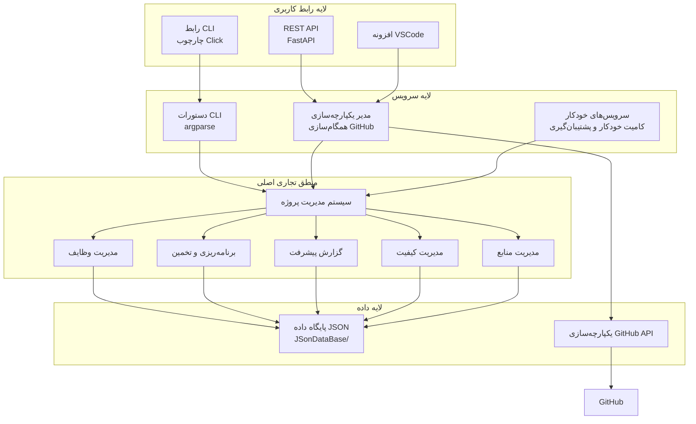
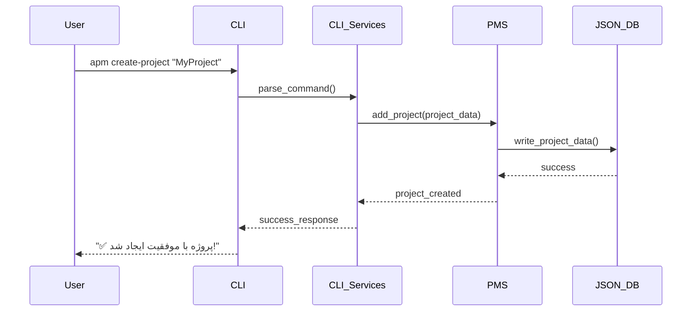
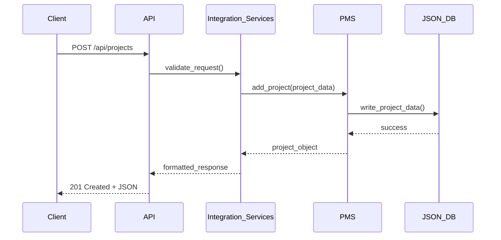

# AutoProjectManagement - راهنمای جامع معماری سیستم و پیاده‌سازی

## خلاصه اجرایی

AutoProjectManagement یک سیستم جامع **مبتنی بر پایتون CLI و API** است که برای مدیریت خودکار پروژه، ردیابی وظایف و یکپارچه‌سازی GitHub طراحی شده است. این سیستم قابلیت‌های رابط خط فرمان و REST API را فراهم می‌کند و از ذخیره‌سازی مبتنی بر JSON با ویژگی‌های همگام‌سازی GitHub استفاده می‌کند.

## 1. مرور کلی سیستم و معماری

### 1.1 نمودار معماری سطح بالا



### 1.2 پشته فناوری

| جزء | فناوری | نسخه | هدف |
|-----------|------------|---------|---------|
| **زبان** | پایتون | 3.8+ | پیاده‌سازی اصلی |
| **چارچوب CLI** | Click | 8.0+ | رابط خط فرمان |
| **چارچوب API** | FastAPI | 0.68+ | نقاط پایانی REST |
| **ذخیره‌سازی داده** | فایل‌های JSON | بومی | ماندگاری داده |
| **کلاینت HTTP** | httpx | 0.24+ | فراخوانی‌های API GitHub |
| **تست** | pytest | 7.0+ | تست‌های واحد و یکپارچه |
| **یکپارچه‌سازی Git** | GitPython | 3.1+ | عملیات مخزن |

## 2. معماری جزئی مفصل

### 2.1 معماری رابط CLI

**موقعیت**: `autoprojectmanagement/cli.py`
**چارچوب**: Click (چارچوب CLI پایتون)

#### دستورات موجود

| دستور | توضیحات | پارامترها | مثال |
|---------|-------------|------------|---------|
| `init` | مقدمات پیکربندی سیستم | `--config-path` | `apm init --config-path ./config` |
| `create-project` | ایجاد پروژه جدید | `project_name` | `apm create-project "MyProject"` |
| `add-task` | افزودن وظیفه به پروژه | `--project`, `--title` | `apm add-task --project MyProject --title "پیاده‌سازی ویژگی"` |
| `status` | نمایش وضعیت پروژه | `--project` | `apm status --project MyProject` |
| `report` | تولید گزارش‌ها | `--type`, `--format` | `apm report --type progress --format markdown` |
| `sync-github` | همگام‌سازی با GitHub | `--project` | `apm sync-github --project MyProject` |

### 2.2 سیستم اصلی مدیریت پروژه

**موقعیت**: `autoprojectmanagement/main_modules/project_management_system.py`
**کلاس اصلی**: `ProjectManagementSystem`

#### قابلیت‌های اصلی

| قابلیت | توضیحات | متدها |
|------------|-------------|---------|
| **مدیریت پروژه** | ایجاد، خواندن، به‌روزرسانی، حذف پروژه‌ها | `add_project()`, `remove_project()`, `update_project()`, `get_project()` |
| **مدیریت وظایف** | مدیریت وظایف درون پروژه‌ها | `add_task_to_project()`, `remove_task_from_project()`, `update_task_in_project()` |
| **اعتبارسنجی داده** | اطمینان از یکپارچگی داده‌ها | اعتبارسنجی داخلی برای فیلدهای پروژه و وظیفه |
| **ماندگاری JSON** | ذخیره داده در قالب JSON | سریال‌سازی/دسریال‌سازی خودکار |

#### ساختار داده

```python
# ساختار پروژه
{
    "id": int,
    "name": str,
    "description": str,
    "created_date": str,
    "updated_date": str,
    "status": str,
    "priority": str,
    "owner": str,
    "tags": List[str]
}

# ساختار وظیفه
{
    "id": int,
    "title": str,
    "description": str,
    "project_id": int,
    "status": str,
    "priority": str,
    "assignee": str,
    "due_date": str,
    "created_date": str,
    "updated_date": str,
    "tags": List[str]
}
```

### 2.3 معماری API

**موقعیت**: `autoprojectmanagement/api/main.py`
**چارچوب**: FastAPI

#### نقاط پایانی API

| نقطه پایانی | متد | توضیحات | بدنه درخواست | پاسخ |
|----------|--------|-------------|--------------|----------|
| `/api/projects` | GET | لیست همه پروژه‌ها | - | آرایه JSON |
| `/api/projects` | POST | ایجاد پروژه جدید | شیء پروژه JSON | پروژه JSON |
| `/api/projects/{id}` | GET | دریافت پروژه با ID | - | پروژه JSON |
| `/api/projects/{id}` | PUT | به‌روزرسانی پروژه | شیء پروژه JSON | پروژه JSON |
| `/api/projects/{id}` | DELETE | حذف پروژه | - | تأیید JSON |
| `/api/projects/{id}/tasks` | GET | لیست وظایف پروژه | - | آرایه JSON |
| `/api/projects/{id}/tasks` | POST | افزودن وظیفه به پروژه | شیء وظیفه JSON | وظیفه JSON |

### 2.4 معماری ذخیره‌سازی داده

**موقعیت**: `JSonDataBase/`

#### ساختار دایرکتوری

```
JSonDataBase/
├── Inputs/
│   ├── UserInputs/
│   │   ├── project_config.json
│   │   └── user_preferences.json
│   └── SystemGeneratorInputs/
│       └── system_defaults.json
├── OutPuts/
│   ├── commit_progress.json
│   ├── commit_task_database.json
│   ├── progress_report.md
│   └── project_data.json
└── Backups/
    ├── backup_*.json
    └── metadata/
        └── backup_*.json
```

#### فایل‌های داده

| فایل | هدف | ساختار |
|------|---------|-----------|
| `commit_progress.json` | ردیابی پیشرفت کامیت | `{project_id: {task_id: status}}` |
| `commit_task_database.json` | پایگاه داده وظایف | `{tasks: [task_objects]}` |
| `project_data.json` | داده اصلی پروژه | `{projects: [project_objects]}` |
| `progress_report.md` | گزارش‌های پیشرفت مارک‌داون | گزارش‌های قابل خواندن برای انسان |

### 2.5 معماری یکپارچه‌سازی GitHub

**موقعیت**: `autoprojectmanagement/services/integration_services/github_integration.py`

#### ویژگی‌های یکپارچه‌سازی

| ویژگی | توضیحات | نقاط پایانی API مورد استفاده |
|---------|-------------|-------------------|
| **ایجاد مخزن** | ایجاد مخازن GitHub | `POST /user/repos` |
| **تخته‌های پروژه** | ایجاد تخته‌های پروژه | `POST /repos/{owner}/{repo}/projects` |
| **مدیریت ایشو** | ایجاد/به‌روزرسانی ایشوها | `POST /repos/{owner}/{repo}/issues` |
| **مدیریت نقاط عطف** | ایجاد نقاط عطف پروژه | `POST /repos/{owner}/{repo}/milestones` |
| **مدیریت برچسب‌ها** | ایجاد و مدیریت برچسب‌ها | `POST /repos/{owner}/{repo}/labels` |

### 2.6 سرویس‌های خودکار

**موقعیت**: `autoprojectmanagement/services/automation_services/`

#### مرور سرویس‌ها

| سرویس | هدف | ماشه | خروجی |
|---------|---------|---------|--------|
| **کامیت خودکار** | کامیت‌های خودکار git | زمان‌بندی شده یا در تغییر | کامیت‌های git با پیشرفت |
| **مدیر پشتیبان‌گیری** | پشتیبان‌گیری خودکار | زمان‌بندی شده | فایل‌های پشتیبان ZIP با متادیتا |
| **همگام‌سازی ویکی** | همگام‌سازی مستندات | در به‌روزرسانی پروژه | صفحات ویکی به‌روزرسانی شده |

## 3. جریان داده و معماری فرآیند

### 3.1 جریان دستور CLI



### 3.2 جریان درخواست API



## 4. پیکربندی و محیط

### 4.1 فایل‌های پیکربندی

**موقعیت**: دایرکتوری ریشه و `autoprojectmanagement/`

| فایل | هدف | قالب |
|------|---------|--------|
| `autoproject_configuration.py` | پیکربندی اصلی | ماژول پایتون |
| `requirements.txt` | وابستگی‌ها | قالب pip |
| `pyproject.toml` | متادیتای پروژه | TOML |
| `.gitignore` | قوانین نادیده‌گیری git | قالب Git |

### 4.2 متغیرهای محیطی

| متغیر | توضیحات | پیش‌فرض |
|----------|-------------|---------|
| `APM_CONFIG_PATH` | مسیر فایل پیکربندی | `./config` |
| `APM_DATA_PATH` | مسیر ذخیره‌سازی داده | `./JSonDataBase` |
| `GITHUB_TOKEN` | توکن API GitHub | مورد نیاز برای یکپارچه‌سازی GitHub |
| `LOG_LEVEL` | سطح لاگ‌گیری | `INFO` |

## 5. استراتژی تست

### 5.1 ساختار تست

**موقعیت**: `tests/`

#### دسته‌بندی تست‌ها

| دسته | موقعیت | هدف |
|----------|----------|---------|
| **تست‌های واحد** | `tests/code_tests/01_UnitTests/` | تست اجزای فردی |
| **تست‌های یکپارچه** | `tests/code_tests/02_IntegrationTests/` | تست تعامل اجزا |
| **تست‌های سیستم** | `tests/code_tests/03_SystemTests/` | تست انتها به انتها |
| **تست‌های API** | `tests/api/` | تست نقاط پایانی REST API |

### 5.2 دستورات تست

```bash
# اجرای همه تست‌ها
pytest tests/

# اجرای دسته خاص تست
pytest tests/code_tests/01_UnitTests/

# اجرا با پوشش
pytest --cov=autoprojectmanagement tests/

# اجرای فقط تست‌های API
pytest tests/api/
```

## 6. استقرار و نصب

### 6.1 روش‌های نصب

#### روش 1: pip install
```bash
pip install autoprojectmanagement
```

#### روش 2: از منبع
```bash
git clone https://github.com/autoprojectmanagement/autoprojectmanagement.git
cd autoprojectmanagement
pip install -e .
```

#### روش 3: راه‌اندازی توسعه
```bash
git clone https://github.com/autoprojectmanagement/autoprojectmanagement.git
cd autoprojectmanagement
pip install -r requirements-dev.txt
python setup.py develop
```

### 6.2 راه‌اندازی پیکربندی

```bash
# مقدمات سیستم
apm init

# پیکربندی یکپارچه‌سازی GitHub
apm config set github.token YOUR_GITHUB_TOKEN

# تنظیم دایرکتوری داده
apm config set data.path ./my_project_data
```

## 7. عملکرد و مقیاس‌پذیری

### 7.1 ویژگی‌های عملکرد

| معیار | مقدار | یادداشت‌ها |
|--------|--------|-------|
| **زمان راه‌اندازی** | < 1 ثانیه | مقدمات CLI |
| **زمان پاسخ API** | < 500ms | میانگین برای عملیات CRUD |
| **I/O فایل JSON** | < 100ms | برای فایل‌های < 1MB |
| **فراخوانی‌های API GitHub** | < 2s | شامل تأخیر شبکه |

### 7.2 ملاحظات مقیاس‌پذیری

| جنبه | محدودیت | راه‌حل |
|--------|------------|----------|
| **اندازه فایل JSON** | < 10MB توصیه شده | تقسیم به چندین فایل |
| **کاربران همزمان** | طراحی تک‌کاربره | استفاده از API برای چندکاربره |
| **محدودیت‌های نرخ GitHub** | 5000 درخواست/ساعت | پیاده‌سازی کش |
| **مصرف حافظه** | < 100MB معمولی | پردازش استریم برای مجموعه داده‌های بزرگ |

## 8. معماری امنیت

### 8.1 ویژگی‌های امنیت

| ویژگی | پیاده‌سازی | هدف |
|---------|----------------|---------|
| **احراز هویت API** | توکن Bearer | کنترل دسترسی REST API |
| **توکن GitHub** | متغیر محیطی | دسترسی امن API |
| **رمزگذاری داده** | مجوزهای سیستم فایل | محافظت داده در حالت سکون |
| **اعتبارسنجی ورودی** | بررسی نوع و پاک‌سازی | جلوگیری از حملات تزریق |

### 8.2 بهترین تمرین‌های امنیتی

- ذخیره توکن‌های GitHub در متغیرهای محیطی
- استفاده از HTTPS برای فراخوانی‌های API GitHub
- اعتبارسنجی همه ورودی‌های کاربر
- پیاده‌سازی مدیریت خطای مناسب
- به‌روزرسانی‌های امنیتی منظم

## 9. نظارت و قابلیت مشاهده

### 9.1 معماری لاگ‌گیری

**موقعیت**: در سراسر کد پایه
**چارچوب**: لاگ‌گیری پایتون

#### سطوح لاگ

| سطح | کاربرد | مثال |
|-------|--------|---------|
| **DEBUG** | اطلاعات اشکال‌زدایی دقیق | درخواست/پاسخ API |
| **INFO** | اطلاعات عمومی | راه‌اندازی سیستم، عملیات |
| **WARNING** | شرایط هشدار دهنده | ویژگی‌های منسوخ |
| **ERROR** | شرایط خطا | عملیات‌های ناموفق |
| **CRITICAL** | شکست‌های بحرانی | شکست‌های سیستم |

### 9.2 راه‌اندازی نظارت

```python
# پیکربندی لاگ‌گیری
import logging
logging.basicConfig(
    level=logging.INFO,
    format='%(asctime)s - %(name)s - %(levelname)s - %(message)s',
    handlers=[
        logging.FileHandler('autoprojectmanagement.log'),
        logging.StreamHandler()
    ]
)
```

## 10. نقشه راه آینده

### 10.1 ویژگی‌های برنامه‌ریزی شده

| ویژگی | اولویت | جدول زمانی | توضیحات |
|---------|----------|----------|-------------|
| **پشتیبانی پایگاه داده** | بالا | Q1 2025 | بک‌اند SQLite/PostgreSQL |
| **رابط کاربری وب** | متوسط | Q2 2025 | رابط وب مبتنی بر React |
| **اپلیکیشن موبایل** | پایین | Q3 2025 | اپلیکیشن موبایل React Native |
| **یکپارچه‌سازی AI** | متوسط | Q4 2025 | پیشنهادهای وظیفه با قدرت AI |
| **همکاری تیمی** | بالا | Q1 2025 | پشتیبانی چندکاربره |

### 10.2 بدهی فنی

| مورد | تأثیر | اولویت | راه‌حل |
|------|--------|----------|------------|
| **مدیریت خطا** | متوسط | بالا | مدیریت استثنا جامع |
| **لاگ‌گیری** | پایین | متوسط | پیاده‌سازی لاگ‌گیری ساختار یافته |
| **پوشش تست** | بالا | بالا | دستیابی به پوشش تست 90%+ |
| **مستندات** | متوسط | متوسط | مستندات API کامل |

## 11. خلاصه و نتیجه‌گیری

سیستم AutoProjectManagement یک راه‌حل جامع و آماده تولید برای مدیریت پروژه خودکار با ویژگی‌های کلیدی زیر است:

- **معماری ماژولی**: جداسازی تمیز نگرانی‌ها با رابط‌های خوب تعریف شده
- **رابط‌های متعدد**: پشتیبانی CLI، REST API و افزونه VSCode
- **یکپارچه‌سازی GitHub**: همگام‌سازی کامل با مخازن و پروژه‌های GitHub
- **ماندگاری JSON**: راه‌حل ذخیره‌سازی داده ساده اما مؤثر
- **طراحی قابل توسعه**: آسان برای افزودن ویژگی‌ها و یکپارچه‌سازی‌های جدید
- **آماده تولید**: تست جامع، مدیریت خطا و مستندات

این سند معماری یک طرح کامل برای درک، پیاده‌سازی و گسترش سیستم AutoProjectManagement بر اساس کد پایه و پیاده‌سازی واقعی فراهم می‌کند.

---

**نسخه سند**: 2.0.0  
**آخرین به‌روزرسانی**: 2025-08-16  
**نگهداری توسط**: تیم AutoProjectManagement  
**مجوز**: MIT
