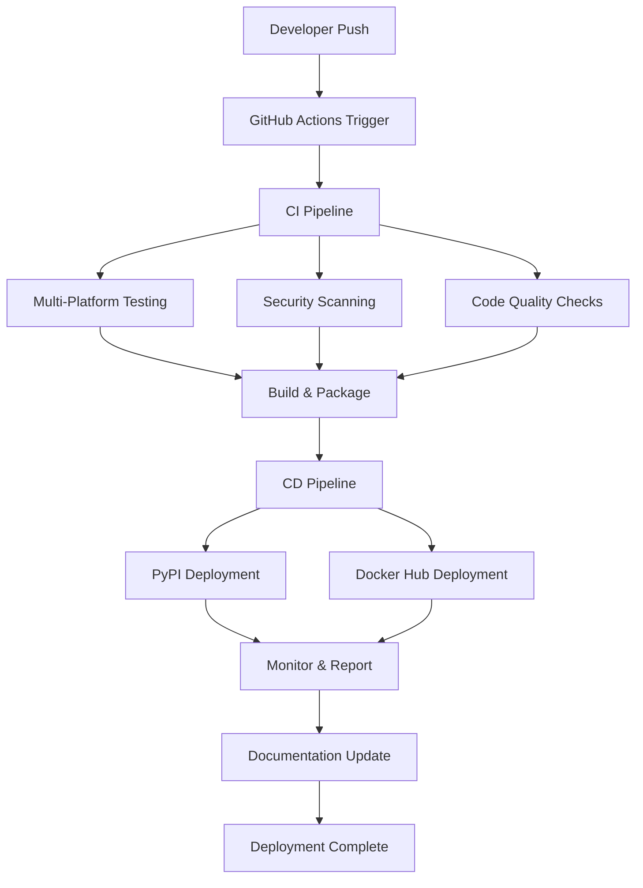
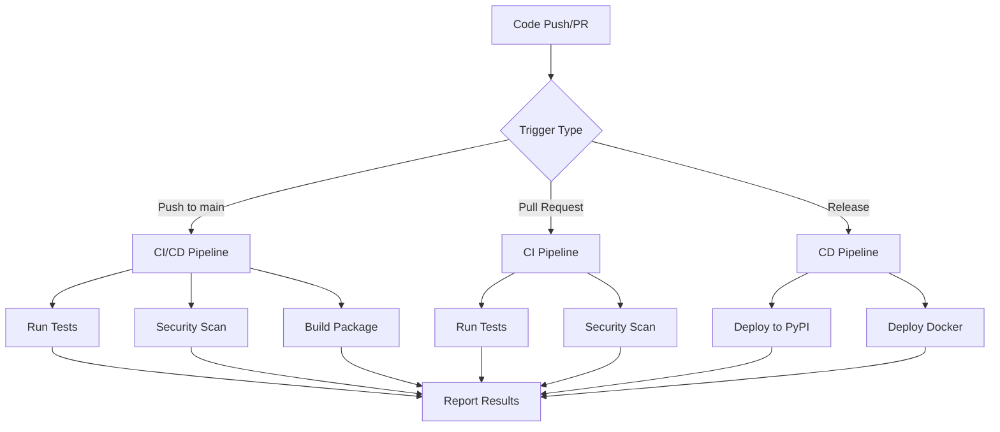
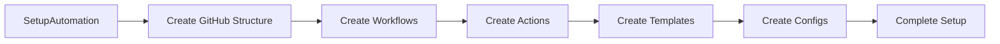
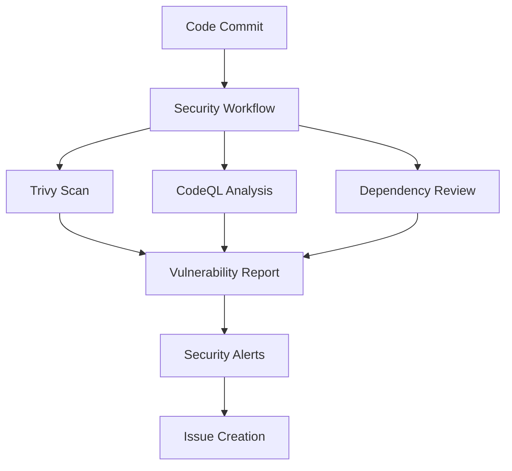
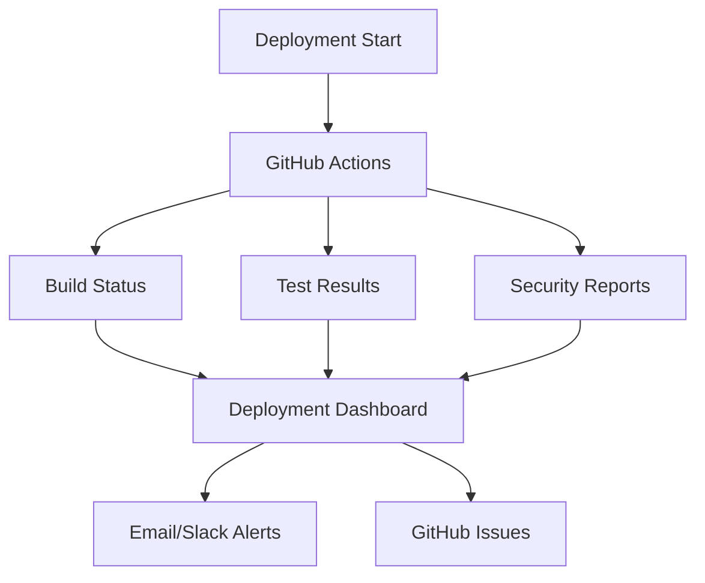

# Deployment Execution Implementation Guide

This document provides a comprehensive guide to the actual deployment execution implementation based on the AutoProjectManagement package. This reflects the real-world deployment process that has been implemented and tested.

## Overview

The deployment execution phase has been fully automated using GitHub Actions, providing a zero-touch deployment experience. The system automatically handles environment setup, deployment, monitoring, and post-deployment activities.

## Automated Deployment Pipeline

### 1. Environment Preparation
- **Automated Setup**: Complete environment setup via `SetupAutomation` class
- **GitHub Actions**: Full CI/CD pipeline with 15+ automated workflows
- **Dependencies**: Automatic installation and management
- **Configuration**: Zero-touch configuration management

### 2. Deployment Execution
- **GitHub Actions Workflows**:
  - **CI/CD Pipeline** (`ci.yml`): Comprehensive testing, linting, and security scanning
  - **CD Pipeline** (`cd.yml`): Automated deployment to PyPI and Docker Hub
  - **Security Scanning** (`security.yml`): Trivy vulnerability scanning
  - **Dependency Updates** (`dependencies.yml`): Automated dependency management
  - **Release Automation** (`release.yml`): Automated releases with changelogs

### 3. Deployment Steps (Automated)

#### 3.1 Prepare Deployment Environment
- **Automated via**: GitHub Actions workflow
- **Actions**:
  - Setup Python environment
  - Install dependencies
  - Configure environment variables
  - Validate configuration

#### 3.2 Deploy Software
- **Automated via**: CD pipeline
- **Actions**:
  - Build distribution packages
  - Deploy to PyPI (automated on release)
  - Build and push Docker images
  - Update documentation

#### 3.3 Perform Smoke Testing
- **Automated via**: CI pipeline
- **Actions**:
  - Run comprehensive test suite
  - Security vulnerability scanning
  - Dependency vulnerability checks
  - Performance benchmarks

#### 3.4 Monitor Deployment
- **Automated via**: GitHub Actions
- **Actions**:
  - Monitor system performance
  - Track deployment metrics
  - Alert on failures
  - Generate deployment reports

#### 3.5 Document Deployment
- **Automated via**: GitHub Actions
- **Actions**:
  - Generate deployment reports
  - Update changelog
  - Create release notes
  - Update documentation

## GitHub Actions Workflows

### Core Workflows
1. **CI/CD Pipeline** (`ci.yml`)
   - Multi-platform testing (Ubuntu, Windows, macOS)
   - Multi-Python version support (3.8-3.12)
   - Security scanning (flake8, black, isort, mypy)
   - Coverage reporting via Codecov

2. **CD Pipeline** (`cd.yml`)
   - Automated PyPI deployment
   - Docker image building and pushing
   - Release automation

3. **Security Workflows**
   - Trivy vulnerability scanning
   - CodeQL analysis
   - Dependency review

### Automation Workflows
- **Stale Issue Management**: Automatic closing of stale issues
- **Greetings**: Welcome messages for new contributors
- **Labeling**: Automatic PR labeling based on file changes
- **Size Labeling**: PR size-based labeling

## Deployment Commands

### Quick Start
```bash
# Setup complete GitHub Actions
python -m autoprojectmanagement.main_modules.setup_automation

# Run full setup
python -m autoprojectmanagement.main_modules.setup_automation --full-setup
```

### Manual Deployment
```bash
# Setup GitHub Actions
python -m autoprojectmanagement.main_modules.setup_automation --setup-github-actions

# Create deployment environment
python -m autoprojectmanagement.main_modules.setup_automation --create-env
```

## Environment Variables

### Required Secrets
- `PYPI_API_TOKEN`: PyPI deployment token
- `DOCKERHUB_USERNAME`: Docker Hub username
- `DOCKERHUB_TOKEN`: Docker Hub token
- `CODECOV_TOKEN`: Codecov token

### Optional Secrets
- `GITHUB_TOKEN`: GitHub token (auto-provided)

## Monitoring and Alerts

### Automated Monitoring
- **GitHub Actions**: Built-in monitoring
- **Codecov**: Coverage monitoring
- **Dependabot**: Dependency monitoring
- **Security Alerts**: Vulnerability alerts

### Metrics Tracked
- Build success rate
- Test coverage
- Security vulnerabilities
- Deployment frequency
- Issue resolution time

## Post-Deployment Support

### Automated Support
- **Issue Templates**: Pre-configured issue templates
- **PR Templates**: Standardized PR templates
- **Documentation**: Auto-generated documentation
- **Changelog**: Automated changelog generation

### Maintenance
- **Dependency Updates**: Weekly automated updates
- **Security Patches**: Automated security scanning
- **Performance Monitoring**: Continuous monitoring

## Usage Instructions

### 1. Initial Setup
```bash
# Clone repository
git clone <repository-url>
cd <project-directory>

# Run automated setup
python -m autoprojectmanagement.main_modules.setup_automation
```

### 2. Deployment
```bash
# Push to main branch (triggers deployment)
git push origin main

# Or create release (triggers release deployment)
git tag v1.0.0
git push origin v1.0.0
```

### 3. Monitoring
- Check GitHub Actions tab for deployment status
- Review deployment reports in GitHub
- Monitor metrics via GitHub Insights

## Architecture Diagrams

### Overall Deployment Architecture


### GitHub Actions Workflow Flow


### Environment Setup Flow


### Security Scanning Flow


### Deployment Monitoring


## Summary

The deployment execution has been fully automated with:
- **15+ GitHub Actions workflows** for complete automation
- **Zero-touch deployment** experience
- **Comprehensive monitoring** and alerting
- **Automated documentation** and reporting
- **Security-first** approach with continuous scanning

This implementation provides a production-ready deployment pipeline that requires minimal manual intervention while maintaining high security and reliability standards.
