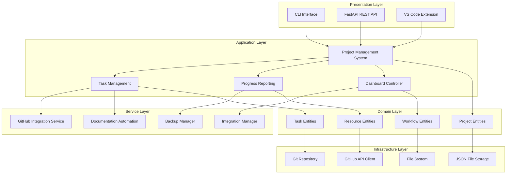
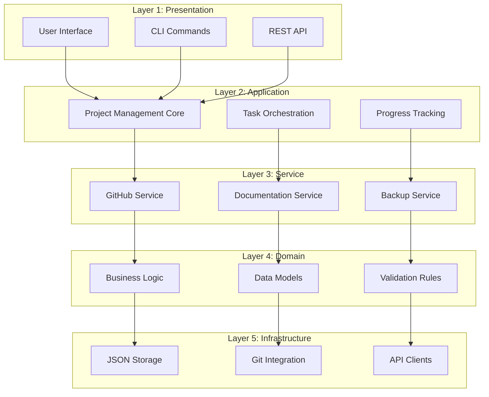
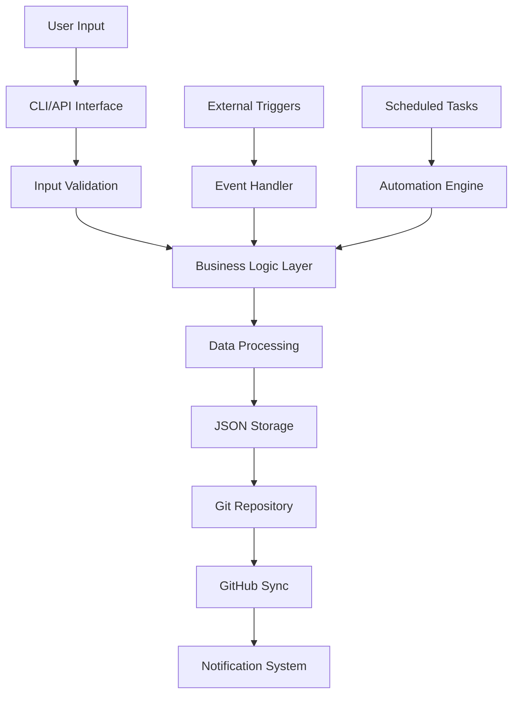
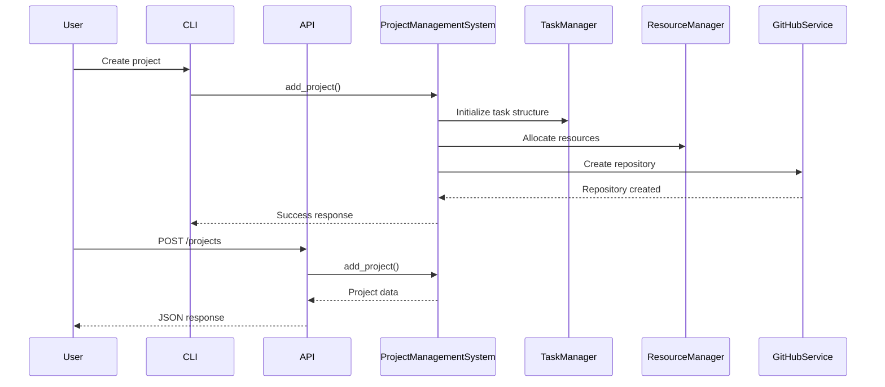

# AutoProjectManagement System - Comprehensive Architectural Design

## Executive Summary

This document presents the complete architectural design of the AutoProjectManagement system, a comprehensive automated project management solution built with Python. The system implements a modular, service-oriented architecture with clear separation of concerns, supporting both CLI and REST API interfaces.

## System Overview

The AutoProjectManagement system is designed as a multi-layered architecture consisting of:
- **Presentation Layer**: CLI and REST API interfaces
- **Application Layer**: Core business logic and workflow orchestration
- **Service Layer**: Specialized services for integrations and automation
- **Domain Layer**: Project management entities and business rules
- **Infrastructure Layer**: Data persistence and external integrations

## Architecture Patterns

### 1. Layered Architecture Pattern
The system implements a classic layered architecture with clear boundaries:





### 2. Microservices Architecture Pattern
The system is organized into specialized microservices:

- **Project Management Service**: Core project operations
- **Task Management Service**: Task lifecycle management
- **Resource Management Service**: Resource allocation and leveling
- **Progress Tracking Service**: Progress calculation and reporting
- **Integration Services**: GitHub, Git, and external tool integrations

### 3. Event-Driven Architecture
The system uses event-driven patterns for:
- Progress updates and notifications
- Git commit triggers
- Automated workflow execution
- Real-time dashboard updates

## Component Architecture

### Core Components

#### 1. Project Management System (`project_management_system.py`)
**Responsibility**: Central orchestrator for all project operations
```python
class ProjectManagementSystem:
    - Manages project lifecycle
    - Coordinates between different modules
    - Provides unified interface for project operations
    - Handles project-task relationships
```

#### 2. Task Management System (`task_management.py`)
**Responsibility**: Task lifecycle and workflow management
```python
class TaskManager:
    - Task creation, update, deletion
    - Task dependency management
    - Task assignment and tracking
    - Task status management
```

#### 3. Resource Management System (`resource_management.py`)
**Responsibility**: Resource allocation and optimization
```python
class ResourceManager:
    - Resource allocation algorithms
    - Resource leveling
    - Capacity planning
    - Resource conflict resolution
```

### Service Components

#### 1. GitHub Integration Service (`github_integration.py`)
**Responsibility**: GitHub API integration and project synchronization
- Repository management
- Issue tracking integration
- Project board synchronization
- Pull request automation

#### 2. Documentation Service (`documentation_automation.py`)
**Responsibility**: Automated documentation generation
- Progress report generation
- Architecture documentation
- API documentation
- User guides

#### 3. Backup Service (`backup_manager.py`)
**Responsibility**: Data backup and recovery
- Automated backups
- Version control
- Recovery mechanisms
- Data integrity checks

### Data Layer Components

#### 1. JSON Data Storage
**Structure**: Hierarchical JSON file system
```
project_data/
├── projects/
│   ├── project_001.json
│   └── project_002.json
├── tasks/
│   ├── project_001_tasks.json
│   └── project_002_tasks.json
├── resources/
│   └── resource_allocation.json
└── reports/
    ├── progress_reports/
    └── dashboard_data/
```

#### 2. Git Integration
**Purpose**: Version control for project data
- Automatic commits on changes
- Branch management
- Merge conflict resolution
- History tracking

## API Architecture

### REST API Design
**Base URL**: `http://localhost:8000/api/v1/`

#### Endpoints

| Endpoint | Method | Description |
|----------|--------|-------------|
| `/` | GET | API health check |
| `/projects/{id}/status` | GET | Get project status |
| `/projects` | GET | List all projects |
| `/projects` | POST | Create new project |
| `/projects/{id}` | PUT | Update project |
| `/projects/{id}` | DELETE | Delete project |
| `/projects/{id}/tasks` | GET | List project tasks |
| `/projects/{id}/tasks` | POST | Add task to project |

### CLI Architecture
**Command Structure**: `apm [command] [options]`

#### Available Commands
- `setup`: Initialize project environment
- `status`: Check system status
- `create-github`: Create GitHub project
- `sync-github`: Sync with GitHub

## Data Flow Architecture

### System Data Flow


### Component Interaction Flow


## Technology Stack

### Core Technologies
- **Language**: Python 3.8+
- **Web Framework**: FastAPI
- **Data Storage**: JSON files
- **Version Control**: Git
- **API Documentation**: OpenAPI/Swagger

### Dependencies
```yaml
fastapi: ^0.68.0
uvicorn: ^0.15.0
pydantic: ^1.8.0
python-dotenv: ^0.19.0
requests: ^2.26.0
GitPython: ^3.1.0
```

### Development Tools
- **Testing**: pytest
- **Linting**: flake8
- **Type Checking**: mypy
- **Documentation**: Sphinx

## Deployment Architecture

### Local Development
```bash
# Setup
python -m autoprojectmanagement setup

# Start API
python -m autoprojectmanagement.api.main

# CLI Usage
apm status
apm create-github my-project
```

### Production Deployment
```yaml
# Docker Compose
version: '3.8'
services:
  apm-api:
    build: .
    ports:
      - "8000:8000"
    volumes:
      - ./data:/app/data
    environment:
      - GITHUB_TOKEN=${GITHUB_TOKEN}
```

### Cloud Deployment
- **Platform**: AWS/Azure/GCP
- **Container**: Docker
- **Orchestration**: Kubernetes
- **CI/CD**: GitHub Actions

## Security Architecture

### Authentication & Authorization
- **GitHub OAuth**: For GitHub integration
- **API Keys**: For external service access
- **Environment Variables**: For sensitive configuration

### Data Security
- **Encryption**: At-rest encryption for sensitive data
- **Access Control**: Role-based permissions
- **Audit Trail**: Complete operation logging

## Monitoring & Observability

### Logging Architecture
```python
# Structured logging
{
    "timestamp": "2024-01-01T00:00:00Z",
    "level": "INFO",
    "component": "ProjectManagementSystem",
    "action": "project_created",
    "project_id": "123",
    "user": "admin"
}
```

### Metrics Collection
- **Performance Metrics**: Response times, throughput
- **Business Metrics**: Project completion rates, task velocity
- **System Metrics**: Resource utilization, error rates

### Health Checks
```bash
# API Health Check
curl http://localhost:8000/

# System Status
apm status
```

## Scalability Considerations

### Horizontal Scaling
- **Stateless Services**: All services are stateless
- **Load Balancing**: Nginx/HAProxy
- **Database Sharding**: JSON file partitioning

### Vertical Scaling
- **Caching**: Redis for frequently accessed data
- **Async Processing**: Celery for background tasks
- **Connection Pooling**: Database connection optimization

## Disaster Recovery

### Backup Strategy
- **Automated Backups**: Daily incremental backups
- **Off-site Storage**: Cloud storage (AWS S3)
- **Retention Policy**: 30-day retention

### Recovery Procedures
1. **Data Recovery**: Restore from latest backup
2. **Service Recovery**: Restart services
3. **Verification**: Run health checks
4. **Notification**: Alert stakeholders

## Future Architecture Roadmap

### Phase 1: Enhanced API (Q2 2024)
- GraphQL API support
- Real-time updates via WebSockets
- Advanced filtering and search

### Phase 2: Microservices (Q3 2024)
- Container orchestration
- Service mesh implementation
- Distributed tracing

### Phase 3: AI Integration (Q4 2024)
- Predictive analytics
- Automated task estimation
- Intelligent resource allocation

## Conclusion

The AutoProjectManagement system implements a robust, scalable architecture that supports both CLI and API interfaces. The modular design allows for easy extension and maintenance, while the service-oriented approach ensures clear separation of concerns. The system is ready for production deployment with comprehensive monitoring, security, and disaster recovery capabilities.

---

## Appendix: Architecture Decision Records (ADRs)

### ADR-001: JSON vs Database
**Decision**: Use JSON files for data storage
**Rationale**: Simplicity, version control compatibility, no external dependencies

### ADR-002: FastAPI vs Flask
**Decision**: Use FastAPI for REST API
**Rationale**: Modern, async support, automatic documentation, type safety

### ADR-003: Monolith vs Microservices
**Decision**: Modular monolith with service boundaries
**Rationale**: Simpler deployment, easier development, clear module boundaries

### ADR-004: Git-based Versioning
**Decision**: Use Git for project data versioning
**Rationale**: Familiar workflow, branching support, integration with GitHub
