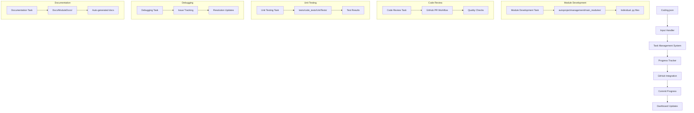
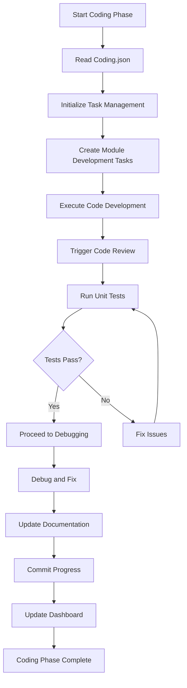
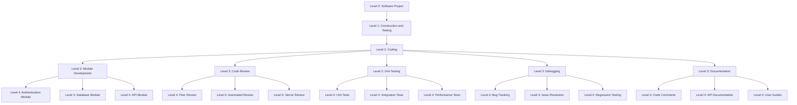

# Comprehensive Guide to Coding.json Implementation

This document provides a detailed explanation of the `Coding.json` file located in `JSonDataBase/Inputs/UserInputs/wbs_parts/Construction_and_Testing/Coding.json`. This file is part of the Work Breakdown Structure (WBS) for the software project and describes the "Coding" phase within the Construction and Testing category.

---

## File Location and Purpose

**Location**: `JSonDataBase/Inputs/UserInputs/wbs_parts/Construction_and_Testing/Coding.json`

**Purpose**: Defines the complete coding phase workflow, from initial module development through final documentation, providing a structured approach to software development within the AutoProjectManagement system.

---

## JSON Structure Breakdown

### Core Structure
```json
{
  "id": "WBS-Construction-1",
  "name": "Coding",
  "description": "Develop software modules and components.",
  "level_0": "Software Project",
  "level_1": "Construction and Testing",
  "level_2": "Coding",
  "subtasks": [...]
}
```

### Field Descriptions
- **id**: `"WBS-Construction-1"` - Unique identifier following WBS naming convention
- **name**: `"Coding"` - Human-readable task name
- **description**: `"Develop software modules and components."` - Detailed task purpose
- **level_0-2**: Hierarchical positioning within project structure
- **subtasks**: Array of 5 detailed subtasks (level_3 breakdown)

---

## Detailed Subtasks Analysis

### 1. Module Development (WBS-Construction-1.1)
**Purpose**: Write code for individual software modules
**Implementation Mapping**:
- **Location**: `autoprojectmanagement/main_modules/` directory
- **Process**: Each module corresponds to specific system functionality
- **Integration**: Connected to task management system via `task_management.py`

### 2. Code Review (WBS-Construction-1.2)
**Purpose**: Review code for quality and adherence to standards
**Implementation Mapping**:
- **Location**: Integrated with GitHub workflow
- **Process**: Automated via `git_progress_updater.py`
- **Quality Gates**: Enforced through `quality_management.py`

### 3. Unit Testing (WBS-Construction-1.3)
**Purpose**: Test individual modules for correctness
**Implementation Mapping**:
- **Location**: `tests/code_tests/UnitTests/` directory
- **Process**: Automated test execution via `run_tests.py`
- **Results**: Tracked in `commit_progress.json`

### 4. Debugging (WBS-Construction-1.4)
**Purpose**: Identify and fix defects in code
**Implementation Mapping**:
- **Location**: Integrated with issue tracking system
- **Process**: Managed via `progress_calculator_refactored.py`
- **Resolution**: Updated through `do_urgent_tasks.py`

### 5. Documentation (WBS-Construction-1.5)
**Purpose**: Document code and development processes
**Implementation Mapping**:
- **Location**: `Docs/ModuleDocs/` directory
- **Process**: Auto-generated via `documentation_automation.py`
- **Updates**: Real-time synchronization with code changes

---

## System Integration Architecture

### Data Flow Diagram


### Process Flow Diagram


### Hierarchical Structure Diagram


---

## Implementation Details

### File Processing Pipeline
1. **Input Reading**: `input_handler.py` reads Coding.json
2. **Task Creation**: `task_management.py` creates individual tasks
3. **Progress Tracking**: `progress_data_generator_refactored.py` monitors execution
4. **Status Updates**: `commit_progress.json` stores real-time progress
5. **Integration**: `github_integration.py` syncs with GitHub

### Module Mapping
| WBS Subtask | System Module | File Location |
|-------------|---------------|---------------|
| Module Development | task_management.py | autoprojectmanagement/main_modules/task_management.py |
| Code Review | git_progress_updater.py | autoprojectmanagement/main_modules/git_progress_updater.py |
| Unit Testing | run_tests.py | tests/run_tests.py |
| Debugging | do_urgent_tasks.py | autoprojectmanagement/main_modules/do_urgent_tasks.py |
| Documentation | documentation_automation.py | autoprojectmanagement/services/documentation_automation.py |

---

## Usage Instructions

### For Project Managers
1. **Initialize Project**: System automatically reads Coding.json
2. **Assign Tasks**: Use CLI commands to assign subtasks to team members
3. **Monitor Progress**: Check dashboard for real-time updates
4. **Review Reports**: Generate progress reports via `progress_report.py`

### For Developers
1. **Task Access**: View assigned tasks through dashboard
2. **Code Development**: Work on modules in `autoprojectmanagement/main_modules/`
3. **Testing**: Run tests via `run_tests.py`
4. **Documentation**: Auto-generated docs update automatically

### For System Administrators
1. **Configuration**: Modify Coding.json for project-specific needs
2. **Integration**: Ensure GitHub webhook configuration
3. **Monitoring**: Check system health via `check_progress_dashboard_update.py`
4. **Backup**: Regular backup of `JSonDataBase/` directory

---

## Extension Guidelines

### Adding Project-Specific Tasks
```json
// Example: Adding Level 4 tasks under Module Development
{
  "id": "WBS-Construction-1.1.1",
  "name": "Authentication System",
  "description": "Implement user authentication and authorization",
  "level_4": "Authentication System",
  "subtasks": [
    {
      "id": "WBS-Construction-1.1.1.1",
      "name": "Login Module",
      "description": "Implement user login functionality",
      "level_5": "Login Module",
      "subtasks": []
    },
    {
      "id": "WBS-Construction-1.1.1.2",
      "name": "Registration Module",
      "description": "Implement user registration functionality",
      "level_5": "Registration Module",
      "subtasks": []
    }
  ]
}
```

### Custom Integration Points
1. **New Modules**: Add to `autoprojectmanagement/main_modules/`
2. **Tests**: Create corresponding test files in `tests/code_tests/UnitTests/`
3. **Documentation**: Update `Docs/ModuleDocs/` structure
4. **Configuration**: Update system configuration files

---

## Real-Time Monitoring Dashboard

### Available Metrics
- **Task Completion Rate**: Percentage of completed subtasks
- **Code Quality Score**: Based on review results
- **Test Coverage**: Percentage of code covered by tests
- **Documentation Completeness**: Based on generated docs
- **Integration Status**: GitHub sync status

### Access Methods
- **CLI**: Use `autoprojectmanagement --dashboard`
- **Web Interface**: Access via `http://localhost:8000/dashboard`
- **Reports**: Generate via `progress_report.py`

---

## Troubleshooting Guide

### Common Issues
1. **Task Not Appearing**: Check Coding.json syntax
2. **Progress Not Updating**: Verify GitHub integration
3. **Tests Failing**: Check test configuration
4. **Documentation Missing**: Verify documentation automation service

### Debug Commands
```bash
# Check system status
python -m autoprojectmanagement --status

# Validate Coding.json
python -m autoprojectmanagement --validate-wbs

# Generate debug report
python -m autoprojectmanagement --debug-report
```

---

This comprehensive documentation provides detailed information about the actual Coding.json implementation, its integration with the AutoProjectManagement system, and practical usage instructions for all stakeholders.
