# Prototype Planning - Comprehensive Guide

## Overview

This document provides a comprehensive guide for the **Prototype Planning** phase within the software development lifecycle. It serves as a detailed blueprint for planning, organizing, and executing prototype development activities to validate concepts, reduce risks, and gather early feedback.

## Purpose and Objectives

### Primary Goals
- **Risk Reduction**: Identify and mitigate technical and business risks early
- **Concept Validation**: Validate assumptions and design decisions
- **Stakeholder Alignment**: Ensure all parties understand project scope and expectations
- **Resource Optimization**: Efficient allocation of time, budget, and human resources
- **Feedback Collection**: Gather early user and stakeholder feedback

### Key Deliverables
- Comprehensive prototype plan document
- Detailed project schedule with milestones
- Resource allocation matrix
- Risk assessment and mitigation strategies
- Approval documentation from stakeholders

## Architecture Overview

### High-Level Process Flow

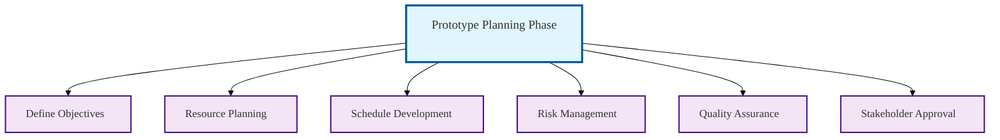

### Detailed Objective Definition
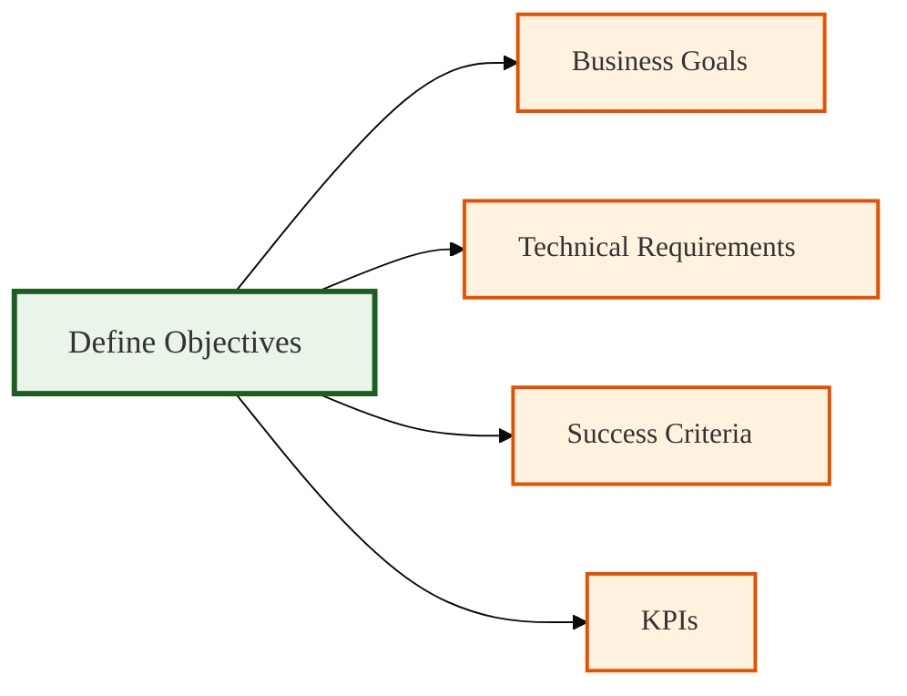

### Resource Planning Framework
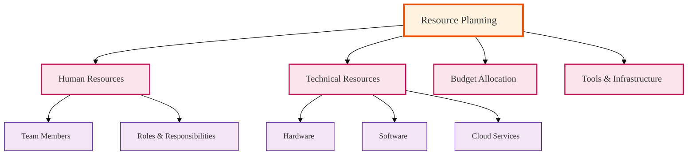

### Schedule Development Process
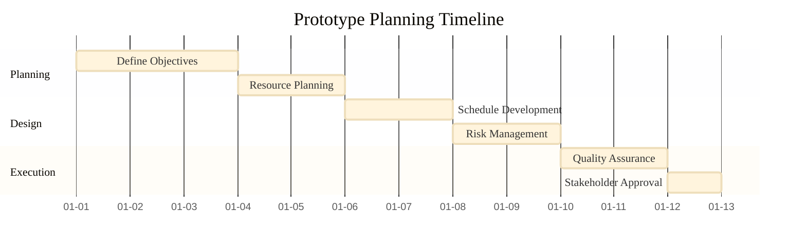

### Risk Management Framework
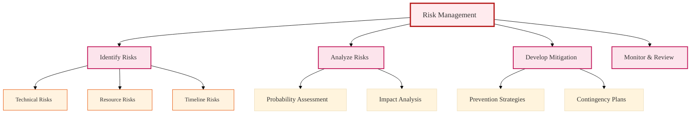

### Quality Assurance Planning
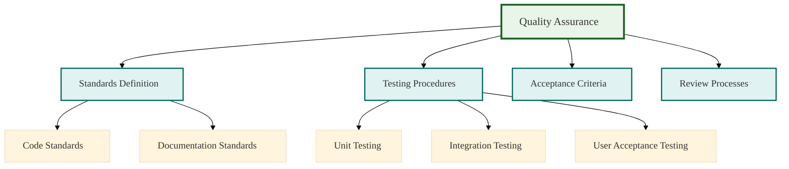

### Stakeholder Management
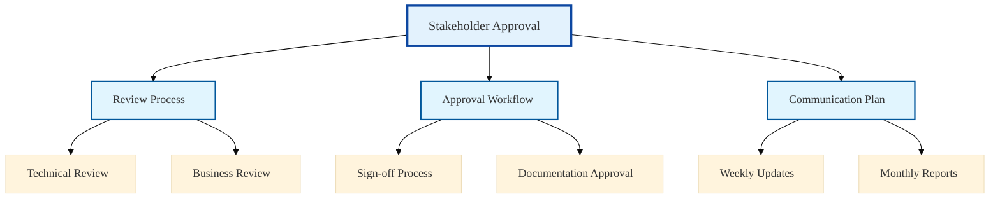

## Detailed Planning Components

### 1. Objective Definition Framework

#### Business Objectives
```json
{
  "business_objectives": {
    "primary_goal": "Validate core functionality before full development",
    "target_metrics": {
      "user_satisfaction_score": ">= 7/10",
      "performance_improvement": ">= 30%",
      "feature_completeness": ">= 80%"
    },
    "stakeholder_expectations": [
      "Demonstrate key features",
      "Prove technical feasibility",
      "Validate user experience"
    ]
  }
}
```

#### Technical Objectives
- **Architecture Validation**: Test system architecture decisions
- **Technology Stack**: Validate chosen technologies and frameworks
- **Integration Points**: Verify third-party integrations
- **Performance Benchmarks**: Establish baseline performance metrics

#### Success Criteria Matrix
| Criteria Type | Metric | Target Value | Measurement Method |
|--------------|--------|--------------|-------------------|
| Functional | Feature Completeness | 80% | User Story Testing |
| Performance | Response Time | < 2 seconds | Load Testing |
| Usability | Task Success Rate | 85% | User Testing |
| Technical | Code Coverage | 70% | Unit Testing |

### 2. Resource Planning Matrix

#### Human Resources Allocation
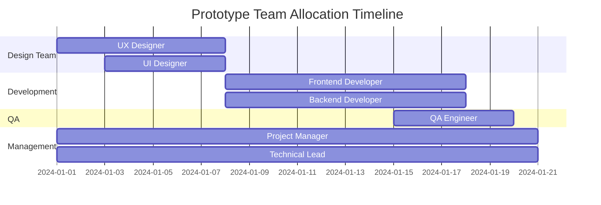

#### Technical Resources
- **Development Environment**: Cloud-based development servers
- **Testing Infrastructure**: Automated testing pipelines
- **Collaboration Tools**: Jira, Confluence, Slack
- **Design Tools**: Figma, Adobe Creative Suite
- **Version Control**: Git with feature branch workflow

#### Budget Breakdown
| Category | Estimated Cost | Percentage |
|----------|----------------|------------|
| Personnel | $15,000 | 60% |
| Tools & Licenses | $3,000 | 12% |
| Infrastructure | $4,000 | 16% |
| Contingency | $3,000 | 12% |
| **Total** | **$25,000** | **100%** |

### 3. Schedule Development

#### Phase-Based Timeline
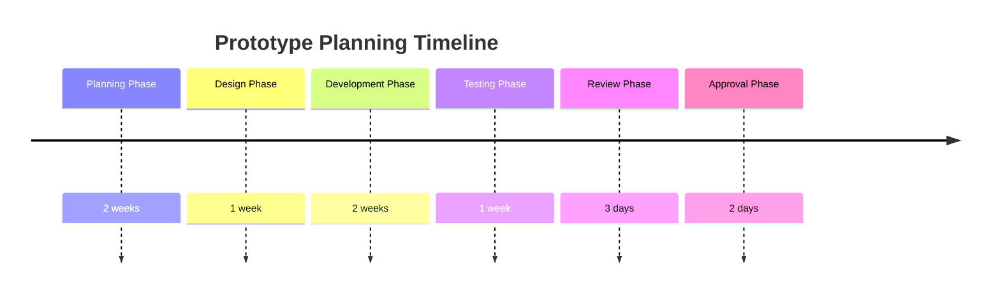

#### Detailed Milestone Chart
| Milestone | Description | Due Date | Dependencies |
|-----------|-------------|----------|--------------|
| M1 - Plan Complete | All planning documents finalized | Week 2 | Stakeholder input |
| M2 - Design Approved | UX/UI designs signed off | Week 3 | M1 Complete |
| M3 - Alpha Build | Core features implemented | Week 5 | M2 Complete |
| M4 - Testing Complete | All tests passed | Week 6 | M3 Complete |
| M5 - Final Review | Stakeholder review complete | Week 6.5 | M4 Complete |

### 4. Risk Management Framework

#### Risk Identification Matrix
| Risk Category | Specific Risk | Probability | Impact | Risk Score |
|---------------|---------------|-------------|---------|------------|
| Technical | Technology incompatibility | Medium | High | 6 |
| Resource | Key personnel unavailable | Low | High | 4 |
| Scope | Feature creep | High | Medium | 6 |
| Timeline | Underestimated effort | Medium | Medium | 4 |
| Quality | Insufficient testing | Low | High | 4 |

#### Risk Mitigation Strategies
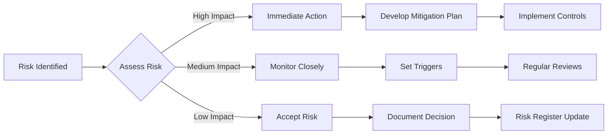

### 5. Quality Assurance Planning

#### Quality Gates
1. **Planning Review Gate**: All plans reviewed by technical lead
2. **Design Review Gate**: UX/UI designs validated by stakeholders
3. **Code Review Gate**: All code peer-reviewed before testing
4. **Testing Gate**: Comprehensive test coverage achieved
5. **Acceptance Gate**: Stakeholder sign-off required

#### Testing Strategy
- **Unit Testing**: 70% code coverage minimum
- **Integration Testing**: All API endpoints tested
- **User Acceptance Testing**: 5+ users from target audience
- **Performance Testing**: Load testing with 100+ concurrent users
- **Security Testing**: OWASP top 10 vulnerabilities scan

### 6. Stakeholder Management

#### Stakeholder Matrix
| Stakeholder | Role | Interest Level | Influence | Communication Frequency |
|-------------|------|----------------|-----------|------------------------|
| Product Owner | Decision Maker | High | High | Weekly |
| Development Team | Implementers | High | Medium | Daily |
| End Users | Consumers | Medium | Medium | Bi-weekly |
| QA Team | Validators | High | Medium | Weekly |
| Management | Sponsors | Medium | High | Monthly |

#### Communication Plan
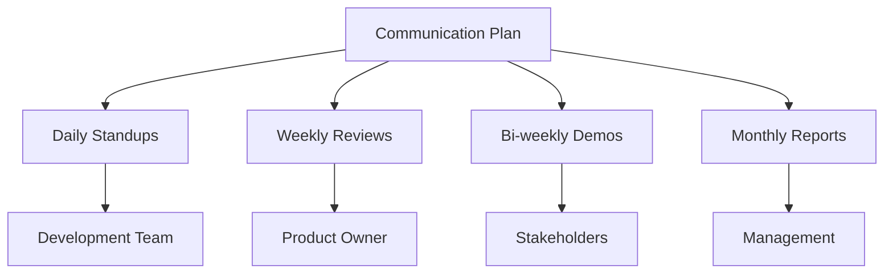

## JSON Schema Structure

### Core Prototype Planning Schema
```json
{
  "prototype_planning": {
    "id": "WBS-Modeling-4.1",
    "name": "Prototype Planning",
    "description": "Comprehensive plan for prototype development",
    "version": "1.0",
    "created_date": "2024-01-01",
    "last_updated": "2024-01-15",
    "status": "draft",
    "phases": {
      "planning": {
        "duration": "2 weeks",
        "objectives": ["Define scope", "Set objectives", "Plan resources"],
        "deliverables": ["Project plan", "Resource allocation", "Risk assessment"]
      },
      "execution": {
        "duration": "3 weeks",
        "objectives": ["Build prototype", "Test functionality", "Gather feedback"],
        "deliverables": ["Working prototype", "Test reports", "User feedback"]
      }
    },
    "resources": {
      "team": {
        "project_manager": 0.5,
        "technical_lead": 1.0,
        "developers": 2.0,
        "designers": 1.0,
        "qa_engineers": 1.0
      },
      "budget": {
        "personnel": 15000,
        "tools": 3000,
        "infrastructure": 4000,
        "contingency": 3000
      }
    },
    "risks": [
      {
        "id": "R001",
        "description": "Technology stack incompatibility",
        "probability": "medium",
        "impact": "high",
        "mitigation": "Conduct technology spike before development"
      }
    ],
    "success_criteria": {
      "functional": "80% feature completeness",
      "performance": "Response time < 2 seconds",
      "usability": "User satisfaction score >= 7/10"
    }
  }
}
```

## Implementation Workflow

### Step-by-Step Process
1. **Initiation**
   - Review project requirements
   - Identify prototype scope
   - Establish success criteria

2. **Planning**
   - Create detailed project plan
   - Allocate resources
   - Develop risk mitigation strategies

3. **Design**
   - Create user experience designs
   - Develop technical architecture
   - Plan integration points

4. **Development**
   - Implement core features
   - Conduct regular code reviews
   - Perform continuous testing

5. **Validation**
   - User acceptance testing
   - Performance validation
   - Security assessment

6. **Review**
   - Stakeholder demonstration
   - Feedback collection
   - Plan refinement

## Tools and Templates

### Available Templates
- [Project Plan Template](./templates/project-plan-template.md)
- [Risk Assessment Matrix](./templates/risk-assessment-template.xlsx)
- [Resource Allocation Sheet](./templates/resource-allocation-template.xlsx)
- [Milestone Tracker](./templates/milestone-tracker.md)

### Recommended Tools
- **Project Management**: Jira, Trello, Asana
- **Design**: Figma, Sketch, Adobe XD
- **Development**: VS Code, Git, Docker
- **Testing**: Jest, Selenium, Postman
- **Communication**: Slack, Microsoft Teams, Zoom

## Best Practices

### Planning Guidelines
1. **Start with clear objectives** - Define what success looks like
2. **Involve stakeholders early** - Ensure alignment from the beginning
3. **Plan for iterations** - Expect changes and feedback
4. **Document everything** - Maintain comprehensive records
5. **Use data-driven decisions** - Base choices on metrics and evidence

### Common Pitfalls to Avoid
- Over-engineering the prototype
- Insufficient stakeholder involvement
- Unrealistic timeline expectations
- Inadequate risk planning
- Poor communication planning

## Monitoring and Control

### Key Performance Indicators (KPIs)
- **Schedule Variance**: (Actual Progress - Planned Progress) / Planned Progress
- **Budget Variance**: (Actual Cost - Planned Cost) / Planned Cost
- **Scope Creep**: Number of unplanned features added
- **Quality Metrics**: Defect density, test coverage, user satisfaction

### Reporting Dashboard
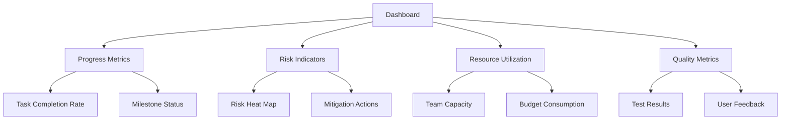

## Conclusion

This comprehensive Prototype Planning guide provides a structured approach to planning and executing prototype development activities. By following this framework, teams can ensure systematic planning, effective resource utilization, and successful prototype delivery that meets stakeholder expectations and project objectives.

The key to successful prototype planning lies in balancing thoroughness with flexibility, maintaining clear communication, and continuously adapting based on feedback and changing requirements.
