# Prototype Refinement Process Documentation

## Overview

This document provides a comprehensive guide to the **Prototype Refinement** phase within the software development lifecycle. It details the systematic approach to refining prototypes based on testing feedback and validation results.

---

## Purpose and Scope

The Prototype Refinement process ensures that initial prototypes evolve into production-ready solutions through iterative improvement cycles. This phase bridges the gap between initial concept validation and final implementation.

### Key Objectives
- Transform feedback into actionable improvements
- Validate design decisions through testing
- Ensure prototype alignment with requirements
- Document evolution for traceability

---

## Process Architecture

### High-Level Process Flow

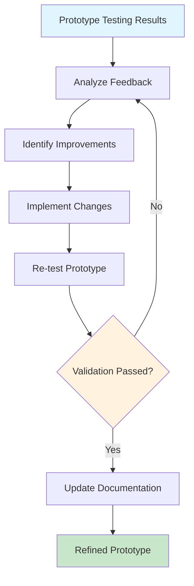

---

## Detailed Process Components

### 1. Feedback Analysis Framework

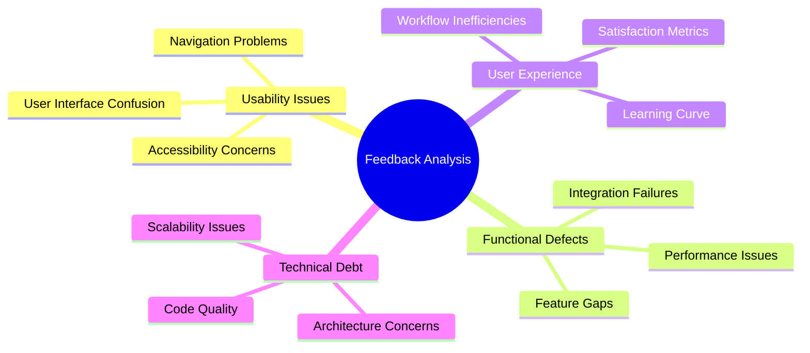

### 2. Improvement Identification Process

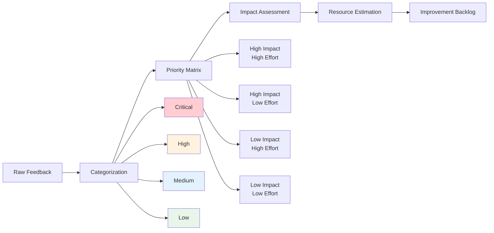

### 3. Implementation Workflow

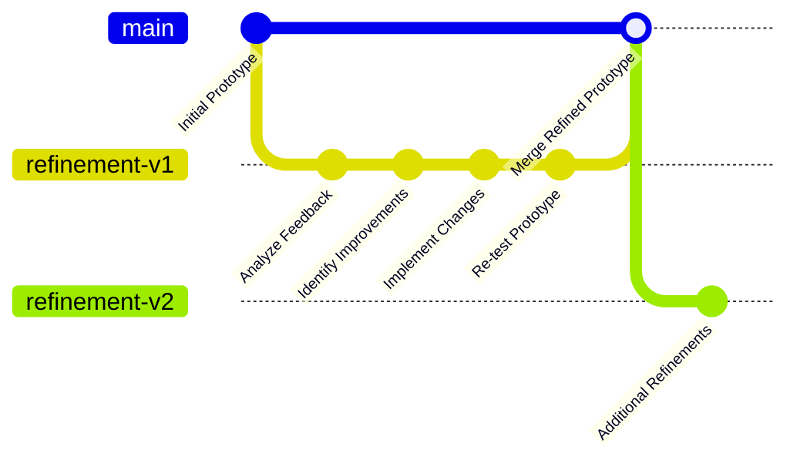

---

## Task Breakdown Structure

### WBS Hierarchy

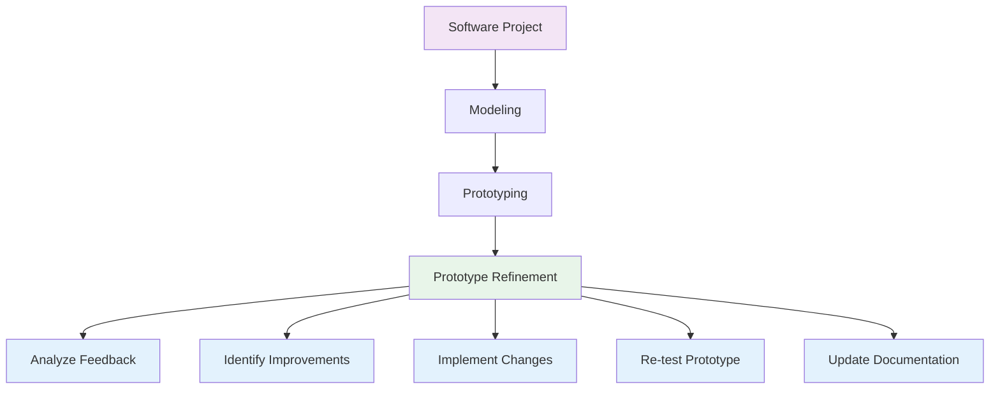

### Detailed Task Specifications

| Task ID | Task Name | Description | Dependencies | Duration Estimate |
|---------|-----------|-------------|--------------|-------------------|
| WBS-Modeling-4.4.1 | Analyze Feedback | Systematic review of testing feedback to identify patterns and issues | Testing Results | 2-4 hours |
| WBS-Modeling-4.4.2 | Identify Improvements | Prioritize and define specific improvements based on analysis | Feedback Analysis | 1-2 hours |
| WBS-Modeling-4.4.3 | Implement Changes | Execute approved improvements in the prototype | Improvement List | 4-8 hours |
| WBS-Modeling-4.4.4 | Re-test Prototype | Validate changes through targeted testing | Updated Prototype | 2-3 hours |
| WBS-Modeling-4.4.5 | Update Documentation | Document all changes and maintain traceability | Validated Changes | 1 hour |

---

## Quality Assurance Framework

### Testing Strategy

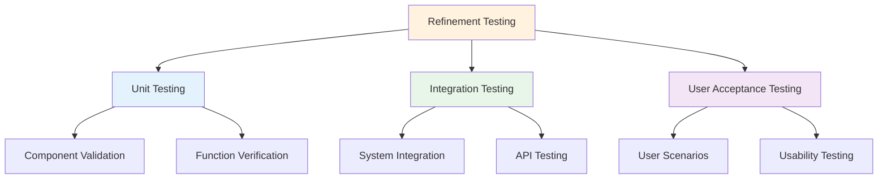

### Validation Criteria

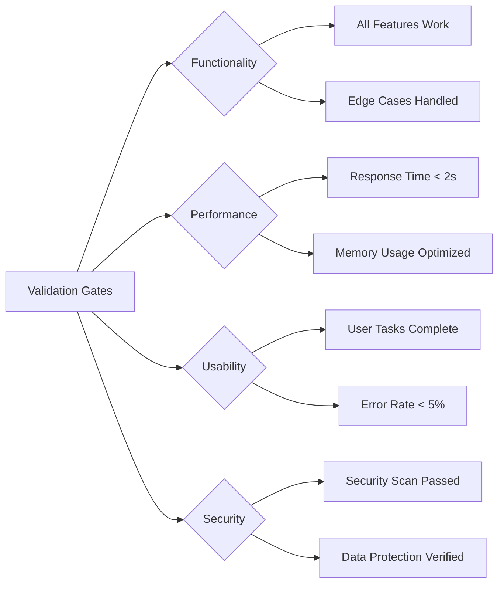

---

## Documentation Standards

### Change Documentation Template

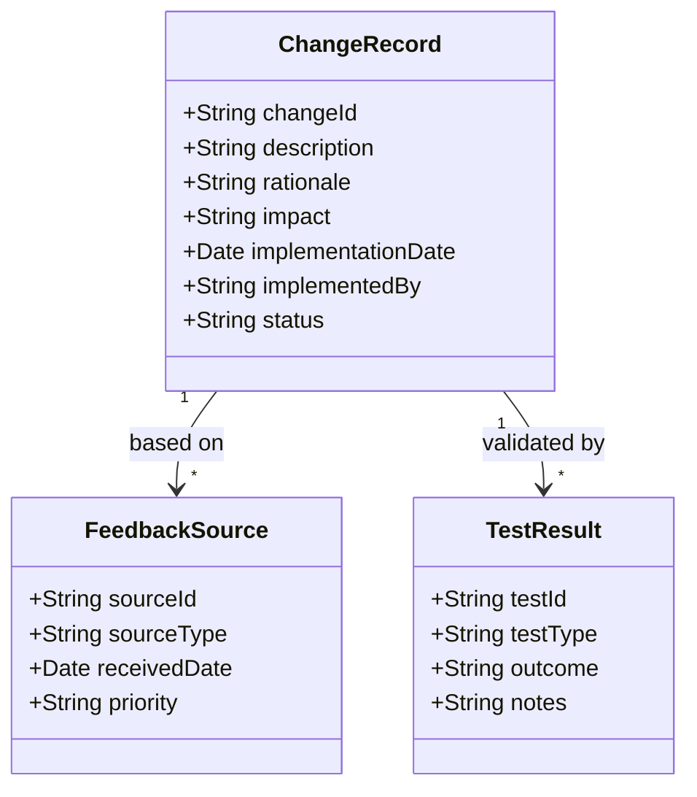

---

## Risk Management

### Common Refinement Risks

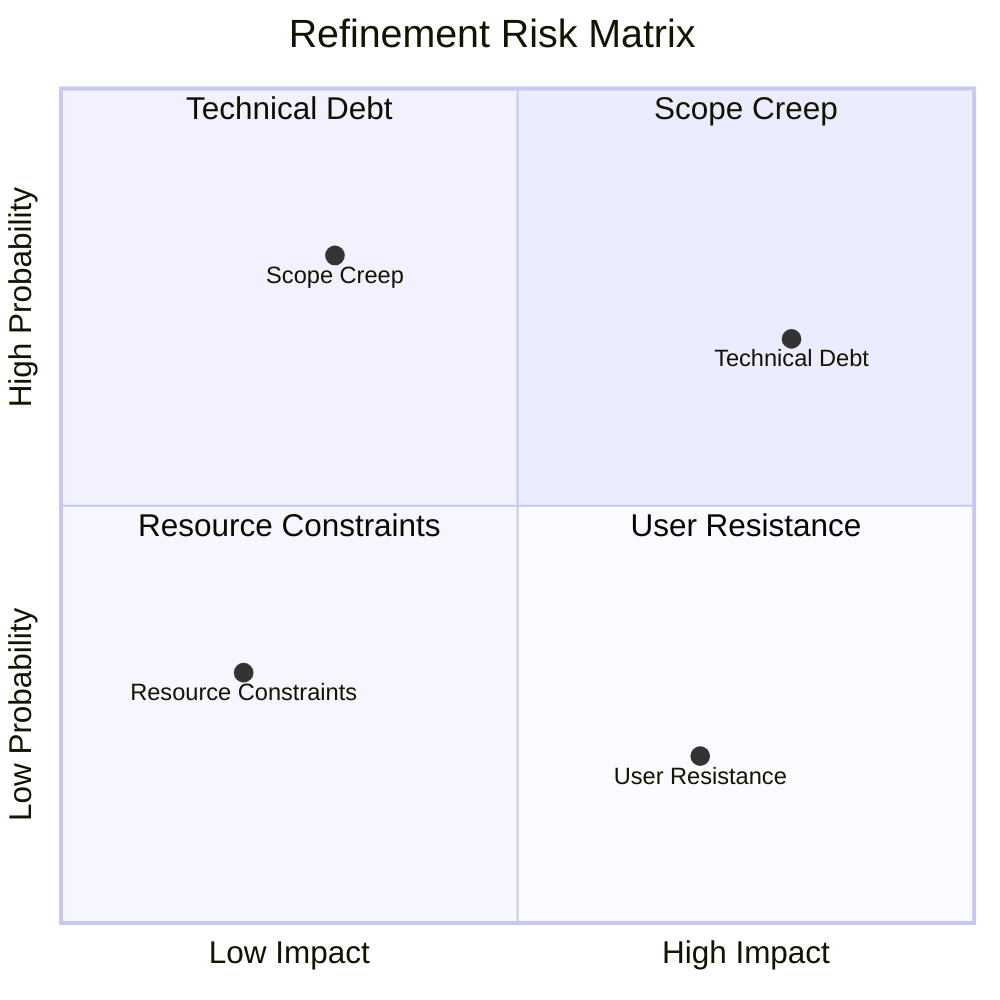

---

## Extension Guidelines

### Customization Framework

To extend this structure for specific project needs:

1. **Level 5-7 Breakdown**: Add project-specific subtasks
2. **Custom Metrics**: Define project-specific KPIs
3. **Tool Integration**: Connect with project management tools
4. **Automation**: Implement automated testing and deployment

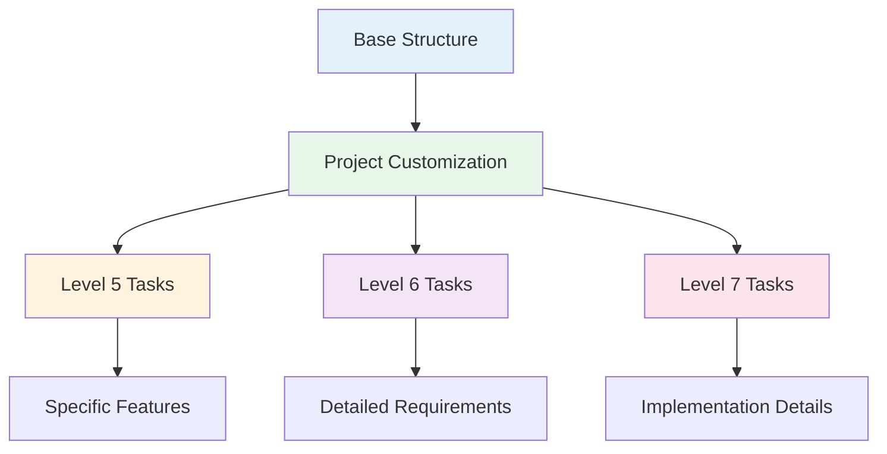

---

## Best Practices

### Iteration Guidelines

1. **Small Batches**: Implement changes in small, testable increments
2. **Continuous Feedback**: Maintain regular stakeholder communication
3. **Documentation First**: Update documentation before implementation
4. **Automated Testing**: Implement comprehensive test automation
5. **Version Control**: Use feature branches for each refinement cycle

### Success Metrics

- **Feedback Resolution Rate**: >90% of critical issues resolved
- **Test Coverage**: >80% for refined components
- **User Satisfaction**: >4.0/5.0 in post-refinement surveys
- **Performance Impact**: <5% degradation in key metrics

---

## Integration Points

### Tool Ecosystem

```mermaid
flowchart TD
    A[Prototype Refinement] --> B[GitHub Projects]
    A --> C[GitHub Actions]
    A --> D[Testing Tools]
    A --> E[GitHub Wiki]
    
    B --> B1[Project Management]
    C --> C1[CI/CD Pipeline]
    D --> D1[Automated Tests]
    E --> E1[Documentation]
    
    style A fill:#e1f5fe
    style B fill:#24292f
    style C fill:#0969da
    style D fill:#28a745
    style E fill:#6f42c1
```

---

## Conclusion

The Prototype Refinement process transforms initial concepts into validated, production-ready solutions through systematic feedback integration and iterative improvement. By following this structured approach, teams can ensure high-quality deliverables that meet user needs and technical requirements.

This documentation serves as a living guide that should be updated as the project evolves and new insights are gained through the refinement process.
