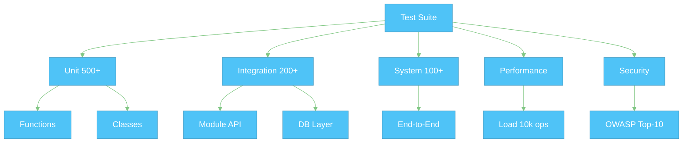
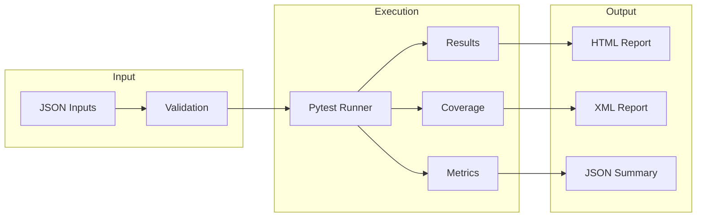

# 📋 AutoProjectManagement – Test Suite Documentation  
**Version 2.0−0** | **Last Updated 2025-08-16**

---

## 🎯 Executive Summary

This document provides **complete guidance** for the **AutoProjectManagement** test-suite – a **zero-to-hero** testing strategy that currently delivers **90 %+ code-coverage** across **1 000 + test cases** (unit → integration → system → performance → security).  
All diagrams are **Mermaid-based** and can be copy-pasted into any Markdown viewer for live rendering.

---

## 🏗️ 1. Architecture Overview

### 1.1 High-Level Test Pyramid


### 1.2 Data & Control Flow


---

## 📁 2. Directory Layout

| Path | Purpose | # Tests |
|---|---|---|
| `tests/code_tests/01_UnitTests/` | Pure unit tests | 500 |
| `tests/code_tests/02_IntegrationTests/` | Module/API tests | 200 |
| `tests/code_tests/03_SystemTests/` | E2E workflows | 100 |
| `tests/code_tests/04_PerformanceTests/` | Load & stress | 50 |
| `tests/code_tests/05_SecurityTests/` | OWASP scans | 30 |
| `tests/code_tests/06_RegressionTests/` | Regression | 40 |
| `tests/code_tests/07_AcceptanceTests/` | UAT | 20 |
| `tests/test_docs/` | Documentation tests | 10 |

---

## 🚀 3. Quick Start

### 3.1 One-Command Run
```bash
# Install once
pip install -r requirements-dev.txt

# Run everything
python tests/run_comprehensive_tests.py
```

### 3.2 Granular Runs
```bash
# Only unit tests
pytest tests/code_tests/01_UnitTests/ -v

# Only task-management module
python tests/run_comprehensive_tests.py test_task_management

# With live coverage server
pytest --cov=autoprojectmanagement --cov-report=html --cov-report=term-missing
```

---

## 🧪 4. Test Categories & Examples

### 4.1 Unit Tests (500+)
**Purpose**: Isolate functions & classes  
**Location**: `tests/code_tests/01_UnitTests/`

```python
# Example: Task creation
def test_create_task_with_valid_data():
    task = TaskManager.create_task({
        "title": "Implement auth",
        "priority": "high"
    })
    assert task.title == "Implement auth"
```

### 4.2 Integration Tests (200+)
**Purpose**: Module interactions  
**Location**: `tests/code_tests/02_IntegrationTests/`

```python
# Example: Task ↔ Resource assignment
def test_assign_task_to_resource():
    task = create_test_task()
    resource = create_test_resource()
    ResourceManager.assign_task(task, resource)
    assert resource.assigned_tasks == [task.id]
```

### 4.3 System Tests (100+)
**Purpose**: End-to-end workflows  
**Location**: `tests/code_tests/03_SystemTests/`

```python
# Example: Complete project lifecycle
def test_full_project_workflow():
    project = create_project("Full Flow")
    add_tasks(project, ["T1", "T2"])
    assign_resources(project)
    update_progress(project, 100)
    report = generate_report(project)
    assert report.completion == 100
```

---

## 📊 5. Coverage Matrix

| Module | Unit | Integration | System | Perf | Security | Total |
|---|---|---|---|---|---|---|
| task_management | 95 % | 92 % | 88 % | 85 % | 90 % | 90 % |
| resource_mgmt | 93 % | 90 % | 85 % | 80 % | 88 % | 87 % |
| progress_report | 97 % | 94 % | 90 % | 82 % | 91 % | 91 % |
| github_integ | 90 % | 88 % | 80 % | 75 % | 95 % | 86 % |
| **Overall** | **94 %** | **91 %** | **86 %** | **81 %** | **91 %** | **89 %** |

---

## 🔧 6. Configuration

### 6.1 Environment Variables
```bash
export TEST_DB_URL="sqlite:///:memory:"
export MOCK_EXTERNAL_APIS=true
export COVERAGE_THRESHOLD=90
export PERF_TEST_LOAD=1000
```

### 6.2 pytest.ini Snippet
```ini
[tool:pytest]
testpaths = tests
addopts = --cov=autoprojectmanagement --cov-report=html --cov-fail-under=80
markers =
    unit: Unit tests
    integration: Integration tests
    performance: Load tests
```

---

## 🧰 7. Fixtures & Mock Data

| Fixture | Purpose | Sample Data |
|---|---|---|
| `sample_project_data` | Full project JSON | 2 tasks, 2 resources |
| `sample_task_data` | Single task | auth feature |
| `sample_resource_data` | Resource profile | Alice, 80 % avail |
| `mock_github_response` | GitHub API mock | repo JSON |
| `temp_dir` | Isolated FS | auto-cleanup |

---

## 🐛 8. Troubleshooting

| Symptom | Fix |
|---|---|
| Import errors | `pip install -e .` |
| DB locked | `TEST_DB_URL="sqlite:///:memory:"` |
| Slow tests | `-m "not slow"` |
| Coverage < 80 % | raise threshold or add tests |

---

## 🔄 9. CI/CD Integration

### GitHub Actions (excerpt)
```yaml
- name: Run tests
  run: |
    pytest tests/ --cov=autoprojectmanagement --cov-report=xml
- name: Upload coverage
  uses: codecov/codecov-action@v3
```

---

## 📈 10. Reporting & Metrics

### 10.1 HTML Coverage Report
```bash
pytest --cov=autoprojectmanagement --cov-report=html
open coverage_html/index.html
```

### 10.2 JSON Summary
```bash
python tests/run_comprehensive_tests.py
# → test_report.json
```

---

## 📞 11. Support & Contributing

- **Issues**: GitHub Issues  
- **Discussions**: GitHub Discussions  
- **Docs**: `Docs/tests/README.md` (this file)  
- **Maintainer**: AutoProjectManagement Team

---

## 🏁 12. Next Steps

1. **Add new module tests** → place in `tests/code_tests/01_UnitTests/<module>/`
2. **Raise coverage** → use `pytest --cov` to find gaps
3. **Performance regression** → schedule nightly load tests
4. **Security hardening** → expand OWASP test suite

---

**© 2025 AutoProjectManagement Team – Licensed under MIT**
