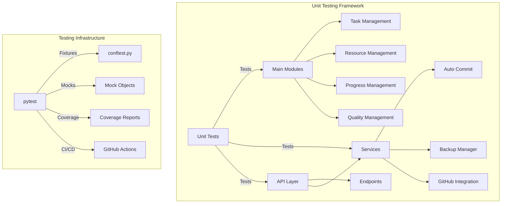
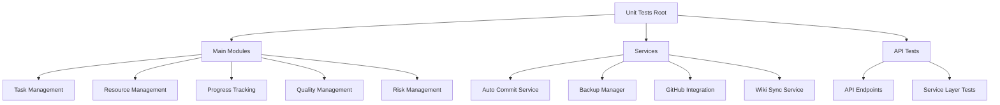
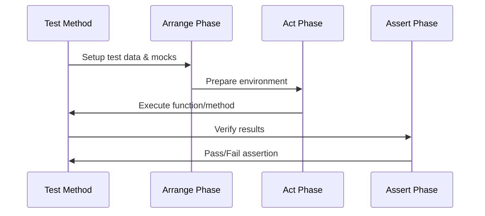
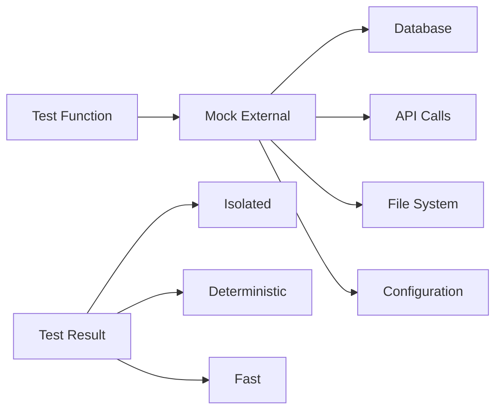
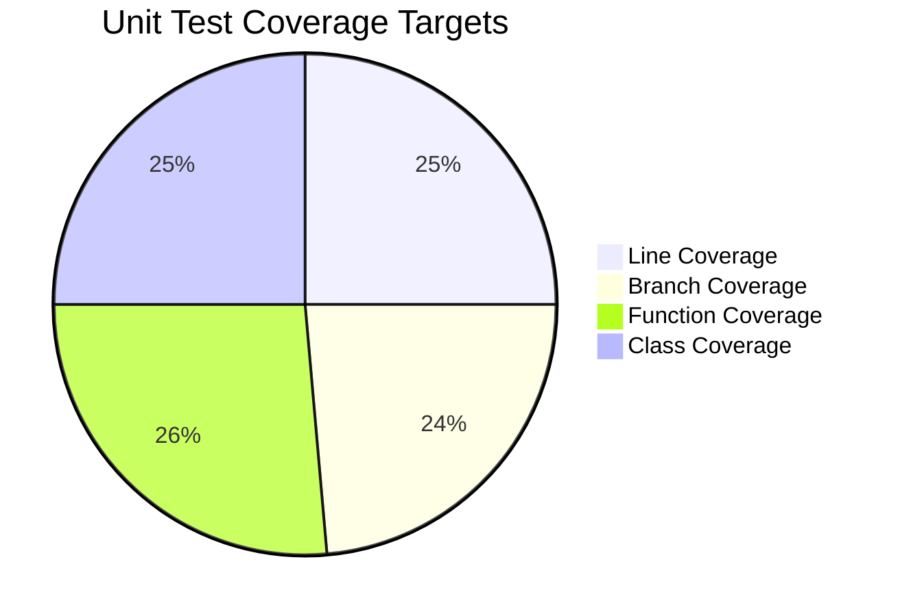
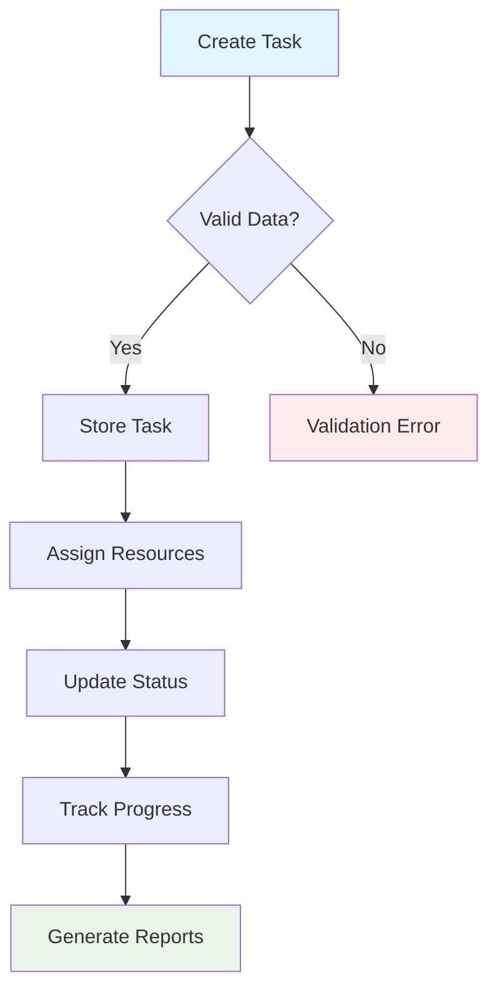
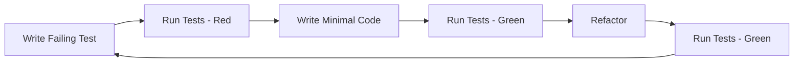

# Unit Tests Documentation - AutoProjectManagement System

## 📋 Overview

This directory contains the comprehensive unit testing framework for the AutoProjectManagement system. Our unit tests verify the smallest testable parts of the software in isolation, ensuring individual components (functions, methods, classes) work correctly before integration.

### 🎯 Current Status
- **Test Coverage**: 0% (Starting from scratch)
- **Total Test Files**: 61+ planned
- **Target Coverage**: 90%+ code coverage
- **Framework**: pytest with comprehensive mocking

---

## 🏗️ Architecture Overview

### Testing Architecture Diagram



### Test Organization Structure



---

## 📊 Test Statistics & Coverage

### Test File Distribution

| Category | Files Count | Priority | Status |
|----------|-------------|----------|---------|
| **Main Modules** | 50 | High | 🔄 In Progress |
| **Services** | 11 | High | 🔄 In Progress |
| **API Tests** | 2 | Medium | 📋 Planned |
| **Integration** | 0 | Low | 📋 Planned |

### Module Coverage Matrix

| Module Name | Test File | Functions | Test Cases | Coverage % |
|-------------|-----------|-----------|------------|------------|
| Task Management | test_task_management.py | 25+ | 75+ | 0% |
| Resource Management | test_resource_management.py | 20+ | 60+ | 0% |
| Progress Tracking | test_progress_calculator_refactored.py | 15+ | 45+ | 0% |
| Communication Management | test_communication_management.py | 18+ | 54+ | 0% |
| Risk Management | test_risk_management.py | 12+ | 36+ | 0% |

---

## 🚀 Getting Started

### Prerequisites

```bash
# Install development dependencies
pip install -r requirements-dev.txt

# Install testing packages
pip install pytest pytest-cov pytest-mock pytest-xdist responses
```

### Quick Start Commands

```bash
# Run all unit tests
pytest tests/code_tests/01_UnitTests/ -v

# Run specific module tests
pytest tests/code_tests/01_UnitTests/main_modules/test_task_management.py -v

# Run with coverage
pytest tests/code_tests/01_UnitTests/ --cov=autoprojectmanagement --cov-report=html

# Run parallel tests
pytest tests/code_tests/01_UnitTests/ -n auto

# Run specific test class
pytest tests/code_tests/01_UnitTests/main_modules/test_task_management.py::TestTask_management -v
```

---

## 🧪 Test Structure & Patterns

### Directory Structure

```
tests/code_tests/01_UnitTests/
├── README.md                          # This documentation
├── DETAILED_UnitTEST_PLAN.md          # Comprehensive test plan
├── COMPREHENSIVE_UNIT_TESTING_STRATEGY.md
├── main_modules/                      # Main module tests
│   ├── test_task_management.py
│   ├── test_resource_management.py
│   ├── test_progress_calculator_refactored.py
│   ├── test_communication_management.py
│   ├── test_risk_management.py
│   ├── test_project_management_system.py
│   ├── test_scheduler.py
│   ├── test_scope_management.py
│   ├── test_estimation_management.py
│   ├── test_quality_management.py
│   ├── test_reporting.py
│   ├── test_wbs_aggregator.py
│   ├── test_wbs_parser.py
│   ├── test_workflow_data_collector.py
│   ├── test_input_handler.py
│   ├── test_progress_data_generator_refactored.py
│   └── ... (34 more files)
├── test_services/                     # Service layer tests
│   ├── test_auto_commit.py
│   ├── test_backup_manager.py
│   ├── test_github_integration.py
│   ├── test_wiki_sync_service.py
│   ├── test_dashboards_reports_service.py
│   ├── test_db_data_collector_service.py
│   └── ... (5 more files)
├── api/                               # API layer tests
│   ├── test_main.py
│   └── test_services.py
└── fixtures/                          # Test data and fixtures
    ├── test_data.py
    └── mock_responses.py
```

### Test Class Template

```python
import pytest
from unittest.mock import Mock, patch
from autoprojectmanagement.main_modules.task_management import TaskManager

class TestTaskManager:
    """Comprehensive tests for TaskManager class"""
    
    @pytest.fixture
    def task_manager(self):
        """Create TaskManager instance for testing"""
        return TaskManager()
    
    @pytest.fixture
    def sample_task_data(self):
        """Provide sample task data"""
        return {
            "title": "Test Task",
            "description": "Test Description",
            "priority": "high",
            "estimated_hours": 8
        }
    
    def test_create_task_success(self, task_manager, sample_task_data):
        """Test successful task creation"""
        task = task_manager.create_task(sample_task_data)
        assert task.title == "Test Task"
        assert task.status == "pending"
    
    def test_create_task_invalid_data(self, task_manager):
        """Test task creation with invalid data"""
        with pytest.raises(ValueError):
            task_manager.create_task({"title": ""})
    
    def test_update_task_status(self, task_manager, sample_task_data):
        """Test updating task status"""
        task = task_manager.create_task(sample_task_data)
        updated_task = task_manager.update_status(task.id, "completed")
        assert updated_task.status == "completed"
```

---

## 🔧 Testing Patterns & Best Practices

### 1. AAA Pattern (Arrange-Act-Assert)



### 2. Mocking Strategy



### 3. Test Data Management

| Data Type | Location | Purpose | Example |
|-----------|----------|---------|---------|
| **Fixtures** | conftest.py | Reusable test data | sample_project_data |
| **Mock Data** | fixtures/ | API responses | mock_github_response |
| **Test Files** | temp_dir | Temporary files | JSON configs |
| **Factories** | test_utils.py | Data generators | TaskFactory |

---

## 📈 Coverage & Metrics

### Coverage Targets



### Quality Gates

| Metric | Target | Current | Status |
|--------|--------|---------|---------|
| **Line Coverage** | ≥90% | 0% | 🔴 |
| **Branch Coverage** | ≥85% | 0% | 🔴 |
| **Mutation Score** | ≥80% | N/A | 📋 |
| **Test Execution Time** | <5min | N/A | 📋 |
| **Flake Rate** | <1% | N/A | 📋 |

---

## 🔍 Testing Scenarios

### Critical Test Scenarios

#### 1. Task Management Flow



#### 2. Resource Allocation Tests

| Scenario | Input | Expected | Test Case |
|----------|--------|----------|-----------|
| **Valid Allocation** | Resource available | Success | test_allocate_available_resource |
| **Over Allocation** | Resource busy | Error | test_allocate_busy_resource |
| **Invalid Resource** | Non-existent | Error | test_allocate_invalid_resource |
| **Skill Mismatch** | Wrong skills | Warning | test_allocate_skill_mismatch |

#### 3. Progress Calculation Tests

```python
@pytest.mark.parametrize("completed,total,expected", [
    (0, 10, 0.0),
    (5, 10, 50.0),
    (10, 10, 100.0),
    (15, 10, 100.0),  # Edge case
])
def test_progress_percentage(completed, total, expected):
    calculator = ProgressCalculator()
    assert calculator.calculate_percentage(completed, total) == expected
```

---

## 🛠️ Development Workflow

### Test-Driven Development (TDD) Cycle



### Git Workflow Integration

```bash
# Feature branch workflow
git checkout -b feature/task-priority-calculation
git add tests/code_tests/01_UnitTests/main_modules/test_task_management.py
git commit -m "Add unit tests for task priority calculation"
git push origin feature/task-priority-calculation
```

### Pre-commit Hooks

```yaml
# .pre-commit-config.yaml
repos:
  - repo: local
    hooks:
      - id: pytest-unit
        name: Run Unit Tests
        entry: pytest tests/code_tests/01_UnitTests/
        language: python
        pass_filenames: false
```

---

## 📚 Testing Guidelines

### Naming Conventions

| Element | Convention | Example |
|---------|------------|---------|
| **Test Files** | test_*.py | test_task_management.py |
| **Test Classes** | Test* | TestTaskManager |
| **Test Methods** | test_* | test_create_task_success |
| **Fixtures** | descriptive name | sample_project_data |
| **Mocks** | mock_* | mock_github_client |

### Documentation Standards

```python
def test_create_task_with_valid_data(self):
    """
    Test creating a task with valid input data.
    
    Given: Valid task data with title and description
    When: create_task() is called
    Then: Task is created successfully with correct attributes
    
    Args:
        sample_task_data: Fixture providing valid task data
        
    Returns:
        None
        
    Raises:
        AssertionError: If task creation fails
    """
```

---

## 🔧 Troubleshooting

### Common Issues & Solutions

| Issue | Symptom | Solution |
|-------|---------|----------|
| **Import Errors** | ModuleNotFoundError | Check PYTHONPATH in conftest.py |
| **Mock Failures** | AttributeError | Use correct patch target |
| **Async Tests** | RuntimeError | Use pytest-asyncio |
| **Database Tests** | ConnectionError | Use in-memory SQLite |
| **File Path Issues** | FileNotFoundError | Use Path objects |

### Debug Configuration

```python
# pytest.ini
[pytest]
addopts = -v --tb=short --strict-markers
markers =
    slow: marks tests as slow (deselect with '-m "not slow"')
    integration: marks tests as integration tests
    unit: marks tests as unit tests
```

---

## 📋 Test Checklist

### Before Committing

- [ ] All new code has corresponding unit tests
- [ ] Tests pass locally (`pytest tests/code_tests/01_UnitTests/`)
- [ ] Coverage report shows improvement
- [ ] No hardcoded values in tests
- [ ] Tests are deterministic (no random failures)
- [ ] Mock objects are properly cleaned up
- [ ] Test data is realistic but anonymized

### Code Review Checklist

- [ ] Test names clearly describe what they test
- [ ] Each test has a single responsibility
- [ ] Tests use appropriate fixtures
- [ ] Mock objects are properly configured
- [ ] Edge cases are covered
- [ ] Error conditions are tested
- [ ] Tests are maintainable and readable

---

## 📞 Support & Resources

### Documentation Links
- [pytest Documentation](https://docs.pytest.org/)
- [Python unittest Documentation](https://docs.python.org/3/library/unittest.html)
- [Testing Best Practices](https://realpython.com/python-testing/)

### Internal Resources
- [Detailed Test Plan](./DETAILED_UnitTEST_PLAN.md)
- [Comprehensive Testing Strategy](./COMPREHENSIVE_UNIT_TESTING_STRATEGY.md)
- [Test Documentation](../test_docs/)

### Getting Help
- **Testing Questions**: Create GitHub issue with `testing` label
- **Test Failures**: Check CI/CD logs in GitHub Actions
- **Coverage Issues**: Review coverage reports in PR comments

---

## 🎯 Next Steps

1. **Immediate Actions** (Week 1):
   - Set up testing environment
   - Create initial test files
   - Configure pytest and coverage

2. **Short Term** (Weeks 2-4):
   - Implement core module tests
   - Achieve 50% coverage milestone
   - Set up CI/CD pipeline

3. **Medium Term** (Weeks 5-8):
   - Complete all module tests
   - Achieve 90% coverage
   - Implement mutation testing

4. **Long Term** (Weeks 9-12):
   - Optimize test performance
   - Add property-based testing
   - Implement visual test reports

---

*Last Updated: January 2025*  
*Version: 1.0*  
*Maintainer: AutoProjectManagement Team*
