# Integration Tests Documentation

## Overview

This document provides comprehensive guidance for integration testing in the AutoProjectManagement system. Integration tests verify the interaction between integrated units or modules to detect interface defects and ensure components work together as expected.

## Table of Contents

1. [Test Architecture](#test-architecture)
2. [Test Strategy](#test-strategy)
3. [Test Scenarios](#test-scenarios)
4. [Test Data Management](#test-data-management)
5. [Test Execution](#test-execution)
6. [Test Results & Reporting](#test-results--reporting)
7. [Continuous Integration](#continuous-integration)
8. [Best Practices](#best-practices)

---

## Test Architecture

### System Architecture Overview


### Test Layer Architecture


---

## Test Strategy

### Test Pyramid for Integration Tests


### Test Types Matrix

| Test Type | Scope | Speed | Complexity | Maintenance | Example |
|-----------|--------|--------|------------|-------------|---------|
| **Contract Tests** | Single Interface | Fast | Low | Low | API endpoint validation |
| **Component Tests** | Multiple Modules | Medium | Medium | Medium | Progress + Workflow integration |
| **End-to-End** | Full System | Slow | High | High | Complete project lifecycle |

---

## Test Scenarios

### Critical Integration Scenarios

#### 1. Progress Data Generation Integration


#### 2. GitHub Service Integration


#### 3. Database Integration Flow


---

## Test Data Management

### Test Data Strategy


### Test Data Templates

#### Sample Progress Data Structure
```json
{
  "project_id": "test_project_001",
  "wbs_structure": {
    "phases": [
      {
        "id": "phase_1",
        "name": "Planning",
        "weight": 0.3,
        "tasks": [
          {
            "id": "task_1_1",
            "name": "Requirements Gathering",
            "estimated_hours": 40,
            "actual_hours": 35,
            "status": "completed"
          }
        ]
      }
    ]
  },
  "progress_metrics": {
    "overall_completion": 0.75,
    "phase_completion": {
      "planning": 1.0,
      "development": 0.6,
      "testing": 0.2
    }
  }
}
```

### Test Data Configuration Table

| Data Type | Format | Location | Purpose | Refresh Frequency |
|-----------|--------|----------|---------|-------------------|
| **Static Fixtures** | JSON | `fixtures/` | Base test data | Version controlled |
| **Dynamic Data** | Generated | `temp/` | Edge cases | Per test run |
| **Mock APIs** | Python classes | `mocks/` | External services | As needed |
| **Database Snapshots** | SQL dumps | `snapshots/` | Complex scenarios | Major releases |

---

## Test Execution

### Test Execution Pipeline


### Test Configuration Matrix

| Environment | Database | API Mock | File System | Use Case |
|-------------|----------|----------|-------------|----------|
| **Local** | SQLite | Local mocks | Temp files | Development |
| **CI** | PostgreSQL | HTTP mocks | In-memory | Automated testing |
| **Staging** | Production clone | Real APIs | Persistent | Pre-release |
| **Production** | Read-only | Cached responses | Backup | Monitoring |

### Test Execution Commands

```bash
# Run all integration tests
pytest tests/code_tests/02_IntegrationTests/ -v

# Run specific test module
pytest tests/code_tests/02_IntegrationTests/test_progress_integration.py -v

# Run with coverage
pytest tests/code_tests/02_IntegrationTests/ --cov=autoprojectmanagement --cov-report=html

# Run in parallel
pytest tests/code_tests/02_IntegrationTests/ -n auto

# Run with specific markers
pytest tests/code_tests/02_IntegrationTests/ -m "integration and not slow"
```

---

## Test Results & Reporting

### Test Report Structure


### Key Metrics Dashboard

| Metric | Target | Current | Trend | Status |
|--------|--------|---------|--------|--------|
| **Test Coverage** | ≥85% | 78% | ↗️ | 🟡 |
| **Test Execution Time** | <5min | 3.2min | ↗️ | ✅ |
| **Success Rate** | ≥95% | 97% | → | ✅ |
| **Flaky Tests** | 0 | 2 | ↘️ | 🟡 |

### Test Result Visualization


---

## Continuous Integration

### CI/CD Pipeline Integration

```mermaid
graph TD
    subgraph "Development Workflow"
        A[Feature Branch] --> B[Pull Request]
        B --> C[Integration Tests]
        C --> D[Review]
        D --> E[Merge]
    end
    
    subgraph "CI Pipeline"
        C --> F[Environment Setup]
        F --> G[Test Execution]
        G --> H[Result Analysis]
        H --> I[Quality Gate]
    end
    
    subgraph "Quality Gates"
        I --> J{Coverage > 85%}
        I --> K{All Tests Pass}
        I --> L{Performance OK}
    end
    
    J --> M[✅ Pass]
    K --> M
    L --> M
```



### GitHub Actions Workflow

```yaml
name: Integration Tests

on:
  push:
    branches: [ main, develop ]
  pull_request:
    branches: [ main ]

jobs:
  integration-tests:
    runs-on: ubuntu-latest
    
    services:
      postgres:
        image: postgres:13
        env:
          POSTGRES_PASSWORD: postgres
        options: >-
          --health-cmd pg_isready
          --health-interval 10s
          --health-timeout 5s
          --health-retries 5
    
    steps:
    - uses: actions/checkout@v3
    
    - name: Set up Python
      uses: actions/setup-python@v4
      with:
        python-version: '3.9'
    
    - name: Install dependencies
      run: |
        python -m pip install --upgrade pip
        pip install -r requirements-dev.txt
    
    - name: Run integration tests
      run: |
        pytest tests/code_tests/02_IntegrationTests/ -v --cov=autoprojectmanagement
    
    - name: Upload coverage
      uses: codecov/codecov-action@v3
```

---

## Best Practices

### Test Design Principles

1. **Test Independence**: Each test should be independent and not rely on execution order
2. **Clear Assertions**: Use descriptive assertion messages
3. **Test Data Management**: Use fixtures and factories for test data
4. **Mock External Dependencies**: Isolate tests from external systems
5. **Performance Testing**: Include performance benchmarks for critical paths

### Common Patterns

#### Test Fixture Pattern
```python
@pytest.fixture
def progress_generator():
    """Create a progress generator with test data."""
    with tempfile.TemporaryDirectory() as tmpdir:
        progress_file = os.path.join(tmpdir, 'progress.json')
        workflow_file = os.path.join(tmpdir, 'workflow.json')
        
        # Create test data
        with open(progress_file, 'w') as f:
            json.dump(TEST_PROGRESS_DATA, f)
        with open(workflow_file, 'w') as f:
            json.dump(TEST_WORKFLOW_DATA, f)
            
        generator = ProgressDataGenerator(
            db_progress_json_path=progress_file,
            workflow_definition_path=workflow_file
        )
        yield generator
```

#### Mock Service Pattern
```python
@pytest.fixture
def mock_github_service():
    """Mock GitHub service for testing."""
    with patch('autoprojectmanagement.services.github_integration.GitHubService') as mock:
        mock_instance = MagicMock()
        mock.return_value = mock_instance
        yield mock_instance
```

### Error Handling Tests

| Error Scenario | Test Case | Expected Behavior |
|----------------|-----------|-------------------|
| **Missing Files** | test_missing_progress_file | Raise FileNotFoundError |
| **Invalid JSON** | test_invalid_json_format | Raise JSONDecodeError |
| **Network Issues** | test_github_api_timeout | Retry with exponential backoff |
| **Permission Errors** | test_file_permission_error | Raise PermissionError |

---

## Troubleshooting

### Common Issues and Solutions

| Issue | Symptom | Solution |
|-------|---------|----------|
| **Test Flakiness** | Intermittent failures | Use deterministic test data |
| **Slow Tests** | >5min execution time | Use parallel execution |
| **Memory Issues** | OOM errors | Use smaller test datasets |
| **Network Dependencies** | External API failures | Use mocks/stubs |

### Debug Configuration

```python
# Enable debug logging
import logging
logging.basicConfig(level=logging.DEBUG)

# Run specific test with debug
pytest tests/code_tests/02_IntegrationTests/test_progress_integration.py::TestProgressIntegration::test_init_custom_values -v -s
```

---

## Resources

### Documentation Links
- [Unit Tests Documentation](../01_UnitTests/README.md)
- [System Tests Documentation](../03_SystemTests/README.md)
- [API Documentation](../../../modules_docs/api/_api_docs.md)

### Tools and Libraries
- **pytest**: Test framework
- **pytest-cov**: Coverage reporting
- **pytest-mock**: Mocking utilities
- **responses**: HTTP request mocking
- **factory-boy**: Test data factories

### Support
For questions or issues with integration tests, please:
1. Check the troubleshooting section above
2. Review existing test cases for patterns
3. Open an issue in the project repository
4. Contact the development team

---

*Last updated: 2025-08-16*  
*Version: 1.0.0*
