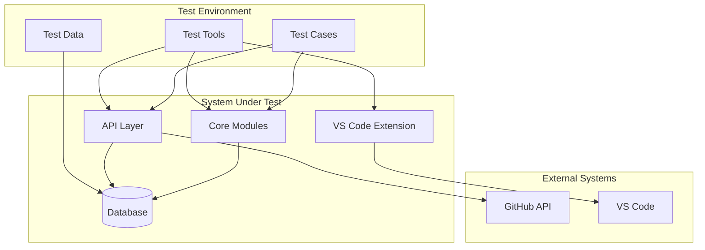
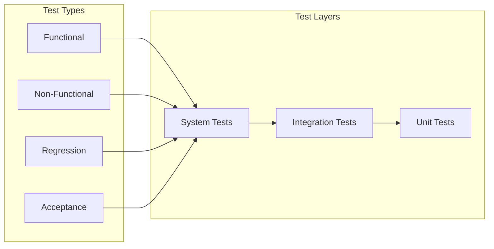
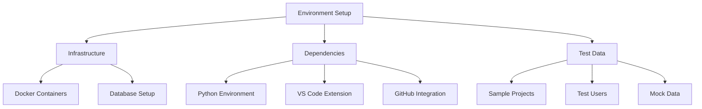
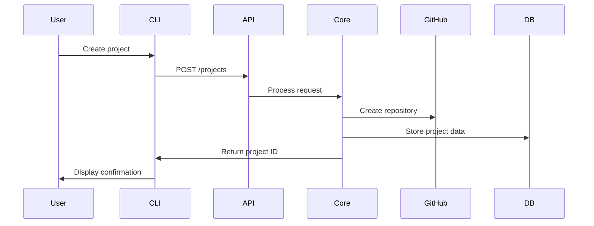
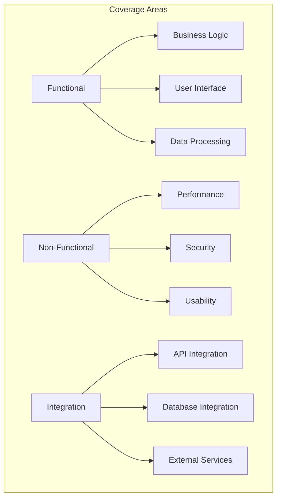
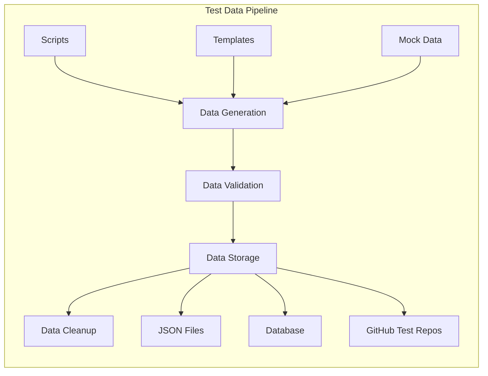
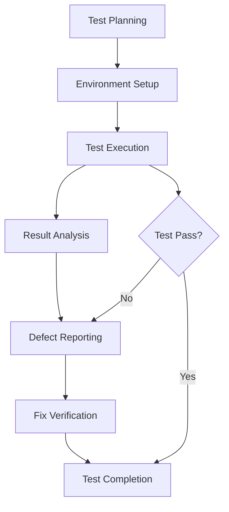
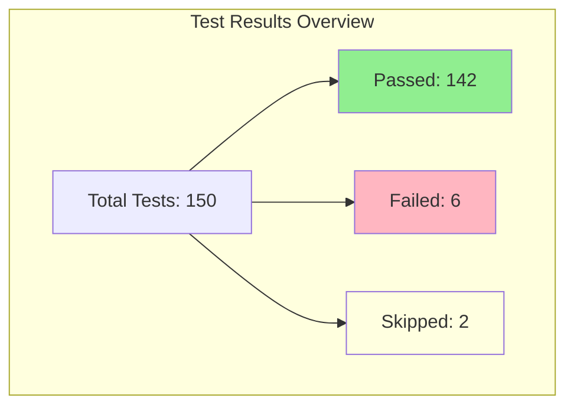
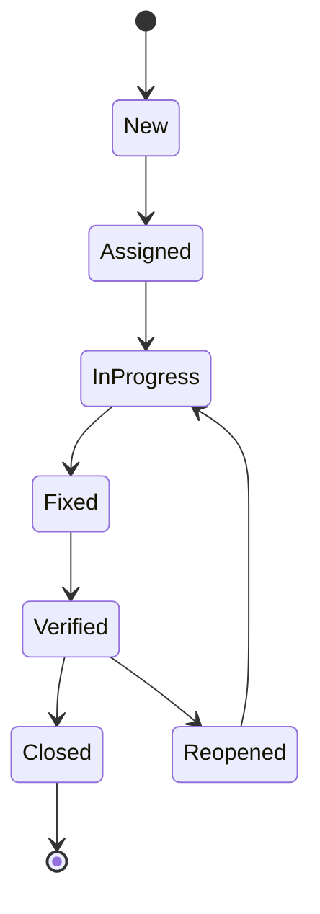
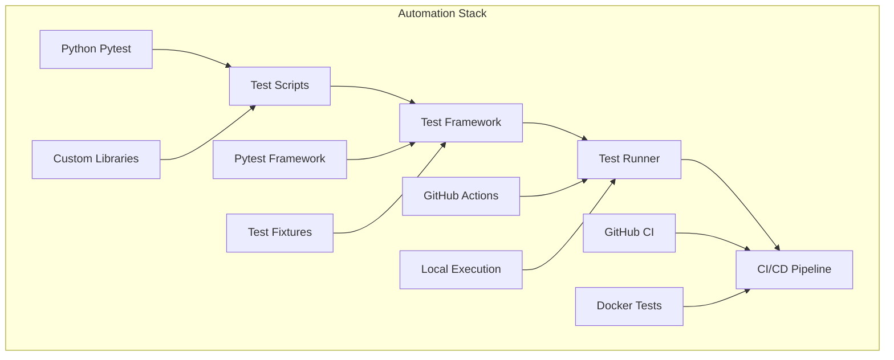

# System Tests Documentation

## Overview

This document provides comprehensive guidance for system testing of the AutoProjectManagement system. System tests validate the complete and integrated software product to ensure it meets specified requirements, both functional and non-functional.

## Table of Contents

1. [Test Scope](#test-scope)
2. [Test Architecture](#test-architecture)
3. [Test Environment](#test-environment)
4. [Test Scenarios](#test-scenarios)
5. [Test Cases](#test-cases)
6. [Test Data](#test-data)
7. [Test Execution](#test-execution)
8. [Test Results](#test-results)
9. [Defect Management](#defect-management)
10. [Automation Framework](#automation-framework)

## Test Scope

### In-Scope Components

| Component Category | Components | Test Focus |
|-------------------|------------|------------|
| **Core Modules** | Project Management System, Task Workflow Management, Resource Management | End-to-end workflows |
| **Integration Points** | GitHub API, JSON Database, VS Code Extension | Data flow validation |
| **User Interfaces** | CLI Interface, API Endpoints, VS Code Extension UI | User interaction flows |
| **Data Processing** | Data Collection, Progress Reporting, Quality Commit Management | Data integrity and accuracy |

### Out-of-Scope Components

- Unit-level component testing
- Third-party service reliability (GitHub, VS Code)
- Performance benchmarking beyond defined thresholds

## Test Architecture

### System Test Architecture Diagram



### Test Layer Architecture



## Test Environment

### Environment Configuration

| Environment | Purpose | Configuration | Access |
|-------------|---------|---------------|---------|
| **SIT** | System Integration Testing | Full system stack | Internal team |
| **UAT** | User Acceptance Testing | Production-like | Stakeholders |
| **Staging** | Pre-production validation | Production mirror | Limited access |

### Environment Setup Requirements



## Test Scenarios

### Critical Business Scenarios

| Scenario ID | Scenario Name | Priority | Description |
|-------------|---------------|----------|-------------|
| **SYS-001** | Project Creation Workflow | High | Complete project setup from CLI to GitHub |
| **SYS-002** | Task Lifecycle Management | High | Full task workflow from creation to completion |
| **SYS-003** | Resource Allocation | High | Assign and manage resources across projects |
| **SYS-004** | Progress Reporting | Medium | Generate and validate progress reports |
| **SYS-005** | GitHub Integration | High | Sync data between system and GitHub |

### Scenario Flow Diagram



## Test Cases

### Test Case Structure

Each test case follows this template:

```yaml
test_case:
  id: SYS-XXX
  title: "Descriptive test name"
  priority: High/Medium/Low
  type: Functional/Non-functional/Regression
  preconditions:
    - List of required setup steps
  steps:
    - Step 1: Action
    - Step 2: Expected result
  expected_results:
    - Expected outcome 1
    - Expected outcome 2
  post_conditions:
    - Cleanup actions
```

### Sample Test Cases

#### SYS-001: Project Creation Workflow

| Field | Details |
|-------|---------|
| **Test Case ID** | SYS-001 |
| **Title** | Verify complete project creation workflow |
| **Priority** | High |
| **Type** | Functional |
| **Preconditions** | - GitHub account configured<br>- CLI tool installed<br>- Valid project template available |
| **Test Steps** | 1. Execute `autoproject create --name "TestProject" --template web`<br>2. Verify project structure creation<br>3. Check GitHub repository creation<br>4. Validate JSON database entries |
| **Expected Results** | - Project created successfully<br>- GitHub repository initialized<br>- Database populated with project data<br>- CLI returns success message |
| **Post-conditions** | - Clean up test project<br>- Remove GitHub repository |

### Test Case Coverage Matrix



## Test Data

### Test Data Categories

| Category | Description | Examples | Management |
|----------|-------------|----------|------------|
| **Project Data** | Sample projects for testing | Web apps, APIs, ML projects | JSON templates |
| **User Data** | Test user accounts and permissions | Admin, Developer, Viewer roles | Configuration files |
| **Workflow Data** | Task sequences and dependencies | Sprint planning, bug tracking | CSV/JSON files |
| **Performance Data** | Load testing datasets | Large repositories, many tasks | Generated scripts |

### Test Data Management



## Test Execution

### Execution Strategy

| Phase | Duration | Focus | Success Criteria |
|-------|----------|--------|------------------|
| **Phase 1** | 2 days | Smoke tests | All critical paths functional |
| **Phase 2** | 3 days | Functional tests | 95% test case pass rate |
| **Phase 3** | 2 days | Integration tests | No integration failures |
| **Phase 4** | 1 day | Regression tests | No new defects introduced |

### Execution Workflow



### Execution Commands

```bash
# Run all system tests
pytest tests/code_tests/03_SystemTests/ -v --tb=short

# Run specific test suite
pytest tests/code_tests/03_SystemTests/test_project_workflow.py -v

# Run with coverage
pytest tests/code_tests/03_SystemTests/ --cov=autoprojectmanagement --cov-report=html

# Run performance tests
pytest tests/code_tests/03_SystemTests/test_performance.py --benchmark-only
```

## Test Results

### Result Reporting Format

| Test Run | Date | Environment | Total Tests | Passed | Failed | Skipped | Pass Rate |
|----------|------|-------------|-------------|--------|--------|---------|-----------|
| **Run-001** | 2025-07-27 | SIT | 150 | 142 | 6 | 2 | 94.7% |
| **Run-002** | 2025-07-28 | UAT | 150 | 148 | 1 | 1 | 98.7% |

### Result Dashboard



## Defect Management

### Defect Lifecycle



### Defect Severity Levels

| Severity | Description | Examples | SLA |
|----------|-------------|----------|-----|
| **Critical** | System crash, data loss | GitHub sync failure | 24 hours |
| **High** | Major functionality broken | Task workflow error | 48 hours |
| **Medium** | Minor functionality issue | UI display problem | 1 week |
| **Low** | Cosmetic issues | Text formatting | Next release |

## Automation Framework

### Automation Architecture



### Key Automation Components

| Component | Technology | Purpose | Status |
|-----------|------------|---------|--------|
| **Test Framework** | Pytest | Test execution | ✅ Implemented |
| **Test Data** | JSON/YAML templates | Data management | ✅ Implemented |
| **Mock Services** | pytest-mock | External service simulation | ✅ Implemented |
| **Reporting** | pytest-html | Test reports | ✅ Implemented |
| **CI/CD** | GitHub Actions | Automated testing | ✅ Implemented |

## Best Practices

### Test Design Principles

1. **Independence**: Each test should be independent of others
2. **Repeatability**: Tests should produce consistent results
3. **Clarity**: Test cases should be easy to understand
4. **Maintainability**: Tests should be easy to update
5. **Comprehensive**: Cover all critical business scenarios

### Naming Conventions

- Test files: `test_<module>_<scenario>.py`
- Test functions: `test_<action>_<expected_result>()`
- Test classes: `Test<ClassName><Scenario>`
- Test data: `<scenario>_test_data.json`

## Maintenance

### Regular Maintenance Tasks

| Frequency | Task | Owner | Tools |
|-----------|------|--------|--------|
| **Weekly** | Review failed tests | QA Lead | Test reports |
| **Monthly** | Update test cases | Test Team | Test management |
| **Quarterly** | Performance review | Dev Team | Benchmarking |
| **Release** | Regression suite update | QA Team | Test automation |

### Version Control

- All test artifacts stored in Git
- Test data versioned with code
- Test results archived for 90 days
- Documentation updated with each release

## Contact Information

| Role | Contact | Responsibility |
|------|---------|----------------|
| **QA Lead** | qa@company.com | Test strategy and execution |
| **Dev Lead** | dev@company.com | Test environment and fixes |
| **Product Owner** | product@company.com | Test scenario validation |
| **Automation Engineer** | automation@company.com | Test automation and CI/CD |

---

*Last updated: 2025-07-27*  
*Version: 1.0*  
*Next review: 2025-10-27*
