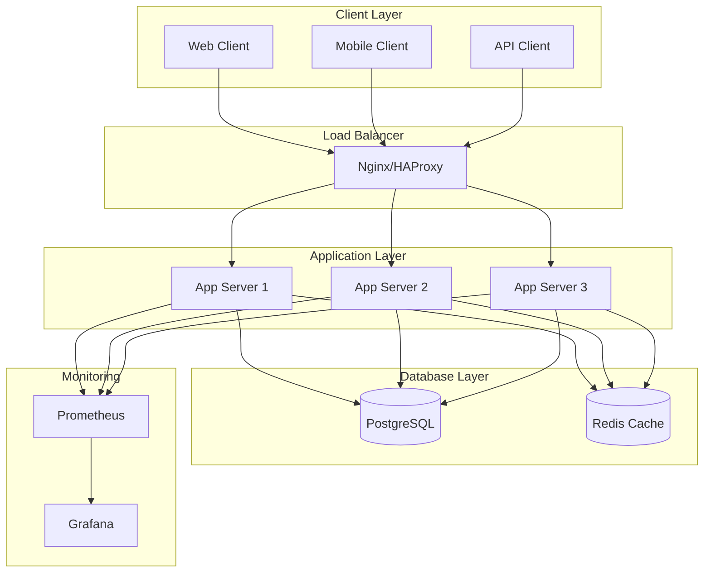
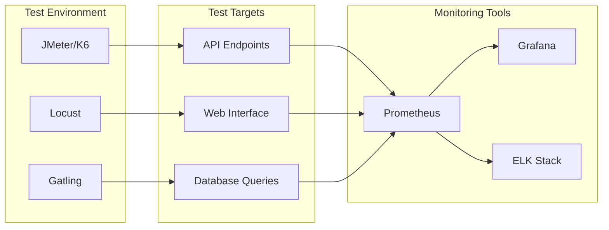
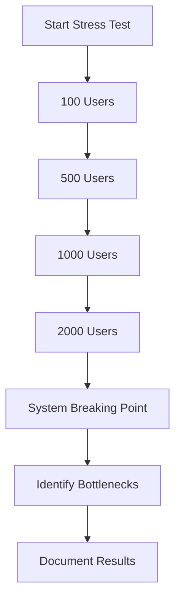
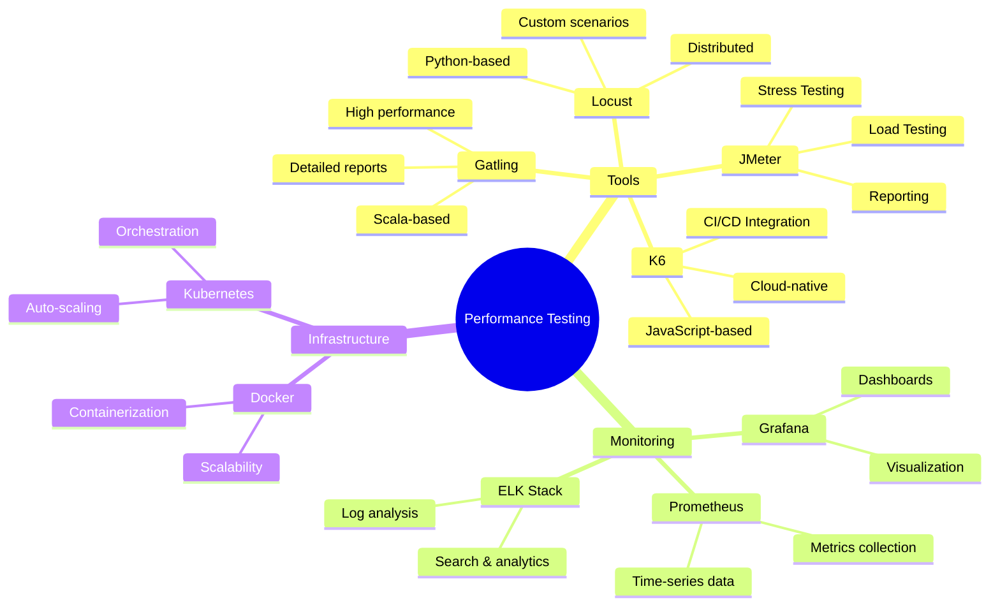
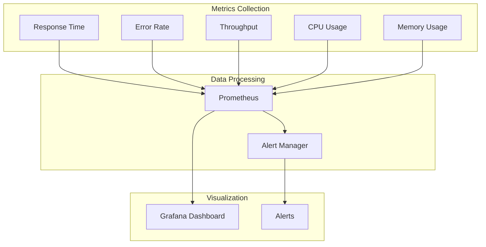
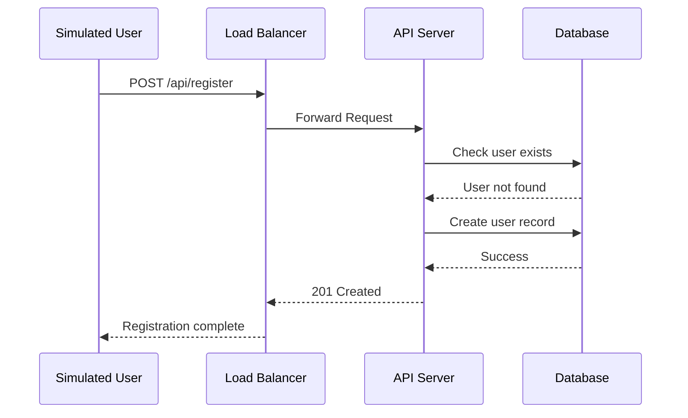
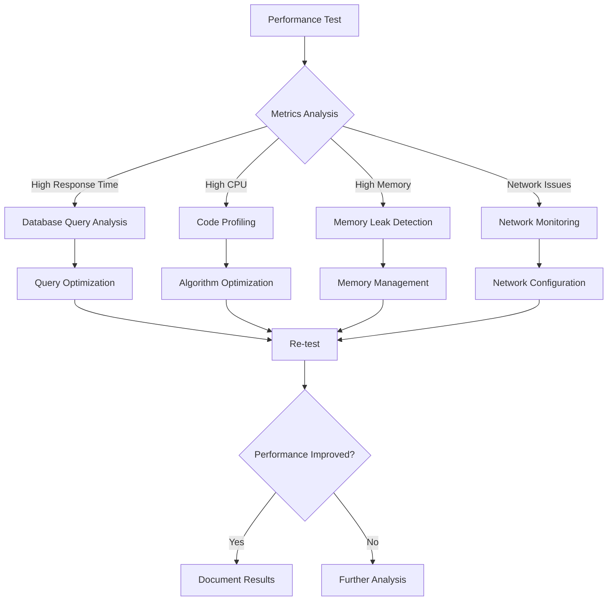
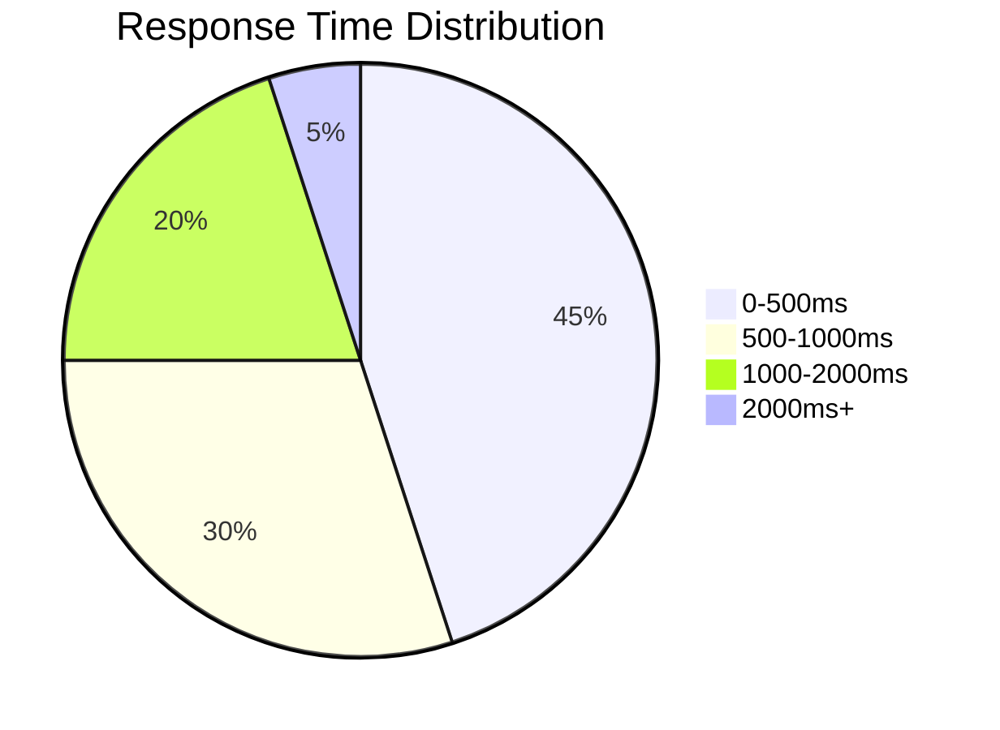
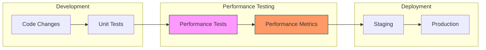

# Performance Testing Documentation

## 📊 Overview

This comprehensive performance testing documentation covers the **AutoProjectManagement** system's performance evaluation strategy, implementation, and monitoring. Our performance tests ensure the system meets scalability, responsiveness, and stability requirements under various load conditions.

---

## 🎯 Test Objectives

| Objective Category | Description | Success Criteria |
|-------------------|-------------|------------------|
| **Scalability** | System's ability to handle increasing load | Support 1000+ concurrent users |
| **Responsiveness** | Response time under various loads | < 2s for 95th percentile |
| **Stability** | System behavior under sustained load | Zero critical failures in 24h |
| **Resource Usage** | CPU, memory, and I/O utilization | < 80% resource usage at peak |
| **Throughput** | Requests processed per second | > 100 requests/second |

---

## 🏗️ System Architecture Overview

### High-Level Architecture


### Performance Test Environment


---

## 📈 Performance Test Types

### 1. Load Testing
**Purpose**: Evaluate system behavior under expected load conditions

| Test Scenario | Users | Duration | Ramp-up | Expected RPS |
|---------------|--------|----------|---------|--------------|
| Normal Load | 100 | 30 min | 5 min | 50 |
| Peak Load | 500 | 1 hour | 10 min | 200 |
| Stress Load | 1000 | 2 hours | 15 min | 400 |

### 2. Stress Testing
**Purpose**: Find system breaking point



### 3. Endurance Testing
**Purpose**: Evaluate system stability over extended periods

| Test Type | Duration | User Load | Focus Areas |
|-----------|----------|-----------|-------------|
| Soak Test | 8 hours | 200 users | Memory leaks |
| Spike Test | 1 hour | 0→500→0 users | Recovery time |
| Volume Test | 4 hours | 1000 users | Data handling |

---

## 🔧 Test Configuration Matrix

### API Endpoints Performance Matrix

| Endpoint | Method | Expected RT (ms) | Max RT (ms) | Throughput (req/s) | Error Rate |
|----------|--------|------------------|-------------|-------------------|------------|
| `/api/projects` | GET | 150 | 500 | 100 | < 0.1% |
| `/api/projects` | POST | 200 | 600 | 50 | < 0.1% |
| `/api/tasks` | GET | 100 | 400 | 200 | < 0.1% |
| `/api/tasks` | POST | 250 | 700 | 75 | < 0.1% |
| `/api/users` | GET | 120 | 450 | 150 | < 0.1% |
| `/api/reports` | GET | 500 | 1500 | 25 | < 0.5% |

### Database Performance Metrics

| Operation | Table | Expected Time | Max Time | Concurrent Users |
|-----------|--------|---------------|----------|------------------|
| SELECT | projects | 50ms | 200ms | 100 |
| INSERT | tasks | 100ms | 300ms | 50 |
| UPDATE | users | 80ms | 250ms | 75 |
| DELETE | tasks | 120ms | 400ms | 25 |
| JOIN | reports | 300ms | 1000ms | 10 |

---

## 🛠️ Test Tools & Framework

### Primary Testing Tools



### Tool Comparison Matrix

| Tool | Language | Learning Curve | Scalability | Best For |
|------|----------|----------------|-------------|----------|
| JMeter | GUI/Java | Medium | High | Traditional load testing |
| K6 | JavaScript | Low | Very High | Developers, CI/CD |
| Locust | Python | Low | High | Custom scenarios |
| Gatling | Scala | High | Very High | High-performance testing |

---

## 📊 Performance Metrics Dashboard

### Real-time Monitoring Dashboard


### Key Performance Indicators (KPIs)

| KPI Category | Metric | Target | Alert Threshold |
|--------------|--------|--------|-----------------|
| **Response Time** | 95th percentile | < 2s | > 3s |
| **Error Rate** | HTTP 5xx errors | < 0.1% | > 1% |
| **Throughput** | Requests/second | > 100 | < 50 |
| **CPU Usage** | Average CPU | < 70% | > 85% |
| **Memory** | Memory usage | < 80% | > 90% |
| **Disk I/O** | Disk utilization | < 70% | > 85% |

---

## 🧪 Test Scenarios & Scripts

### Scenario 1: User Registration Load Test



### Scenario 2: Project Creation Stress Test

```python
# Locust test example
from locust import HttpUser, task, between

class ProjectManagementUser(HttpUser):
    wait_time = between(1, 3)
    
    @task(3)
    def create_project(self):
        self.client.post("/api/projects", json={
            "name": "Test Project",
            "description": "Performance test project"
        })
    
    @task(5)
    def get_projects(self):
        self.client.get("/api/projects")
    
    @task(2)
    def update_project(self):
        self.client.put("/api/projects/1", json={
            "status": "in_progress"
        })
```

---

## 📈 Performance Baselines

### Response Time Baseline Chart

```mermaid
gantt
    title Response Time Baseline by Endpoint
    dateFormat X
    axisFormat %s
    
    section Fast Endpoints
    GET /api/tasks    :0, 100
    GET /api/users    :0, 120
    GET /api/projects :0, 150
    
    section Medium Endpoints
    POST /api/tasks   :0, 250
    POST /api/projects:0, 300
    
    section Slow Endpoints
    GET /api/reports  :0, 500
    POST /api/reports :0, 800
```



### Throughput Comparison

```mermaid
barChart
    title Throughput by Endpoint (requests/second)
    xAxis Endpoint
    yAxis RPS
    series
        "GET /api/tasks": 200
        "GET /api/users": 150
        "GET /api/projects": 100
        "POST /api/tasks": 75
        "POST /api/projects": 50
        "GET /api/reports": 25
```

---

## 🔍 Bottleneck Analysis

### Common Performance Bottlenecks

| Bottleneck Type | Symptoms | Detection Method | Solution |
|-----------------|----------|------------------|----------|
| **Database** | Slow queries, high CPU | Query profiling | Index optimization |
| **Network** | High latency, timeouts | Network monitoring | CDN, caching |
| **Memory** | OOM errors, GC pressure | Memory profiling | Memory optimization |
| **CPU** | High utilization, slow processing | CPU profiling | Code optimization |
| **I/O** | Disk thrashing, slow reads | I/O monitoring | SSD, caching |

### Bottleneck Detection Flow



---

## 🚀 Performance Optimization Strategies

### Database Optimization
- **Indexing Strategy**: Create composite indexes for frequently queried columns
- **Query Optimization**: Use EXPLAIN ANALYZE for query performance analysis
- **Connection Pooling**: Implement connection pooling to reduce overhead
- **Caching**: Implement Redis caching for frequently accessed data

### Application Optimization
- **Code Profiling**: Use cProfile for Python performance analysis
- **Async Processing**: Implement async/await for I/O operations
- **Lazy Loading**: Load data only when needed
- **Compression**: Enable gzip compression for API responses

### Infrastructure Optimization
- **Horizontal Scaling**: Add more application servers
- **Load Balancing**: Use Nginx for load distribution
- **CDN**: Use CloudFlare for static content delivery
- **Auto-scaling**: Implement Kubernetes HPA for automatic scaling

---

## 📋 Test Execution Checklist

### Pre-Test Checklist
- [ ] Test environment provisioned
- [ ] Test data prepared
- [ ] Monitoring tools configured
- [ ] Test scripts validated
- [ ] Baseline measurements captured

### During Test Checklist
- [ ] Monitor real-time metrics
- [ ] Check error rates
- [ ] Verify resource utilization
- [ ] Document anomalies
- [ ] Capture performance snapshots

### Post-Test Checklist
- [ ] Analyze test results
- [ ] Compare against baselines
- [ ] Identify bottlenecks
- [ ] Create optimization plan
- [ ] Update documentation

---

## 📊 Reporting & Documentation

### Performance Test Report Template

| Section | Description |
|---------|-------------|
| **Executive Summary** | High-level findings and recommendations |
| **Test Environment** | Hardware, software, and network configuration |
| **Test Scenarios** | Detailed description of test cases executed |
| **Results** | Metrics, charts, and analysis |
| **Bottlenecks** | Identified performance issues |
| **Recommendations** | Action items for optimization |
| **Next Steps** | Follow-up testing and monitoring |

### Sample Performance Report Dashboard



---

## 🔄 Continuous Performance Monitoring

### CI/CD Integration



### Automated Performance Gates

| Gate | Metric | Threshold | Action |
|------|--------|-----------|--------|
| **Response Time** | 95th percentile | < 2s | Block merge if exceeded |
| **Error Rate** | HTTP 5xx | < 0.5% | Block merge if exceeded |
| **Throughput** | RPS | > 80% of baseline | Warning if below |

---

## 🆘 Troubleshooting Guide

### Common Issues & Solutions

| Issue | Symptoms | Solution |
|-------|----------|----------|
| **High Response Time** | > 5s response time | Check database queries, add indexes |
| **Memory Leaks** | Increasing memory usage | Use memory profiler, fix leaks |
| **Connection Pool Exhaustion** | Connection timeouts | Increase pool size, optimize connections |
| **CPU Spikes** | 100% CPU usage | Profile code, optimize algorithms |
| **Database Locks** | Deadlocks, timeouts | Optimize transactions, add indexes |

### Performance Debugging Flow

```mermaid
flowchart TD
    Start([Performance Issue]) --> CheckMetrics{Check Metrics}
    CheckMetrics --> ResponseTime{Response Time?}
    CheckMetrics --> ErrorRate{Error Rate?}
    CheckMetrics --> Throughput{Throughput?}
    
    ResponseTime -->|High| QueryAnalysis[Query Analysis]
    ErrorRate -->|High| ErrorLog[Error Log Analysis]
    Throughput -->|Low| ResourceCheck[Resource Check]
    
    QueryAnalysis --> OptimizeQuery[Optimize Queries]
    ErrorLog --> FixErrors[Fix Errors]
    ResourceCheck --> ScaleResources[Scale Resources]
    
    OptimizeQuery & FixErrors & ScaleResources --> ReTest[Re-test]
    ReTest --> {Issue Resolved?}
    
    ReTest -->|Yes| Done([Done])
    ReTest -->|No| DeepAnalysis[Deep Analysis]
    DeepAnalysis --> Done
```

---

## 📞 Support & Contacts

### Performance Testing Team
- **Lead Performance Engineer**: [Your Name]
- **Database Performance Specialist**: [DBA Name]
- **DevOps Performance**: [DevOps Name]
- **Monitoring & Alerting**: [SRE Name]

### Resources
- **Performance Testing Wiki**: [Internal Wiki Link]
- **Monitoring Dashboard**: [Grafana URL]
- **Test Results**: [Test Results Storage]
- **Performance Issues**: [Issue Tracker Link]

---

## 📝 Version History

| Version | Date | Changes | Author |
|---------|------|---------|--------|
| 1.0 | 2025-07-27 | Initial comprehensive performance testing documentation | Performance Team |
| 1.1 | TBD | Add cloud performance testing scenarios | TBD |
| 1.2 | TBD | Include mobile app performance tests | TBD |

---

*This document is maintained by the Performance Testing Team and updated regularly based on test results and system changes.*
