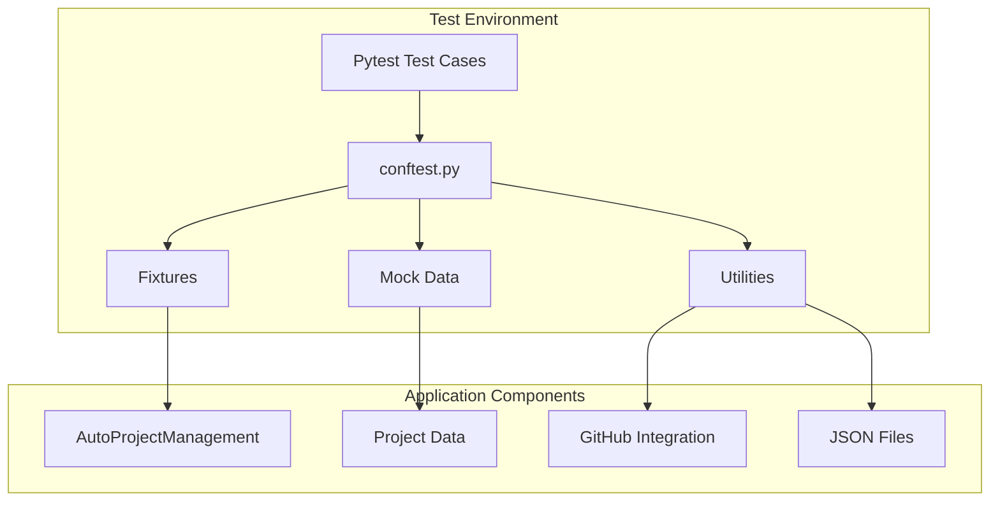
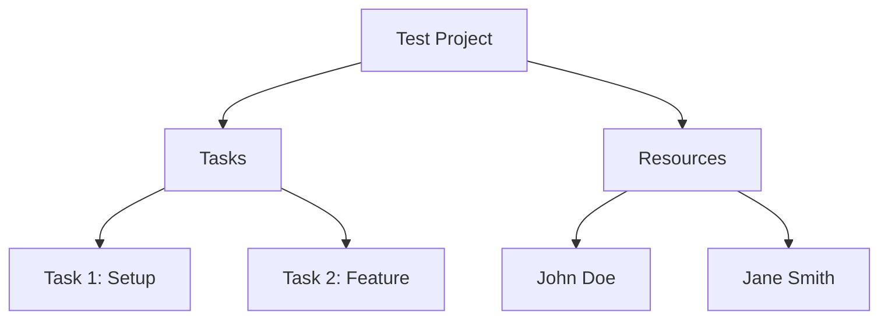
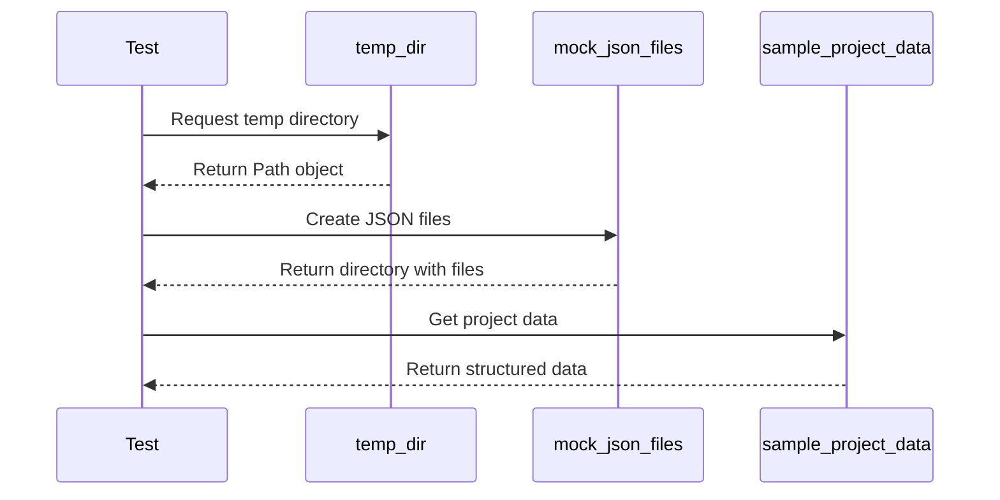
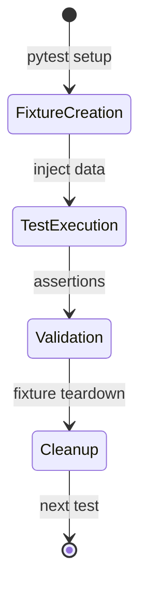
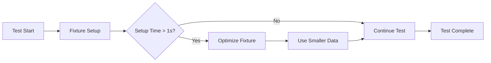

# Pytest Configuration and Fixtures Documentation

## Overview

The `conftest.py` file serves as the central configuration hub for pytest in the AutoProjectManagement test suite. It provides a comprehensive collection of fixtures, mock data, and testing utilities that enable efficient and reliable testing across all test modules.

## Table of Contents

1. [Architecture Overview](#architecture-overview)
2. [Fixture Categories](#fixture-categories)
3. [Detailed Fixture Documentation](#detailed-fixture-documentation)
4. [Usage Patterns](#usage-patterns)
5. [Testing Strategies](#testing-strategies)
6. [Best Practices](#best-practices)
7. [Troubleshooting](#troubleshooting)

## Architecture Overview

### System Architecture Diagram



### Fixture Dependency Graph

```mermaid
graph TD
    temp_dir --> mock_json_files
    sample_project_data --> sample_task_data
    sample_project_data --> sample_resource_data
    mock_config_data --> clean_environment
    mock_github_response --> mock_requests
    sample_task_data --> sample_risk_data
    
    classDef baseFixture fill:#e1f5fe
    classDef dataFixture fill:#fff3e0
    classDef mockFixture fill:#f3e5f5
    
    class temp_dir, clean_environment baseFixture
    class sample_project_data, sample_task_data, sample_resource_data, sample_risk_data dataFixture
    class mock_config_data, mock_github_response, mock_json_files, mock_requests mockFixture
```

## Fixture Categories

### Category Overview Table

| Category | Purpose | Fixtures Count | Primary Usage |
|----------|---------|----------------|---------------|
| **Environment** | Directory and environment setup | 2 | `temp_dir`, `clean_environment` |
| **Data Fixtures** | Sample data for testing | 6 | `sample_project_data`, `sample_task_data`, etc. |
| **Mock Fixtures** | External service mocking | 4 | `mock_github_response`, `mock_requests`, etc. |
| **JSON Fixtures** | File-based test data | 1 | `mock_json_files` |

### Detailed Fixture Documentation

#### 1. Environment Fixtures

##### `temp_dir`
- **Type**: Directory fixture
- **Scope**: Function-level
- **Purpose**: Creates isolated temporary directories for file operations
- **Usage**:
```python
def test_file_operations(temp_dir):
    test_file = temp_dir / "test.json"
    test_file.write_text('{"test": "data"}')
    assert test_file.exists()
```

##### `clean_environment`
- **Type**: Environment fixture
- **Scope**: Function-level
- **Purpose**: Provides clean environment variables for testing
- **Cleans**: AUTO_PROJECT_* and GITHUB_* variables

#### 2. Data Fixtures

##### `sample_project_data`
- **Type**: Complex data structure
- **Purpose**: Complete project data with tasks and resources
- **Structure**:



**Data Schema**:
```json
{
  "project_name": "string",
  "project_id": "string",
  "description": "string",
  "start_date": "date",
  "end_date": "date",
  "status": "enum",
  "tasks": ["array<Task>"],
  "resources": ["array<Resource>"]
}
```

##### `sample_task_data`
- **Type**: Task-specific data
- **Purpose**: Individual task testing
- **Fields**:
  - task_id: Unique identifier
  - title: Task name
  - description: Detailed description
  - priority: high/medium/low
  - status: task status
  - estimated_hours: planned effort
  - actual_hours: actual effort
  - assigned_to: resource assignment

##### `sample_resource_data`
- **Type**: Resource management data
- **Purpose**: Resource allocation testing
- **Key Attributes**:
  - resource_id: Unique identifier
  - name: Resource name
  - role: Job function
  - availability: Percentage availability
  - skills: Technical competencies
  - hourly_rate: Cost per hour

##### `sample_risk_data`
- **Type**: Risk management data
- **Purpose**: Risk assessment testing
- **Risk Matrix**:

| Probability | Impact | Risk Level | Example |
|-------------|---------|------------|---------|
| High | High | Critical | Data breach |
| Medium | High | High | API dependency |
| Low | Medium | Medium | Minor delays |
| Low | Low | Low | Documentation |

#### 3. Mock Fixtures

##### `mock_github_response`
- **Type**: GitHub API mock
- **Purpose**: Simulates GitHub repository responses
- **Response Structure**:
```json
{
  "id": 123456789,
  "name": "repository-name",
  "full_name": "owner/repository",
  "private": false,
  "owner": {"login": "username"},
  "html_url": "https://github.com/owner/repo"
}
```

##### `mock_config_data`
- **Type**: Configuration mock
- **Purpose**: Application configuration testing
- **Sections**:
  - github: GitHub integration settings
  - project: Project-specific configurations
  - notifications: Alert and notification settings

##### `mock_json_files`
- **Type**: File system fixture
- **Purpose**: Creates realistic JSON file structures
- **Generated Files**:
  - `commit_progress.json`: Git commit tracking
  - `detailed_wbs.json`: Work breakdown structure

##### `mock_requests`
- **Type**: HTTP mocking fixture
- **Purpose**: API testing without external dependencies
- **Integration**: Uses `responses` library

## Usage Patterns

### Common Test Patterns

#### 1. Project Data Testing
```python
def test_project_creation(sample_project_data):
    assert sample_project_data["project_name"] == "Test Project"
    assert len(sample_project_data["tasks"]) == 2
```

#### 2. File Operations Testing
```python
def test_json_file_handling(mock_json_files):
    files = list(mock_json_files.glob("*.json"))
    assert len(files) >= 2
```

#### 3. API Testing
```python
def test_github_api(mock_requests, mock_github_response):
    mock_requests.add(
        responses.GET,
        "https://api.github.com/repos/user/test-repo",
        json=mock_github_response,
        status=200
    )
    # Test API call
```

### Fixture Composition

#### Complex Test Setup


## Testing Strategies

### Strategy Matrix

| Test Type | Primary Fixtures | Mock Level | Data Complexity |
|-----------|------------------|------------|-----------------|
| **Unit Tests** | sample_task_data, sample_resource_data | Low | Simple |
| **Integration Tests** | mock_json_files, mock_config_data | Medium | Medium |
| **System Tests** | sample_project_data, mock_requests | High | Complex |
| **Performance Tests** | temp_dir, clean_environment | Variable | Large datasets |

### Test Data Lifecycle



## Best Practices

### 1. Fixture Selection Guide

| Scenario | Recommended Fixtures | Example |
|----------|---------------------|---------|
| **Testing file I/O** | `temp_dir`, `mock_json_files` | Configuration file tests |
| **Testing business logic** | `sample_project_data`, `sample_task_data` | Task management tests |
| **Testing external APIs** | `mock_requests`, `mock_github_response` | GitHub integration tests |
| **Testing resource allocation** | `sample_resource_data` | Resource management tests |

### 2. Performance Considerations

- **Use function scope** for most fixtures to ensure isolation
- **Leverage fixture caching** for expensive setup operations
- **Minimize file system operations** in tests

### 3. Data Validation Patterns

```python
def validate_project_data(data):
    """Validate project data structure."""
    required_fields = ["project_name", "project_id", "tasks", "resources"]
    return all(field in data for field in required_fields)

def test_project_data_validation(sample_project_data):
    assert validate_project_data(sample_project_data)
```

## Troubleshooting

### Common Issues and Solutions

| Issue | Symptom | Solution |
|-------|---------|----------|
| **Fixture conflicts** | Tests interfering with each other | Use function scope fixtures |
| **File permission errors** | Cannot write to temp_dir | Check directory permissions |
| **Mock mismatches** | API calls not matching mocks | Verify URL and parameters |
| **Environment pollution** | Tests affecting each other | Use clean_environment fixture |

### Debug Configuration

```python
# Enable verbose pytest output
pytest -v tests/

# Run specific fixture tests
pytest -k "temp_dir" tests/

# Debug fixture setup
pytest --setup-show tests/
```

### Performance Monitoring



## Extension Guidelines

### Adding New Fixtures

1. **Identify the need**: Determine what test data or setup is missing
2. **Choose scope**: Function, class, module, or session
3. **Implement fixture**: Follow existing patterns
4. **Add documentation**: Update this documentation
5. **Write tests**: Ensure the fixture works correctly

### Example New Fixture

```python
@pytest.fixture
def sample_milestone_data():
    """Sample milestone data for testing."""
    return {
        "milestone_id": "MILE-001",
        "title": "Project Kickoff",
        "description": "Initial project setup complete",
        "due_date": "2024-01-15",
        "status": "completed",
        "completion_percentage": 100
    }
```

## Integration with CI/CD

### GitHub Actions Integration

```yaml
name: Test Suite
on: [push, pull_request]
jobs:
  test:
    runs-on: ubuntu-latest
    steps:
      - uses: actions/checkout@v2
      - name: Run tests with fixtures
        run: |
          pip install -r requirements-dev.txt
          pytest tests/ -v --tb=short
```

## Conclusion

The `conftest.py` file provides a robust foundation for testing the AutoProjectManagement system. By leveraging these fixtures effectively, developers can write comprehensive tests that cover various scenarios while maintaining test isolation and performance.

For questions or contributions to this documentation, please refer to the project's contribution guidelines.
