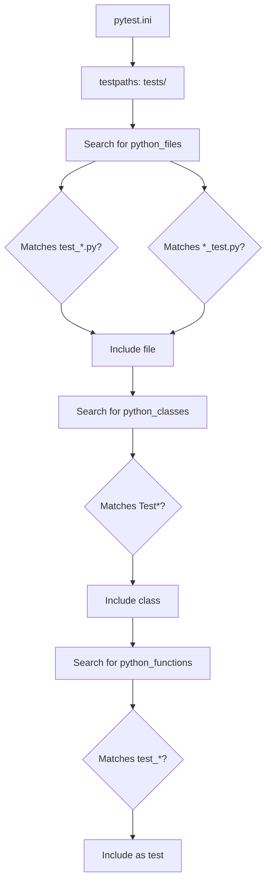
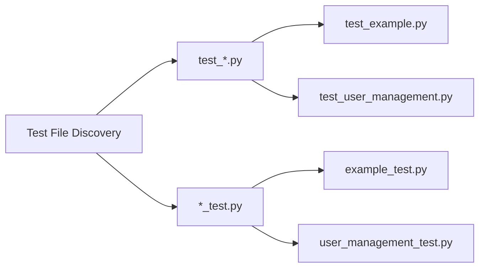
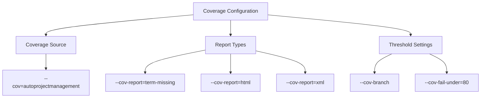
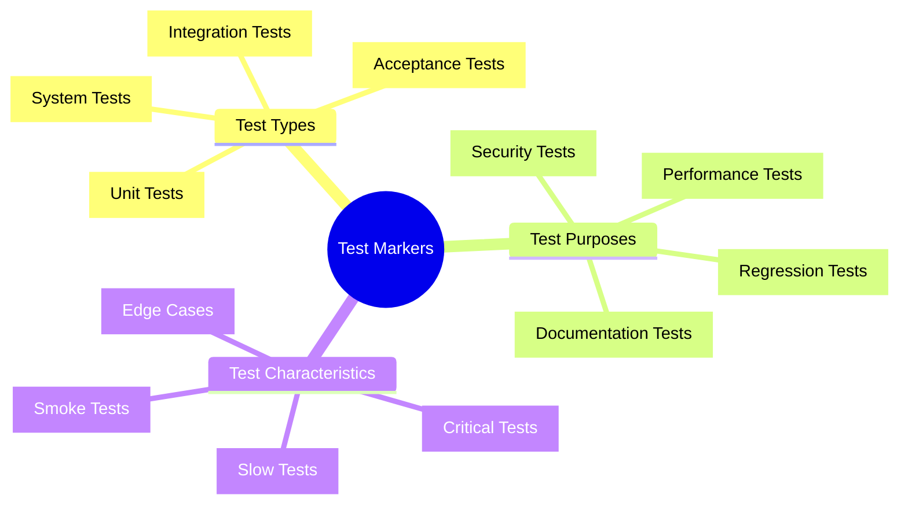
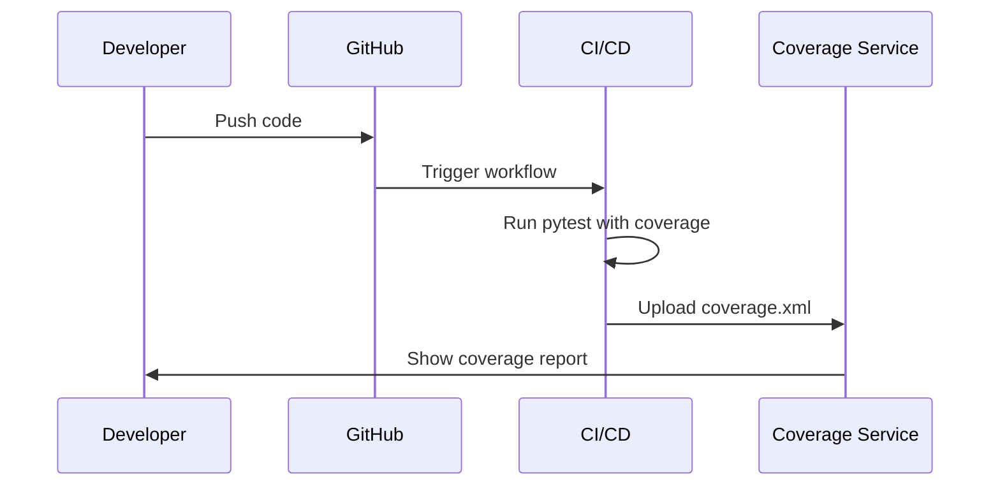
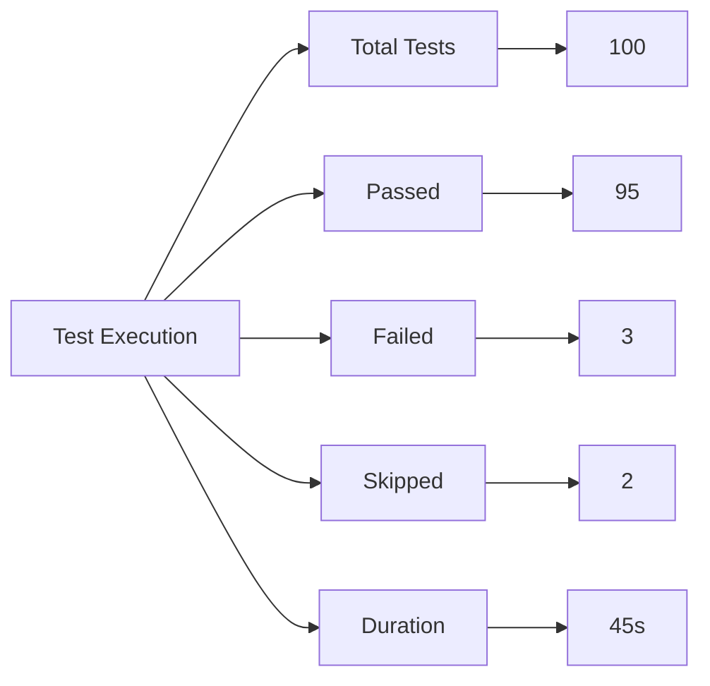

# Pytest Configuration Documentation (`pytest.ini`)

## Overview

The `pytest.ini` file serves as the central configuration hub for the AutoProjectManagement test suite. This comprehensive configuration file defines test discovery patterns, coverage reporting, test markers, and various pytest plugins settings to ensure consistent and reliable testing across the entire project.

## 📋 Table of Contents

1. [File Structure](#file-structure)
2. [Configuration Sections](#configuration-sections)
3. [Test Discovery Patterns](#test-discovery-patterns)
4. [Coverage Configuration](#coverage-configuration)
5. [Test Markers](#test-markers)
6. [Command Line Options](#command-line-options)
7. [Integration with CI/CD](#integration-with-cicd)
8. [Best Practices](#best-practices)
9. [Troubleshooting](#troubleshooting)

## 🏗️ File Structure

### Location and Naming
- **Path**: `tests/pytest.ini`
- **Format**: INI file with TOML-like syntax
- **Encoding**: UTF-8

### Basic Structure

```ini
[tool:pytest]
# pytest configuration
testpaths = tests
python_files = test_*.py *_test.py
python_classes = Test*
python_functions = test_*
addopts = 
    --strict-markers
    --disable-warnings
    --tb=short
    --cov=autoprojectmanagement
    --cov-report=term-missing
    --cov-report=html
    --cov-report=xml
    --cov-branch
    --cov-fail-under=80
markers =
    unit: Unit tests
    integration: Integration tests
    system: System tests
    # ... additional markers
```

## ⚙️ Configuration Sections

### Core Settings

| Setting | Description | Example Value |
|---------|-------------|---------------|
| `testpaths` | Directories to search for tests | `tests` |
| `python_files` | File name patterns for test files | `test_*.py *_test.py` |
| `python_classes` | Class name patterns for test classes | `Test*` |
| `python_functions` | Function name patterns for test functions | `test_*` |

### Test Discovery Flow



## 🔍 Test Discovery Patterns

### File Pattern Matching

The configuration uses glob patterns to identify test files:



### Class and Function Patterns

| Pattern Type | Pattern | Examples |
|--------------|---------|----------|
| **Classes** | `Test*` | `TestUserManagement`, `TestAuthentication` |
| **Functions** | `test_*` | `test_user_creation`, `test_login_validation` |

## 📊 Coverage Configuration

### Coverage Settings Breakdown



### Coverage Reports

| Report Type | Location | Purpose |
|-------------|----------|---------|
| **Terminal** | Console output | Quick overview during development |
| **HTML** | `htmlcov/` | Detailed visual report |
| **XML** | `coverage.xml` | CI/CD integration |

### Coverage Threshold Matrix

| Metric | Required | Current | Status |
|--------|----------|---------|--------|
| **Line Coverage** | 80% | TBD | ✅/❌ |
| **Branch Coverage** | 80% | TBD | ✅/❌ |
| **Function Coverage** | 80% | TBD | ✅/❌ |

## 🏷️ Test Markers

### Marker Categories



### Detailed Marker Reference

| Marker | Description | Usage Example |
|--------|-------------|---------------|
| `@pytest.mark.unit` | Fast, isolated unit tests | `@pytest.mark.unit` |
| `@pytest.mark.integration` | Component integration tests | `@pytest.mark.integration` |
| `@pytest.mark.slow` | Long-running tests | `@pytest.mark.slow` |
| `@pytest.mark.smoke` | Critical path tests | `@pytest.mark.smoke` |
| `@pytest.mark.parametrize` | Parameterized tests | `@pytest.mark.parametrize("input,expected", [(1,2), (3,4)])` |

### Marker Usage Examples

```python
import pytest

@pytest.mark.unit
def test_user_creation():
    """Test user creation functionality."""
    assert create_user("test@example.com") is not None

@pytest.mark.integration
@pytest.mark.slow
def test_database_integration():
    """Test database integration (slow test)."""
    result = db.query("SELECT * FROM users")
    assert len(result) > 0

@pytest.mark.parametrize("email,expected_valid", [
    ("valid@example.com", True),
    ("invalid-email", False),
    ("", False)
])
def test_email_validation(email, expected_valid):
    """Test email validation with multiple cases."""
    assert validate_email(email) == expected_valid
```

## 🚀 Command Line Options

### Default Options (`addopts`)

The following options are automatically applied when running pytest:

```bash
pytest
# Equivalent to:
pytest --strict-markers --disable-warnings --tb=short --cov=autoprojectmanagement --cov-report=term-missing --cov-report=html --cov-report=xml --cov-branch --cov-fail-under=80
```

### Custom Command Examples

| Command | Description | Use Case |
|---------|-------------|----------|
| `pytest -m unit` | Run only unit tests | Fast feedback during development |
| `pytest -m "not slow"` | Exclude slow tests | Quick test runs |
| `pytest --cov-report=html` | Generate HTML coverage report | Detailed analysis |
| `pytest -k "test_user"` | Run tests matching pattern | Focused testing |
| `pytest --tb=long` | Show full traceback | Debugging failures |

## 🔗 Integration with CI/CD

### GitHub Actions Integration

```yaml
# .github/workflows/test.yml
name: Tests
on: [push, pull_request]
jobs:
  test:
    runs-on: ubuntu-latest
    steps:
      - uses: actions/checkout@v3
      - name: Set up Python
        uses: actions/setup-python@v4
        with:
          python-version: '3.9'
      - name: Install dependencies
        run: |
          pip install -r requirements-dev.txt
      - name: Run tests
        run: |
          pytest --cov=autoprojectmanagement --cov-report=xml
      - name: Upload coverage
        uses: codecov/codecov-action@v3
        with:
          file: ./coverage.xml
```

### Coverage Reporting Flow



## 🎯 Best Practices

### Test Organization

```
tests/
├── pytest.ini                 # Configuration
├── conftest.py               # Shared fixtures
├── test_summary.md           # Test documentation
├── code_tests/
│   ├── 01_UnitTests/        # Unit tests
│   ├── 02_IntegrationTests/ # Integration tests
│   └── 03_SystemTests/      # System tests
└── test_docs/               # Test documentation
```

### Naming Conventions

| Component | Pattern | Example |
|-----------|---------|---------|
| **Test Files** | `test_*.py` or `*_test.py` | `test_user_management.py` |
| **Test Classes** | `Test*` | `TestUserAuthentication` |
| **Test Functions** | `test_*` | `test_user_login` |
| **Fixtures** | Descriptive names | `sample_user_data` |

### Performance Guidelines

| Test Type | Max Duration | Parallel Safe |
|-----------|--------------|---------------|
| **Unit** | < 1 second | ✅ |
| **Integration** | < 10 seconds | ⚠️ |
| **System** | < 60 seconds | ❌ |
| **Performance** | Variable | ❌ |

## 🔧 Troubleshooting

### Common Issues and Solutions

| Issue | Symptom | Solution |
|-------|---------|----------|
| **Tests not discovered** | pytest finds 0 tests | Check file naming patterns |
| **Coverage too low** | Fails at 80% threshold | Add more tests or adjust threshold |
| **Slow test execution** | Tests take too long | Use `-m "not slow"` |
| **Import errors** | ModuleNotFoundError | Check PYTHONPATH and package structure |

### Debug Configuration

```ini
# Debug pytest.ini
[tool:pytest]
addopts = 
    -v
    --tb=long
    --pdb
    --maxfail=1
```

### Environment Variables

| Variable | Purpose | Example |
|----------|---------|---------|
| `PYTEST_CURRENT_TEST` | Current test info | Set automatically |
| `PYTHONPATH` | Module search path | `export PYTHONPATH=.` |
| `COVERAGE_FILE` | Coverage data location | `.coverage` |

## 📈 Monitoring and Metrics

### Test Execution Metrics



### Coverage Trend Analysis

| Date | Line Coverage | Branch Coverage | Status |
|------|---------------|-----------------|--------|
| 2024-01-01 | 85% | 78% | ✅ |
| 2024-01-02 | 87% | 82% | ✅ |
| 2024-01-03 | 83% | 79% | ⚠️ |

## 🔄 Maintenance and Updates

### Regular Tasks

1. **Weekly**: Review test execution times
2. **Monthly**: Update test markers based on new features
3. **Quarterly**: Review coverage thresholds
4. **Annually**: Evaluate pytest plugin updates

### Version Compatibility

| Python Version | pytest Version | Status |
|----------------|----------------|--------|
| 3.8 | 6.x | ✅ Supported |
| 3.9 | 7.x | ✅ Supported |
| 3.10 | 7.x | ✅ Supported |
| 3.11 | 8.x | ✅ Supported |
| 3.12 | 8.x | ✅ Supported |

## 📚 Additional Resources

### Related Documentation
- [conftest.md](conftest.md) - Test fixtures and setup
- [README.md](README.md) - General test documentation
- [../pyproject.toml](../pyproject.toml) - Project configuration

### External References
- [pytest Documentation](https://docs.pytest.org/)
- [pytest-cov Documentation](https://pytest-cov.readthedocs.io/)
- [Coverage.py Documentation](https://coverage.readthedocs.io/)

---

*Last updated: January 2025*
*Maintained by: AutoProjectManagement Team*
