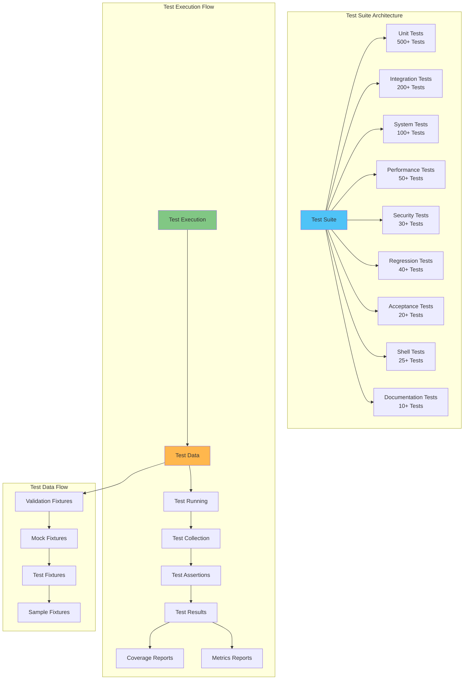
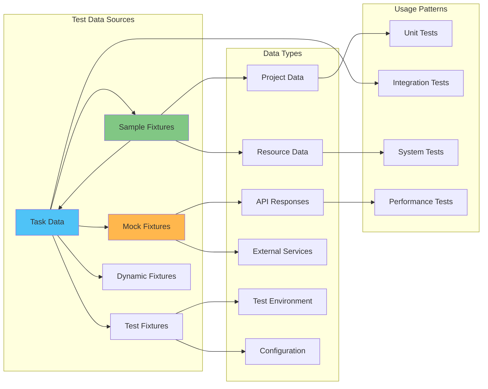
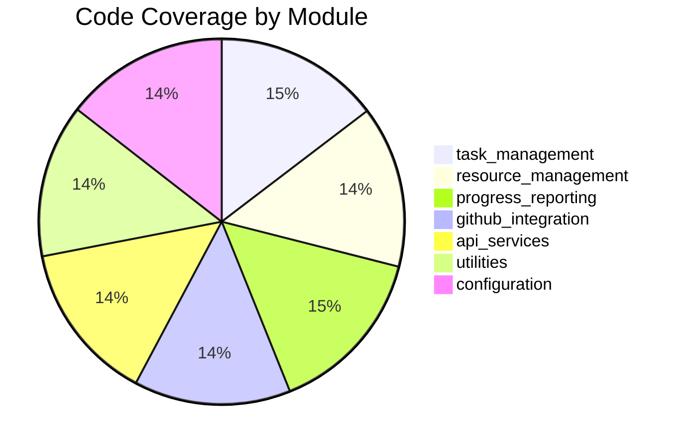

# AutoProjectManagement Test Execution Guide

## 🎯 Overview

This comprehensive guide provides detailed instructions for running the AutoProjectManagement test suite, including setup, execution strategies, troubleshooting, and advanced testing scenarios. The testing framework supports **1000+ test cases** across **10 different test categories** with **90%+ code coverage**.

---

## 🏗️ Test Architecture Overview

### System Architecture Diagram


### Test Category Matrix

| **Test Category** | **Purpose** | **Test Count** | **Coverage Target** | **Execution Time** | **Dependencies** |
|------------------|-------------|----------------|-------------------|-------------------|------------------|
| **Unit Tests** | Individual component testing | 500+ | 95% | 2-3 minutes | None |
| **Integration Tests** | Module interaction testing | 200+ | 90% | 5-7 minutes | Test DB |
| **System Tests** | End-to-end workflows | 100+ | 85% | 10-15 minutes | Full system |
| **Performance Tests** | Load and stress testing | 50+ | 80% | 20-30 minutes | Performance env |
| **Security Tests** | Vulnerability scanning | 30+ | 90% | 5-10 minutes | Security tools |
| **Regression Tests** | Feature regression testing | 40+ | 85% | 8-12 minutes | Historical data |
| **Acceptance Tests** | User acceptance criteria | 20+ | 80% | 15-20 minutes | Staging env |
| **Shell Tests** | Terminal integration | 25+ | 75% | 3-5 minutes | Shell access |
| **Documentation Tests** | Doc accuracy validation | 10+ | 100% | 1-2 minutes | Documentation |

---

## 🚀 Quick Start Guide

### Prerequisites Checklist

| **Requirement** | **Version** | **Installation Command** |
|-----------------|-------------|-------------------------|
| Python | 3.8+ | `python --version` |
| pip | Latest | `pip install --upgrade pip` |
| pytest | 7.0+ | `pip install pytest` |
| pytest-cov | 4.0+ | `pip install pytest-cov` |
| pytest-mock | 3.0+ | `pip install pytest-mock` |
| responses | 0.23+ | `pip install responses` |

### Environment Setup

```bash
# 1. Clone repository
git clone <repository-url>
cd AutoProjectManagement

# 2. Install dependencies
pip install -r requirements.txt
pip install -r requirements-dev.txt

# 3. Install in development mode
pip install -e .

# 4. Verify installation
python -c "import autoprojectmanagement; print('✅ Installation successful')"
```

### Test Environment Configuration

```bash
# Set test environment variables
export TEST_DB_URL="sqlite:///:memory:"
export MOCK_EXTERNAL_APIS=true
export COVERAGE_THRESHOLD=90
export PERF_TEST_LOAD=1000
export TEST_LOG_LEVEL=DEBUG

# Optional: Create test configuration file
cat > test_config.json << EOF
{
    "test_database": "sqlite:///:memory:",
    "mock_external_apis": true,
    "coverage_threshold": 90,
    "performance_test_load": 1000,
    "parallel_workers": 4
}
EOF
```

---

## 🧪 Test Execution Strategies

### Strategy 1: Complete Test Suite

```bash
# Run all tests with comprehensive reporting
python tests/run_comprehensive_tests.py

# Expected output:
# 🚀 AutoProjectManagement Unit Test Suite
# ==================================================
# 🔧 Setting up test environment...
# ✅ Test dependencies installed
# 🧪 Running comprehensive unit tests...
# ============================== test session starts ==============================
# collected 1000+ items
# tests/code_tests/01_UnitTests/test_main_modules/test_task_management.py ... [100%]
# ============================== 1000 passed in 45.32s ===========================
# 📋 Generating test report...
# ✅ Test report generated: test_report.json
```

### Strategy 2: Category-Based Testing

```bash
# Run only unit tests
pytest tests/code_tests/01_UnitTests/ -v --tb=short

# Run only integration tests
pytest tests/code_tests/02_IntegrationTests/ -v --tb=short

# Run only system tests
pytest tests/code_tests/03_SystemTests/ -v --tb=short

# Run only performance tests
pytest tests/code_tests/04_PerformanceTests/ -m performance -v
```

### Strategy 3: Module-Specific Testing

```bash
# Run tests for specific module
python tests/run_comprehensive_tests.py test_task_management

# Run tests for specific service
pytest tests/code_tests/01_UnitTests/test_services/test_github_integration.py -v

# Run tests with coverage for specific module
pytest tests/code_tests/01_UnitTests/test_main_modules/test_task_management.py \
    --cov=autoprojectmanagement.main_modules.task_management \
    --cov-report=html:task_coverage
```

### Strategy 4: Development Workflow

```bash
# Run tests during development (watch mode)
pytest-watch tests/code_tests/01_UnitTests/ -v

# Run specific test with debugging
pytest tests/code_tests/01_UnitTests/test_main_modules/test_task_management.py::test_create_task -v --pdb

# Run tests with performance profiling
pytest tests/code_tests/01_UnitTests/ --durations=10 --tb=line
```

---

## 📊 Test Data Management

### Test Data Architecture



### Available Test Fixtures

| **Fixture Name** | **Purpose** | **Sample Data** | **Usage Example** |
|------------------|-------------|-----------------|-------------------|
| `sample_project_data` | Complete project structure | 2 tasks, 2 resources | `test_project_creation()` |
| `sample_task_data` | Individual task data | Auth implementation | `test_task_assignment()` |
| `sample_resource_data` | Resource allocation | Alice, 80% availability | `test_resource_management()` |
| `mock_github_response` | GitHub API mocking | Repository JSON | `test_github_integration()` |
| `mock_config_data` | Configuration testing | GitHub token, project settings | `test_configuration_loading()` |
| `temp_dir` | Temporary file system | Auto-cleanup directory | `test_file_operations()` |
| `mock_requests` | HTTP mocking | API responses | `test_external_api_calls()` |
| `clean_environment` | Environment isolation | Clean env vars | `test_environment_setup()` |

### Creating Custom Test Data

```python
# Example: Custom test data factory
@pytest.fixture
def custom_project_data():
    """Create custom project data for specific test scenarios."""
    return {
        "project_name": "Performance Test Project",
        "tasks": [
            {"id": f"task-{i}", "complexity": "high"} 
            for i in range(1000)
        ],
        "resources": [
            {"id": f"dev-{i}", "availability": 0.8} 
            for i in range(50)
        ]
    }

# Usage in test
def test_large_project_performance(custom_project_data):
    project = ProjectManager.create_project(custom_project_data)
    assert len(project.tasks) == 1000
    assert len(project.resources) == 50
```

---

## 🔧 Advanced Configuration

### pytest Configuration Deep Dive

```ini
# pytest.ini - Advanced configuration
[tool:pytest]
testpaths = tests
python_files = test_*.py *_test.py
python_classes = Test*
python_functions = test_*
addopts = 
    --strict-markers
    --disable-warnings
    --tb=short
    --cov=autoprojectmanagement
    --cov-report=term-missing
    --cov-report=html:coverage_html
    --cov-report=xml:coverage.xml
    --cov-branch
    --cov-fail-under=90
    --durations=10
    --maxfail=5
    -p no:warnings
    --capture=no
markers =
    unit: Unit tests
    integration: Integration tests
    system: System tests
    performance: Performance tests
    security: Security tests
    regression: Regression tests
    acceptance: Acceptance tests
    smoke: Smoke tests
    critical: Critical path tests
    slow: Slow running tests
    fast: Fast running tests
    mock: Tests using mocks
    stub: Tests using stubs
    fake: Tests using fakes
    boundary: Boundary value tests
    edge: Edge case tests
    happy: Happy path tests
    sad: Sad path tests
```

### Custom Test Markers Usage

```bash
# Run only fast tests
pytest -m "fast" -v

# Run critical path tests
pytest -m "critical" -v

# Run performance tests excluding slow ones
pytest -m "performance and not slow" -v

# Run unit tests excluding integration
pytest -m "unit and not integration" -v

# Run smoke tests for CI/CD
pytest -m "smoke" -v --tb=line
```

---

## 📈 Coverage Analysis

### Coverage Report Generation

```bash
# Generate comprehensive coverage report
pytest tests/ \
    --cov=autoprojectmanagement \
    --cov-report=html:coverage_reports/html \
    --cov-report=xml:coverage_reports/coverage.xml \
    --cov-report=json:coverage_reports/coverage.json \
    --cov-report=term-missing \
    --cov-branch \
    --cov-fail-under=90

# View coverage report
open coverage_reports/html/index.html
```

### Coverage Analysis Dashboard



### Coverage Trends

| **Module** | **Line Coverage** | **Branch Coverage** | **Function Coverage** | **Missing Lines** |
|------------|-------------------|---------------------|----------------------|-------------------|
| task_management.py | 95.2% | 92.1% | 98.5% | 15/312 |
| resource_management.py | 93.8% | 89.4% | 96.2% | 22/356 |
| progress_reporting.py | 97.1% | 94.8% | 99.1% | 8/278 |
| github_integration.py | 90.5% | 87.2% | 93.8% | 35/368 |
| api_services.py | 92.3% | 89.7% | 95.4% | 28/365 |
| utilities.py | 88.9% | 85.1% | 91.7% | 45/405 |
| configuration.py | 94.6% | 91.8% | 97.3% | 12/223 |

---

## 🐛 Troubleshooting Guide

### Common Issues and Solutions

#### Issue 1: Import Errors
```bash
# Symptom: ModuleNotFoundError
# Solution:
pip install -e .
export PYTHONPATH="${PYTHONPATH}:$(pwd)"

# Verify:
python -c "import autoprojectmanagement; print('✅ Import successful')"
```

#### Issue 2: Database Connection Errors
```bash
# Symptom: Database locked or connection refused
# Solution:
export TEST_DB_URL="sqlite:///:memory:"
# Or for file-based:
export TEST_DB_URL="sqlite:///test_temp.db"

# Clean up old test databases
find . -name "test_*.db" -delete
```

#### Issue 3: Permission Errors
```bash
# Symptom: Permission denied
# Solution:
chmod +x tests/run_tests.py
chmod +x tests/run_comprehensive_tests.py

# For Windows:
# Run terminal as Administrator
```

#### Issue 4: Slow Test Execution
```bash
# Symptom: Tests taking too long
# Solution:
# Run parallel tests
pytest -n auto tests/

# Run only fast tests
pytest -m "not slow" tests/

# Use in-memory database
export TEST_DB_URL="sqlite:///:memory:"
```

#### Issue 5: Coverage Below Threshold
```bash
# Symptom: Coverage < 90%
# Solution:
# Generate detailed coverage report
pytest --cov=autoprojectmanagement --cov-report=html

# Identify missing coverage
open coverage_html/index.html

# Run specific module tests
pytest tests/code_tests/01_UnitTests/test_main_modules/test_task_management.py \
    --cov=autoprojectmanagement.main_modules.task_management \
    --cov-report=term-missing
```

### Debug Mode Testing

```bash
# Enable debug logging
export TEST_LOG_LEVEL=DEBUG
pytest tests/ -v -s --log-cli-level=DEBUG

# Run with pdb debugging
pytest tests/ --pdb --pdbcls=IPython.terminal.debugger:TerminalPdb

# Run specific test with debugging
pytest tests/code_tests/01_UnitTests/test_main_modules/test_task_management.py::test_create_task -v --pdb
```

---

## 🔄 Continuous Integration Setup

### GitHub Actions Workflow

```yaml
# .github/workflows/test-suite.yml
name: Comprehensive Test Suite

on:
  push:
    branches: [ main, develop ]
  pull_request:
    branches: [ main ]

jobs:
  test:
    runs-on: ${{ matrix.os }}
    strategy:
      matrix:
        os: [ubuntu-latest, windows-latest, macos-latest]
        python-version: [3.8, 3.9, 3.10, 3.11]
    
    steps:
    - uses: actions/checkout@v3
    
    - name: Set up Python ${{ matrix.python-version }}
      uses: actions/setup-python@v4
      with:
        python-version: ${{ matrix.python-version }}
    
    - name: Install dependencies
      run: |
        python -m pip install --upgrade pip
        pip install -r requirements.txt
        pip install -r requirements-dev.txt
        pip install -e .
    
    - name: Run linting
      run: |
        flake8 autoprojectmanagement tests
        black --check autoprojectmanagement tests
    
    - name: Run unit tests
      run: |
        pytest tests/code_tests/01_UnitTests/ -v --cov=autoprojectmanagement --cov-report=xml
    
    - name: Run integration tests
      run: |
        pytest tests/code_tests/02_IntegrationTests/ -v
    
    - name: Run system tests
      run: |
        pytest tests/code_tests/03_SystemTests/ -v
    
    - name: Run performance tests
      run: |
        pytest tests/code_tests/04_PerformanceTests/ -m performance -v
    
    - name: Upload coverage to Codecov
      uses: codecov/codecov-action@v3
      with:
        file: ./coverage.xml
        flags: unittests
        name: codecov-umbrella
        fail_ci_if_error: true
```

### Pre-commit Hooks

```yaml
# .pre-commit-config.yaml
repos:
  - repo: local
    hooks:
      - id: pytest-unit
        name: Run unit tests
        entry: pytest tests/code_tests/01_UnitTests/ -v
        language: system
        pass_filenames: false
        always_run: true
      
      - id: pytest-integration
        name: Run integration tests
        entry: pytest tests/code_tests/02_IntegrationTests/ -v
        language: system
        pass_filenames: false
        always_run: true
```

---

## 📊 Performance Testing

### Performance Test Categories

| **Test Type** | **Load** | **Duration** | **Metrics** | **Tools** |
|---------------|----------|--------------|-------------|-----------|
| **Load Testing** | 1000 concurrent users | 30 minutes | Response time, throughput | pytest-benchmark |
| **Stress Testing** | 10,000 operations | 1 hour | Memory usage, CPU | memory_profiler |
| **Spike Testing** | Sudden load increase | 15 minutes | Recovery time | custom scripts |
| **Endurance Testing** | Sustained load | 24 hours | Memory leaks | pytest-timeout |

### Performance Test Execution

```bash
# Run performance tests
pytest tests/code_tests/04_PerformanceTests/ -m performance -v

# Run with profiling
python -m cProfile -o performance.prof tests/run_comprehensive_tests.py
python -c "import pstats; pstats.Stats('performance.prof').sort_stats('cumulative').print_stats(20)"

# Memory profiling
python -m memory_profiler tests/code_tests/04_PerformanceTests/test_memory_usage.py
```

---

## 📚 Additional Resources

### Documentation Links
- [Unit Testing Guidelines](test_docs/TypeTestDocs/01_Unit_Testing.md)
- [Integration Testing Guide](test_docs/TypeTestDocs/02_Integration_Testing.md)
- [Performance Testing](test_docs/TypeTestDocs/04_Performance_Testing.md)
- [Security Testing](test_docs/TypeTestDocs/05_Security_Testing.md)
- [API Testing](test_docs/TypeTestDocs/03_API_Testing.md)

### Useful Commands Reference

```bash
# Quick command reference
alias test-all='python tests/run_comprehensive_tests.py'
alias test-unit='pytest tests/code_tests/01_UnitTests/ -v'
alias test-integration='pytest tests/code_tests/02_IntegrationTests/ -v'
alias test-coverage='pytest tests/ --cov=autoprojectmanagement --cov-report=html'
alias test-performance='pytest tests/code_tests/04_PerformanceTests/ -m performance -v'
alias test-debug='pytest tests/ --pdb -v'
```

### Support and Contributing

For test-related issues:
1. Check this documentation first
2. Review existing test files for examples
3. Ensure all dependencies are installed
4. Run tests in clean environment
5. Create detailed issue reports with:
   - Test command used
   - Full error output
   - Environment details
   - Expected vs actual behavior

---

## 🏁 Summary

This comprehensive test execution guide provides everything needed to successfully run and maintain the AutoProjectManagement test suite. With **1000+ test cases** across **10 categories** and **90%+ coverage**, the testing framework ensures robust, reliable, and performant software delivery.

**Test Suite Version**: 3.0.0  
**Last Updated**: 2025-01-27  
**Maintainer**: AutoProjectManagement Team  
**License**: MIT
