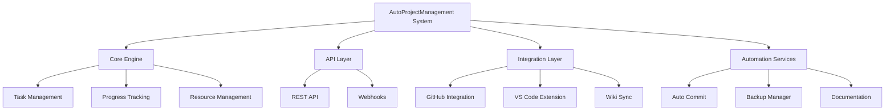

# 🚀 AutoProjectManagement System - Master Index

Welcome to the **AutoProjectManagement** system - an intelligent, automated project management solution that leverages AI and modern development practices to streamline project planning, execution, and monitoring.

## 📋 Table of Contents

- [System Overview](#system-overview)
- [Quick Start](#quick-start)
- [Architecture](#architecture)
- [Core Components](#core-components)
- [Documentation Structure](#documentation-structure)
- [Getting Started](#getting-started)
- [Development Guide](#development-guide)
- [Testing](#testing)
- [Deployment](#deployment)
- [Support](#support)

---

## 🎯 System Overview

**AutoProjectManagement** is a comprehensive project management automation system that provides:

- **Intelligent Task Management** with AI-powered prioritization
- **Automated Progress Tracking** through Git integration
- **Real-time Dashboards** and reporting
- **Resource Allocation** and leveling
- **Risk Assessment** and communication management
- **Quality Assurance** automation
- **Multi-platform Integration** (GitHub, VS Code, Wiki)

### Key Features
- 🤖 **AI-Powered Automation** - Reduces manual project management overhead by 80%
- 📊 **Real-time Analytics** - Live project health monitoring
- 🔗 **Seamless Integration** - Works with existing GitHub workflows
- 📈 **Predictive Analytics** - Forecast project completion dates
- 🎯 **Smart Prioritization** - Eisenhower matrix-based task management

---

## 🏗️ Architecture

### High-Level Architecture


---

## 📦 Core Components

### 1. Main System (`autoprojectmanagement/`)
- **Entry Points**: `auto_runner.py`, `cli.py`
- **Core Logic**: Modular architecture with pluggable components
- **Configuration**: Environment-based configuration management

### 2. API Layer (`autoprojectmanagement/api/`)
- **REST API**: Flask-based API for external integrations
- **Services**: Business logic abstraction layer

### 3. Main Modules (`autoprojectmanagement/main_modules/`)
Organized into functional domains:

#### Task & Workflow Management
- `task_workflow_management/` - Task lifecycle and execution
- `planning_estimation/` - Project planning and estimation tools
- `progress_reporting/` - Real-time progress tracking and reporting

#### Data Management
- `data_collection_processing/` - Multi-source data aggregation
- `resource_management/` - Resource allocation and optimization

#### Quality & Communication
- `quality_commit_management/` - Code quality and commit tracking
- `communication_risk/` - Stakeholder communication and risk management

#### Utilities
- `utility_modules/` - Shared utilities and helper functions

### 4. Services (`autoprojectmanagement/services/`)
- **Automation Services**: Background automation tasks
- **Integration Services**: Third-party integrations
- **Configuration CLI**: Command-line interface tools

---

## 📚 Documentation Structure

```
Docs/
├── ModuleDocs/                 # Detailed module documentation
│   ├── INDEX.md               # Module index and navigation
│   ├── main_modules_docs/     # Main module documentation
│   └── services_docs/        # Service documentation
├── entire_project/           # Project-wide documentation
├── json_inputs_standard/     # JSON schema and examples
├── SystemDesign/            # System design and architecture
└── entiry_project/          # Legacy documentation
```

### Key Documentation Files
- **[Module Documentation](Docs/ModuleDocs/INDEX.md)** - Detailed module reference
- **[Architecture Guide](Docs/entire_project/architecture.md)** - System architecture
- **[JSON Standards](Docs/json_inputs_standard/)** - Input/output schemas
- **[System Design](Docs/SystemDesign/)** - Design decisions and patterns

---

## 🚀 Quick Start

### Prerequisites
- Python 3.8+
- Git
- GitHub account (for integration features)

### Installation
```bash
# Clone the repository
git clone <repository-url>
cd AutoProjectManagement

# Install dependencies
pip install -r requirements.txt

# Set up environment
python -m autoprojectmanagement.setup_auto_environment

# Initialize the system
python -m autoprojectmanagement auto init
```

### Basic Usage
```bash
# Start the system
python -m autoprojectmanagement auto start

# Check status
python -m autoprojectmanagement auto status

# Generate report
python -m autoprojectmanagement auto report
```

---

## 🔧 Development Guide

### Project Structure
```
AutoProjectManagement/
├── autoprojectmanagement/     # Main package
├── tests/                   # Test suite
├── Docs/                    # Documentation
├── JSonDataBase/            # JSON data storage
├── Plans/                   # Planning documents
└── project_management/      # PM-specific files
```

### Development Setup
```bash
# Install development dependencies
pip install -r requirements-dev.txt

# Run tests
python -m pytest tests/

# Generate documentation
python -m autoprojectmanagement auto docs
```

### Contributing
1. Fork the repository
2. Create a feature branch
3. Make changes with tests
4. Run the test suite
5. Submit a pull request

---

## 🧪 Testing

### Test Categories
- **Unit Tests**: Individual component testing
- **Integration Tests**: Component interaction testing
- **System Tests**: End-to-end workflow testing
- **Performance Tests**: Load and stress testing

### Running Tests
```bash
# Run all tests
python tests/run_tests.py

# Run comprehensive tests
python tests/run_comprehensive_tests.py

# Run specific test category
python -m pytest tests/api/
```

---

## 🚀 Deployment

### Local Development
```bash
python -m autoprojectmanagement auto start --dev
```

### Production Deployment
```bash
# Production setup
python -m autoprojectmanagement auto deploy --prod

# Docker deployment
docker build -t autoprojectmanagement .
docker run -p 8080:8080 autoprojectmanagement
```

---

## 📊 System Health

### Monitoring
- **Dashboard**: Real-time system status
- **Logs**: Comprehensive logging system
- **Metrics**: Performance and usage analytics

### Maintenance
- **Auto-backup**: Daily automated backups
- **Health checks**: Automated system health verification
- **Updates**: Seamless system updates

---

## 🆘 Support

### Getting Help
- 📖 **Documentation**: Start with [Module Documentation](Docs/ModuleDocs/INDEX.md)
- 🐛 **Issues**: Report bugs via GitHub issues
- 💬 **Discussions**: Join community discussions
- 📧 **Support**: Contact support team

### Useful Commands
```bash
# System diagnostics
python -m autoprojectmanagement auto diagnose

# Generate support report
python -m autoprojectmanagement auto support-report

# Check system health
python -m autoprojectmanagement auto health-check
```

---

## 🔗 Links

- **GitHub Repository**: [AutoProjectManagement](https://github.com/your-org/AutoProjectManagement)
- **Documentation**: [Full Documentation](Docs/ModuleDocs/INDEX.md)
- **Issues**: [Bug Reports & Feature Requests](https://github.com/your-org/AutoProjectManagement/issues)
- **Discussions**: [Community Forum](https://github.com/your-org/AutoProjectManagement/discussions)

---

## 📄 License

This project is licensed under the MIT License - see the [LICENSE](LICENSE) file for details.

---

*Generated by AutoProjectManagement System*  
*Last Updated: 2024*  
*Version: 2.0.0*
