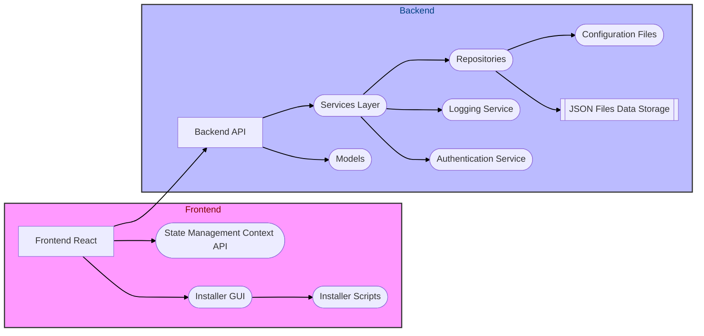
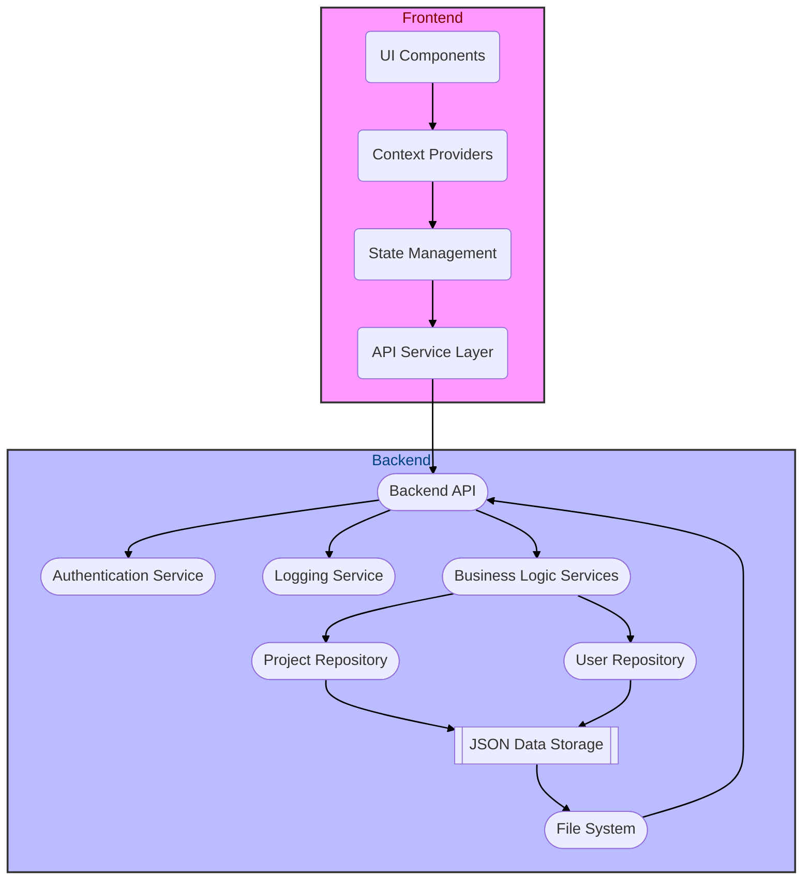
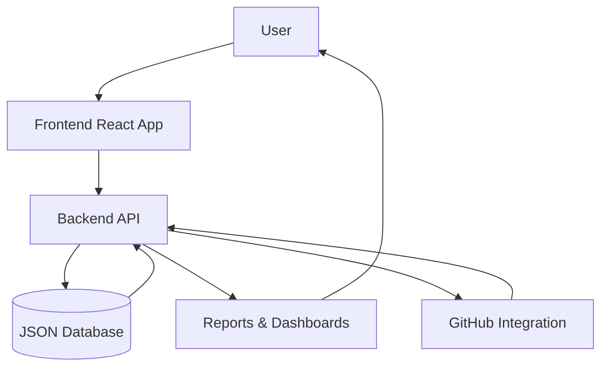
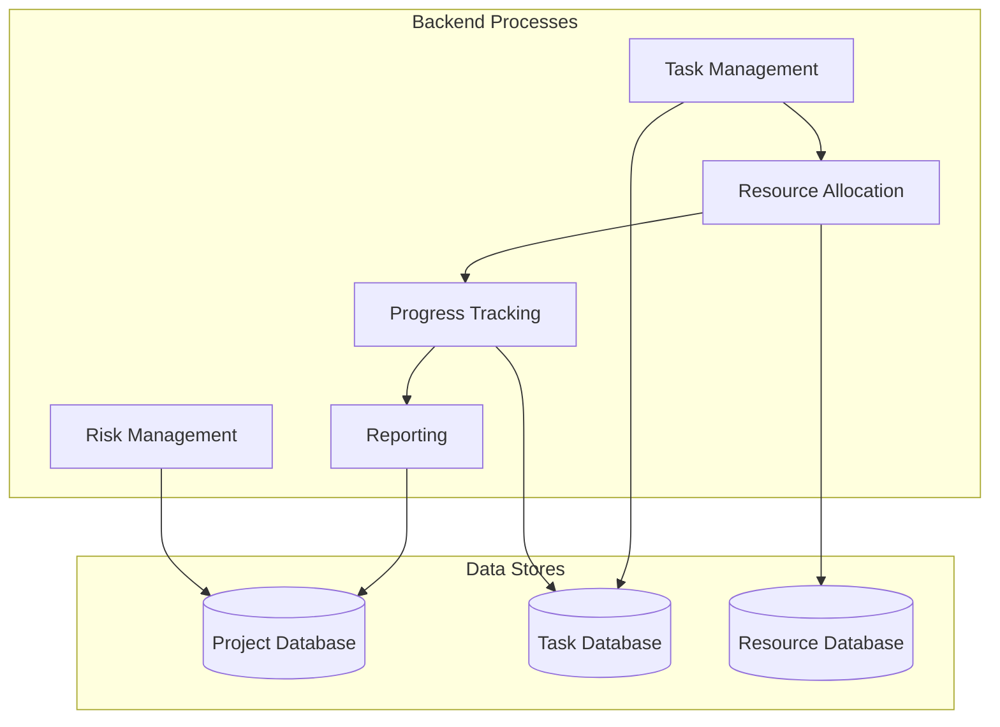
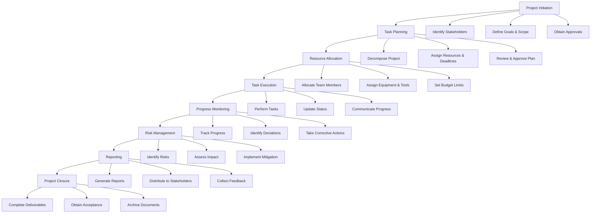
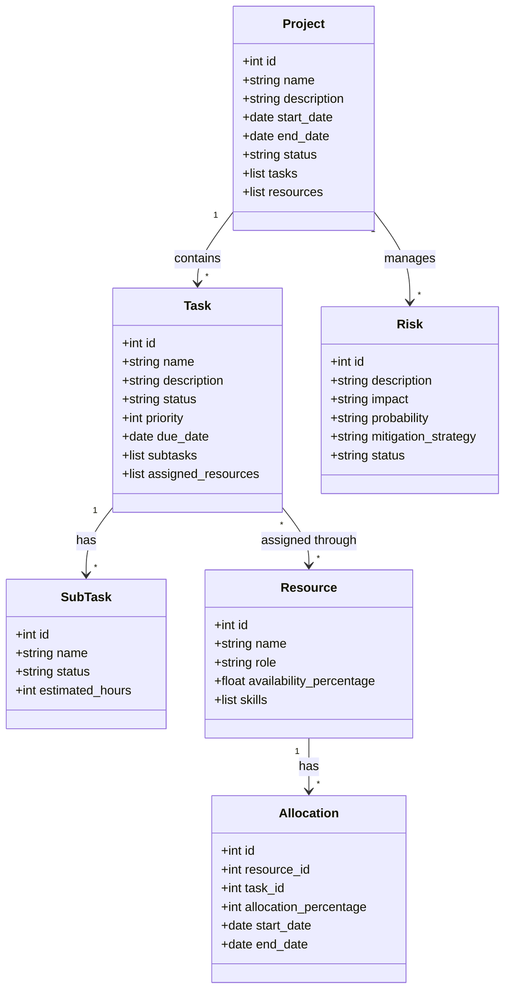

# AutoProjectManagement 🚀

**The Ultimate Zero-Touch Project Management Solution**

AutoProjectManagement is a comprehensive Python package that revolutionizes project management through complete automation. It provides zero-touch project management, automatic task tracking, intelligent workflow optimization, and seamless team collaboration for software development teams.

## 🌟 Key Features

### ✅ **Complete Zero-Touch Project Management**
- **No terminal commands required** - All operations happen automatically
- **Real-time progress tracking** - Progress updated without user interaction
- **Automatic commits** - Changes tracked and committed automatically
- **Risk assessment** - Proactive risk identification and mitigation
- **Automatic reporting** - Reports generated without user intervention

### ✅ **Intelligent Task Management**
- **AI-powered task prioritization** using importance/urgency matrix
- **Automatic resource allocation** based on team capacity and skills
- **Smart scheduling** with resource leveling and conflict resolution
- **Real-time progress calculation** and dashboard updates
- **Automated WBS (Work Breakdown Structure) generation**

### ✅ **Comprehensive Project Views**
- **Interactive Gantt charts** with drag-and-drop functionality
- **Resource allocation dashboards** with visual heat maps
- **Risk management matrices** with automated mitigation strategies
- **Progress tracking** with milestone achievements
- **Team collaboration tools** with automated communication

### ✅ **Advanced Automation Features**
- **Git integration** with automatic progress tracking
- **GitHub Actions automation** for CI/CD pipeline management
- **VS Code extension** for seamless IDE integration
- **JSON-based configuration** for flexible project setup
- **Automated documentation generation**

## 🏗️ System Architecture

### High-Level Architecture Overview



### Detailed System Architecture



## 📊 Data Flow Diagrams

### Level 0 DFD - System Overview



### Level 1 DFD - Detailed Process Flow



## 🔄 BPMN Workflow Diagrams

### Complete Project Management Workflow



## 🏛️ UML Class Diagrams

### Core Domain Model



## 🚀 Quick Start Guide

### Prerequisites
- Python 3.8 or higher
- Node.js 14 or higher
- npm (Node Package Manager)
- Git (optional, for version control)

### Installation Steps

#### 1. Clone the Repository
```bash
git clone https://github.com/autoprojectmanagement/autoprojectmanagement.git
cd autoprojectmanagement
```

#### 2. Setup Python Environment
```bash
python3 -m venv venv
source venv/bin/activate  # On Windows: venv\Scripts\activate
pip install -r requirements.txt
```

#### 3. Install Frontend Dependencies
```bash
cd frontend
npm install
npm run build
cd ..
```

#### 4. Automated Setup (Recommended)
```bash
./setup_env.sh
```

This script will:
- Create and activate Python virtual environment
- Install all Python dependencies
- Install Node.js dependencies
- Build frontend assets
- Start the application

#### 5. Start the Application
```bash
# Start backend API server
./backend_start.sh

# Start frontend server
./frontend_start.sh

# Or use unified startup
./start_all.sh
```

## 📋 Usage Guide

### 1. Initial Project Setup
- Run the installer GUI: `./installer_gui.sh`
- Select project type and configuration
- Upload existing project files (optional)
- Configure team members and resources

### 2. Automatic Project Management
- The system automatically:
  - Creates WBS (Work Breakdown Structure)
  - Assigns tasks based on team capacity
  - Schedules work with resource leveling
  - Tracks progress in real-time
  - Generates reports automatically

### 3. Monitoring Dashboard
- Access the web dashboard at `http://localhost:3000`
- View real-time project status
- Monitor team performance metrics
- Track risks and mitigation strategies

### 4. Git Integration
- Automatic commits for progress updates
- GitHub Actions for CI/CD
- Branch management for features
- Pull request automation

## 📊 JSON Configuration Files

### Project Configuration (`project_config.json`)
```json
{
  "project_name": "Sample Project",
  "project_type": "software_development",
  "start_date": "2024-01-01",
  "end_date": "2024-12-31",
  "team_members": [
    {
      "name": "John Doe",
      "role": "developer",
      "skills": ["Python", "JavaScript", "React"]
    }
  ],
  "milestones": [
    {
      "name": "Phase 1 Complete",
      "date": "2024-03-31",
      "deliverables": ["UI Design", "API Development"]
    }
  ]
}
```

### Task Configuration (`tasks.json`)
```json
{
  "tasks": [
    {
      "id": 1,
      "name": "Setup Development Environment",
      "priority": "high",
      "estimated_hours": 8,
      "assigned_to": "John Doe",
      "dependencies": []
    }
  ]
}
```

## 🔧 Configuration Options

### Environment Variables
```bash
# Database Configuration
DATABASE_PATH=./data/
BACKUP_INTERVAL=3600

# Git Configuration
AUTO_COMMIT=true
COMMIT_INTERVAL=300

# Notification Settings
EMAIL_NOTIFICATIONS=true
SLACK_WEBHOOK_URL=https://hooks.slack.com/...
```

### Custom Scripts
```bash
# Custom automation scripts
./scripts/custom_automation.sh
./scripts/backup_manager.sh
./scripts/report_generator.sh
```

## 🧪 Testing

### Running Tests
```bash
# Run all tests
pytest tests/

# Run specific test categories
pytest tests/unit/
pytest tests/integration/
pytest tests/acceptance/

# Generate test coverage
pytest --cov=autoprojectmanagement tests/
```

### Test Categories
- **Unit Tests**: Individual component testing
- **Integration Tests**: Component interaction testing
- **Acceptance Tests**: End-to-end workflow testing
- **Performance Tests**: Load and stress testing
- **Security Tests**: Vulnerability assessment

## 📈 Monitoring and Logging

### Log Levels
- **INFO**: General operational information
- **WARNING**: Potential issues that don't affect functionality
- **ERROR**: Issues that affect functionality
- **DEBUG**: Detailed debugging information

### Monitoring Dashboard
- Real-time system health
- Performance metrics
- Error rates and trends
- Resource utilization

## 🔒 Security Features

### Authentication & Authorization
- JWT token-based authentication
- Role-based access control (RBAC)
- API key management
- Session timeout handling

### Data Protection
- Input validation and sanitization
- SQL injection prevention
- XSS protection
- Data encryption at rest

### Security Scanning
- Automated vulnerability scanning
- Dependency security checks
- Code security analysis
- Regular security updates

## 📚 Documentation

### Available Documentation
- **User Guide**: `Docs/SystemDesign/Guides/User_Guide.md`
- **Developer Guide**: `Docs/SystemDesign/Guides/Developer_Guidelines.md`
- **API Reference**: `Docs/SystemDesign/Glossary/API_Reference.md`
- **Architecture**: `Docs/entire_project/architecture.md`
- **UML Diagrams**: `Docs/SystemDesign/Diagrams/UML_Diagrams.md`

### API Documentation
- Interactive API documentation at `http://localhost:8000/docs`
- OpenAPI/Swagger specification
- Postman collection available

## 🤝 Contributing

### Development Setup
1. Fork the repository
2. Create feature branch: `git checkout -b feature/amazing-feature`
3. Make changes and add tests
4. Run test suite: `pytest tests/`
5. Commit changes: `git commit -m 'Add amazing feature'`
6. Push to branch: `git push origin feature/amazing-feature`
7. Create Pull Request

### Code Standards
- Follow PEP 8 for Python code
- Use ESLint for JavaScript/React
- Maintain test coverage above 80%
- Document all public APIs
- Include type hints for Python

## 📞 Support

### Getting Help
- **Documentation**: [https://autoprojectmanagement.readthedocs.io](https://autoprojectmanagement.readthedocs.io)
- **Issues**: [GitHub Issues](https://github.com/autoprojectmanagement/autoprojectmanagement/issues)
- **Discussions**: [GitHub Discussions](https://github.com/autoprojectmanagement/autoprojectmanagement/discussions)
- **Community**: [Discord Server](https://discord.gg/autoprojectmanagement)

### Commercial Support
- Enterprise support available
- Custom development services
- Training and workshops
- Consulting services

## 📄 License

This project is licensed under the MIT License - see the [LICENSE](LICENSE) file for details.

## 🏆 Acknowledgments

- Built with ❤️ by the AutoProjectManagement team
- Special thanks to all contributors
- Powered by Python, React, and automation

---

<div align="center">
  <p>
    <strong>AutoProjectManagement</strong> - Making project management effortless through automation
  </p>
  <p>
    <a href="https://autoprojectmanagement.readthedocs.io">Documentation</a> •
    <a href="https://github.com/autoprojectmanagement/autoprojectmanagement">GitHub</a> •
    <a href="https://discord.gg/autoprojectmanagement">Discord</a>
  </p>
</div>
