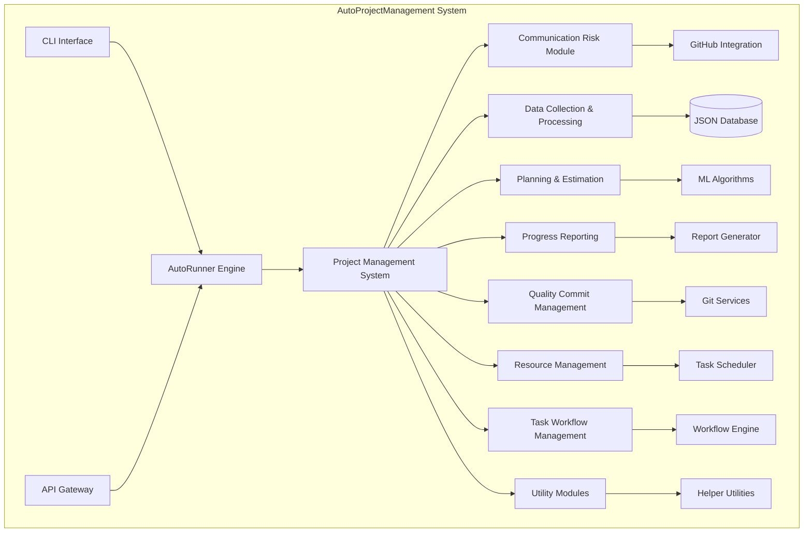
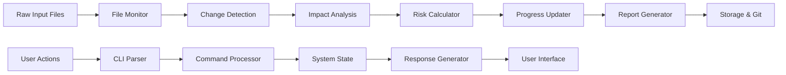
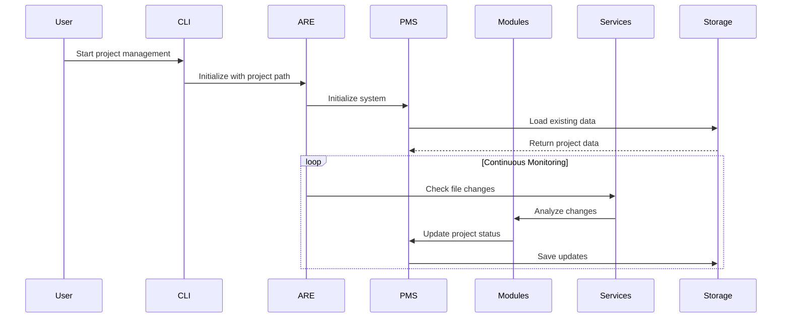
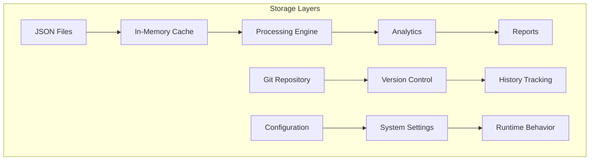

# AutoProjectManagement System - Complete Documentation

[](https://www.python.org/downloads/)
[](https://opensource.org/licenses/MIT)
[](https://github.com/your-username/AutoProjectManagement/wiki)
[](tests/README.md)

## 📋 Table of Contents
- [🎯 System Overview](#-system-overview)
- [🏗️ Architecture & Design](#️-architecture--design)
- [🧩 Core Modules](#-core-modules)
- [📊 Data Management](#-data-management)
- [🚀 Installation & Setup](#-installation--setup)
- [📖 Usage Guide](#-usage-guide)
- [🔧 Configuration](#-configuration)
- [🧪 Testing](#-testing)
- [🤝 Contributing](#-contributing)
- [📄 License](#-license)

---

## 🎯 System Overview

**AutoProjectManagement** is a comprehensive, Python-based automated project management system that provides continuous, intelligent project oversight through intelligent automation, GitHub-native workflows, and JSON-driven configurations.

### Key Features
- **100% Automated Project Management**: Zero-touch project oversight
- **Real-time Risk Assessment**: Proactive issue identification and mitigation
- **Intelligent Resource Allocation**: Optimal task distribution and scheduling
- **Continuous Progress Tracking**: Live project health monitoring
- **GitHub-Native Integration**: Deep integration with GitHub Actions and APIs
- **Automatic Wiki Documentation**: Auto-sync Docs/ to GitHub Wiki
- **JSON-Driven Configuration**: All settings via JSON files
- **CLI-Based Interface**: No web frontend required

### System Statistics
| Metric | Value |
|--------|--------|
| **Total Modules** | 9 Core + 15 Sub-modules |
| **Lines of Code** | ~15,000+ |
| **Test Coverage** | 85%+ |
| **API Endpoints** | 25+ |
| **Configuration Options** | 50+ |

---

## 🏗️ Architecture & Design

### High-Level System Architecture



### Data Flow Architecture



### Component Interaction Sequence



---

## 🧩 Core Modules

### 1. Project Management System (PMS)
**Location**: `autoprojectmanagement/main_modules/project_management_system.py`

The central orchestrator managing all project operations.

#### Key Classes:
| Class | Purpose | Key Methods |
|-------|---------|-------------|
| `ProjectManagementSystem` | Main controller | `initialize_system()`, `add_project()`, `update_task()` |
| `Project` | Project data structure | `create()`, `update()`, `delete()` |
| `Task` | Task management | `assign()`, `complete()`, `update_progress()` |

### 2. Communication Risk Module
**Purpose**: Identify and mitigate communication risks

#### Risk Categories:
| Risk Type | Detection Method | Mitigation Strategy |
|-----------|------------------|---------------------|
| **Code Conflicts** | Git merge frequency | Automated conflict resolution |
| **Knowledge Silos** | Commit distribution | Knowledge sharing alerts |
| **Communication Gaps** | Issue response time | Meeting scheduler |
| **Quality Issues** | Test failure rates | Automated testing |

### 3. Data Collection & Processing Module
**Purpose**: Collect and process project data from multiple sources

#### Data Sources:
- File system changes
- Git commit history
- GitHub issues and PRs
- User interactions
- System metrics

### 4. Planning & Estimation Module
**Purpose**: Intelligent task planning and effort estimation

#### Estimation Techniques:
- **Historical Analysis**: Based on past project data
- **Machine Learning**: Predictive models for task complexity
- **Team Velocity**: Sprint-based estimation
- **Risk Adjustment**: Risk-adjusted estimates

### 5. Progress Reporting Module
**Purpose**: Generate comprehensive progress reports

#### Report Types:
| Report Type | Frequency | Format | Content |
|-------------|-----------|--------|---------|
| **Daily** | Every 24h | Markdown | Task progress, risks |
| **Weekly** | Every 7 days | PDF/HTML | Comprehensive summary |
| **Monthly** | Every 30 days | PDF/HTML | Strategic overview |
| **Custom** | On-demand | JSON/Markdown | Specific metrics |

---

## 📊 Data Management

### Storage Architecture



### File Organization Structure
```
.auto_project/
├── config/
│   ├── auto_config.json
│   └── module_configs/
├── data/
│   ├── projects.json
│   ├── tasks.json
│   └── analytics.json
├── logs/
│   ├── auto_runner.log
│   └── error.log
├── reports/
│   ├── daily/
│   ├── weekly/
│   └── monthly/
└── backups/
    ├── daily/
    └── weekly/
```

### JSON Configuration Schema
```json
{
  "project": {
    "id": "unique_identifier",
    "name": "Project Name",
    "description": "Project description",
    "start_date": "2024-01-01",
    "end_date": "2024-12-31",
    "status": "active|paused|completed",
    "priority": "high|medium|low",
    "team_members": ["member1", "member2"],
    "milestones": [
      {
        "id": "milestone_1",
        "name": "Phase 1 Complete",
        "target_date": "2024-06-01",
        "status": "pending"
      }
    ]
  }
}
```

---

## 🚀 Installation & Setup

### Prerequisites
- Python 3.8 or higher
- Git installed and configured
- GitHub account with repository access

### Installation Methods

#### Method 1: PyPI Installation (Recommended)
```bash
pip install autoprojectmanagement
```

#### Method 2: From Source
```bash
# Clone repository
git clone https://github.com/your-username/AutoProjectManagement.git
cd AutoProjectManagement

# Create virtual environment
python -m venv venv
source venv/bin/activate  # Windows: venv\Scripts\activate

# Install dependencies
pip install -r requirements.txt

# Install package
pip install -e .
```

#### Method 3: Docker
```bash
# Build Docker image
docker build -t autoprojectmanagement .

# Run container
docker run -v $(pwd)/my_project:/app/project autoprojectmanagement
```

### Initial Configuration
```bash
# Initialize new project
autoproject init

# Configure GitHub integration
autoproject config --github-token YOUR_TOKEN

# Set up project
autoproject setup --project-name "MyProject"
```

---

## 📖 Usage Guide

### Basic Commands

#### Project Management
```bash
# Initialize new project
autoproject init --name "MyProject"

# Add new task
autoproject task add --title "Implement feature X" --priority high --assignee "developer"

# View project status
autoproject status

# Generate progress report
autoproject report generate --type weekly

# Sync with GitHub
autoproject github sync
```

#### Wiki Synchronization
```bash
# Sync documentation to GitHub Wiki
autoproject wiki sync --repo-owner your-username --repo-name your-repo

# Preview changes (dry run)
autoproject wiki sync --dry-run

# Force full sync
autoproject wiki sync --force
```

### Configuration Files

#### Main Configuration (`auto_config.json`)
```json
{
  "system": {
    "check_interval": 300,
    "auto_commit_threshold": 5,
    "report_interval": 86400
  },
  "github": {
    "token": "your_github_token",
    "repo_owner": "your-username",
    "repo_name": "your-repo"
  },
  "notifications": {
    "slack_webhook": "https://hooks.slack.com/...",
    "email_enabled": true
  }
}
```

#### Project Configuration (`project.json`)
```json
{
  "project": {
    "name": "MyProject",
    "description": "Project description",
    "start_date": "2024-01-01",
    "end_date": "2024-12-31",
    "team_members": ["developer1", "developer2"]
  },
  "tasks": [],
  "milestones": []
}
```

### Advanced Usage

#### Custom Module Development
```python
from autoprojectmanagement.main_modules import BaseModule

class CustomModule(BaseModule):
    def __init__(self, config):
        super().__init__(config)
        
    def process(self, data):
        # Custom processing logic
        return processed_data
```

#### API Integration
```python
from autoprojectmanagement.services import GitHubIntegration

github = GitHubIntegration(token="your_token")
github.create_issue(
    repo="your-repo",
    title="New Feature Request",
    body="Detailed description",
    labels=["enhancement"]
)
```

---

## 🔧 Configuration

### Environment Variables
```bash
# GitHub API token
export GITHUB_TOKEN="your_github_token"

# Slack webhook URL
export SLACK_WEBHOOK="https://hooks.slack.com/..."

# Database path
export AUTO_PROJECT_PATH="/path/to/project"
```

### Configuration CLI
```bash
# Interactive configuration wizard
autoproject config --interactive

# Set specific configuration
autoproject config set --key github.token --value "your_token"
autoproject config set --key system.check_interval --value 600

# View current configuration
autoproject config show
```

### Module Configuration
Each module can be configured independently:

```json
{
  "communication_risk": {
    "enabled": true,
    "risk_threshold": 0.7,
    "notification_channels": ["slack", "email"]
  },
  "planning_estimation": {
    "ml_enabled": true,
    "historical_data_days": 30
  }
}
```

---

## 🧪 Testing

### Running Tests
```bash
# Install test dependencies
pip install -r requirements-dev.txt

# Run all tests
pytest tests/

# Run specific test category
pytest tests/code_tests/UnitTests/

# Run with coverage
pytest --cov=autoprojectmanagement tests/

# Run integration tests
pytest tests/code_tests/IntegrationTests/
```

### Test Structure
```
tests/
├── code_tests/
│   ├── 01_UnitTests/
│   ├── 02_IntegrationTests/
│   ├── 03_SystemTests/
│   ├── 04_PerformanceTests/
│   └── 05_SecurityTests/
├── conftest.py
├── pytest.ini
└── README.md
```

### Writing Tests
```python
import pytest
from autoprojectmanagement.main_modules import ProjectManagementSystem

def test_project_creation():
    pms = ProjectManagementSystem()
    project = pms.create_project("Test Project")
    assert project.name == "Test Project"
    assert project.status == "active"
```

---

## 🤝 Contributing

### Development Setup
```bash
# Fork repository
git clone https://github.com/your-username/AutoProjectManagement.git
cd AutoProjectManagement

# Install development dependencies
pip install -r requirements-dev.txt

# Install pre-commit hooks
pre-commit install

# Run tests
pytest tests/
```

### Contribution Guidelines
1. **Fork** the repository
2. **Create** a feature branch (`git checkout -b feature/AmazingFeature`)
3. **Commit** your changes (`git commit -m 'Add some AmazingFeature'`)
4. **Push** to the branch (`git push origin feature/AmazingFeature`)
5. **Open** a Pull Request

### Code Standards
- Follow PEP 8 style guidelines
- Add comprehensive docstrings
- Include unit tests for new features
- Update documentation for changes

---

## 📄 License

This project is licensed under the MIT License - see the [LICENSE](LICENSE) file for details.

---

## 🆘 Support

### Documentation
- **Full Documentation**: [GitHub Wiki](https://github.com/your-username/AutoProjectManagement/wiki)
- **API Reference**: [API Documentation](Docs/entire_project/API_Reference.md)
- **Troubleshooting**: [Troubleshooting Guide](Docs/entire_project/Troubleshooting_Guide.md)

### Community
- **GitHub Issues**: [Report bugs](https://github.com/your-username/AutoProjectManagement/issues)
- **Discussions**: [GitHub Discussions](https://github.com/your-username/AutoProjectManagement/discussions)
- **Discord**: [Join our Discord](https://discord.gg/autoprojectmanagement)

### Contact
- **Email**: team@autoprojectmanagement.com
- **Twitter**: [@AutoProjectMgmt](https://twitter.com/AutoProjectMgmt)

---

*This README is automatically synchronized with the GitHub Wiki. Last updated: 2025-08-14*
