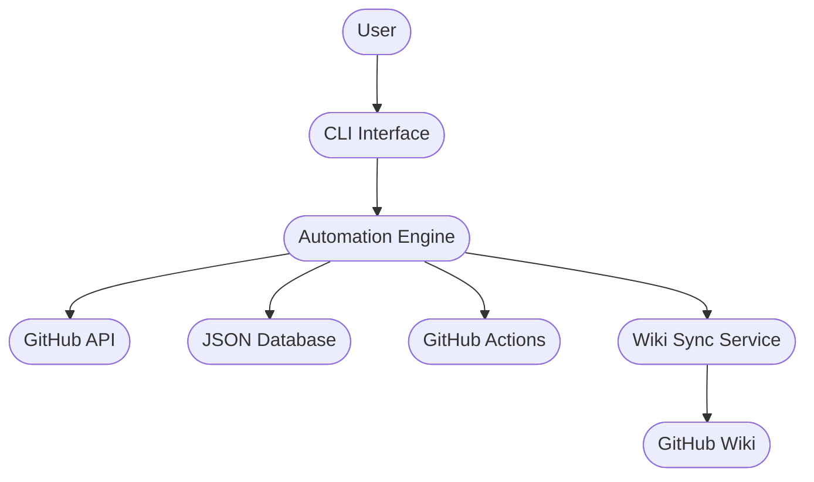
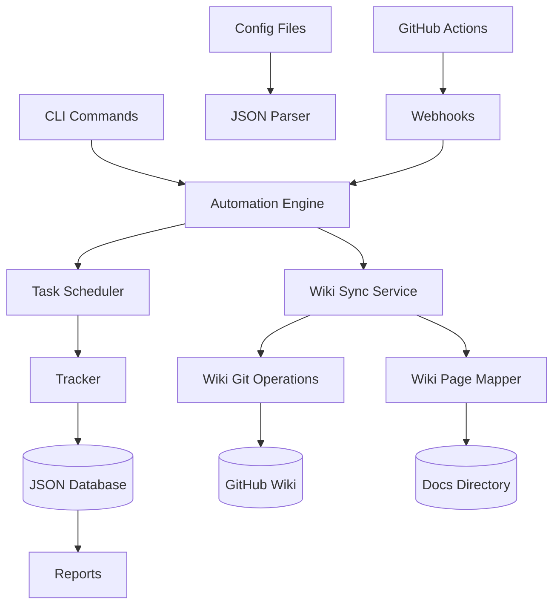
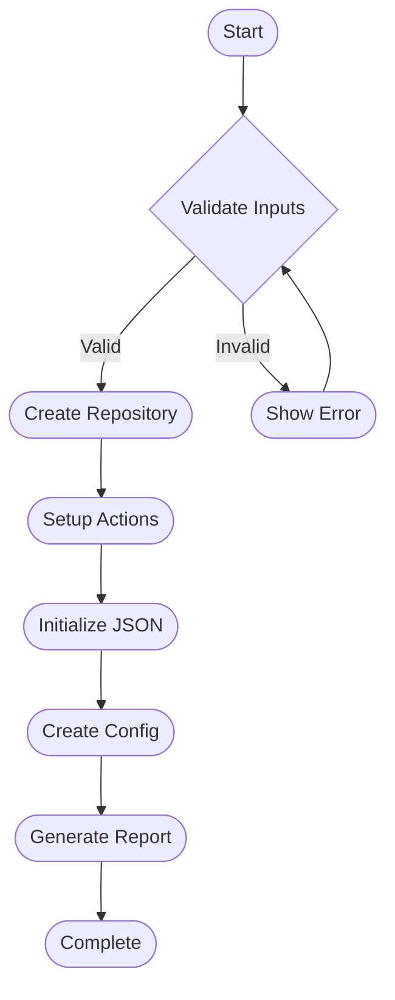
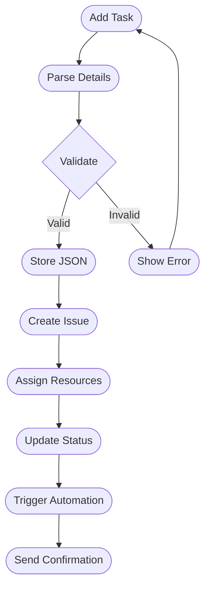
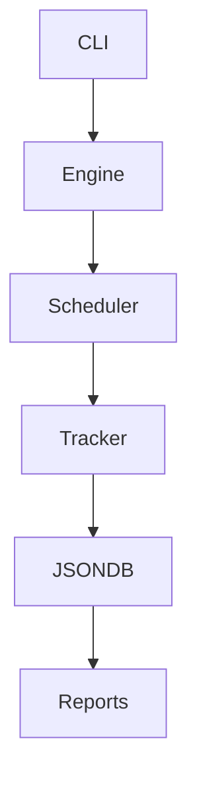
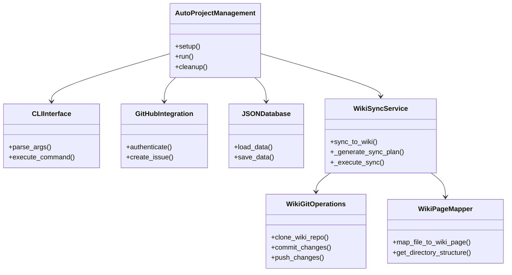
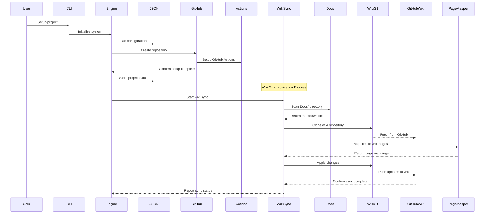
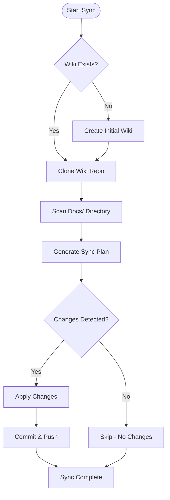

# AutoProjectManagement System

[](https://www.python.org/downloads/)
[](https://opensource.org/licenses/MIT)

## 🎯 Overview

**AutoProjectManagement** is a comprehensive, CLI-based automated project management system that revolutionizes software project management through intelligent automation, GitHub-native workflows, and JSON-driven configurations.

### Key Features
- **100% CLI-based**: No web frontend required
- **GitHub-Native**: Deep integration with GitHub Actions and APIs
- **JSON-Driven**: All configurations and workflows use JSON
- **Automated Progress Tracking**: Real-time progress monitoring via Git commits
- **Self-Managing**: Automatic project setup, monitoring, and reporting
- **Wiki Documentation**: Automatic synchronization of Docs/ to GitHub Wiki

## 🏗️ System Architecture

### High-Level Architecture


### Detailed System Architecture


## 📊 Business Process Diagrams

### Project Initialization Process


### Wiki Synchronization Process


### Task Management Workflow


### Progress Tracking Process


## 📈 Data Flow Diagrams

### Context Level DFD


### System Decomposition


## 🏗️ UML Diagrams

### Class Diagram


### Sequence Diagram


## 🚀 Quick Start Guide

### Prerequisites
- Python 3.8 or higher
- GitHub account with repository access
- Git installed and configured

### Installation

```bash
# 1. Clone the repository
git clone https://github.com/your-username/AutoProjectManagement.git
cd AutoProjectManagement

# 2. Setup Python environment
python3 -m venv venv
source venv/bin/activate  # Windows: venv\Scripts\activate
pip install -r requirements.txt

# 3. Configure GitHub
python -m autoprojectmanagement.cli config --github-token YOUR_TOKEN

# 4. Initialize project
python -m autoprojectmanagement.cli setup --project-name "MyProject"
```

## 📊 Usage Examples

### Basic Commands
```bash
# Initialize a new project
python -m autoprojectmanagement.cli init --name "MyProject"

# Add a new task
python -m autoprojectmanagement.cli task add --title "Implement feature X" --priority high

# View progress
python -m autoprojectmanagement.cli progress show

# Generate reports
python -m autoprojectmanagement.cli report generate --type weekly

# Update GitHub integration
python -m autoprojectmanagement.cli github sync

# Sync documentation to GitHub Wiki
python -m autoprojectmanagement.cli wiki sync --repo-owner your-username --repo-name your-repo
```

### Wiki Synchronization Commands
```bash
# Sync documentation to GitHub Wiki
python -m autoprojectmanagement.cli wiki sync --repo-owner your-username --repo-name your-repo

# Dry run to preview changes
python -m autoprojectmanagement.cli wiki sync --dry-run --repo-owner your-username --repo-name your-repo

# Force full sync (overwrite existing wiki)
python -m autoprojectmanagement.cli wiki sync --force --repo-owner your-username --repo-name your-repo
```

### Configuration Files
- `config.json`: Main system configuration
- `project.json`: Project-specific settings
- `tasks.json`: Task definitions and status
- `progress.json`: Progress tracking data
- `reports.json`: Generated reports metadata
- `wiki_config.json`: Wiki synchronization settings

## 🔧 Development

### Project Structure
```
AutoProjectManagement/
├── autoprojectmanagement/
│   ├── main_modules/          # Core business logic
│   ├── services/              # External integrations
│   │   ├── wiki_git_operations.py    # Git operations for wiki
│   │   ├── wiki_page_mapper.py       # File to wiki page mapping
│   │   └── wiki_sync_service.py      # Wiki synchronization service
│   ├── cli.py                # Command-line interface
│   └── auto_runner.py        # Main execution engine
├── Docs/                     # Documentation (auto-synced to wiki)
├── tests/                    # Test suites
├── requirements.txt          # Dependencies
└── README.md                # This file
```

### Wiki Synchronization Services

The system includes three new services for automatic GitHub Wiki synchronization:

#### WikiGitOperations
Handles all Git operations for the GitHub wiki repository:
- Clone wiki repositories
- Commit changes with proper messages
- Push updates to remote
- Manage branches and commit history
- Clean up temporary repositories

#### WikiPageMapper
Maps file paths to GitHub wiki page names:
- Convert file paths to wiki-compatible names
- Handle special characters and spaces
- Maintain directory structure in wiki
- Generate navigation-friendly page names

#### WikiSyncService
Main service for synchronizing Docs/ markdown files to GitHub Wiki:
- Automatic discovery of markdown files
- Intelligent change detection
- Dry-run capability for testing
- Comprehensive sync reporting
- Initial wiki setup and Home page creation

### Wiki Synchronization Workflow


### Testing
```bash
# Run all tests
python -m pytest tests/

# Run specific test category
python -m pytest tests/code_tests/UnitTests/

# Generate coverage report
python -m pytest --cov=autoprojectmanagement tests/

# Test wiki synchronization
python -m autoprojectmanagement.cli wiki sync --dry-run --repo-owner test-user --repo-name test-repo
```

## 🤝 Contributing

1. Fork the repository
2. Create a feature branch (`git checkout -b feature/AmazingFeature`)
3. Commit your changes (`git commit -m 'Add some AmazingFeature'`)
4. Push to the branch (`git push origin feature/AmazingFeature`)
5. Open a Pull Request

## 📄 License

This project is licensed under the MIT License - see the [LICENSE](LICENSE) file for details.

## 🙏 Acknowledgments

- Built with Python and GitHub Actions
- Inspired by modern DevOps practices
- Designed for automation-first workflows
- Powered by JSON-driven configurations
- Enhanced with automatic GitHub Wiki documentation
