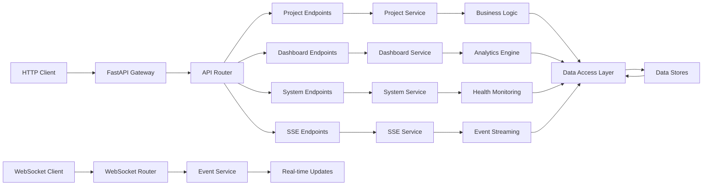
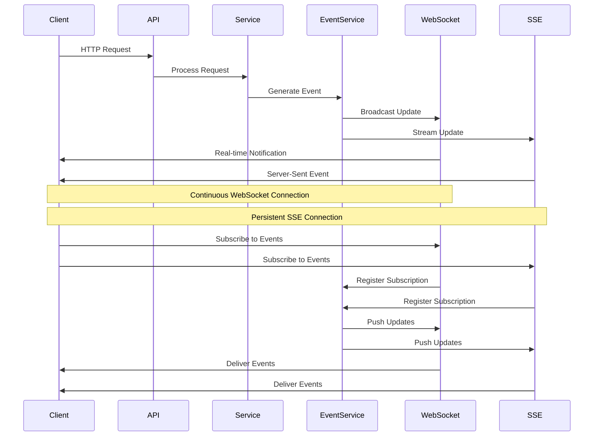

# AutoProjectManagement System - API-First Project Management

[](https://www.python.org/downloads/)
[](https://opensource.org/licenses/MIT)
[](Docs/SystemDesign/)
[](Docs/SystemDesign/Glossary/API_Reference.md)
[](https://fastapi.tiangolo.com/)

## 📋 Table of Contents
- [🎯 System Overview](#-system-overview)
- [🏗️ Architecture & Design](#️-architecture--design)
- [📁 File Structure](#-file-structure)
- [🚀 Quick Start](#-quick-start)
- [📖 API Usage Guide](#-api-usage-guide)
- [🔌 Real-time Dashboard](#-real-time-dashboard)
- [🧪 Testing](#-testing)
- [📚 Documentation](#-documentation)
- [🤝 Contributing](#-contributing)
- [📄 License](#-license)

---

## 🎯 System Overview

**AutoProjectManagement** is a comprehensive API-first automated project management system built with FastAPI. It provides real-time project oversight through RESTful APIs, WebSocket connections, and intelligent automation.

### Key Features
- **RESTful API Integration**: Comprehensive API endpoints for project management
- **Real-time Dashboard**: Live project health monitoring with WebSocket support
- **Automated Progress Tracking**: Intelligent task and resource management
- **JSON-Driven Configuration**: All settings via JSON files
- **WebSocket Support**: Real-time updates and notifications
- **Dashboard Visualization**: Comprehensive dashboard with multiple widget types
- **Event-Driven Architecture**: Real-time event system for instant updates

### System Statistics
| Metric | Value |
|--------|--------|
| **API Endpoints** | 20+ REST endpoints |
| **WebSocket Events** | 7+ real-time event types |
| **Dashboard Widgets** | 6+ available widget types |
| **Response Formats** | JSON, Markdown, Table |
| **Real-time Features** | WebSocket, Server-Sent Events |

---

## 🏗️ Architecture & Design

### High-Level System Architecture

```mermaid
graph TB
    subgraph "AutoProjectManagement System"
        API[FastAPI Server] --> PM[Project Management]
        API --> DB[Dashboard Services]
        API --> WS[WebSocket Gateway]
        API --> SSE[SSE Gateway]
        
        PM --> CRM[Communication Risk Module]
        PM --> DCP[Data Collection & Processing]
        PM --> PE[Planning & Estimation]
        PM --> PR[Progress Reporting]
        PM --> QCM[Quality Commit Management]
        PM --> RM[Resource Management]
        PM --> TWM[Task Workflow Management]
        
        DB --> OV[Dashboard Overview]
        DB --> MT[Metrics & Analytics]
        DB --> AL[Alert System]
        DB --> LY[Layout Management]
        DB --> RT[Real-time Updates]
        
        WS --> EV[Event System]
        WS --> HB[Heartbeat Management]
        WS --> SM[Subscription Management]
        
        SSE --> ES[Event Streaming]
        SSE --> CM[Connection Management]
    end
    
    Client[API Client] --> API
    Dashboard[Dashboard UI] --> DB
    Dashboard --> WS
    Dashboard --> SSE
    
    GitHub[GitHub Integration] --> PM
    VSCode[VS Code Integration] --> PM
    
    DataStores[Data Stores] --> PM
    PM --> DataStores
```



### API Architecture



### Real-time Data Flow



### Data Flow Diagrams

The system includes comprehensive Data Flow Diagrams (DFD) showing:
- **Level 0**: Context diagram showing external interactions
- **Level 1**: System overview with major components
- **Level 2**: Detailed component interactions
- **Level 3**: Process-level data flows

See [DFD Diagrams](Docs/SystemDesign/Diagrams/DFD_Diagrams.md) for complete details.

### UML Diagrams

Comprehensive UML diagrams including:
- **Class Diagrams**: System structure and relationships
- **Sequence Diagrams**: Interaction flows
- **Component Diagrams**: System composition
- **Activity Diagrams**: Process flows
- **State Diagrams**: State transitions


---

## 🚀 Quick Start

### Prerequisites
- Python 3.8 or higher
- FastAPI and required dependencies

### Installation

#### Method 1: From Source
```bash
# Clone repository
git clone https://github.com/AutoProjectManagement/AutoProjectManagement.git
cd AutoProjectManagement

# Create virtual environment
python -m venv venv
source venv/bin/activate  # Windows: venv\Scripts\activate

# Install dependencies
pip install -r requirements.txt
```

#### Method 2: Using pip
```bash
pip install fastapi uvicorn python-multipart
```

### Starting the API Server

```bash
# Start the development server
uvicorn autoprojectmanagement.api.app:app --host 0.0.0.0 --port 8000 --reload
```

### Accessing API Documentation

Once the server is running, access the interactive API documentation:
- **Swagger UI**: http://localhost:8000/docs
- **ReDoc**: http://localhost:8000/redoc
- **OpenAPI Schema**: http://localhost:8000/openapi.json

---

## 📖 API Usage Guide

### Base URL
All API endpoints are prefixed with:
```
http://localhost:8000/api/v1
```

### Authentication
Include the API key in requests:
```bash
curl -H "X-API-Key: development-key" http://localhost:8000/api/v1/health
```

### Core API Endpoints

#### System Endpoints
```bash
# Health check
curl http://localhost:8000/api/v1/health

# System information
curl http://localhost:8000/api/v1/system/info

# Root endpoint
curl http://localhost:8000/
```

#### Project Management
```bash
# List projects
curl http://localhost:8000/api/v1/projects?limit=10

# Create project
curl -X POST http://localhost:8000/api/v1/projects \
  -H "Content-Type: application/json" \
  -d '{"name": "My Project", "description": "Project description"}'

# Get project status
curl http://localhost:8000/api/v1/projects/{project_id}/status
```

#### Dashboard Endpoints
```bash
# Dashboard overview
curl http://localhost:8000/api/v1/dashboard/overview?project_id=project-001

# Dashboard metrics
curl http://localhost:8000/api/v1/dashboard/metrics?project_id=project-001

# Dashboard alerts
curl http://localhost:8000/api/v1/dashboard/alerts?project_id=project-001
```

### Response Formats
The API supports multiple response formats:
```bash
# JSON (default)
curl http://localhost:8000/api/v1/projects/project-001/status

# Markdown
curl http://localhost:8000/api/v1/projects/project-001/status?format=markdown

# Table format
curl http://localhost:8000/api/v1/projects/project-001/status?format=table
```

### Python Client Example

```python
import requests

class AutoProjectManagementClient:
    def __init__(self, base_url="http://localhost:8000", api_key="development-key"):
        self.base_url = base_url
        self.api_key = api_key
        self.headers = {"X-API-Key": api_key}
    
    def get_project_status(self, project_id, format="json"):
        url = f"{self.base_url}/api/v1/projects/{project_id}/status?format={format}"
        response = requests.get(url, headers=self.headers)
        response.raise_for_status()
        return response.json()
    
    def create_project(self, name, description=None):
        url = f"{self.base_url}/api/v1/projects"
        data = {"name": name, "description": description}
        response = requests.post(url, headers=self.headers, json=data)
        response.raise_for_status()
        return response.json()

# Usage
client = AutoProjectManagementClient()
status = client.get_project_status("project-001")
print(status)
```

---

## 🔌 Real-time Dashboard

### WebSocket Integration

The system provides real-time updates through WebSocket connections:

```javascript
// JavaScript WebSocket client example
const socket = new WebSocket('ws://localhost:8000/api/v1/dashboard/ws');

socket.onopen = () => {
    console.log('Connected to AutoProjectManagement WebSocket');
    
    // Subscribe to events
    socket.send(JSON.stringify({
        type: 'subscribe',
        event_types: ['progress_update', 'risk_alert', 'dashboard_update'],
        project_id: 'project-001'
    }));
};

socket.onmessage = (event) => {
    const data = JSON.parse(event.data);
    console.log('Real-time update:', data);
    
    // Handle different event types
    switch(data.type) {
        case 'progress_update':
            updateProgress(data.data);
            break;
        case 'risk_alert':
            showAlert(data.data);
            break;
        case 'dashboard_update':
            refreshDashboard(data.data);
            break;
    }
};

socket.onclose = () => {
    console.log('WebSocket connection closed');
};
```

### Available Event Types

| Event Type | Description | Data Format |
|------------|-------------|-------------|
| `progress_update` | Task progress updates | Progress metrics |
| `risk_alert` | Risk assessment alerts | Alert details |
| `dashboard_update` | Dashboard data refresh | Complete dashboard data |
| `health_check` | System health updates | Health metrics |
| `quality_metric` | Quality assurance updates | Quality metrics |
| `team_performance` | Team performance updates | Performance data |
| `system_status` | System status changes | Status information |

### Dashboard Layout Management

```bash
# Save custom layout
curl -X POST http://localhost:8000/api/v1/dashboard/layout \
  -H "Content-Type: application/json" \
  -d '{
    "layout_type": "custom",
    "widgets": [
      {"widget_id": "health", "position": 0, "enabled": true},
      {"widget_id": "progress", "position": 1, "enabled": true},
      {"widget_id": "alerts", "position": 2, "enabled": true}
    ],
    "refresh_rate": 5000,
    "theme": "dark"
  }'

# Get available layouts
curl http://localhost:8000/api/v1/dashboard/layouts

# Get specific layout
curl http://localhost:8000/api/v1/dashboard/layout?layout_type=custom
```

---

## 🧪 Testing

### Running Tests

```bash
# Install test dependencies
pip install pytest pytest-asyncio httpx

# Run all tests
pytest tests/

# Run with coverage
pytest --cov=autoprojectmanagement tests/

# Run specific test module
pytest tests/test_api.py -v
```

### Test Structure

```
tests/
├── test_api.py              # API endpoint tests
├── test_dashboard.py        # Dashboard functionality tests
├── test_websocket.py        # WebSocket connection tests
├── test_services.py         # Service layer tests
└── conftest.py             # Test configuration
```

### Example Test

```python
import pytest
from fastapi.testclient import TestClient
from autoprojectmanagement.api.app import app

client = TestClient(app)

def test_health_check():
    response = client.get("/api/v1/health")
    assert response.status_code == 200
    assert response.json()["status"] == "healthy"

def test_project_creation():
    project_data = {"name": "Test Project", "description": "Test description"}
    response = client.post("/api/v1/projects", json=project_data)
    assert response.status_code == 200
    assert "project" in response.json()
```

---

## 📚 Documentation

### Comprehensive Documentation

- **API Reference**: [Docs/SystemDesign/Glossary/API_Reference.md](Docs/SystemDesign/Glossary/API_Reference.md)
- **API Modules Documentation**: Complete documentation for all API modules:
  - [Main Module](Docs/SystemDesign/API_Modules/main_documentation.md)
  - [App Module](Docs/SystemDesign/API_Modules/app_documentation.md)
  - [Services Module](Docs/SystemDesign/API_Modules/services.md)
  - [Dashboard Endpoints](Docs/SystemDesign/API_Modules/dashboard_endpoints_documentation.md)
  - [Real-time Service](Docs/SystemDesign/API_Modules/realtime_service_documentation.md)
  - [Server Module](Docs/SystemDesign/API_Modules/server_documentation.md)
  - [SSE Endpoints](Docs/SystemDesign/API_Modules/sse_endpoints_documentation.md)
- **Usage Instructions**: [Docs/SystemDesign/Usage_Instructions.md](Docs/SystemDesign/Usage_Instructions.md)
- **System Design**: [Docs/SystemDesign/](Docs/SystemDesign/)
- **Developer Guide**: [Docs/SystemDesign/Guides/Developer_Guidelines.md](Docs/SystemDesign/Guides/Developer_Guidelines.md)
- **API Documentation Template**: [Docs/SystemDesign/Guides/API_Documentation_Template.md](Docs/SystemDesign/Guides/API_Documentation_Template.md)

### Interactive Documentation

Access the live interactive documentation when the server is running:
- **Swagger UI**: http://localhost:8000/docs
- **ReDoc**: http://localhost:8000/redoc

### Code Examples

All documentation includes practical code examples for:
- Python API clients
- JavaScript/TypeScript integration
- WebSocket real-time updates
- Dashboard customization
- Server-Sent Events (SSE) integration

---

## 🤝 Contributing

### Development Setup

```bash
# Fork and clone the repository
git clone https://github.com/AutoProjectManagement/AutoProjectManagement.git
cd AutoProjectManagement

# Set up development environment
python -m venv venv
source venv/bin/activate
pip install -r requirements-dev.txt

# Run tests to verify setup
pytest tests/
```

### Contribution Guidelines

1. **Fork** the repository
2. **Create** a feature branch (`git checkout -b feature/amazing-feature`)
3. **Commit** your changes (`git commit -m 'Add amazing feature'`)
4. **Push** to the branch (`git push origin feature/amazing-feature`)
5. **Open** a Pull Request

### Code Standards

- Follow PEP 8 style guidelines
- Add comprehensive docstrings to all functions and classes
- Include unit tests for new features
- Update documentation for any changes
- Use type hints throughout the codebase

### Testing Requirements

- All new features must include comprehensive tests
- Maintain test coverage above 80%
- Include both unit tests and integration tests
- Test WebSocket functionality thoroughly

---

## 📄 License

This project is licensed under the MIT License - see the [LICENSE](LICENSE) file for details.

---

## 🆘 Support

### Documentation Resources

- **API Reference**: Complete endpoint documentation
- **Usage Guide**: Practical implementation examples
- **Troubleshooting**: Common issues and solutions
- **Best Practices**: Recommended implementation patterns

### Community Support

- **GitHub Issues**: [Report bugs and request features](https://github.com/AutoProjectManagement/AutoProjectManagement/issues)
- **GitHub Discussions**: [Community discussions and Q&A](https://github.com/AutoProjectManagement/AutoProjectManagement/discussions)
- **Documentation**: Comprehensive guides and examples

### Getting Help

1. Check the [API Documentation](http://localhost:8000/docs) first
2. Review the [Usage Instructions](Docs/SystemDesign/Usage_Instructions.md)
3. Search [GitHub Issues](https://github.com/AutoProjectManagement/AutoProjectManagement/issues) for similar problems
4. Create a new issue if your problem isn't documented

---

*This README is maintained as part of the AutoProjectManagement system. Last updated: 2025-08-14*
