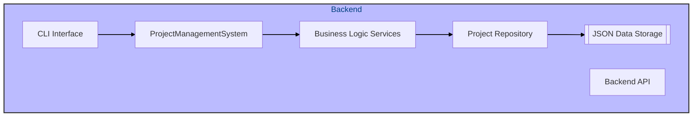
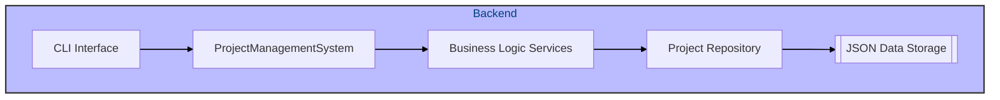
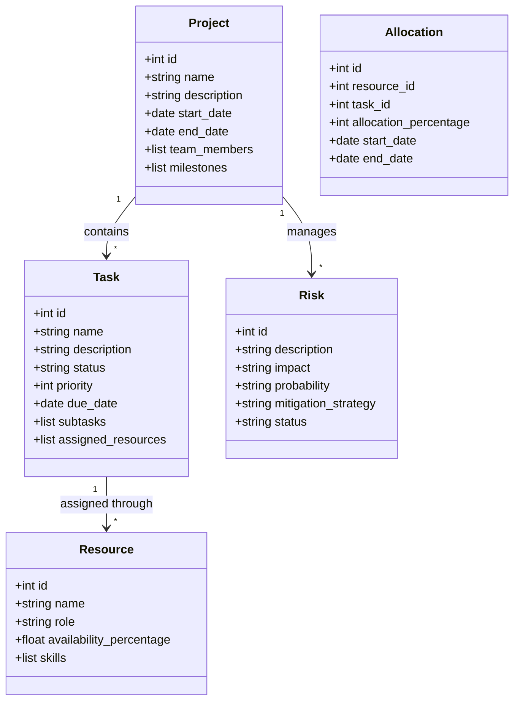
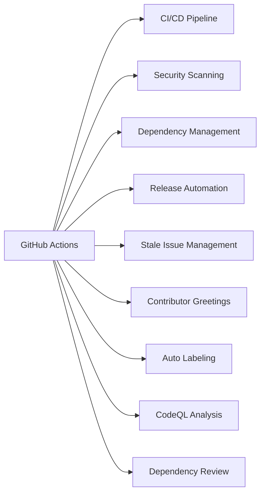
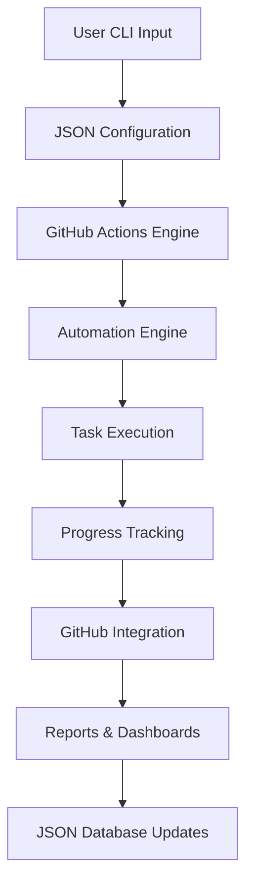

# AutoProjectManagement System

[](https://www.python.org/downloads/)
[](https://opensource.org/licenses/MIT)
[](https://github.com/your-username/AutoProjectManagement/actions)

## 🎯 Overview

**AutoProjectManagement** is a comprehensive, CLI-based automated project management system that revolutionizes software project management through intelligent automation, GitHub-native workflows, and JSON-driven configurations. This system operates entirely through command-line interfaces and deep GitHub integration, eliminating traditional web-based interfaces while providing enterprise-grade project management capabilities.

### Key Differentiators
- **100% CLI-based**: No web frontend required
- **GitHub-Native**: Deep integration with GitHub Actions and APIs
- **JSON-Driven**: All configurations and workflows use JSON
- **Automated Progress Tracking**: Real-time progress monitoring via Git commits
- **Self-Managing**: Automatic project setup, monitoring, and reporting

## 🏗️ System Architecture

### High-Level Architecture


### Detailed System Architecture


### UML Class Diagram


## 🚀 Quick Start Guide

### Prerequisites
- Python 3.8 or higher
- GitHub account with repository access
- Git installed and configured

### Installation Steps

#### 1. Clone the Repository
```bash
git clone https://github.com/your-username/AutoProjectManagement.git
cd AutoProjectManagement
```

#### 2. Setup Python Environment
```bash
python3 -m venv venv
source venv/bin/activate  # On Windows: venv\Scripts\activate
pip install -r requirements.txt
```

#### 3. Setup GitHub Integration
```bash
# Configure GitHub token
python -m autoprojectmanagement.cli config --github-token YOUR_TOKEN
```

### 4. Initial Setup
```bash
# Create initial project structure
python -m autoprojectmanagement.cli setup --project-name "MyProject"
```

## 📊 System Architecture Diagrams

### 1. High-Level System Architecture


### 2. GitHub Actions Integration


### 3. Data Flow Architecture


### 4. UML Class Diagram


## 🚀 Quick Start Guide

### Prerequisites
- Python 3.8 or higher
- GitHub account with repository access
- Git installed and configured

### Installation Steps

#### 1. Clone the Repository
```bash
git clone https://github.com/your-username/AutoProjectManagement.git
cd AutoProjectManagement
```

#### 2. Setup Python Environment
```bash
python3 -m venv venv
source venv/bin/activate  # On Windows: venv\Scripts\activate
pip install -r requirements.txt
```

#### 3. Setup GitHub Integration
```bash
# Configure GitHub token
python -m autoprojectmanagement.cli config --github-token YOUR_TOKEN
```

### 4. Initial Setup
```bash
# Create initial project structure
python -m autoprojectmanagement.cli setup --project-name "MyProject"
```

## 📊 System Architecture Diagrams

### 1. High-Level System Architecture


### 2. GitHub Actions Integration


### 3. Data Flow Architecture


### 4. UML Class Diagram


## 🚀 Quick Start Guide

### Prerequisites
- Python 3.8 or higher
- GitHub account with repository access
- Git installed and configured

### Installation Steps

#### 1. Clone the Repository
```bash
git clone https://github.com/your-username/AutoProjectManagement.git
cd AutoProjectManagement
```

#### 2. Setup Python Environment
```bash
python3 -m venv venv
source venv/bin/activate  # On Windows: venv\Scripts\activate
pip install -r requirements.txt
```

#### 3. Setup GitHub Integration
```bash
# Configure GitHub token
python -m autoprojectmanagement.cli config --github-token YOUR_TOKEN
```

### 4. Initial Setup
```bash
# Create initial project structure
python -m autoprojectmanagement.cli setup --project-name "MyProject"
```

## 📊 System Architecture Diagrams

### 1. High-Level System Architecture


### 2. GitHub Actions Integration


### 3. Data Flow Architecture


### 4. UML Class Diagram


## 🚀 Quick Start Guide

### Prerequisites
- Python 3.8 or higher
- GitHub account with repository access
- Git installed and configured

### Installation Steps

#### 1. Clone the Repository
```bash
git clone https://github.com/your-username/AutoProjectManagement.git
cd AutoProjectManagement
```

#### 2. Setup Python Environment
```bash
python3 -m venv venv
source venv/bin/activate  # On Windows: venv\Scripts\activate
pip install -r requirements.txt
```

#### 3. Setup GitHub Integration
```bash
# Configure GitHub token
python -m autoprojectmanagement.cli config --github-token YOUR_TOKEN
```

### 4. Initial Setup
```bash
# Create initial project structure
python -m autoprojectmanagement.cli setup --project-name "MyProject"
```

## 📊 System Architecture Diagrams

### 1. High-Level System Architecture


### 2. GitHub Actions Integration


### 3. Data Flow Architecture


### 4. UML Class Diagram


## 🚀 Quick Start Guide

### Prerequisites
- Python 3.8 or higher
- GitHub account with repository access
- Git installed and configured

### Installation Steps

#### 1. Clone the Repository
```bash
git clone https://github.com/your-username/AutoProjectManagement.git
cd AutoProjectManagement
```

#### 2. Setup Python Environment
```bash
python3 -m venv venv
source venv/bin/activate  # On Windows: venv\Scripts\activate
pip install -r requirements.txt
```

#### 3. Setup GitHub Integration
```bash
# Configure GitHub token
python -m autoprojectmanagement.cli config --github-token YOUR_TOKEN
```

### 4. Initial Setup
```bash
# Create initial project structure
python -m autoprojectmanagement.cli setup --project-name "MyProject"
```

## 📊 System Architecture Diagrams

### 1. High-Level System Architecture


### 2. GitHub Actions Integration
```mermaid
graph LR
    A[GitHub Actions] --> B[CI/CD Pipeline]
    A --> C[Security Scanning]
    A --> D[Dependency Management]
    A --> E[Release Automation]
    A --> F[Stale Issue Management]
    A --> G[Contributor Greetings]
    A --> H[Auto Labeling]
    A --> I[CodeQL Analysis]
    A --> J[Dependency Review]
```

### 3. Data Flow Architecture
```mermaid
graph TD
    A[User CLI Input] --> B[JSON Configuration]
    B --> C[GitHub Actions Engine]
    C --> D[Automation Engine]
    D --> E[Task Execution]
    E --> F[Progress Tracking]
    F --> G[GitHub Integration]
    G --> H[Reports & Dashboards]
    H --> I[JSON Database Updates]
```

### 4. UML Class Diagram
```mermaid
classDiagram
    class Project {
        +int id
        +string name
        +string description
        +date start_date
        +date end_date
        +list team_members
        +list milestones
    }

    class Task {
        +int id
        +string name
        +string description
        +string status
        +int priority
        +date due_date
        +list subtasks
        +list assigned_resources
    }

    class Resource {
        +int id
        +string name
        +string role
        +float availability_percentage
        +list skills
    }

    class Allocation {
        +int id
        +int resource_id
        +int task_id
        +int allocation_percentage
        +date start_date
        +date end_date
    }

    class Risk {
        +int id
        +string description
        +string impact
        +string probability
        +string mitigation_strategy
        +string status
    }

    Project "1" --> "*" Task : contains
    Task "1" --> "*" Resource : assigned through
    Project "1" --> "*" Risk : manages
```

## 🚀 Quick Start Guide

### Prerequisites
- Python 3.8 or higher
- GitHub account with repository access
- Git installed and configured

### Installation Steps

#### 1. Clone the Repository
```bash
git clone https://github.com/your-username/AutoProjectManagement.git
cd AutoProjectManagement
```

#### 2. Setup Python Environment
```bash
python3 -m venv venv
source venv/bin/activate  # On Windows: venv\Scripts\activate
pip install -r requirements.txt
```

#### 3. Setup GitHub Integration
```bash
# Configure GitHub token
python -m autoprojectmanagement.cli config --github-token YOUR_TOKEN
```

### 4. Initial Setup
```bash
# Create initial project structure
python -m autoprojectmanagement.cli setup --project-name "MyProject"
```

## 📊 System Architecture Diagrams

### 1. High-Level System Architecture
```mermaid
graph TD
    linkStyle default stroke:#000,stroke-width:1.5px
    subgraph Backend
        style Backend fill:#bbf,stroke:#333,stroke-width:2px,color:#004080
        CLI[CLI Interface]
        PMS[ProjectManagementSystem]
        SV_BUS[Business Logic Services]
        RP_PRJ[Project Repository]
        DS_JSON[[JSON Data Storage]]
    end

    CLI --> PMS
    PMS --> SV_BUS
    SV_BUS --> RP_PRJ
    RP_PRJ --> DS_JSON
```

### 2. GitHub Actions Integration
```mermaid
graph LR
    A[GitHub Actions] --> B[CI/CD Pipeline]
    A --> C[Security Scanning]
    A --> D[Dependency Management]
    A --> E[Release Automation]
    A --> F[Stale Issue Management]
    A --> G[Contributor Greetings]
    A --> H[Auto Labeling]
    A --> I[CodeQL Analysis]
    A --> J[Dependency Review]
```

### 3. Data Flow Architecture
```mermaid
graph TD
    A[User CLI Input] --> B[JSON Configuration]
    B --> C[GitHub Actions Engine]
    C --> D[Automation Engine]
    D --> E[Task Execution]
    E --> F[Progress Tracking]
    F --> G[GitHub Integration]
    G --> H[Reports & Dashboards]
    H --> I[JSON Database Updates]
```

### 4. UML Class Diagram
```mermaid
classDiagram
    class Project {
        +int id
        +string name
        +string description
        +date start_date
        +date end_date
        +list team_members
        +list milestones
    }

    class Task {
        +int id
        +string name
        +string description
        +string status
        +int priority
        +date due_date
        +list subtasks
        +list assigned_resources
    }

    class Resource {
        +int id
        +string name
        +string role
        +float availability_percentage
        +list skills
    }

    class Allocation {
        +int id
        +int resource_id
        +int task_id
        +int allocation_percentage
        +date start_date
        +date end_date
    }

    class Risk {
        +int id
        +string description
        +string impact
        +string probability
        +string mitigation_strategy
        +string status
    }

    Project "1" --> "*" Task : contains
    Task "1" --> "*" Resource : assigned through
    Project "1" --> "*" Risk : manages
```

## 🚀 Quick Start Guide

### Prerequisites
- Python 3.8 or higher
- GitHub account with repository access
- Git installed and configured

### Installation Steps

#### 1. Clone the Repository
```bash
git clone https://github.com/your-username/AutoProjectManagement.git
cd AutoProjectManagement
```

#### 2. Setup Python Environment
```bash
python3 -m venv venv
source venv/bin/activate  # On Windows: venv\Scripts\activate
pip install -r requirements.txt
```

#### 3. Setup GitHub Integration
```bash
# Configure GitHub token
python -m autoprojectmanagement.cli config --github-token YOUR_TOKEN
```

### 4. Initial Setup
```bash
# Create initial project structure
python -m autoprojectmanagement.cli setup --project-name "MyProject"
```

## 📊 System Architecture Diagrams

### 1. High-Level System Architecture
```mermaid
graph TD
    linkStyle default stroke:#000,stroke-width:1.5px
    subgraph Backend
        style Backend fill:#bbf,stroke:#333,stroke-width:2px,color:#004080
        CLI[CLI Interface]
        PMS[ProjectManagementSystem]
        SV_BUS[Business Logic Services]
        RP_PRJ[Project Repository]
        DS_JSON[[JSON Data Storage]]
    end

    CLI --> PMS
    PMS --> SV_BUS
    SV_BUS --> RP_PRJ
    RP_PRJ --> DS_JSON
```

### 2. GitHub Actions Integration
```mermaid
graph LR
    A[GitHub Actions] --> B[CI/CD Pipeline]
    A --> C[Security Scanning]
    A --> D[Dependency Management]
    A --> E[Release Automation]
    A --> F[Stale Issue Management]
    A --> G[Contributor Greetings]
    A --> H[Auto Labeling]
    A --> I[CodeQL Analysis]
    A --> J[Dependency Review]
```

### 3. Data Flow Architecture
```mermaid
graph TD
    A[User CLI Input] --> B[JSON Configuration]
    B --> C[GitHub Actions Engine]
    C --> D[Automation Engine]
    D --> E[Task Execution]
    E --> F[Progress Tracking]
    F --> G[GitHub Integration]
    G --> H[Reports & Dashboards]
    H --> I[JSON Database Updates]
```

### 4. UML Class Diagram
```mermaid
classDiagram
    class Project {
        +int id
        +string name
        +string description
        +date start_date
        +date end_date
        +list team_members
        +list milestones
    }

    class Task {
        +int id
        +string name
        +string description
        +string status
        +int priority
        +date due_date
        +list subtasks
        +list assigned_resources
    }

    class Resource {
        +int id
        +string name
        +string role
        +float availability_percentage
        +list skills
    }

    class Allocation {
        +int id
        +int resource_id
        +int task_id
        +int allocation_percentage
        +date start_date
        +date end_date
    }

    class Risk {
        +int id
        +string description
        +string impact
        +string probability
        +string mitigation_strategy
        +string status
    }

    Project "1" --> "*" Task : contains
    Task "1" --> "*" Resource : assigned through
    Project "1" --> "*" Risk : manages
```

## 🚀 Quick Start Guide

### Prerequisites
- Python 3.8 or higher
- GitHub account with repository access
- Git installed and configured

### Installation Steps

#### 1. Clone the Repository
```bash
git clone https://github.com/your-username/AutoProjectManagement.git
cd AutoProjectManagement
```

#### 2. Setup Python Environment
```bash
python3 -m venv venv
source venv/bin/activate  # On Windows: venv\Scripts\activate
pip install -r requirements.txt
```

#### 3. Setup GitHub Integration
```bash
# Configure GitHub token
python -m autoprojectmanagement.cli config --github-token YOUR_TOKEN
```

### 4. Initial Setup
```bash
# Create initial project structure
python -m autoprojectmanagement.cli setup --project-name "MyProject"
```

## 📊 System Architecture Diagrams

### 1. High-Level System Architecture
```mermaid
graph TD
    linkStyle default stroke:#000,stroke-width:1.5px
    subgraph Backend
        style Backend fill:#bbf,stroke:#333,stroke-width:2px,color:#004080
        CLI[CLI Interface]
        PMS[ProjectManagementSystem]
        SV_BUS[Business Logic Services]
        RP_PRJ[Project Repository]
        DS_JSON[[JSON Data Storage]]
    end

    CLI --> PMS
    PMS --> SV_BUS
    SV_BUS --> RP_PRJ
    RP_PRJ --> DS_JSON
```

### 2. GitHub Actions Integration
```mermaid
graph LR
    A[GitHub Actions] --> B[CI/CD Pipeline]
    A --> C[Security Scanning]
    A --> D[Dependency Management]
    A --> E[Release Automation]
    A --> F[Stale Issue Management]
    A --> G[Contributor Greetings]
    A --> H[Auto Labeling]
    A --> I[CodeQL Analysis]
    A --> J[Dependency Review]
```

### 3. Data Flow Architecture
```mermaid
graph TD
    A[User CLI Input] --> B[JSON Configuration]
    B --> C[GitHub Actions Engine]
    C --> D[Automation Engine]
    D --> E[Task Execution]
    E --> F[Progress Tracking]
    F --> G[GitHub Integration]
    G --> H[Reports & Dashboards]
    H --> I[JSON Database Updates]
```

### 4. UML Class Diagram
```mermaid
classDiagram
    class Project {
        +int id
        +string name
        +string description
        +date start_date
        +date end_date
        +list team_members
        +list milestones
    }

    class Task {
        +int id
        +string name
        +string description
        +string status
        +int priority
        +date due_date
        +list subtasks
        +list assigned_resources
    }

    class Resource {
        +int id
        +string name
        +string role
        +float availability_percentage
        +list skills
    }

    class Allocation {
        +int id
        +int resource_id
        +int task_id
        +int allocation_percentage
        +date start_date
        +date end_date
    }

    class Risk {
        +int id
        +string description
        +string impact
        +string probability
        +string mitigation_strategy
        +string status
    }

    Project "1" --> "*" Task : contains
    Task "1" --> "*" Resource : assigned through
    Project "1" --> "*" Risk : manages
```

## 🚀 Quick Start Guide

### Prerequisites
- Python 3.8 or higher
- GitHub account with repository access
- Git installed and configured

### Installation Steps

#### 1. Clone the Repository
```bash
git clone https://github.com/your-username/AutoProjectManagement.git
cd AutoProjectManagement
```

#### 2. Setup Python Environment
```bash
python3 -m venv venv
source venv/bin/activate  # On Windows: venv\Scripts\activate
pip install -r requirements.txt
```

#### 3. Setup GitHub Integration
```bash
# Configure GitHub token
python -m autoprojectmanagement.cli config --github-token YOUR_TOKEN
```

### 4. Initial Setup
```bash
# Create initial project structure
python -m autoprojectmanagement.cli setup --project-name "MyProject"
```

## 📊 System Architecture Diagrams

### 1. High-Level System Architecture
```mermaid
graph TD
    linkStyle default stroke:#000,stroke-width:1.5px
    subgraph Backend
        style Backend fill:#bbf,stroke:#333,stroke-width:2px,color:#004080
        CLI[CLI Interface]
        PMS[ProjectManagementSystem]
        SV_BUS[Business Logic Services]
        RP_PRJ[Project Repository]
        DS_JSON[[JSON Data Storage]]
    end

    CLI --> PMS
    PMS --> SV_BUS
    SV_BUS --> RP_PRJ
    RP_PRJ --> DS_JSON
```

### 2. GitHub Actions Integration
```mermaid
graph LR
    A[GitHub Actions] --> B[CI/CD Pipeline]
    A --> C[Security Scanning]
    A --> D[Dependency Management]
    A --> E[Release Automation]
    A --> F[Stale Issue Management]
    A --> G[Contributor Greetings]
    A --> H[Auto Labeling]
    A --> I[CodeQL Analysis]
    A --> J[Dependency Review]
```

### 3. Data Flow Architecture
```mermaid
graph TD
    A[User CLI Input] --> B[JSON Configuration]
    B --> C[GitHub Actions Engine]
    C --> D[Automation Engine]
    D --> E[Task Execution]
    E --> F[Progress Tracking]
    F --> G[GitHub Integration]
    G --> H[Reports & Dashboards]
    H --> I[JSON Database Updates]
```

### 4. UML Class Diagram
```mermaid
classDiagram
    class Project {
        +int id
        +string name
        +string description
        +date start_date
        +date end_date
        +list team_members
        +list milestones
    }

    class Task {
        +int id
        +string name
        +string description
        +string status
        +int priority
        +date due_date
        +list subtasks
        +list assigned_resources
    }

    class Resource {
        +int id
        +string name
        +string role
        +float availability_percentage
        +list skills
    }

    class Allocation {
        +int id
        +int resource_id
        +int task_id
        +int allocation_percentage
        +date start_date
        +date end_date
    }

    class Risk {
        +int id
        +string description
        +string impact
        +string probability
        +string mitigation_strategy
        +string status
    }

    Project "1" --> "*" Task : contains
    Task "1" --> "*" Resource : assigned through
    Project "1" --> "*" Risk : manages
```

## 🚀 Quick Start Guide

### Prerequisites
- Python 3.8 or higher
- GitHub account with repository access
- Git installed and configured

### Installation Steps

#### 1. Clone the Repository
```bash
git clone https://github.com/your-username/AutoProjectManagement.git
cd AutoProjectManagement
```

#### 2. Setup Python Environment
```bash
python3 -m venv venv
source venv/bin/activate  # On Windows: venv\Scripts\activate
pip install -r requirements.txt
```

#### 3. Setup GitHub Integration
```bash
# Configure GitHub token
python -m autoprojectmanagement.cli config --github-token YOUR_TOKEN
```

### 4. Initial Setup
```bash
# Create initial project structure
python -m autoprojectmanagement.cli setup --project-name "MyProject"
```

## 📊 System Architecture Diagrams

### 1. High-Level System Architecture
```mermaid
graph TD
    linkStyle default stroke:#000,stroke-width:1.5px
    subgraph Backend
        style Backend fill:#bbf,stroke:#333,stroke-width:2px,color:#004080
        CLI[CLI Interface]
        PMS[ProjectManagementSystem]
        SV_BUS[Business Logic Services]
        RP_PRJ[Project Repository]
        DS_JSON[[JSON Data Storage]]
    end

    CLI --> PMS
    PMS --> SV_BUS
    SV_BUS --> RP_PRJ
    RP_PRJ --> DS_JSON
```

### 2. GitHub Actions Integration
```mermaid
graph LR
    A[GitHub Actions] --> B[CI/CD Pipeline]
    A --> C[Security Scanning]
    A --> D[Dependency Management]
    A --> E[Release Automation]
    A --> F[Stale Issue Management]
    A --> G[Contributor Greetings]
    A --> H[Auto Labeling]
    A --> I[CodeQL Analysis]
    A --> J[Dependency Review]
```

### 3. Data Flow Architecture
```mermaid
graph TD
    A[User CLI Input] --> B[JSON Configuration]
    B --> C[GitHub Actions Engine]
    C --> D[Automation Engine]
    D --> E[Task Execution]
    E --> F[Progress Tracking]
    F --> G[GitHub Integration]
    G --> H[Reports & Dashboards]
    H --> I[JSON Database Updates]
```

### 4
