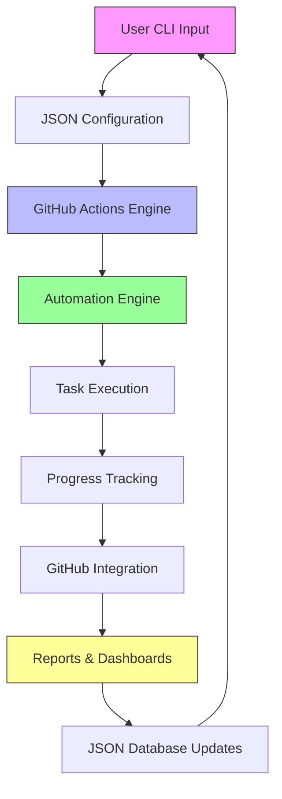
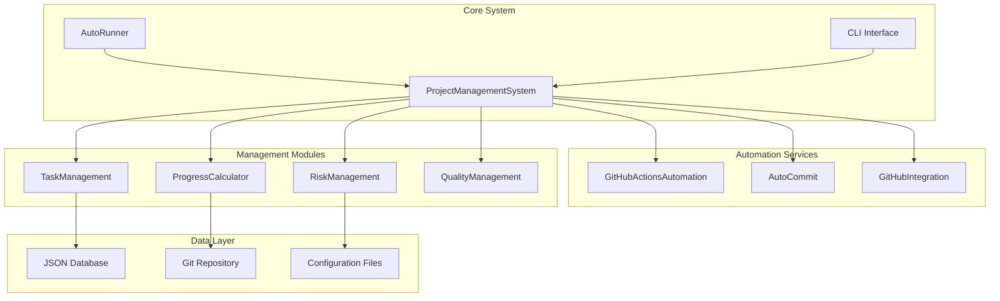

# AutoProjectManagement System

[](https://www.python.org/downloads/)
[](https://opensource.org/licenses/MIT)
[](https://github.com/your-username/AutoProjectManagement/actions)

## 🎯 Overview

**AutoProjectManagement** is a comprehensive, CLI-based automated project management system that revolutionizes software project management through intelligent automation, GitHub-native workflows, and JSON-driven configurations. This system operates entirely through command-line interfaces and deep GitHub integration, eliminating traditional web-based interfaces while providing enterprise-grade project management capabilities.

### Key Differentiators
- **100% CLI-based**: No web frontend required
- **GitHub-Native**: Deep integration with GitHub Actions and APIs
- **JSON-Driven**: All configurations and workflows use JSON
- **Automated Progress Tracking**: Real-time progress monitoring via Git commits
- **Intelligent Task Management**: AI-powered task prioritization and scheduling
- **Self-Managing**: Automatic project setup, monitoring, and reporting

## 🏗️ System Architecture

### High-Level Architecture
```
┌─────────────────────────────────────────────────────────────┐
│                    AutoProjectManagement                     │
├─────────────────────────────────────────────────────────────┤
│  CLI Interface        │  GitHub Actions    │  JSON Database  │
│  ├─ auto_runner.py  │  ├─ 11 Workflows  │  ├─ Inputs      │
│  ├─ cli.py           │  ├─ Automation     │  ├─ Outputs     │
│  └─ Services         │  └─ Integration    │  └─ Configs     │
├─────────────────────────────────────────────────────────────┤
│              Core Modules & Automation Engine               │
│  ├─ Task Management    ├─ Progress Tracking  ├─ Reporting │
│  ├─ Resource Allocation ├─ Risk Management  ├─ Quality  │
│  ├─ Time Management    ├─ Communication     ├─ Scheduling │
└─────────────────────────────────────────────────────────────┘
```

### Data Flow Architecture


### Module Architecture


## 🚀 Quick Start

### Prerequisites
- Python 3.8 or higher
- GitHub account with repository access
- Git installed and configured
- GitHub Personal Access Token (PAT)

### Installation

```bash
# Clone the repository
git clone https://github.com/your-username/AutoProjectManagement.git
cd AutoProjectManagement

# Create virtual environment
python -m venv venv
source venv/bin/activate  # On Windows: venv\Scripts\activate

# Install dependencies
pip install -r requirements.txt

# Install development dependencies (optional)
pip install -r requirements-dev.txt

# Initialize the system
python -m autoprojectmanagement.cli init
```

### Initial Configuration

1. **GitHub Setup**:
   ```bash
   # Configure GitHub token
   python -m autoprojectmanagement.cli config --github-token YOUR_TOKEN
   
   # Set repository
   python -m autoprojectmanagement.cli config --repo owner/repo-name
   ```

2. **JSON Configuration**:
   ```bash
   # Create initial project structure
   python -m autoprojectmanagement.cli setup --project-name "MyProject"
   
   # Setup GitHub Actions
   python -m autoprojectmanagement.cli setup-actions
   ```

## 📊 Core Features

### 1. Automated Task Management
- **Intelligent Task Creation**: Automatically generates tasks from requirements
- **Priority Calculation**: Uses importance/urgency matrix for task prioritization
- **Resource Allocation**: Smart resource distribution based on availability and skills
- **Dependency Management**: Automatic task dependency resolution
- **WBS Generation**: Automatic Work Breakdown Structure creation

### 2. GitHub-Native Automation
- **11 Automated Workflows**:
  - CI/CD Pipeline
  - Security Scanning
  - Dependency Management
  - Release Automation
  - Stale Issue Management
  - Contributor Greetings
  - Auto-labeling
  - CodeQL Analysis
  - Size-based PR labeling
  - Dependency Review
  - Vulnerability Scanning

### 3. Progress Tracking & Reporting
- **Real-time Progress**: Tracks progress via Git commits and branch activities
- **Automated Reports**: Generates markdown reports and dashboards
- **GitHub Integration**: Updates project boards and issues automatically
- **Performance Metrics**: Calculates velocity, burndown rates, and completion forecasts
- **Gantt Charts**: Automatic Gantt chart generation

### 4. Resource & Time Management
- **Resource Leveling**: Balances workload across team members
- **Time Tracking**: Monitors time spent on tasks
- **Capacity Planning**: Forecasts resource needs
- **Schedule Optimization**: Creates optimal project schedules
- **Risk Assessment**: Identifies and prioritizes project risks

### 5. Quality & Communication Management
- **Quality Gates**: Automated quality checks and validations
- **Communication Tracking**: Tracks stakeholder communications
- **Documentation Automation**: Auto-generates project documentation
- **Risk Management**: Continuous risk assessment and mitigation

## 🛠️ CLI Commands

### Basic Commands
```bash
# Initialize new project
python -m autoprojectmanagement.cli init

# Create new project
python -m autoprojectmanagement.cli create-project "ProjectName" --description "Description"

# Show project status
python -m autoprojectmanagement.cli status PROJECT_ID --format table

# Add new task
python -m autoprojectmanagement.cli add-task PROJECT_ID --task-name "Task Name" --priority high

# Generate reports
python -m autoprojectmanagement.cli report PROJECT_ID --report-type detailed --output report.md
```

### Advanced Commands
```bash
# Start automatic project management
python -m autoprojectmanagement.auto_runner --path /path/to/project --daemon

# Setup GitHub Actions
python -m autoprojectmanagement.cli setup-actions

# Configure automation
python -m autoprojectmanagement.cli config --auto-commit true --auto-report true

# Generate Gantt charts
python -m autoprojectmanagement.cli gantt --generate --project-id PROJECT_ID

# Risk analysis
python -m autoprojectmanagement.cli risk --assess --project-id PROJECT_ID

# Resource allocation
python -m autoprojectmanagement.cli resources --allocate --project-id PROJECT_ID
```

### Auto-Runner Commands
```bash
# Start automatic monitoring
python -m autoprojectmanagement.auto_runner

# Run in daemon mode
python -m autoprojectmanagement.auto_runner --daemon

# Monitor specific path
python -m autoprojectmanagement.auto_runner --path /custom/path
```

## 📁 Project Structure

```
AutoProjectManagement/
├── autoprojectmanagement/          # Main package
│   ├── main_modules/              # Core business logic (30+ modules)
│   │   ├── project_management_system.py    # Main system controller
│   │   ├── task_management.py             # Task management engine
│   │   ├── progress_calculator_refactored.py  # Progress calculation
│   │   ├── github_actions_automation.py   # GitHub Actions automation
│   │   ├── risk_management.py            # Risk assessment
│   │   ├── resource_management.py        # Resource allocation
│   │   ├── time_management.py           # Time tracking
│   │   ├── quality_management.py        # Quality gates
│   │   └── [25+ additional modules]
│   ├── services/                    # Service layer
│   │   ├── auto_commit.py           # Automatic commit handling
│   │   ├── github_integration.py    # GitHub API integration
│   │   ├── backup_manager.py        # Backup automation
│   │   └── [additional services]
│   ├── auto_runner.py              # Automatic execution engine
│   ├── cli.py                      # Command-line interface
│   └── setup_auto_environment.py   # Environment setup
├── JSonDataBase/                   # JSON database system
│   ├── Inputs/
│   │   ├── SystemGeneratorInputs/
│   │   └── UserInputs/
│   └── OutPuts/
│       ├── commit_progress.json
│       ├── commit_task_database.json
│       └── progress_report.md
├── Docs/                          # Comprehensive documentation
│   ├── entire_project/
│   ├── SystemDesign/
│   ├── ModuleDocs/
│   └── Diagrams/
├── tests/                         # Test suite
│   ├── code_tests/
│   └── test_docs/
├── .github/                       # GitHub Actions workflows
│   └── workflows/
├── requirements.txt               # Dependencies
├── setup.py                      # Package setup
└── README.md                    # This file
```

## 🔧 Configuration

### JSON Configuration Files
The system uses JSON files for all configurations:

- **Project Configuration**: `project_config.json`
- **Task Definitions**: `task_definitions.json`
- **Resource Allocation**: `resource_config.json`
- **GitHub Settings**: `github_config.json`
- **Automation Rules**: `automation_rules.json`

### Environment Variables
```bash
# GitHub Configuration
GITHUB_TOKEN=your_github_token
GITHUB_REPO=owner/repo-name

# System Configuration
AUTO_PROJECT_PATH=/path/to/project
AUTO_COMMIT_ENABLED=true
AUTO_REPORT_ENABLED=true
LOG_LEVEL=INFO
```

## 🔄 GitHub Actions Integration

### Automated Workflows
The system automatically creates and manages 11 GitHub Actions workflows:

1. **CI/CD Pipeline** (`ci.yml`)
2. **CD Pipeline** (`cd.yml`)
3. **Security Scanning** (`security.yml`)
4. **Dependency Updates** (`dependencies.yml`)
5. **Release Automation** (`release.yml`)
6. **Stale Issue Management** (`stale.yml`)
7. **Contributor Greetings** (`greetings.yml`)
8. **Auto Labeling** (`labeler.yml`)
9. **Size-based PR Labeling** (`size-labeler.yml`)
10. **CodeQL Analysis** (`codeql.yml`)
11. **Dependency Review** (`dependency-review.yml`)

### Custom Actions
- **Progress Update Action**: Automatically updates project progress
- **Report Generation Action**: Creates automated reports
- **Risk Assessment Action**: Performs continuous risk analysis

## 📊 Monitoring & Reporting

### Real-time Dashboards
- **Project Progress Dashboard**: Live progress tracking
- **Resource Utilization Dashboard**: Team capacity monitoring
- **Risk Assessment Dashboard**: Risk identification and mitigation
- **Quality Metrics Dashboard**: Code quality and testing metrics

### Automated Reports
- **Daily Progress Reports**: Generated automatically
- **Weekly Summary Reports**: Comprehensive project status
- **Risk Assessment Reports**: Current risk analysis
- **Resource Allocation Reports**: Team utilization summary

## 🧪 Testing

### Test Categories
```bash
# Run all tests
python -m pytest tests/

# Run specific test categories
python -m pytest tests/code_tests/UnitTests/
python -m pytest tests/code_tests/IntegrationTests/
python -m pytest tests/code_tests/SystemTests/
python -m pytest tests/code_tests/SecurityTests/
```

### Test Coverage
- **Unit Tests**: Individual component testing
- **Integration Tests**: Component interaction testing
- **System Tests**: End-to-end workflow testing
- **Security Tests**: Security vulnerability testing
- **Performance Tests**: Load and stress testing

## 🔐 Security Features

### Built-in Security
- **JWT Authentication**: Secure API access
- **API Key Management**: Service-to-service authentication
- **Input Validation**: JSON sanitization and validation
- **Dependency Scanning**: Automated vulnerability detection
- **Code Security Analysis**: Static code analysis

### Security Workflows
- **Trivy Vulnerability Scanner**: Container security
- **CodeQL Analysis**: Code security analysis
- **Dependency Review**: PR dependency checking
- **Safety Checks**: Python package security

## 📈 Performance Optimization

### Caching Strategies
- **IndexedDB Caching**: Frontend data caching
- **Git-based Caching**: Commit history caching
- **JSON File Caching**: Configuration caching

### Optimization Features
- **Lazy Loading**: Component lazy loading
- **Progressive Enhancement**: Gradual feature enhancement
- **Resource Optimization**: Memory and CPU optimization

## 🤝 Contributing

### Development Setup
```bash
# Clone repository
git clone https://github.com/your-username/AutoProjectManagement.git

# Install development dependencies
pip install -r requirements-dev.txt

# Run tests
python -m pytest tests/

# Run linting
flake8 autoprojectmanagement/
black autoprojectmanagement/
```

### Contribution Guidelines
1. Fork the repository
2. Create feature branch: `git checkout -b feature/amazing-feature`
3. Commit changes: `git commit -m 'Add amazing feature'`
4. Push to branch: `git push origin feature/amazing-feature`
5. Open pull request

## 📄 License

This project is licensed under the MIT License - see the [LICENSE](LICENSE) file for details.

## 🆘 Support

- **Documentation**: [Docs/](Docs/)
- **Issues**: [GitHub Issues](https://github.com/your-username/AutoProjectManagement/issues)
- **Discussions**: [GitHub Discussions](https://github.com/your-username/AutoProjectManagement/discussions)

## 🙏 Acknowledgments

- Built with Python 3.8+
- Powered by GitHub Actions
- Inspired by modern DevOps practices
- Designed for developer productivity

---

**Note**: This system is designed for developers who prefer CLI-based workflows and deep GitHub integration. No web frontend is required or provided.
