# AutoProjectManagement System

[](https://www.python.org/downloads/)
[](https://opensource.org/licenses/MIT)

## 🎯 Overview

**AutoProjectManagement** is a comprehensive, CLI-based automated project management system that revolutionizes software project management through intelligent automation, GitHub-native workflows, and JSON-driven configurations.

### Key Features
- **100% CLI-based**: No web frontend required
- **GitHub-Native**: Deep integration with GitHub Actions and APIs
- **JSON-Driven**: All configurations and workflows use JSON
- **Automated Progress Tracking**: Real-time progress monitoring via Git commits
- **Self-Managing**: Automatic project setup, monitoring, and reporting

## 🏗️ System Architecture

### High-Level Architecture

```mermaid
%%{init: {'theme':'base', 'themeVariables': { 'primaryColor': '#4CAF50', 'primaryTextColor': '#fff', 'primaryBorderColor': '#45a049', 'lineColor': '#333', 'secondaryColor': '#2196F3', 'tertiaryColor': '#fff'}}}%%
graph TD
    User([👤 User CLI]) --> CLI([⚙️ CLI Interface])
    CLI --> Engine([🤖 Automation Engine])
    Engine --> GitHub([🔗 GitHub API])
    Engine --> JSON([📊 JSON Database])
    Engine --> Actions([⚡ GitHub Actions])
    
    style User fill:#4CAF50,stroke:#45a049,stroke-width:3px,color:#fff
    style CLI fill:#2196F3,stroke:#1976D2,stroke-width:3px,color:#fff
    style Engine fill:#FF9800,stroke:#F57C00,stroke-width:3px,color:#fff
    style GitHub fill:#9C27B0,stroke:#7B1FA2,stroke-width:3px,color:#fff
    style JSON fill:#607D8B,stroke:#455A64,stroke-width:3px,color:#fff
    style Actions fill:#00BCD4,stroke:#0097A7,stroke-width:3px,color:#fff
```


### Detailed System Architecture

```mermaid
%%{init: {'theme':'base', 'themeVariables': { 'primaryColor': '#FF5722', 'primaryTextColor': '#fff', 'primaryBorderColor': '#E64A19', 'lineColor': '#333', 'secondaryColor': '#795548', 'tertiaryColor': '#fff'}}}%%
graph TB
    subgraph "🖥️ User Interface Layer"
        CLI[CLI Commands]
        Config[Configuration Files]
        Scripts[Automation Scripts]
    end
    
    subgraph "⚙️ Processing Layer"
        Engine[Automation Engine]
        Parser[JSON Parser]
        Scheduler[Task Scheduler]
        Tracker[Progress Tracker]
    end
    
    subgraph "🔗 Integration Layer"
        GitHubAPI[GitHub API]
        Actions[GitHub Actions]
        Webhooks[Webhooks Handler]
    end
    
    subgraph "💾 Data Layer"
        JSONDB[(JSON Storage)]
        Logs[(Log Files)]
        Reports[(Generated Reports)]
    end
    
    CLI --> Engine
    Config --> Parser
    Engine --> Scheduler
    Scheduler --> GitHubAPI
    Engine --> Tracker
    Tracker --> JSONDB
    Actions --> Webhooks
    Webhooks --> Engine
    
    style CLI fill:#FF5722,stroke:#E64A19,stroke-width:2px,color:#fff
    style Config fill:#795548,stroke:#5D4037,stroke-width:2px,color:#fff
    style Scripts fill:#607D8B,stroke:#455A64,stroke-width:2px,color:#fff
    style Engine fill:#4CAF50,stroke:#45a049,stroke-width:2px,color:#fff
    style Parser fill:#2196F3,stroke:#1976D2,stroke-width:2px,color:#fff
    style Scheduler fill:#FF9800,stroke:#F57C00,stroke-width:2px,color:#fff
    style Tracker fill:#9C27B0,stroke:#7B1FA2,stroke-width:2px,color:#fff
    style GitHubAPI fill:#00BCD4,stroke:#0097A7,stroke-width:2px,color:#fff
    style Actions fill:#FF5722,stroke:#E64A19,stroke-width:2px,color:#fff
    style Webhooks fill:#4CAF50,stroke:#45a049,stroke-width:2px,color:#fff
    style JSONDB fill:#FFC107,stroke:#FFA000,stroke-width:2px,color:#333
    style Logs fill:#9E9E9E,stroke:#757575,stroke-width:2px,color:#fff
    style Reports fill:#8BC34A,stroke:#689F38,stroke-width:2px,color:#fff
```


## 📊 Business Process Diagrams (Flowchart Style)

### Project Initialization Process

```mermaid
%%{init: {'theme':'base', 'themeVariables': { 'primaryColor': '#673AB7', 'primaryTextColor': '#fff', 'primaryBorderColor': '#512DA8', 'lineColor': '#333', 'secondaryColor': '#FFC107', 'tertiaryColor': '#fff'}}}%%
flowchart TD
    A([🚀 User Starts Setup]) --> B{🔍 Validate Inputs}
    B -->|✅ Valid| C([📁 Create Repository Structure])
    B -->|❌ Invalid| D([⚠️ Show Error Message])
    D --> B
    C --> E([⚙️ Setup GitHub Actions])
    E --> F([📊 Initialize JSON Files])
    F --> G([🔧 Create Initial Configuration])
    G --> H([📋 Generate Welcome Report])
    H --> I([✅ Setup Complete])
    I --> J([📧 Send Notification])
    
    style A fill:#673AB7,stroke:#512DA8,stroke-width:3px,color:#fff
    style C fill:#4CAF50,stroke:#45a049,stroke-width:3px,color:#fff
    style D fill:#F44336,stroke:#D32F2F,stroke-width:3px,color:#fff
    style E fill:#2196F3,stroke:#1976D2,stroke-width:3px,color:#fff
    style F fill:#FF9800,stroke:#F57C00,stroke-width:3px,color:#fff
    style G fill:#9C27B0,stroke:#7B1FA2,stroke-width:3px,color:#fff
    style H fill:#00BCD4,stroke:#0097A7,stroke-width:3px,color:#fff
    style I fill:#8BC34A,stroke:#689F38,stroke-width:3px,color:#fff
    style J fill:#FF5722,stroke:#E64A19,stroke-width:3px,color:#fff
```


### Task Management Workflow

```mermaid
%%{init: {'theme':'base', 'themeVariables': { 'primaryColor': '#3F51B5', 'primaryTextColor': '#fff', 'primaryBorderColor': '#303F9F', 'lineColor': '#333', 'secondaryColor': '#FF9800', 'tertiaryColor': '#fff'}}}%%
flowchart TD
    A([👨‍💻 Developer Adds Task]) --> B([📋 Parse Task Details])
    B --> C{✅ Validate Task}
    C -->|✅ Valid| D([💾 Store in JSON Database])
    C -->|❌ Invalid| E([⚠️ Show Validation Error])
    E --> A
    D --> F([📝 Create GitHub Issue])
    F --> G([👥 Assign Resources])
    G --> H([📊 Update Task Status])
    H --> I([🤖 Trigger Automation])
    I --> J([✅ Send Confirmation])
    J --> K([📈 Update Dashboard])
    
    style A fill:#3F51B5,stroke:#303F9F,stroke-width:3px,color:#fff
    style B fill:#2196F3,stroke:#1976D2,stroke-width:3px,color:#fff
    style D fill:#4CAF50,stroke:#45a049,stroke-width:3px,color:#fff
    style E fill:#F44336,stroke:#D32F2F,stroke-width:3px,color:#fff
    style F fill:#FF9800,stroke:#F57C00,stroke-width:3px,color:#fff
    style G fill:#9C27B0,stroke:#7B1FA2,stroke-width:3px,color:#fff
    style H fill:#00BCD4,stroke:#0097A7,stroke-width:3px,color:#fff
    style I fill:#FF5722,stroke:#E64A19,stroke-width:3px,color:#fff
    style J fill:#8BC34A,stroke:#689F38,stroke-width:3px,color:#fff
    style K fill:#607D8B,stroke:#455A64,stroke-width:3px,color:#fff
```


### Progress Tracking Process

```mermaid
%%{init: {'theme':'base', 'themeVariables': { 'primaryColor': '#009688', 'primaryTextColor': '#fff', 'primaryBorderColor': '#00796B', 'lineColor': '#333', 'secondaryColor': '#FFC107', 'tertiaryColor': '#fff'}}}%%
flowchart TD
    A([📝 Git Commit Detected]) --> B([🔍 Parse Commit Message])
    B --> C{✅ Valid Format?}
    C -->|✅ Yes| D([📊 Extract Task Info])
    C -->|❌ No| E([⚠️ Log Invalid Format])
    E --> F([⏭️ Skip Processing])
    D --> G([📈 Update Task Progress])
    G --> H([🧮 Calculate New Metrics])
    H --> I([💾 Update JSON Database])
    I --> J([📋 Generate Progress Report])
    J --> K([🔄 Update GitHub PR Status])
    K --> L([📧 Send Notifications])
    
    style A fill:#009688,stroke:#00796B,stroke-width:3px,color:#fff
    style B fill:#2196F3,stroke:#1976D2,stroke-width:3px,color:#fff
    style D fill:#4CAF50,stroke:#45a049,stroke-width:3px,color:#fff
    style E fill:#F44336,stroke:#D32F2F,stroke-width:3px,color:#fff
    style F fill:#9E9E9E,stroke:#757575,stroke-width:3px,color:#fff
    style G fill:#FF9800,stroke:#F57C00,stroke-width:3px,color:#fff
    style H fill:#9C27B0,stroke:#7B1FA2,stroke-width:3px,color:#fff
    style I fill:#00BCD4,stroke:#0097A7,stroke-width:3px,color:#fff
    style J fill:#FF5722,stroke:#E64A19,stroke-width:3px,color:#fff
    style K fill:#8BC34A,stroke:#689F38,stroke-width:3px,color:#fff
    style L fill:#607D8B,stroke:#455A64,stroke-width:3px,color:#fff
```


### Complete Workflow Sequence

```mermaid
%%{init: {'theme':'base', 'themeVariables': { 'primaryColor': '#E91E63', 'primaryTextColor': '#fff', 'primaryBorderColor': '#C2185B', 'lineColor': '#333', 'secondaryColor': '#4CAF50', 'tertiaryColor': '#fff'}}}%%
flowchart TD
    subgraph "🚀 Initialization Phase"
        A1([🚀 Start]) --> A2([⚙️ Load Configuration])
        A2 --> A3([🔗 Setup GitHub Integration])
        A3 --> A4([📊 Initialize Database])
    end
    
    subgraph "⚙️ Operation Phase"
        B1([📥 Receive Command]) --> B2([🔍 Parse Arguments])
        B2 --> B3([🧠 Execute Business Logic])
        B3 --> B4([💾 Update Database])
        B4 --> B5([⚡ Trigger GitHub Actions])
    end
    
    subgraph "📊 Reporting Phase"
        C1([📈 Collect Metrics]) --> C2([📋 Generate Reports])
        C2 --> C3([📊 Update Dashboards])
        C3 --> C4([📧 Send Notifications])
    end
    
    A4 --> B1
    B5 --> C1
    
    style A1 fill:#E91E63,stroke:#C2185B,stroke-width:3px,color:#fff
    style A2 fill:#2196F3,stroke:#1976D2,stroke-width:3px,color:#fff
    style A3 fill:#4CAF50,stroke:#45a049,stroke-width:3px,color:#fff
    style A4 fill:#FF9800,stroke:#F57C00,stroke-width:3px,color:#fff
    style B1 fill:#9C27B0,stroke:#7B1FA2,stroke-width:3px,color:#fff
    style B2 fill:#00BCD4,stroke:#0097A7,stroke-width:3px,color:#fff
    style B3 fill:#FF5722,stroke:#E64A19,stroke-width:3px,color:#fff
    style B4 fill:#8BC34A,stroke:#689F38,stroke-width:3px,color:#fff
    style B5 fill:#607D8B,stroke:#455A64,stroke-width:3px,color:#fff
    style C1 fill:#673AB7,stroke:#512DA8,stroke-width:3px,color:#fff
    style C2 fill:#3F51B5,stroke:#303F9F,stroke-width:3px,color:#fff
    style C3 fill:#009688,stroke:#00796B,stroke-width:3px,color:#fff
    style C4 fill:#795548,stroke:#5D4037,stroke-width:3px,color:#fff
```


## 📈 Data Flow Diagrams (Flowchart Style)

### Context Level DFD (Level 0)

```mermaid
%%{init: {'theme':'base', 'themeVariables': { 'primaryColor': '#FF9800', 'primaryTextColor': '#fff', 'primaryBorderColor': '#F57C00', 'lineColor': '#333', 'secondaryColor': '#4CAF50', 'tertiaryColor': '#fff'}}}%%
flowchart LR
    User([👤 User/Developer])
    System([🤖 AutoProjectManagement System])
    GitHub([🔗 GitHub Platform])
    Storage([💾 JSON Storage])
    
    User -->|📋 Commands & Data| System
    System -->|🔌 API Calls| GitHub
    System -->|📖 Read/Write| Storage
    GitHub -->|📡 Webhooks| System
    Storage -->|📊 Reports| User
    
    style User fill:#FF9800,stroke:#F57C00,stroke-width:3px,color:#fff
    style System fill:#4CAF50,stroke:#45a049,stroke-width:3px,color:#fff
    style GitHub fill:#2196F3,stroke:#1976D2,stroke-width:3px,color:#fff
    style Storage fill:#9C27B0,stroke:#7B1FA2,stroke-width:3px,color:#fff
```


### Level 1 DFD - System Decomposition

```mermaid
%%{init: {'theme':'base', 'themeVariables': { 'primaryColor': '#795548', 'primaryTextColor': '#fff', 'primaryBorderColor': '#5D4037', 'lineColor': '#333', 'secondaryColor': '#FFC107', 'tertiaryColor': '#fff'}}}%%
flowchart TD
    subgraph "🤖 AutoProjectManagement System"
        subgraph "🖥️ Presentation Layer"
            CLI[CLI Interface]
            Config[Config Manager]
        end
        
        subgraph "⚙️ Business Logic Layer"
            Engine[Automation Engine]
            Scheduler[Task Scheduler]
            Tracker[Progress Tracker]
            Calculator[Metrics Calculator]
        end
        
        subgraph "💾 Data Access Layer"
            JSONDB[(JSON Database)]
            Cache[(Cache Layer)]
            Logger[(Log Files)]
        end
        
        subgraph "🔗 External Services"
            GitHubAPI[GitHub API Client]
            Actions[Actions Runner]
            Notifications[Notification Service]
        end
    end
    
    CLI --> Engine
    Config --> Engine
    Engine --> Scheduler
    Scheduler --> Tracker
    Tracker --> Calculator
    Calculator --> JSONDB
    JSONDB --> Cache
    Cache --> Logger
    Engine --> GitHubAPI
    GitHubAPI --> Actions
    Actions --> Notifications
    
    style CLI fill:#795548,stroke:#5D4037,stroke-width:2px,color:#fff
    style Config fill:#607D8B,stroke:#455A64,stroke-width:2px,color:#fff
    style Engine fill:#4CAF50,stroke:#45a049,stroke-width:2px,color:#fff
    style Scheduler fill:#FF9800,stroke:#F57C00,stroke-width:2px,color:#fff
    style Tracker fill:#2196F3,stroke:#1976D2,stroke-width:2px,color:#fff
    style Calculator fill:#9C27B0,stroke:#7B1FA2,stroke-width:2px,color:#fff
    style JSONDB fill:#FFC107,stroke:#FFA000,stroke-width:2px,color:#333
    style Cache fill:#9E9E9E,stroke:#757575,stroke-width:2px,color:#fff
    style Logger fill:#F44336,stroke:#D32F2F,stroke-width:2px,color:#fff
    style GitHubAPI fill:#00BCD4,stroke:#0097A7,stroke-width:2px,color:#fff
    style Actions fill:#FF5722,stroke:#E64A19,stroke-width:2px,color:#fff
    style Notifications fill:#8BC34A,stroke:#689F38,stroke-width:2px,color:#fff
```


### Level 2 DFD - Data Processing Details


### Data Flow - Detailed View


## 🏗️ UML Diagrams

### Class Diagram - Core System


### Sequence Diagram - Complete Workflow

```mermaid
%%{init: {'theme':'base', 'themeVariables': { 'primaryColor': '#9C27B0', 'primaryTextColor': '#fff', 'primaryBorderColor': '#7B1FA2', 'lineColor': '#333', 'secondaryColor': '#4CAF50', 'tertiaryColor': '#fff'}}}%%
sequenceDiagram
    participant U as 👤 User
    participant CLI as ⚙️ CLI Interface
    participant Engine as 🤖 Automation Engine
    participant GitHub as 🔗 GitHub API
    participant JSON as 📊 JSON Database
    participant Actions as ⚡ GitHub Actions
    
    U->>CLI: Execute project setup
    CLI->>Engine: Initialize system
    Engine->>JSON: Load configuration
    Engine->>GitHub: Create repository structure
    GitHub->>Actions: Setup workflows
    Actions->>Engine: Confirm setup
    Engine->>JSON: Store project data
    Engine->>CLI: Return success
    
    U->>CLI: Add new task
    CLI->>Engine: Process task
    Engine->>JSON: Store task data
    Engine->>GitHub: Create issue
    GitHub->>Actions: Trigger workflow
    Actions->>Engine: Update progress
    Engine->>JSON: Update records
    Engine->>CLI: Display confirmation
    
    U->>CLI: Generate report
    CLI->>Engine: Request report
    Engine->>JSON: Fetch data
    Engine->>GitHub: Get commit history
    Engine->>Engine: Calculate metrics
    Engine->>CLI: Generate report
    CLI->>U: Display formatted report
```


### Component Diagram - System Architecture


## 🚀 Quick Start Guide

### Prerequisites
- Python 3.8 or higher
- GitHub account with repository access
- Git installed and configured

### Installation

```bash
# 1. Clone the repository
git clone https://github.com/your-username/AutoProjectManagement.git
cd AutoProjectManagement

# 2. Setup Python environment
python3 -m venv venv
source venv/bin/activate  # Windows: venv\Scripts\activate
pip install -r requirements.txt

# 3. Configure GitHub
python -m autoprojectmanagement.cli config --github-token YOUR_TOKEN

# 4. Initialize project
python -m autoprojectmanagement.cli setup --project-name "MyProject"
```

## 📊 Usage Examples

### Basic Commands
```bash
# Initialize a new project
python -m autoprojectmanagement.cli init --name "MyProject"

# Add a new task
python -m autoprojectmanagement.cli task add --title "Implement feature X" --priority high

# View progress
python -m autoprojectmanagement.cli progress show

# Generate reports
python -m autoprojectmanagement.cli report generate --type weekly

# Update GitHub integration
python -m autoprojectmanagement.cli github sync
```

### Configuration Files
- `config.json`: Main system configuration
- `project.json`: Project-specific settings
- `tasks.json`: Task definitions and status
- `progress.json`: Progress tracking data
- `reports.json`: Generated reports metadata

## 🔧 Development

### Project Structure
```
AutoProjectManagement/
├── autoprojectmanagement/
│   ├── main_modules/          # Core business logic
│   │   ├── task_management.py
│   │   ├── progress_tracker.py
│   │   └── github_integration.py
│   ├── services/              # External integrations
│   │   ├── auto_commit.py
│   │   ├── github_integration.py
│   │   └── backup_manager.py
│   ├── cli.py                # Command-line interface
│   └── auto_runner.py        # Main execution engine
├── Docs/                     # Documentation
│   ├── BPMN_Diagrams.md
│   ├── DFD_Diagrams.md
│   └── UML_Diagrams.md
├── tests/                    # Test suites
├── requirements.txt          # Dependencies
└── README.md                # This file
```

### Testing
```bash
# Run all tests
python -m pytest tests/

# Run specific test category
python -m pytest tests/code_tests/UnitTests/

# Run integration tests
python -m pytest tests/code_tests/IntegrationTests/

# Generate coverage report
python -m pytest --cov=autoprojectmanagement tests/
```

## 🤝 Contributing

1. Fork the repository
2. Create a feature branch (`git checkout -b feature/AmazingFeature`)
3. Commit your changes (`git commit -m 'Add some AmazingFeature'`)
4. Push to the branch (`git push origin feature/AmazingFeature`)
5. Open a Pull Request

## 📄 License

This project is licensed under the MIT License - see the [LICENSE](LICENSE) file for details.

## 🙏 Acknowledgments

- Built with Python and GitHub Actions
- Inspired by modern DevOps practices
- Designed for automation-first workflows
- Powered by JSON-driven configurations
