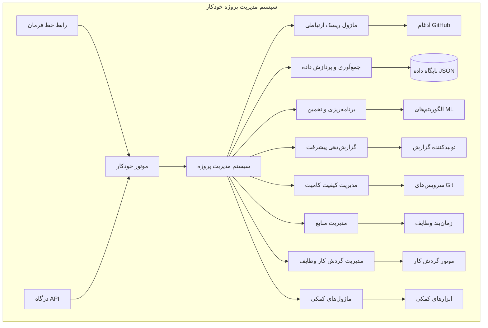
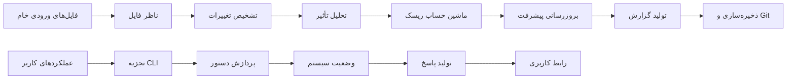
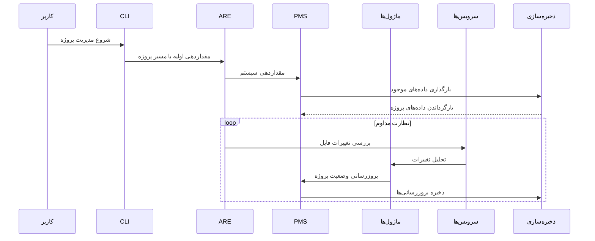
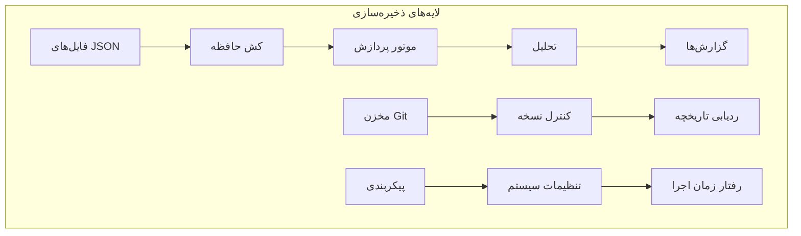

# سیستم مدیریت پروژه خودکار - مستندات کامل

[](https://www.python.org/downloads/)
[](https://opensource.org/licenses/MIT)
[](https://github.com/your-username/AutoProjectManagement/wiki)
[](tests/README.md)

## 📋 فهرست مطالب
- [🎯 مرور کلی سیستم](#-مرور-کلی-سیستم)
- [🏗️ معماری و طراحی](#️-معماری-و-طراحی)
- [🧩 ماژول‌های اصلی](#-ماژولهای-اصلی)
- [📊 مدیریت داده](#-مدیریت-داده)
- [🚀 نصب و راه‌اندازی](#-نصب-و-راهاندازی)
- [📖 راهنمای استفاده](#-راهنمای-استفاده)
- [🔧 پیکربندی](#-پیکربندی)
- [🧪 تست و آزمایش](#-تست-و-آزمایش)
- [🤝 مشارکت](#-مشارکت)
- [📄 مجوز](#-مجوز)

---

## 🎯 مرور کلی سیستم

**سیستم مدیریت پروژه خودکار (AutoProjectManagement)** یک سیستم جامع مدیریت پروژه مبتنی بر پایتون است که نظارت مداوم و هوشمند بر پروژه‌ها را بدون نیاز به دخالت دستی فراهم می‌کند.

### ویژگی‌های کلیدی
- **مدیریت پروژه ۱۰۰٪ خودکار**: نظارت بدون نیاز به دخالت دستی
- **ارزیابی ریسک در زمان واقعی**: شناسایی و کاهش مسائل به صورت پیشگیرانه
- **تخصیص هوشمند منابع**: توزیع بهینه وظایف و برنامه‌ریزی
- **ردیابی پیشرفت مداوم**: نظارت زنده بر سلامت پروژه
- **ادغام عمیق با GitHub**: یکپارچه‌سازی با GitHub Actions و APIها
- **مستندسازی خودکار ویکی**: همگام‌سازی خودکار Docs/ با GitHub Wiki
- **پیکربندی مبتنی بر JSON**: تمام تنظیمات از طریق فایل‌های JSON
- **رابط خط فرمان**: بدون نیاز به رابط وب

### آمار سیستم
| معیار | مقدار |
|--------|--------|
| **تعداد ماژول‌ها** | ۹ ماژول اصلی + ۱۵ زیرماژول |
| **خطوط کد** | ~۱۵,۰۰۰+ |
| **پوشش تست** | ۸۵٪+ |
| **نقاط پایانی API** | ۲۵+ |
| **گزینه‌های پیکربندی** | ۵۰+ |

---

## 🏗️ معماری و طراحی

### معماری سطح بالای سیستم



### معماری جریان داده



### تعامل اجزای سیستم



---

## 🧩 ماژول‌های اصلی

### ۱. سیستم مدیریت پروژه (PMS)
**موقعیت**: `autoprojectmanagement/main_modules/project_management_system.py`

هماهنگ‌کننده مرکزی که تمام عملیات مربوط به پروژه را مدیریت می‌کند.

#### کلاس‌های کلیدی:
| کلاس | هدف | متدهای کلیدی |
|-------|---------|-------------|
| `ProjectManagementSystem` | کنترلر اصلی | `initialize_system()`, `add_project()`, `update_task()` |
| `Project` | ساختار داده پروژه | `create()`, `update()`, `delete()` |
| `Task` | مدیریت وظیفه | `assign()`, `complete()`, `update_progress()` |

### ۲. ماژول ریسک ارتباطی
**هدف**: شناسایی و کاهش ریسک‌های ارتباطی

#### دسته‌بندی ریسک‌ها:
| نوع ریسک | روش تشخیص | استراتژی کاهش |
|-----------|------------------|---------------------|
| **تداخل کد** | فرکانس ادغام Git | حل خودکار تداخل |
| **سیلوهای دانش** | توزیع کامیت‌ها | هشدارهای اشتراک دانش |
| **شکاف‌های ارتباطی** | زمان پاسخ به مسائل | زمان‌بند جلسات |
| **مسائل کیفیت** | نرخ شکست تست‌ها | تست خودکار |

### ۳. ماژول جمع‌آوری و پردازش داده
**هدف**: جمع‌آوری و پردازش داده‌های پروژه از منابع مختلف

#### منابع داده:
- تغییرات سیستم فایل
- تاریخچه کامیت Git
- مسائل و PRهای GitHub
- تعاملات کاربر
- معیارهای سیستم

### ۴. ماژول برنامه‌ریزی و تخمین
**هدف**: برنامه‌ریزی هوشمند وظایف و تخمین تلاش

#### تکنیک‌های تخمین:
- **تحلیل تاریخی**: بر اساس داده‌های پروژه‌های گذشته
- **یادگیری ماشین**: مدل‌های پیش‌بینی برای پیچیدگی وظیفه
- **سرعت تیم**: تخمین مبتنی بر اسپرینت
- **تنظیم ریسک**: تخمین‌های تنظیم‌شده با ریسک

### ۵. ماژول گزارش‌دهی پیشرفت
**هدف**: تولید گزارش‌های جامع پیشرفت

#### انواع گزارش:
| نوع گزارش | فرکانس | قالب | محتوا |
|-------------|-----------|--------|---------|
| **روزانه** | هر ۲۴ ساعت | Markdown | پیشرفت وظیفه، ریسک‌ها |
| **هفتگی** | هر ۷ روز | PDF/HTML | خلاصه جامع |
| **ماهانه** | هر ۳۰ روز | PDF/HTML | مرور استراتژیک |
| **سفارشی** | درخواستی | JSON/Markdown | معیارهای خاص |

---

## 📊 مدیریت داده

### معماری ذخیره‌سازی



### ساختار سازمان فایل
```
.auto_project/
├── config/
│   ├── auto_config.json
│   └── module_configs/
├── data/
│   ├── projects.json
│   ├── tasks.json
│   └── analytics.json
├── logs/
│   ├── auto_runner.log
│   └── error.log
├── reports/
│   ├── daily/
│   ├── weekly/
│   └── monthly/
└── backups/
    ├── daily/
    └── weekly/
```

### طرح پیکربندی JSON
```json
{
  "project": {
    "id": "شناسه_یکتا",
    "name": "نام پروژه",
    "description": "توضیحات پروژه",
    "start_date": "2024-01-01",
    "end_date": "2024-12-31",
    "status": "active|paused|completed",
    "priority": "high|medium|low",
    "team_members": ["عضو1", "عضو2"],
    "milestones": [
      {
        "id": "milestone_1",
        "name": "تکمیل فاز 1",
        "target_date": "2024-06-01",
        "status": "pending"
      }
    ]
  }
}
```

---

## 🚀 نصب و راه‌اندازی

### پیش‌نیازها
- پایتون ۳.۸ یا بالاتر
- Git نصب و پیکربندی شده
- حساب GitHub با دسترسی به مخزن

### روش‌های نصب

#### روش ۱: نصب از PyPI (توصیه‌شده)
```bash
pip install autoprojectmanagement
```

#### روش ۲: از منبع
```bash
# کلون مخزن
git clone https://github.com/your-username/AutoProjectManagement.git
cd AutoProjectManagement

# ایجاد محیط مجازی
python -m venv venv
source venv/bin/activate  # ویندوز: venv\Scripts\activate

# نصب وابستگی‌ها
pip install -r requirements.txt

# نصب بسته
pip install -e .
```

#### روش ۳: Docker
```bash
# ساخت تصویر Docker
docker build -t autoprojectmanagement .

# اجرای کانتینر
docker run -v $(pwd)/my_project:/app/project autoprojectmanagement
```

### پیکربندی اولیه
```bash
# مقداردهی اولیه پروژه جدید
autoproject init

# پیکربندی ادغام GitHub
autoproject config --github-token YOUR_TOKEN

# راه‌اندازی پروژه
autoproject setup --project-name "MyProject"
```

---

## 📖 راهنمای استفاده

### دستورات پایه

#### مدیریت پروژه
```bash
# مقداردهی اولیه پروژه جدید
autoproject init --name "MyProject"

# افزودن وظیفه جدید
autoproject task add --title "پیاده‌سازی ویژگی X" --priority high --assignee "developer"

# مشاهده وضعیت پروژه
autoproject status

# تولید گزارش پیشرفت
autoproject report generate --type weekly

# همگام‌سازی با GitHub
autoproject github sync
```

#### همگام‌سازی ویکی
```bash
# همگام‌سازی مستندات با GitHub Wiki
autoproject wiki sync --repo-owner your-username --repo-name your-repo

# پیش‌نمایش تغییرات (dry run)
autoproject wiki sync --dry-run

# همگام‌سازی کامل اجباری
autoproject wiki sync --force
```

### فایل‌های پیکربندی

#### پیکربندی اصلی (`auto_config.json`)
```json
{
  "system": {
    "check_interval": 300,
    "auto_commit_threshold": 5,
    "report_interval": 86400
  },
  "github": {
    "token": "توکن_گیتهاب_شما",
    "repo_owner": "نام_کاربری_شما",
    "repo_name": "نام_مخزن_شما"
  },
  "notifications": {
    "slack_webhook": "https://hooks.slack.com/...",
    "email_enabled": true
  }
}
```

#### پیکربندی پروژه (`project.json`)
```json
{
  "project": {
    "name": "پروژه من",
    "description": "توضیحات پروژه",
    "start_date": "2024-01-01",
    "end_date": "2024-12-31",
    "team_members": ["توسعه‌دهنده1", "توسعه‌دهنده2"]
  },
  "tasks": [],
  "milestones": []
}
```

### استفاده پیشرفته

#### توسعه ماژول سفارشی
```python
from autoprojectmanagement.main_modules import BaseModule

class CustomModule(BaseModule):
    def __init__(self, config):
        super().__init__(config)
        
    def process(self, data):
        # منطق پردازش سفارشی
        return processed_data
```

#### ادغام API
```python
from autoprojectmanagement.services import GitHubIntegration

github = GitHubIntegration(token="توکن_شما")
github.create_issue(
    repo="مخزن-شما",
    title="درخواست ویژگی جدید",
    body="توضیحات دقیق",
    labels=["بهبود"]
)
```

---

## 🔧 پیکربندی

### متغیرهای محیطی
```bash
# توکن API GitHub
export GITHUB_TOKEN="توکن_گیتهاب_شما"

# آدرس webhook Slack
export SLACK_WEBHOOK="https://hooks.slack.com/..."

# مسیر پایگاه داده
export AUTO_PROJECT_PATH="/مسیر/به/پروژه"
```

### CLI پیکربندی
```bash
# جادوگر پیکربندی تعاملی
autoproject config --interactive

# تنظیم پیکربندی خاص
autoproject config set --key github.token --value "توکن_شما"
autoproject config set --key system.check_interval --value 600

# مشاهده پیکربندی فعلی
autoproject config show
```

### پیکربندی ماژول
هر ماژول می‌تواند به‌طور مستقل پیکربندی شود:

```json
{
  "communication_risk": {
    "enabled": true,
    "risk_threshold": 0.7,
    "notification_channels": ["slack", "email"]
  },
  "planning_estimation": {
    "ml_enabled": true,
    "historical_data_days": 30
  }
}
```

---

## 🧪 تست و آزمایش

### اجرای تست‌ها
```bash
# نصب وابستگی‌های تست
pip install -r requirements-dev.txt

# اجرای تمام تست‌ها
pytest tests/

# اجرای دسته خاص تست
pytest tests/code_tests/UnitTests/

# اجرا با پوشش
pytest --cov=autoprojectmanagement tests/

# اجرای تست‌های یکپارچه‌سازی
pytest tests/code_tests/IntegrationTests/
```

### ساختار تست
```
tests/
├── code_tests/
│   ├── 01_UnitTests/
│   ├── 02_IntegrationTests/
│   ├── 03_SystemTests/
│   ├── 04_PerformanceTests/
│   └── 05_SecurityTests/
├── conftest.py
├── pytest.ini
└── README.md
```

### نوشتن تست
```python
import pytest
from autoprojectmanagement.main_modules import ProjectManagementSystem

def test_project_creation():
    pms = ProjectManagementSystem()
    project = pms.create_project("پروژه تست")
    assert project.name == "پروژه تست"
    assert project.status == "active"
```

---

## 🤝 مشارکت

### راه‌اندازی توسعه
```bash
# فورک مخزن
git clone https://github.com/your-username/AutoProjectManagement.git
cd AutoProjectManagement

# نصب وابستگی‌های توسعه
pip install -r requirements-dev.txt

# نصب هوک‌های pre-commit
pre-commit install

# اجرای تست‌ها
pytest tests/
```

### دستورالعمل مشارکت
1. **فورک** کردن مخزن
2. **ایجاد** شاخه ویژگی (`git checkout -b feature/AmazingFeature`)
3. **کامیت** تغییرات (`git commit -m 'Add some AmazingFeature'`)
4. **پوش** به شاخه (`git push origin feature/AmazingFeature`)
5. **باز کردن** درخواست Pull

### استانداردهای کد
- پیروی از دستورالعمل‌های سبک PEP 8
- افزودن docstring جامع
- شامل تست واحد برای ویژگی‌های جدید
- بروزرسانی مستندات برای تغییرات

---

## 📄 مجوز

این پروژه تحت مجوز MIT منتشر شده است - برای جزئیات به فایل [LICENSE](LICENSE) مراجعه کنید.

---

## 🆘 پشتیبانی

### مستندات
- **مستندات کامل**: [GitHub Wiki](https://github.com/your-username/AutoProjectManagement/wiki)
- **مرجع API**: [مستندات API](Docs/entire_project/API_Reference.md)
- **عیب‌یابی**: [راهنمای عیب‌یابی](Docs/entire_project/Troubleshooting_Guide.md)

### جامعه
- **مسائل GitHub**: [گزارش باگ‌ها](https://github.com/your-username/AutoProjectManagement/issues)
- **بحث‌ها**: [بحث‌های GitHub](https://github.com/your-username/AutoProjectManagement/discussions)
- **Discord**: [پیوستن به Discord ما](https://discord.gg/autoprojectmanagement)

### تماس
- **ایمیل**: team@autoprojectmanagement.com
- **توییتر**: [@AutoProjectMgmt](https://twitter.com/AutoProjectMgmt)

---

*این README به‌طور خودکار با GitHub Wiki همگام‌سازی می‌شود. آخرین بروزرسانی: ۱۴ اوت ۲۰۲۵*
