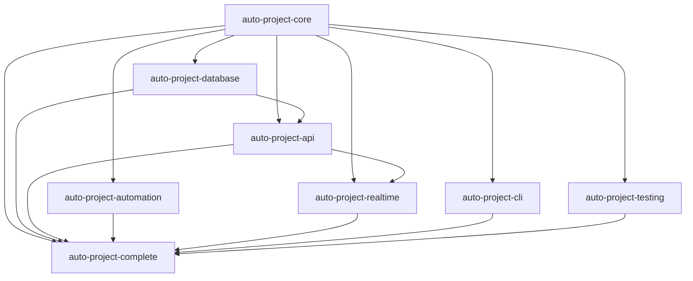

# Detailed Migration Plan for AutoProjectManagement

## 🎯 Overview
تبدیل پروژه به معماری میکروسرویس با ۸ پکیج مستقل

## 📦 Package List

### 1. auto-project-core
**هدف:** هسته اصلی سیستم مدیریت پروژه  
**فایل‌های اصلی:**
- `autoprojectmanagement/main_modules/project_management_system.py`
- `autoprojectmanagement/main_modules/task_management.py`
- `autoprojectmanagement/main_modules/resource_management.py`
- `autoprojectmanagement/main_modules/risk_management.py`

**تست‌ها:**
- `tests/code_tests/01_UnitTests/main_modules/test_project_management_system.py`
- `tests/code_tests/01_UnitTests/main_modules/test_task_management.py`
- `tests/code_tests/01_UnitTests/main_modules/test_resource_management.py`

**مدت زمان تخمینی:** ۴ روز

### 2. auto-project-api
**هدف:** APIها و endpointها  
**فایل‌های اصلی:**
- `autoprojectmanagement/api/sse_endpoints_complete.py`
- `autoprojectmanagement/api/main.py`
- `autoprojectmanagement/api/services.py`

**تست‌ها:**
- `tests/code_tests/01_UnitTests/api/test_main.py`
- `tests/code_tests/01_UnitTests/api/test_sse_endpoints.py`
- `tests/code_tests/01_UnitTests/api/test_services.py`

**مدت زمان تخمینی:** ۳ روز

### 3. auto-project-database
**هدف:** مدیریت داده و JSON  
**فایل‌های اصلی:**
- `autoprojectmanagement/services/json_data_linker.py`
- `autoprojectmanagement/services/configuration_cli/json_data_linker.py`

**تست‌ها:**
- تست‌های مربوط به JSON data management

**مدت زمان تخمینی:** ۲ روز

### 4. auto-project-automation
**هدف:** سرویس‌های اتوماسیون  
**فایل‌های اصلی:**
- `autoprojectmanagement/services/automation_services/auto_file_watcher.py`
- سایر فایل‌های automation_services

**تست‌ها:**
- تست‌های مربوط به automation services

**مدت زمان تخمینی:** ۳ روز

### 5. auto-project-realtime
**هدف:** ارتباط real-time  
**فایل‌های اصلی:**
- `autoprojectmanagement/api/realtime_service.py`
- فایل‌های مربوط به SSE و WebSocket

**تست‌ها:**
- تست‌های integration real-time

**مدت زمان تخمینی:** ۳ روز

### 6. auto-project-cli
**هدف:** رابط خط فرمان  
**فایل‌های اصلی:**
- `autoprojectmanagement/cli.py`
- `autoprojectmanagement/cli_dashboard.py`

**تست‌ها:**
- تست‌های CLI commands

**مدت زمان تخمینی:** ۲ روز

### 7. auto-project-testing
**هدف:** ابزارهای تست  
**فایل‌های اصلی:**
- `tests/run_comprehensive_tests.py`
- `tests/conftest.py`
- تمام فایل‌های تست

**مدت زمان تخمینی:** ۲ روز

### 8. auto-project-complete
**هدف:** پکیج کامل (meta package)  
**فایل‌های اصلی:**
- `__init__.py` برای imports همه پکیج‌ها
- فایل‌های integration

**مدت زمان تخمینی:** ۲ روز

## 🗓️ Timeline

### فاز ۱: برنامه‌ریزی و طراحی (۱ هفته)
- [ ] طراحی ساختار پکیج‌ها
- [ ] تعیین وابستگی‌ها
- [ ] برنامه migration دقیق
- [ ] ایجاد مستندات فنی

### فاز ۲: توسعه پکیج‌ها (۲-۳ هفته)
- [ ] auto-project-core (۴ روز)
- [ ] auto-project-database (۲ روز)
- [ ] auto-project-api (۳ روز)
- [ ] auto-project-automation (۳ روز)
- [ ] auto-project-realtime (۳ روز)
- [ ] auto-project-cli (۲ روز)
- [ ] auto-project-testing (۲ روز)
- [ ] auto-project-complete (۲ روز)

### فاز ۳: تست و اعتبارسنجی (۱ هفته)
- [ ] Unit tests برای هر پکیج
- [ ] Integration tests بین پکیج‌ها
- [ ] Performance testing
- [ ] Security testing

### فاز ۴: انتشار و مستندسازی (۱ هفته)
- [ ] ایجاد ریپازیتوری‌های GitHub
- [ ] تنظیم CI/CD pipelines
- [ ] ایجاد مستندات کاربری
- [ ] انتشار نسخه اولیه

## 🔗 Dependencies

## 🚀 Deployment Strategy

### ۱. نسخه‌گذاری Semantic
- `major.minor.patch` برای هر پکیج
- مدیریت وابستگی‌ها با version pinning

### ۲. CI/CD Pipeline
- GitHub Actions برای هر ریپازیتوری
- Automated testing روی هر commit
- Automated deployment به PyPI

### ۳. مستندسازی
- README.md برای هر پکیج
- API documentation با Sphinx
- مثال‌های کاربردی
- Tutorials گام به گام

### ۴. Monitoring
- نظارت بر عملکرد هر پکیج
- error tracking
- usage analytics

## ⚠️ ریسک‌ها و راهکارها
