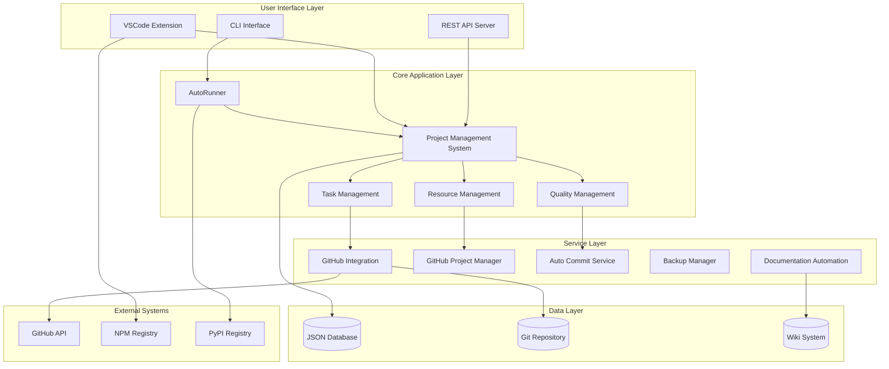
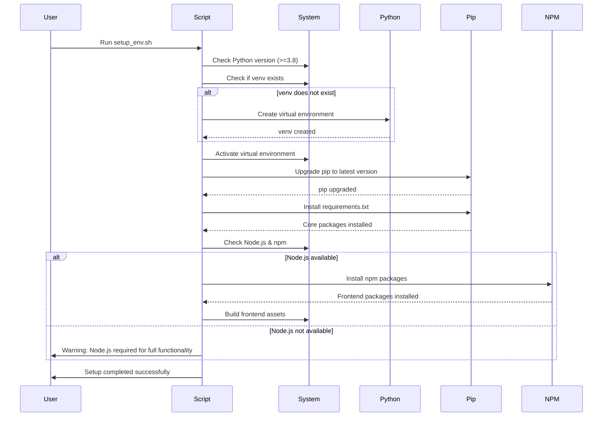
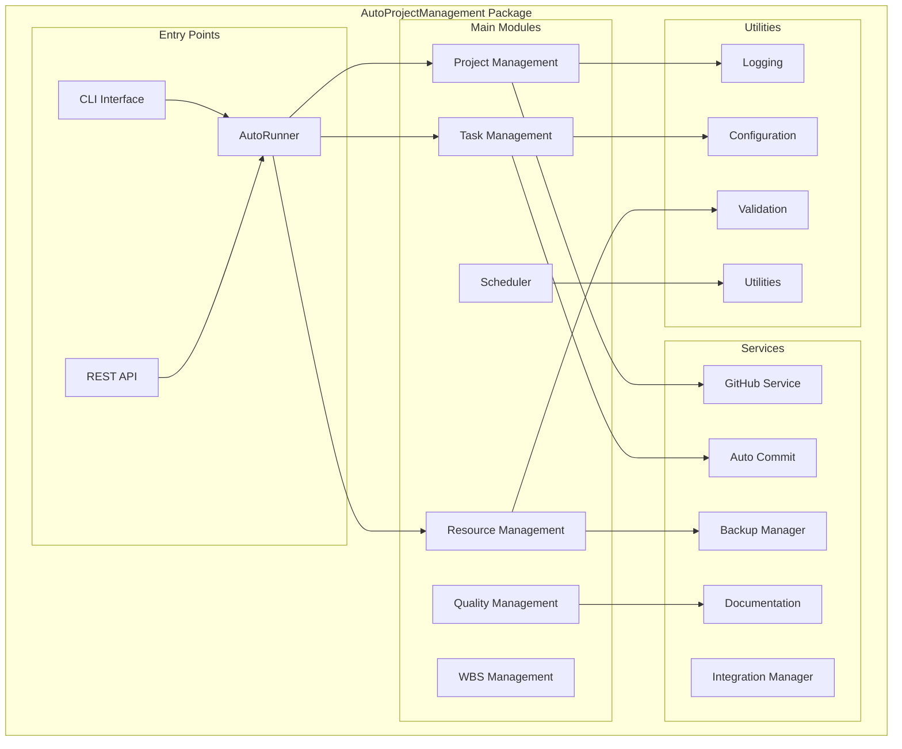
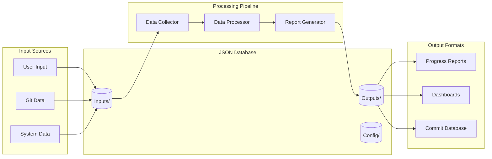
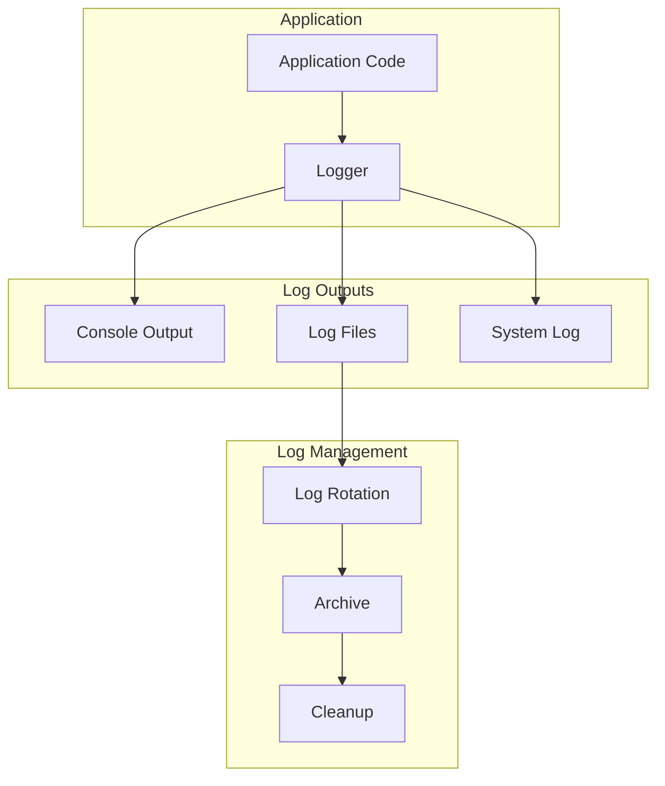

# AutoProjectManagement - Comprehensive Environment Architecture & System Design

## 🏗️ System Architecture Overview

### High-Level Architecture Diagram



## 🐍 Python Virtual Environment Structure

### Detailed Virtual Environment Layout

```
AutoProjectManagement/
├── 📁 venv/                           # Python Virtual Environment
│   ├── 📁 bin/                        # Executable scripts (Linux/Mac)
│   │   ├── activate                   # Environment activation script
│   │   ├── activate.csh               # C-shell activation
│   │   ├── activate.fish              # Fish shell activation
│   │   ├── python                     # Python interpreter (venv)
│   │   ├── python3                    # Python3 symlink
│   │   ├── pip                        # Package installer
│   │   ├── pip3                       # Pip3 symlink
│   │   ├── pytest                     # Testing framework
│   │   ├── black                      # Code formatter
│   │   ├── flake8                     # Linter
│   │   └── mypy                       # Type checker
│   ├── 📁 Scripts/                    # Executable scripts (Windows)
│   │   ├── activate.bat               # Windows activation
│   │   ├── deactivate.bat             # Windows deactivation
│   │   ├── python.exe                 # Windows Python interpreter
│   │   └── pip.exe                    # Windows pip
│   ├── 📁 lib/                        # Python libraries
│   │   └── python3.x/
│   │       ├── 📁 site-packages/      # Installed packages
│   │       │   ├── 📁 autoprojectmanagement/
│   │       │   ├── 📁 click/
│   │       │   ├── 📁 rich/
│   │       │   ├── 📁 requests/
│   │       │   ├── 📁 pytest/
│   │       │   └── 📁 ... (other dependencies)
│   │       └── 📁 dist-packages/      # System packages (if any)
│   ├── 📁 include/                    # C headers for binary packages
│   └── 📁 pyvenv.cfg                  # Virtual environment configuration
```

## 📦 Package Dependencies & Requirements

### Core Dependencies (requirements.txt)

```txt
# Core Framework
click>=8.1.3                    # CLI framework
rich>=12.5.1                   # Rich terminal output
pyyaml>=6.0                    # YAML configuration files
jinja2>=3.1.2                  # Template engine

# HTTP & API
requests>=2.28.1               # HTTP client
urllib3>=1.26.12               # HTTP library

# Data Processing
python-dateutil>=2.8.2         # Date/time utilities
pytz>=2022.1                   # Timezone definitions

# File System
pathlib2>=2.3.7                # Path manipulation
watchdog>=2.1.9               # File system events

# Development Tools
setuptools>=65.3.0            # Package management
wheel>=0.37.1                 # Wheel packaging
```

### Development Dependencies (requirements-dev.txt)

```txt
# Testing Framework
pytest>=7.1.2                 # Testing framework
pytest-cov>=3.0.0            # Coverage reporting
pytest-mock>=3.8.2           # Mocking utilities
pytest-asyncio>=0.19.0       # Async testing

# Code Quality
black>=22.6.0                # Code formatter
flake8>=5.0.4                # Linting
mypy>=0.971                  # Type checking
isort>=5.10.1                # Import sorting

# Documentation
sphinx>=5.1.1                # Documentation generator
sphinx-rtd-theme>=1.0.0    # Documentation theme

# Security
bandit>=1.7.4                # Security linting
safety>=2.1.1                # Dependency vulnerability scanner
```

## 🔄 Installation & Setup Flow

### Automated Setup Process (setup_env.sh)



## 🎯 Module Architecture

### Core Module Structure



## 📊 Data Flow Architecture

### JSON Database Structure



## 🔧 Configuration Management

### Environment Variables & Configuration

```yaml
# Environment Configuration
environment:
  development:
    debug: true
    log_level: DEBUG
    auto_commit: false
  
  production:
    debug: false
    log_level: INFO
    auto_commit: true

# GitHub Configuration
github:
  token: ${GITHUB_TOKEN}
  repository: ${GITHUB_REPO}
  branch: ${GITHUB_BRANCH:-main}

# Database Configuration
database:
  json_path: "./JSonDataBase"
  backup_enabled: true
  backup_interval: 3600  # seconds

# API Configuration
api:
  host: ${API_HOST:-localhost}
  port: ${API_PORT:-8000}
  debug: ${API_DEBUG:-false}
```

## 🚀 Deployment Architecture

### Docker Support (Optional)

```dockerfile
# Dockerfile
FROM python:3.9-slim

WORKDIR /app

# Install system dependencies
RUN apt-get update && apt-get install -y \
    git \
    nodejs \
    npm \
    && rm -rf /var/lib/apt/lists/*

# Copy requirements
COPY requirements.txt requirements-dev.txt ./

# Install Python dependencies
RUN pip install --no-cache-dir -r requirements.txt -r requirements-dev.txt

# Copy application code
COPY . .

# Create non-root user
RUN useradd -m -u 1000 appuser
USER appuser

# Expose port
EXPOSE 8000

# Run application
CMD ["python", "-m", "autoprojectmanagement.api.main"]
```

### Docker Compose Configuration

```yaml
# docker-compose.yml
version: '3.8'

services:
  autoprojectmanagement:
    build: .
    ports:
      - "8000:8000"
    environment:
      - GITHUB_TOKEN=${GITHUB_TOKEN}
      - GITHUB_REPO=${GITHUB_REPO}
    volumes:
      - ./JSonDataBase:/app/JSonDataBase
      - ./.git:/app/.git
    restart: unless-stopped
```

## 📈 Monitoring & Logging

### Logging Architecture



## 🔍 Testing Architecture

### Test Structure

```
tests/
├── 📁 unit/                    # Unit tests
│   ├── test_project_management.py
│   ├── test_task_management.py
│   └── test_resource_management.py
├── 📁 integration/             # Integration tests
│   ├── test_github_integration.py
│   └── test_api_endpoints.py
├── 📁 system/                  # System tests
│   ├── test_full_workflow.py
│   └── test_deployment.py
├── 📁 fixtures/                # Test data
└── 📁 mocks/                   # Mock objects
```

## 🎯 Quick Start Commands

### Development Environment

```bash
# Clone repository
git clone <repository-url>
cd AutoProjectManagement

# Run setup script
chmod +x setup_env.sh
./setup_env.sh

# Activate environment
source venv/bin/activate  # Linux/Mac
# or
venv\Scripts\activate     # Windows

# Run tests
pytest tests/

# Start development server
python -m autoprojectmanagement.api.main

# Run CLI
autoprojectmanagement --help
```

### Production Deployment

```bash
# Install production dependencies only
pip install -r requirements.txt

# Set environment variables
export GITHUB_TOKEN="your-token"
export GITHUB_REPO="owner/repo"

# Run application
python -m autoprojectmanagement.auto_runner
```

## 📋 Health Check Commands

```bash
# Check Python version
python --version

# Verify virtual environment
which python

# Check installed packages
pip list

# Run health check
python -c "import autoprojectmanagement; print('OK')"

# Test API
curl http://localhost:8000/health
```

This comprehensive environment diagram provides a complete overview of the AutoProjectManagement system architecture, including all components, dependencies, and deployment configurations as implemented in the project.
