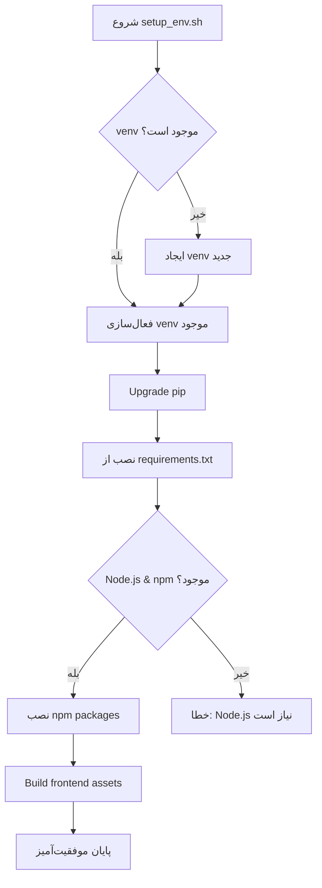

# محیط مجازی و فایل نیازمندی‌ها - نمودار ساختاری

## 🏗️ ساختار محیط مجازی Python

```
AutoProjectManagement/
├── 📁 venv/                    # محیط مجازی Python
│   ├── 📁 bin/                 # اسکریپت‌های فعال‌سازی و ابزار
│   │   ├── activate            # فعال‌سازی محیط در Linux/Mac
│   │   ├── python              # Python interpreter محیط مجازی
│   │   ├── pip                 # Package manager محیط مجازی
│   │   └── ...
│   ├── 📁 lib/                 # کتابخانه‌های Python
│   │   └── python3.x/
│   │       └── site-packages/  # پکیج‌های نصب شده
│   └── 📁 include/             # هدرهای C برای پکیج‌های باینری
```

## 📋 فایل‌های نیازمندی‌ها

### 1. requirements.txt (پکیج‌های اصلی)
```
autoprojectmanagement/
├── 📄 requirements.txt          # پکیج‌های اصلی پروژه
│   ├── python-dateutil>=2.8.2
│   ├── pytz>=2022.1
│   ├── requests>=2.28.1
│   ├── click>=8.1.3
│   ├── rich>=12.5.1
│   ├── pyyaml>=6.0
│   ├── jinja2>=3.1.2
│   └── ...
```

### 2. requirements-dev.txt (پکیج‌های توسعه)
```
autoprojectmanagement/
├── 📄 requirements-dev.txt      # پکیج‌های توسعه و تست
│   ├── pytest>=7.1.2
│   ├── pytest-cov>=3.0.0
│   ├── black>=22.6.0
│   ├── flake8>=5.0.4
│   ├── mypy>=0.971
│   └── ...
```

## 🔄 جریان نصب توسط setup_env.sh



## 📊 لیست پکیج‌های کلیدی

### پکیج‌های اصلی پروژه:
| پکیج | کاربرد |
|------|--------|
| **click** | CLI interface |
| **rich** | Rich terminal output |
| **requests** | HTTP requests |
| **pyyaml** | YAML configuration |
| **jinja2** | Template rendering |
| **python-dateutil** | Date/time handling |

### پکیج‌های توسعه:
| پکیج | کاربرد |
|------|--------|
| **pytest** | Testing framework |
| **black** | Code formatting |
| **flake8** | Linting |
| **mypy** | Type checking |

## 🎯 دستورات اجرایی

### فعال‌سازی محیط:
```bash
# در دایرکتوری اصلی پروژه:
source venv/bin/activate  # Linux/Mac
# یا
venv\Scripts\activate     # Windows
```

### نصب دستی:
```bash
# فقط پکیج‌های اصلی:
pip install -r requirements.txt

# با پکیج‌های توسعه:
pip install -r requirements.txt -r requirements-dev.txt
```

## 🔍 بررسی وضعیت پس از نصب
```bash
# لیست پکیج‌های نصب شده:
pip list

# بررسی نسخه Python:
python --version

# بررسی فعال بودن محیط:
which python  # باید مسیر venv را نشان دهد
