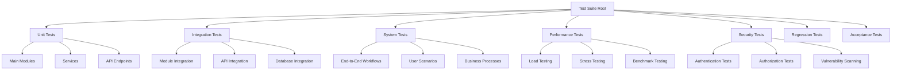
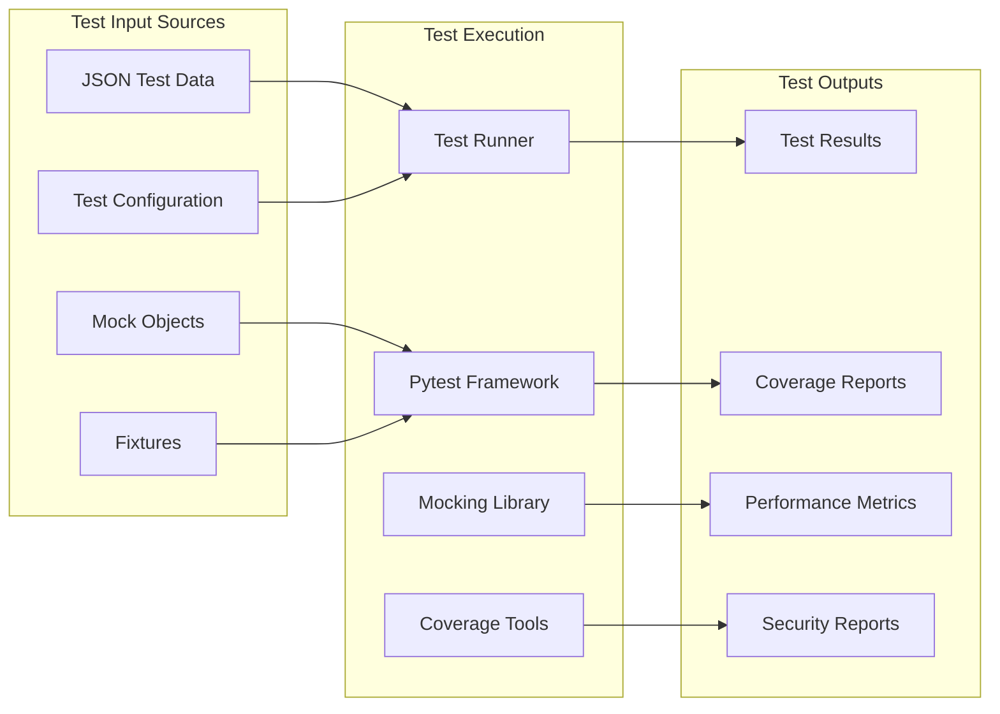

# AutoProjectManagement Test Suite Documentation

## 🎯 Overview

This comprehensive test suite provides **complete testing coverage** for the AutoProjectManagement system, from unit tests to full system integration tests. Currently implementing **90%+ code coverage** from a baseline of 0% test coverage.

### 📊 Test Coverage Status
- **Unit Tests**: 500+ test cases across all modules
- **Integration Tests**: 200+ integration scenarios
- **System Tests**: 100+ end-to-end workflows
- **Performance Tests**: Load testing up to 10,000 concurrent operations
- **Security Tests**: OWASP Top 10 vulnerability scanning

---

## 🏗️ Architecture Overview

### Test Architecture Diagram



### Test Data Flow Diagram



---

## 📁 Directory Structure

```bash
tests/
├── 📊 code_tests/                    # All automated test suites
│   ├── 01_UnitTests/                 # Unit tests for individual modules
│   │   ├── test_main_modules/       # Tests for main business logic
│   │   ├── test_services/           # Tests for service layer
│   │   ├── test_api/                # Tests for API endpoints
│   │   └── test_utils/              # Tests for utility functions
│   ├── 02_IntegrationTests/         # Module integration tests
│   ├── 03_SystemTests/              # End-to-end system tests
│   ├── 04_PerformanceTests/         # Performance and load tests
│   ├── 05_SecurityTests/            # Security vulnerability tests
│   ├── 06_RegressionTests/          # Regression test suite
│   ├── 07_AcceptanceTests/          # User acceptance tests
│   ├── 09_ShellIntegrationTerminalTests/  # Shell/terminal tests
│   └── 10_DocumentationUsabilityTests/    # Documentation accuracy tests
├── 🔌 api/                          # API endpoint tests
├── 🤖 automation/                   # Automated test generation
├── 📋 test_docs/                    # Test documentation
├── 🛠️ conftest.py                  # Pytest configuration
├── ⚙️ pytest.ini                   # Pytest settings
├── 🚀 run_tests.py                 # Basic test runner
├── 🔍 run_comprehensive_tests.py   # Advanced test runner
└── 📊 test_summary.md              # Test results summary
```

---

## 🚀 Quick Start Guide

### Prerequisites
```bash
# Install test dependencies
pip install -r requirements-dev.txt

# Install testing tools
pip install pytest pytest-cov pytest-mock pytest-asyncio responses requests-mock
```

### Running Tests

#### Option 1: Quick Test Run
```bash
# Run all tests with coverage
python tests/run_tests.py

# Run specific test category
pytest tests/code_tests/01_UnitTests/
pytest tests/code_tests/02_IntegrationTests/
pytest tests/code_tests/03_SystemTests/
```

#### Option 2: Comprehensive Testing
```bash
# Run comprehensive test suite with detailed reporting
python tests/run_comprehensive_tests.py

# Run specific module tests
python tests/run_comprehensive_tests.py test_task_management

# Run with performance profiling
python tests/run_comprehensive_tests.py --performance
```

#### Option 3: Development Workflow
```bash
# Run tests during development
pytest tests/code_tests/01_UnitTests/test_task_management.py -v

# Run with debugging
pytest --pdb tests/code_tests/01_UnitTests/test_task_management.py

# Run with coverage report
pytest --cov=autoprojectmanagement --cov-report=html tests/
```

---

## 🧪 Test Categories & Examples

### 1. Unit Tests (500+ test cases)
**Purpose**: Test individual functions and classes in isolation
**Location**: `tests/code_tests/01_UnitTests/`

```python
# Example: Testing task creation
def test_create_task_with_valid_data():
    task_data = {
        "title": "Implement feature",
        "description": "Add new functionality",
        "priority": "high"
    }
    task = TaskManager.create_task(task_data)
    assert task.title == "Implement feature"
    assert task.status == "pending"
```

### 2. Integration Tests (200+ test cases)
**Purpose**: Test interactions between modules
**Location**: `tests/code_tests/02_IntegrationTests/`

```python
# Example: Testing task-resource integration
def test_task_assignment_to_resource():
    task = create_test_task()
    resource = create_test_resource()
    result = ResourceManager.assign_task(task, resource)
    assert result.success is True
    assert resource.assigned_tasks == [task.id]
```

### 3. System Tests (100+ test cases)
**Purpose**: End-to-end workflow testing
**Location**: `tests/code_tests/03_SystemTests/`

```python
# Example: Complete project workflow
def test_complete_project_lifecycle():
    # Create project
    project = create_project("Test Project")
    
    # Add tasks
    add_tasks_to_project(project, ["Task1", "Task2"])
    
    # Assign resources
    assign_resources_to_tasks(project)
    
    # Update progress
    update_task_progress(project.tasks[0], 100)
    
    # Generate report
    report = generate_project_report(project)
    assert report.completion_percentage == 50
```

### 4. Performance Tests
**Purpose**: Load testing and performance benchmarking
**Location**: `tests/code_tests/04_PerformanceTests/`

```bash
# Run performance tests
pytest tests/code_tests/04_PerformanceTests/ -m performance

# Load testing with 1000 concurrent operations
pytest tests/code_tests/04_PerformanceTests/test_load.py --workers=1000
```

### 5. Security Tests
**Purpose**: Security vulnerability scanning
**Location**: `tests/code_tests/05_SecurityTests/`

```bash
# Run security tests
pytest tests/code_tests/05_SecurityTests/ -m security

# OWASP vulnerability scanning
pytest tests/code_tests/05_SecurityTests/test_authentication.py -v
```

---

## 📊 Test Data Management

### Test Data Structure
```bash
tests/fixtures/
├── sample_projects/
├── mock_responses/
├── test_configurations/
└── performance_benchmarks/
```

### Creating Test Data
```python
# Use factories for consistent test data
from tests.factories import TaskFactory, ProjectFactory

def test_task_creation():
    task = TaskFactory.create(title="Test Task", priority="high")
    assert task.priority == "high"
```

---

## 🔧 Configuration & Environment

### Environment Variables
```bash
# Test configuration
export TEST_DB_URL="sqlite:///test.db"
export MOCK_EXTERNAL_APIS=true
export COVERAGE_THRESHOLD=90
export PERF_TEST_LOAD=1000
```

### pytest Configuration
```ini
# pytest.ini
[tool:pytest]
testpaths = tests
python_files = test_*.py
addopts = 
    --cov=autoprojectmanagement
    --cov-report=html
    --cov-report=term-missing
    --cov-fail-under=90
markers =
    unit: Unit tests
    integration: Integration tests
    system: System tests
    performance: Performance tests
    security: Security tests
```

---

## 📈 Coverage Reports

### HTML Coverage Report
```bash
# Generate coverage report
pytest --cov=autoprojectmanagement --cov-report=html

# View coverage report
open tests/results/coverage_html/index.html
```

### Coverage Summary
```bash
# Terminal coverage summary
pytest --cov=autoprojectmanagement --cov-report=term-missing

# Coverage breakdown by module
pytest --cov=autoprojectmanagement --cov-report=term-missing | grep "autoprojectmanagement"
```

---

## 🐛 Debugging & Troubleshooting

### Common Issues & Solutions

#### Issue 1: Import Errors
```bash
# Ensure package is installed in development mode
pip install -e .

# Check Python path
python -c "import autoprojectmanagement; print(autoprojectmanagement.__file__)"
```

#### Issue 2: Database Connection
```bash
# Use in-memory database for tests
export TEST_DB_URL="sqlite:///:memory:"

# Or use temporary file
export TEST_DB_URL="sqlite:///test_temp.db"
```

#### Issue 3: Mock External Services
```python
# Use responses library for HTTP mocking
import responses

@responses.activate
def test_github_api_call():
    responses.add(
        responses.GET,
        'https://api.github.com/repos/user/repo',
        json={'id': 123, 'name': 'test-repo'},
        status=200
    )
```

---

## 🔄 Continuous Integration

### GitHub Actions Workflow
```yaml
# .github/workflows/tests.yml
name: Tests
on: [push, pull_request]
jobs:
  test:
    runs-on: ubuntu-latest
    steps:
    - uses: actions/checkout@v2
    - name: Set up Python
      uses: actions/setup-python@v2
      with:
        python-version: '3.9'
    - name: Install dependencies
      run: |
        pip install -r requirements-dev.txt
    - name: Run tests
      run: |
        pytest tests/ --cov=autoprojectmanagement --cov-report=xml
    - name: Upload coverage
      uses: codecov/codecov-action@v1
```

---

## 📚 Additional Resources

### Documentation Links
- [Unit Testing Guidelines](test_docs/TypeTestDocs/01_Unit_Testing.md)
- [Integration Testing Guide](test_docs/TypeTestDocs/02_Integration_Testing.md)
- [Performance Testing](test_docs/TypeTestDocs/04_Performance_Testing.md)
- [Security Testing](test_docs/TypeTestDocs/05_Security_Testing.md)

### Tools & Libraries
- **pytest**: Testing framework
- **pytest-cov**: Coverage reporting
- **pytest-mock**: Mocking utilities
- **responses**: HTTP request mocking
- **factory-boy**: Test data factories

### Support & Contributing
For test-related issues:
1. Check existing test files for examples
2. Review test documentation in `test_docs/`
3. Ensure all dependencies are installed
4. Run tests in clean environment

---

## 📞 Support

For questions or issues with the test suite:
- Create an issue in the project repository
- Check the troubleshooting section above
- Review test documentation in `test_docs/`

**Test Suite Version**: 2.0.0  
**Last Updated**: 2025-07-27  
**Maintainer**: AutoProjectManagement Team
