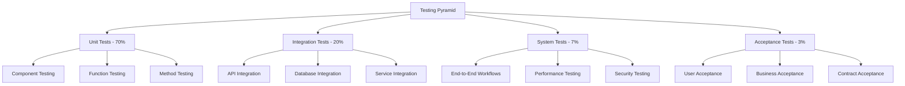
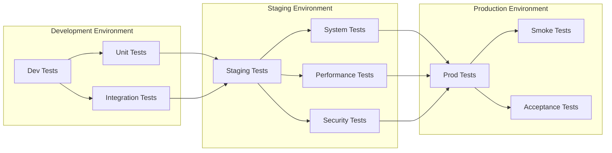
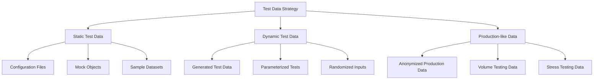
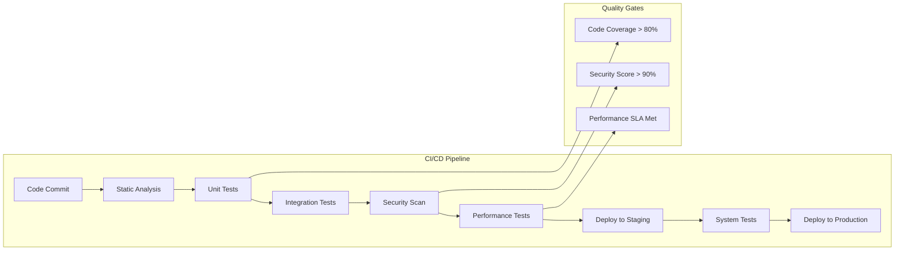
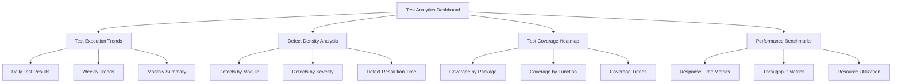
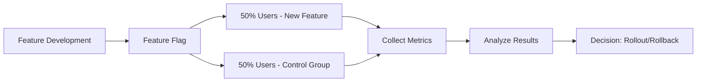

# Enhanced Master Testing Document for ProjectManagement System

_Last updated: 2025-07-27_

---

## Executive Summary

This enhanced master document provides a comprehensive framework for all testing activities within the ProjectManagement system. It serves as the central nervous system for quality assurance, integrating detailed testing strategies, architectural diagrams, and implementation guidelines that ensure robust, scalable, and user-centric software delivery.

---

## 1. Testing Architecture Overview

### 1.1 System Architecture Context

The ProjectManagement system employs a multi-layered testing architecture that mirrors the software development lifecycle. Our testing pyramid approach ensures optimal resource allocation while maintaining comprehensive coverage.

### 1.2 Testing Pyramid Strategy



---

## 2. Comprehensive Testing Framework

### 2.1 Testing Layers and Responsibilities

| Layer | Scope | Responsibility | Tools | Frequency |
|-------|--------|----------------|--------|-----------|
| **Unit** | Individual components | Logic validation | pytest, unittest | Every commit |
| **Integration** | Module interactions | Interface testing | pytest, Postman | Daily |
| **System** | Complete system | End-to-end validation | Selenium, Cypress | Weekly |
| **Acceptance** | Business requirements | User validation | Manual, Jira | Per release |
| **Performance** | Load & stress | Scalability testing | JMeter, Locust | Monthly |
| **Security** | Vulnerability assessment | Security validation | OWASP ZAP, Bandit | Quarterly |

### 2.2 Testing Environment Matrix



---

## 3. Detailed Testing Strategies

### 3.1 Risk-Based Testing Approach

We employ a risk-based testing methodology that prioritizes testing efforts based on:

1. **Business Impact**: Critical business functions receive highest priority
2. **Technical Complexity**: Complex integrations require extensive testing
3. **User Frequency**: High-usage features get continuous testing
4. **Regulatory Compliance**: Compliance requirements drive specific test cases

### 3.2 Test Case Design Patterns

#### 3.2.1 Boundary Value Analysis
- Input validation testing at edge cases
- Database field limit testing
- API parameter boundary testing

#### 3.2.2 Equivalence Partitioning
- User role-based testing scenarios
- Data type validation testing
- Configuration variation testing

#### 3.2.3 Decision Table Testing
- Business rule validation
- Workflow state transition testing
- Permission matrix validation

### 3.3 Test Data Management Strategy



---

## 4. Advanced Testing Techniques

### 4.1 Test Automation Framework

Our automation framework follows the Page Object Model (POM) pattern for maintainability and scalability:

#### 4.1.1 Framework Architecture
```
tests/
├── automation/
│   ├── pages/
│   │   ├── base_page.py
│   │   ├── dashboard_page.py
│   │   └── project_page.py
│   ├── tests/
│   │   ├── test_dashboard.py
│   │   └── test_project_management.py
│   ├── utils/
│   │   ├── driver_factory.py
│   │   └── test_data_manager.py
│   └── reports/
│       └── html_reporter.py
```

### 4.2 Continuous Testing Pipeline



### 4.3 Shift-Left Testing Strategy

We implement shift-left testing by:

1. **Early Test Design**: Creating test cases during requirements gathering
2. **Developer Testing**: Encouraging TDD practices
3. **Continuous Feedback**: Real-time test results in development environment
4. **Automated Quality Checks**: Pre-commit hooks and PR validations

---

## 5. Testing Metrics and KPIs

### 5.1 Quality Metrics Dashboard

| Metric Category | KPI | Target | Measurement Method |
|-----------------|-----|--------|-------------------|
| **Test Coverage** | Code Coverage | > 85% | pytest-cov |
| **Test Effectiveness** | Defect Detection Rate | > 95% | Jira integration |
| **Test Efficiency** | Test Execution Time | < 30 min | CI/CD analytics |
| **Test Reliability** | Flaky Test Rate | < 2% | Test analytics |
| **Quality Gate** | Security Score | > 90% | OWASP ZAP |

### 5.2 Test Reporting Dashboard



---

## 6. Testing Tools and Infrastructure

### 6.1 Testing Tool Stack

| Category | Primary Tool | Secondary Tool | Purpose |
|----------|--------------|----------------|---------|
| **Unit Testing** | pytest | unittest | Python testing |
| **Web Testing** | Selenium | Cypress | UI automation |
| **API Testing** | Postman | REST Assured | API validation |
| **Performance** | JMeter | Locust | Load testing |
| **Security** | OWASP ZAP | Bandit | Security scanning |
| **Mocking** | pytest-mock | responses | Test doubles |
| **Reporting** | Allure | HTMLTestRunner | Test reports |

### 6.2 Testing Infrastructure

#### 6.2.1 Container-Based Testing
- Docker containers for consistent test environments
- Docker Compose for multi-service testing
- Kubernetes for scalability testing

#### 6.2.2 Cloud-Based Testing
- AWS Device Farm for cross-browser testing
- BrowserStack for mobile testing
- Sauce Labs for parallel execution

---

## 7. Advanced Testing Scenarios

### 7.1 Chaos Engineering Testing

We implement chaos engineering principles to test system resilience:

1. **Service Failure Simulation**: Random service shutdowns
2. **Network Partition Testing**: Simulating network failures
3. **Resource Exhaustion**: Memory and CPU stress testing
4. **Database Failure**: Connection pool exhaustion testing

### 7.2 A/B Testing Framework

For feature validation, we employ A/B testing:



---

## 8. Compliance and Regulatory Testing

### 8.1 GDPR Compliance Testing
- Data anonymization testing
- Right to deletion implementation
- Consent management testing

### 8.2 Accessibility Testing (WCAG 2.1)
- Screen reader compatibility
- Keyboard navigation testing
- Color contrast validation

### 8.3 Security Standards Compliance
- OWASP Top 10 vulnerability testing
- SOC 2 compliance validation
- ISO 27001 security controls testing

---

## 9. Testing Documentation Standards

### 9.1 Test Case Documentation Template

Each test case must include:
- **Test Case ID**: Unique identifier
- **Test Description**: Clear, concise description
- **Preconditions**: Required system state
- **Test Steps**: Detailed step-by-step instructions
- **Expected Results**: Specific expected outcomes
- **Actual Results**: Actual test outcomes
- **Test Data**: Required test data
- **Postconditions**: System state after test

### 9.2 Test Evidence Requirements

- Screenshots for UI tests
- Log files for backend tests
- Performance metrics for load tests
- Security scan reports for security tests

---

## 10. Continuous Improvement Framework

### 10.1 Test Retrospectives
- Monthly test effectiveness reviews
- Quarterly testing strategy updates
- Annual testing tool evaluation

### 10.2 Test Debt Management
- Regular flaky test cleanup
- Test case optimization
- Automation coverage improvement

### 10.3 Knowledge Sharing
- Testing best practices documentation
- Cross-team testing workshops
- Testing tool training sessions

---

## 11. Emergency Testing Procedures

### 11.1 Hotfix Testing Protocol
1. **Immediate Regression Testing**: Run critical test suite
2. **Targeted Testing**: Focus on affected areas
3. **Smoke Testing**: Verify core functionality
4. **Production Monitoring**: Post-deployment validation

### 11.2 Incident Response Testing
- **Severity 1**: Full regression testing
- **Severity 2**: Affected module testing
- **Severity 3**: Targeted fix verification

---

## 12. Conclusion and Next Steps

This enhanced master testing document provides a comprehensive framework for ensuring the highest quality standards in the ProjectManagement system. Regular reviews and updates of this document ensure it remains aligned with evolving business needs and technological advancements.

### 12.1 Implementation Roadmap
1. **Phase 1**: Implement core testing framework (Week 1-2)
2. **Phase 2**: Deploy automation infrastructure (Week 3-4)
3. **Phase 3**: Establish metrics and reporting (Week 5-6)
4. **Phase 4**: Continuous improvement implementation (Ongoing)

### 12.2 Success Criteria
- 95% test coverage achieved
- < 2% flaky test rate
- < 24 hour defect resolution time
- 100% critical path test automation

---

**Document Owner**: QA Team  
**Review Schedule**: Monthly  
**Next Review Date**: 2025-08-27
