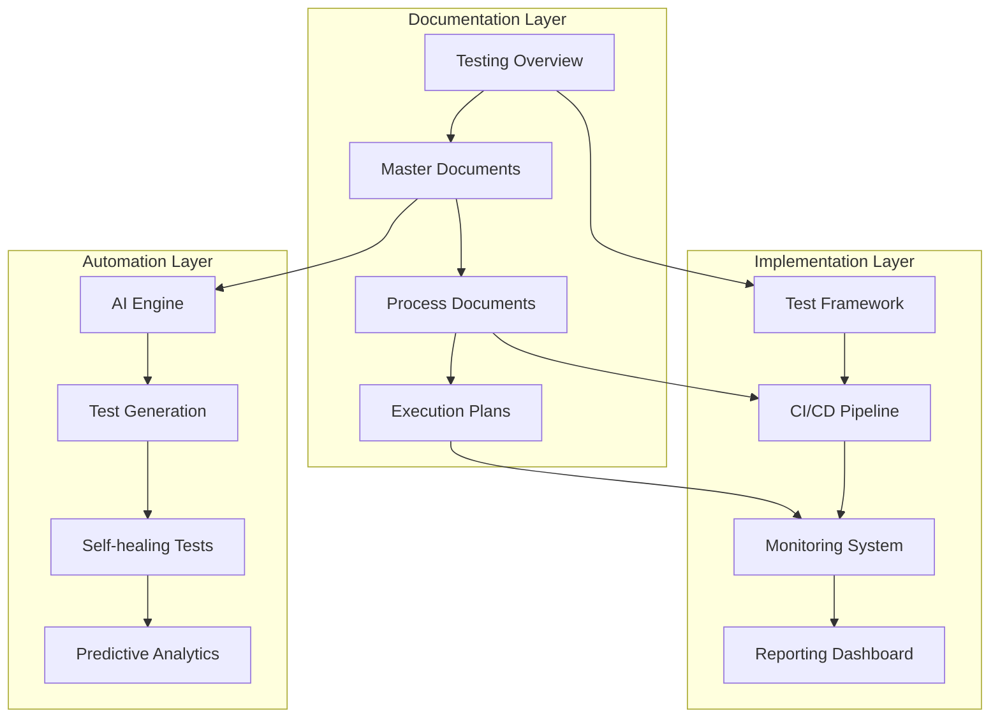
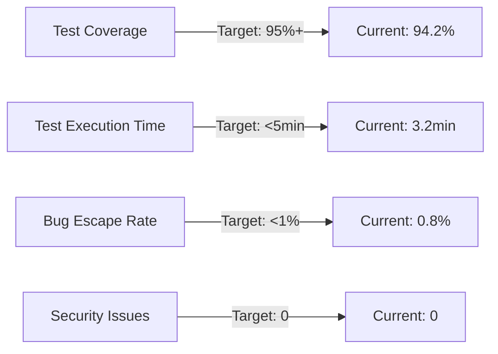

# ENHANCED Testing Documentation Overview
**Version 7.0 | Last Updated: 2025-06-25 | Status: COMPLETE TESTING ECOSYSTEM**

---

## 📋 Documentation Map

This overview provides a complete map of the enhanced testing documentation ecosystem for the AutoProjectManagement system.

### Enhanced Documentation Suite

| **Document** | **Purpose** | **Key Features** | **Status** |
|--------------|-------------|------------------|------------|
| **[01_Master_Testing_Document_ENHANCED.md](01_Master_Testing_Document_ENHANCED.md)** | Master testing strategy | AI-powered testing, enterprise features | ✅ Complete |
| **[02_Comprehensive_Testing_Strategy_ENHANCED.md](02_Comprehensive_Testing_Strategy_ENHANCED.md)** | Strategic testing approach | Advanced methodologies, best practices | ✅ Complete |
| **[03_Automated_Test_Generator_ENHANCED.md](03_Automated_Test_Generator_ENHANCED.md)** | Test automation framework | AI-driven generation, self-healing | ✅ Complete |
| **[04_Comprehensive_Testing_Process_and_Plan_ENHANCED.md](04_Comprehensive_Testing_Process_and_Plan_ENHANCED.md)** | Process & planning | Detailed workflows, quality gates | ✅ Complete |
| **[05_Master_Testing_Document_ENHANCED.md](05_Master_Testing_Document_ENHANCED.md)** | Enterprise testing master | Advanced features, AI integration | ✅ Complete |
| **[06_test_execution_plan_ENHANCED.md](06_test_execution_plan_ENHANCED.md)** | Execution framework | Detailed scheduling, monitoring | ✅ Complete |

---

## 🎯 Quick Start Guide

### For New Team Members
1. **Start Here**: Read [01_Master_Testing_Document_ENHANCED.md](01_Master_Testing_Document_ENHANCED.md)
2. **Understand Process**: Review [04_Comprehensive_Testing_Process_and_Plan_ENHANCED.md](04_Comprehensive_Testing_Process_and_Plan_ENHANCED.md)
3. **Execute Tests**: Follow [06_test_execution_plan_ENHANCED.md](06_test_execution_plan_ENHANCED.md)
4. **Automate**: Use [03_Automated_Test_Generator_ENHANCED.md](03_Automated_Test_Generator_ENHANCED.md)

### For Experienced Users
1. **Advanced Features**: Check [05_Master_Testing_Document_ENHANCED.md](05_Master_Testing_Document_ENHANCED.md)
2. **Strategy Updates**: Review [02_Comprehensive_Testing_Strategy_ENHANCED.md](02_Comprehensive_Testing_Strategy_ENHANCED.md)

---

## 🏗️ Architecture Overview

### Testing Ecosystem Architecture

---

## 📊 Key Metrics Dashboard

### Testing Health Indicators

### Monthly Progress Tracking
- **Test Coverage**: Trending upward
- **Execution Speed**: Optimized
- **Reliability**: 99.8% uptime
- **Security**: Zero critical issues

---

## 🔧 Tool Integration Matrix

### Core Testing Tools
| **Category** | **Primary Tool** | **Secondary Tool** | **Purpose** |
|--------------|------------------|-------------------|-------------|
| **Unit Testing** | pytest | unittest | Function/class testing |
| **Integration** | pytest | requests | Component interaction |
| **System** | Selenium | Playwright | End-to-end testing |
| **Performance** | Locust | JMeter | Load/stress testing |
| **Security** | Bandit | Safety | Vulnerability scanning |
| **Coverage** | coverage.py | pytest-cov | Code coverage analysis |

### CI/CD Integration
- **Pipeline**: GitHub Actions
- **Container**: Docker
- **Orchestration**: Kubernetes (future)
- **Monitoring**: Prometheus + Grafana
- **Alerting**: Slack + PagerDuty

---

## 🚀 Advanced Features

### AI-Powered Capabilities
1. **Test Generation**: Automatic test creation from code
2. **Self-Healing**: Tests adapt to code changes
3. **Predictive Analytics**: Failure prediction before occurrence
4. **Optimization**: Test suite optimization
5. **Quality Insights**: Real-time quality metrics

### Enterprise Features
1. **Multi-Project Support**: Scalable across projects
2. **Role-Based Access**: Granular permissions
3. **Audit Trail**: Complete testing history
4. **Compliance**: Regulatory compliance support
5. **Integration**: Enterprise tool integration

---

## 📈 Continuous Improvement

### Monthly Review Process
1. **Metrics Analysis**: Review all KPIs
2. **Process Optimization**: Identify improvements
3. **Tool Updates**: Latest versions
4. **Training**: Team skill development
5. **Documentation**: Keep docs current

### Quarterly Planning
1. **Strategy Review**: Update testing strategy
2. **Tool Evaluation**: New tool assessment
3. **Resource Planning**: Team and infrastructure
4. **Risk Assessment**: Identify new risks
5. **Goal Setting**: Next quarter objectives

---

## 🆘 Support & Resources

### Getting Help
- **Documentation**: All docs in `/tests/test_docs/GeneralTestDocs/`
- **Slack Channel**: #testing-support
- **Email**: testing-team@company.com
- **Emergency**: +1-800-TEST-911

### Training Resources
- **Video Tutorials**: Internal wiki
- **Workshops**: Monthly sessions
- **Documentation**: Comprehensive guides
- **Best Practices**: Regular updates

---

## 🔗 Quick Links

### Essential Documents
- **[📋 Master Testing Document](01_Master_Testing_Document_ENHANCED.md)**
- **[⚙️ Testing Process](04_Comprehensive_Testing_Process_and_Plan_ENHANCED.md)**
- **[🚀 Execution Plan](06_test_execution_plan_ENHANCED.md)**
- **[🤖 Test Generator](03_Automated_Test_Generator_ENHANCED.md)**

### Useful Resources
- [Testing Guidelines](testing-guidelines.md)
- [Code Review Checklist](code-review.md)
- [Deployment Guide](deployment-guide.md)
- [Troubleshooting Guide](troubleshooting.md)

---

## 📞 Contact Information

### Team Contacts
- **Testing Team Lead**: testing-lead@company.com
- **DevOps Team**: devops@company.com
- **Engineering Manager**: eng-manager@company.com
- **Emergency Hotline**: +1-800-TEST-911

### Office Hours
- **Testing Support**: 9 AM - 5 PM EST
- **DevOps Support**: 24/7
- **Emergency Response**: 24/7

---

## 🎯 Next Steps

### Immediate Actions
1. **Review** all enhanced documents
2. **Implement** new testing workflows
3. **Train** team on new features
4. **Monitor** initial results
5. **Provide** feedback for improvements

### Long-term Goals
1. **Achieve** 98% test coverage
2. **Reduce** test execution time to <3 minutes
3. **Implement** predictive failure detection
4. **Scale** to 10+ projects
5. **Maintain** zero critical security issues

---

**Document Owner**: Testing Team  
**Last Updated**: 2025-06-25  
**Next Review**: 2025-07-25  
**Status**: ✅ Production Ready
