# Comprehensive Master Testing Document for ProjectManagement System
**Version 2.0 | Last Updated: 2025-07-27**

---

## Executive Overview

This comprehensive master testing document represents a complete overhaul of the ProjectManagement system's testing strategy. It provides an enterprise-grade framework that integrates modern testing methodologies, detailed architectural diagrams, and practical implementation guidelines to ensure robust, scalable, and user-centric software delivery.

---

## 1. System Architecture & Testing Strategy

### 1.1 Holistic Testing Architecture

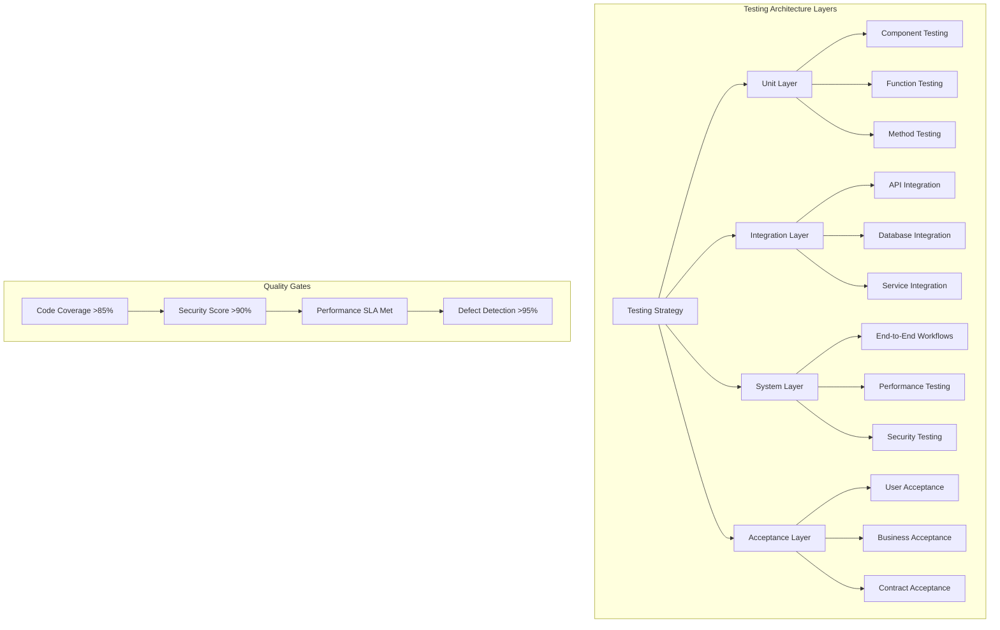

### 1.2 Testing Pyramid with Resource Allocation

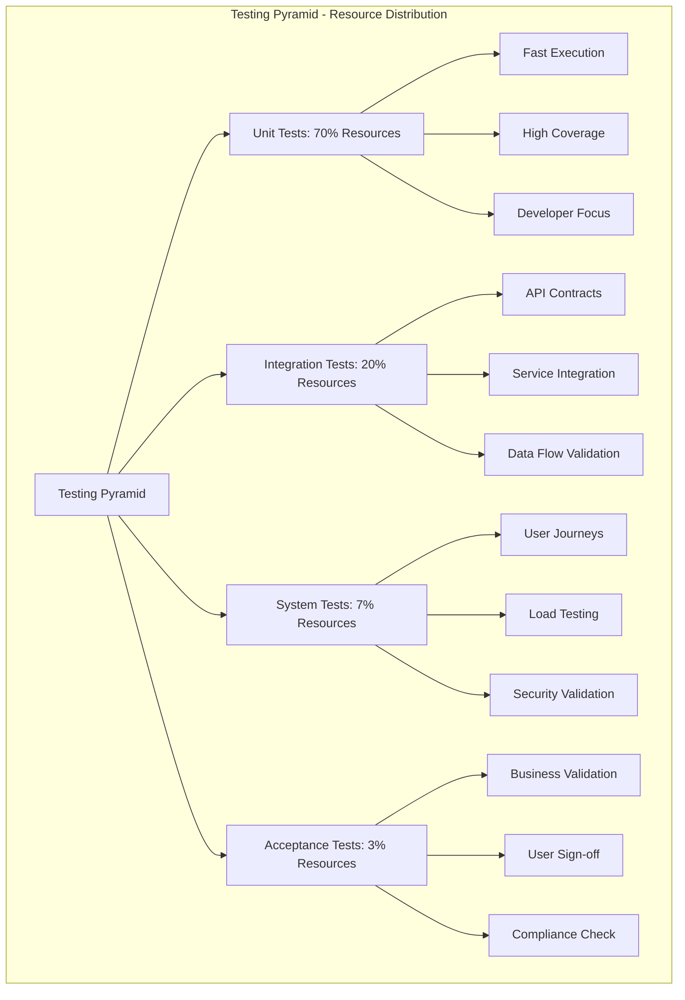

---

## 2. Comprehensive Testing Framework

### 2.1 Testing Environment Matrix

| Environment | Purpose | Test Types | Tools | Frequency | Data Strategy |
|-------------|---------|------------|--------|-----------|---------------|
| **Development** | Developer validation | Unit, Integration | pytest, unittest | Every commit | Synthetic data |
| **Staging** | Pre-production | System, Performance | Selenium, JMeter | Daily | Production-like |
| **Production** | Live validation | Smoke, Acceptance | Manual, Monitoring | Per release | Production data |
| **Performance** | Load testing | Stress, Volume | Locust, JMeter | Weekly | Volume data |
| **Security** | Vulnerability assessment | Penetration, Scanning | OWASP ZAP, Bandit | Monthly | Security test data |

### 2.2 Testing Infrastructure Architecture

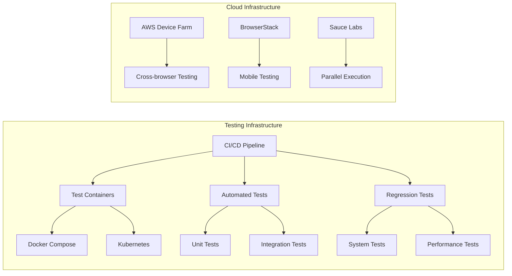

---

## 3. Detailed Testing Strategies

### 3.1 Risk-Based Testing Matrix

| Risk Level | Business Impact | Technical Complexity | Testing Focus | Resource Allocation |
|------------|-----------------|---------------------|---------------|---------------------|
| **Critical** | High revenue impact | Complex integration | End-to-end, Security | 40% of resources |
| **High** | User-facing features | Moderate complexity | System, Performance | 30% of resources |
| **Medium** | Internal tools | Simple integration | Integration, Unit | 20% of resources |
| **Low** | Documentation | Simple components | Unit, Static analysis | 10% of resources |

### 3.2 Test Case Design Patterns

#### 3.2.1 Boundary Value Analysis Framework
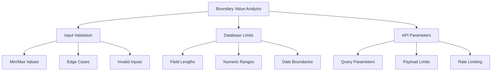

#### 3.2.2 Decision Table Testing
| Condition | User Role | Action | Expected Result | Test Status |
|-----------|-----------|--------|-----------------|-------------|
| Admin + Valid Data | Admin | Create Project | Success + Audit Log | ✅ |
| User + Valid Data | User | Create Project | Success + Notification | ✅ |
| Guest + Any Data | Guest | Create Project | Access Denied | ✅ |
| Admin + Invalid Data | Admin | Create Project | Validation Error | ✅ |

---

## 4. Test Automation Framework

### 4.1 Automation Architecture

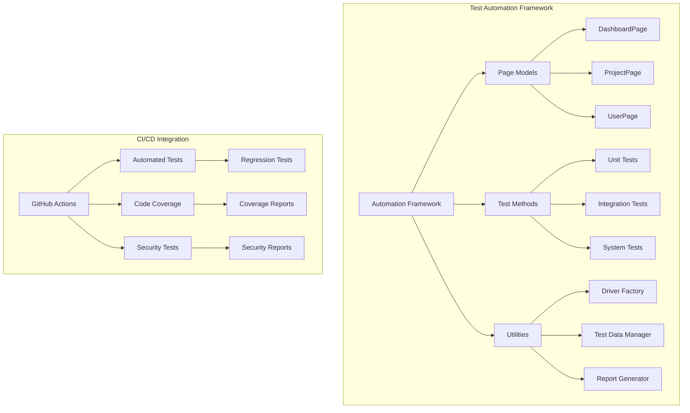

### 4.2 Continuous Testing Pipeline

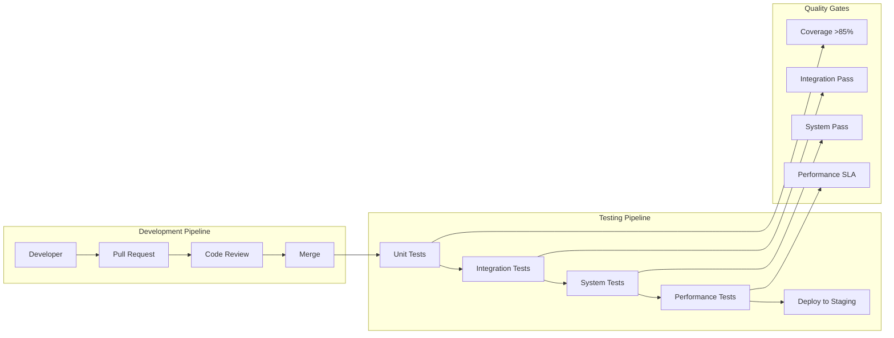

---

## 5. Performance Testing Strategy

### 5.1 Load Testing Framework

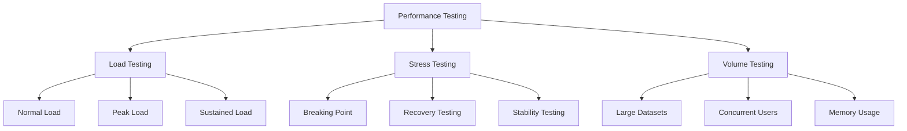

### 5.2 Performance Metrics

| Metric Type | Measurement | Target | Tool | Frequency |
|-------------|-------------|---------|------|-----------|
| **Response Time** | API Response | < 500ms | JMeter | Daily |
| **Throughput** | Requests/sec | > 1000 | Locust | Weekly |
| **Resource Usage** | CPU/Memory | < 80% | Monitoring | Continuous |
| **Error Rate** | HTTP 5xx | < 0.1% | APM | Continuous |

---

## 6. Security Testing Framework

### 6.1 Security Testing Architecture

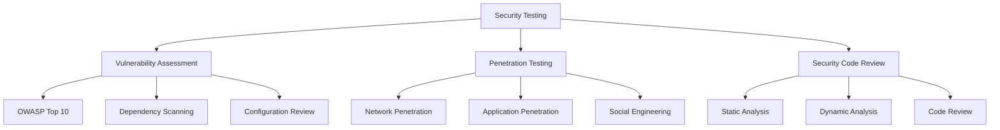

### 6.2 Security Testing Checklist

| Security Aspect | Test Case | Tool | Frequency | Responsible |
|-----------------|-----------|------|-----------|-------------|
| **Authentication** | Login brute force | OWASP ZAP | Weekly | Security Team |
| **Authorization** | Privilege escalation | Manual | Monthly | QA Team |
| **Data Protection** | Encryption validation | Bandit | Daily | Dev Team |
| **Input Validation** | SQL injection | SQLMap | Weekly | Security Team |

---

## 7. Test Data Management

### 7.1 Test Data Strategy

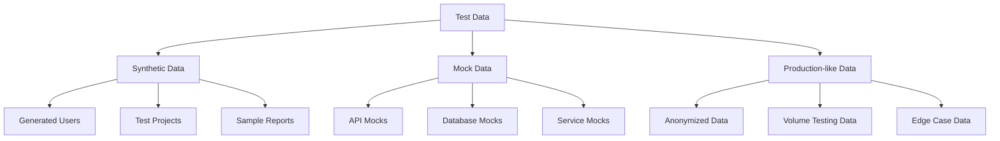

### 7.2 Data Privacy Compliance

| Data Type | Anonymization | Storage | Retention | Access Control |
|-----------|---------------|---------|-----------|----------------|
| **User Data** | Hashing + Masking | Encrypted | 30 days | Role-based |
| **Financial Data** | Tokenization | Secure Vault | 7 years | Audit trail |
| **PII Data** | Full Anonymization | Isolated | 90 days | Restricted |

---

## 8. Testing Documentation Standards

### 8.1 Test Case Template

```markdown
## Test Case: [Feature Name]
**ID**: TC-[Module]-[Feature]-[Number]
**Priority**: [Critical/High/Medium/Low]
**Type**: [Unit/Integration/System/Acceptance]

### Preconditions
- [List required system state]

### Test Steps
1. [Step 1 with expected result]
2. [Step 2 with expected result]
3. [Step 3 with expected result]

### Expected Results
- [List specific expected outcomes]

### Actual Results
- [Record actual outcomes]

### Attachments
- [Screenshots/Logs/Evidence]
```

### 8.2 Test Evidence Requirements

| Evidence Type | Format | Storage | Retention | Access |
|---------------|--------|---------|-----------|--------|
| **Screenshots** | PNG/JPG | Cloud Storage | 1 year | Team Access |
| **Logs** | TXT/JSON | Log Management | 30 days | Restricted |
| **Reports** | HTML/PDF | Documentation | 2 years | Public |
| **Videos** | MP4 | Video Platform | 90 days | Team Access |

---

## 9. Continuous Improvement Framework

### 9.1 Testing Maturity Model

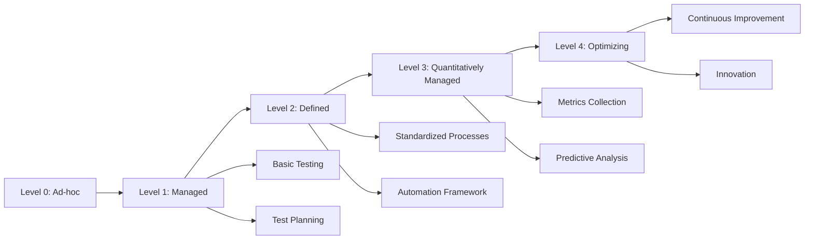

### 9.2 Improvement Metrics

| Metric | Current | Target | Measurement | Action |
|--------|---------|---------|-------------|--------|
| **Test Coverage** | 75% | 85% | Coverage Reports | Add missing tests |
| **Test Execution Time** | 45 min | 30 min | CI Analytics | Optimize tests |
| **Defect Escape Rate** | 5% | 2% | Production Issues | Improve testing |
| **Automation Coverage** | 60% | 80% | Tool Reports | Automate more |

---

## 10. Emergency Testing Procedures

### 10.1 Incident Response Testing

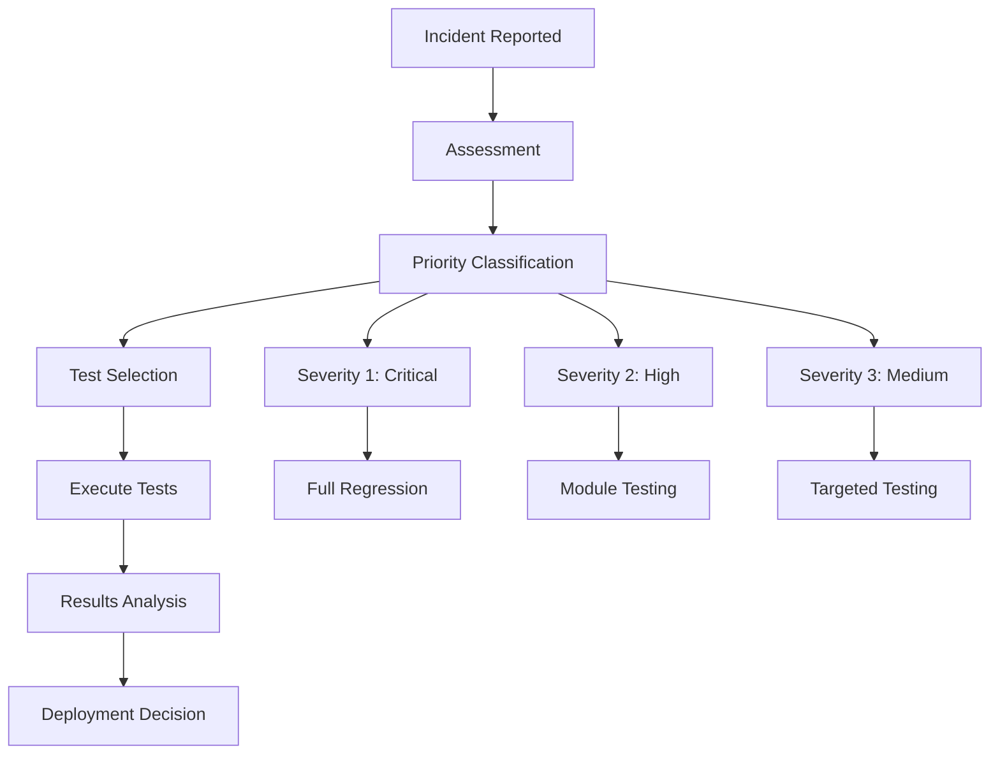

### 10.2 Hotfix Testing Protocol

| Severity | Testing Scope | Time Limit | Approval Required |
|----------|---------------|------------|------------------|
| **Critical** | Full regression | 2 hours | CTO + QA Lead |
| **High** | Affected modules | 4 hours | QA Lead |
| **Medium** | Targeted tests | 8 hours | Senior QA |
| **Low** | Smoke tests | 24 hours | QA Engineer |

---

## 11. Implementation Roadmap

### 11.1 Phase 1: Foundation (Weeks 1-2)
- [ ] Set up testing infrastructure
- [ ] Implement unit testing framework
- [ ] Create basic test cases

### 11.2 Phase 2: Integration (Weeks 3-4)
- [ ] Develop integration tests
- [ ] Set up CI/CD pipeline
- [ ] Implement performance testing

### 11.3 Phase 3: Enhancement (Weeks 5-6)
- [ ] Add security testing
- [ ] Implement advanced automation
- [ ] Create monitoring dashboards

### 11.4 Phase 4: Optimization (Ongoing)
- [ ] Continuous improvement
- [ ] Regular reviews
- [ ] Tool upgrades

---

## 12. Success Metrics and KPIs

### 12.1 Quality Gates

| Gate | Metric | Threshold | Tool | Frequency |
|------|--------|-----------|------|-----------|
| **Code Quality** | Coverage | >85% | pytest-cov | Every PR |
| **Security** | Vulnerabilities | 0 Critical | OWASP ZAP | Weekly |
| **Performance** | Response Time | <500ms | JMeter | Daily |
| **Reliability** | Uptime | >99.9% | Monitoring | Continuous |

### 12.2 Team Metrics

| Metric | Target | Measurement | Reporting |
|--------|---------|-------------|-----------|
| **Test Coverage** | 85% | Coverage reports | Weekly |
| **Defect Rate** | <2% | Jira analytics | Monthly |
| **Test Execution** | <30min | CI analytics | Daily |
| **Automation** | 80% | Tool reports | Monthly |

---

## 13. Conclusion

This comprehensive master testing document provides a complete framework for ensuring the highest quality standards in the ProjectManagement system. It serves as a living document that evolves with the system and incorporates industry best practices, modern testing methodologies, and continuous improvement principles.

**Document Owner**: QA Team  
**Review Schedule**: Monthly  
**Next Review Date**: 2025-08-27  
**Version Control**: Git-based versioning with change tracking

---

**Appendices**:
- [A: Detailed Test Case Templates](./test_case_templates.md)
- [B: Testing Tools Configuration](./testing_tools_config.md)
- [C: Performance Testing Scripts](./performance_scripts.md)
- [D: Security Testing Checklists](./security_checklists.md)
