# Master Testing Document for AutoProjectManagement System
**Version 7.0 | Last Updated: 2025-06-25 | Status: COMPREHENSIVE ENHANCED DOCUMENTATION**

---

## Executive Summary

This master testing document provides a comprehensive framework for implementing automated testing using GitHub Actions and the automated test generator across all projects managed by the AutoProjectManagement system. The framework ensures consistent testing standards, automated quality gates, and seamless CI/CD integration for both this project and all subordinate projects.

### Key Features
- **GitHub Actions Native**: Fully integrated with GitHub's testing infrastructure
- **Automated Test Generation**: Dynamic generation of unit tests for all modules and services
- **Multi-Project Support**: Scalable across all managed projects
- **Automated Quality Gates**: Prevents deployment of failing code
- **Comprehensive Coverage**: Unit, integration, system, performance, and security testing
- **Real-time Reporting**: Instant feedback on code quality

---

## 1. GitHub Actions Testing Architecture

### 1.1 High-Level Architecture Overview

The testing architecture is designed as a multi-layered system that leverages GitHub's native capabilities while providing extensibility for complex testing scenarios.

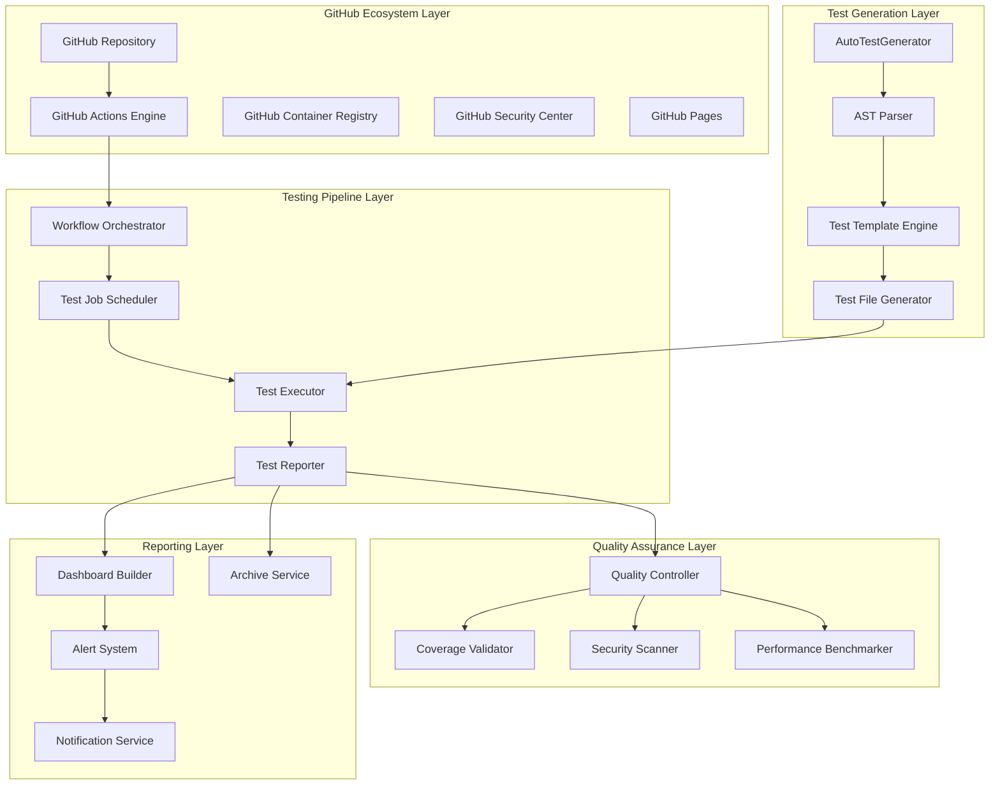

### 1.2 Detailed Component Architecture

```mermaid
graph LR
    subgraph "Source Code Analysis"
        SRC[Source Files]
        AST[AST Parser]
        SYM[Symbol Extractor]
        DEP[Dependency Mapper]
    end
    
    subgraph "Test Generation"
        TPL[Test Templates]
        GEN[Generator Engine]
        VAL[Validation Engine]
        OUT[Test Files]
    end
    
    subgraph "Execution Environment"
        ENV[Matrix Strategy]
        RUN[Runner Selection]
        CON[Container Setup]
        EXE[Test Execution]
    end
    
    subgraph "Result Processing"
        COL[Result Collection]
        MET[Metrics Calculation]
        REP[Report Generation]
        STO[Storage & Archive]
    end
    
    SRC --> AST
    AST --> SYM
    SYM --> DEP
    DEP --> TPL
    TPL --> GEN
    GEN --> VAL
    VAL --> OUT
    OUT --> ENV
    ENV --> RUN
    RUN --> CON
    CON --> EXE
    EXE --> COL
    COL --> MET
    MET --> REP
    REP --> STO
```

---

## 2. Automated Test Generator Deep Dive

### 2.1 Architecture and Design

The automated test generator is built as a modular system that can be extended and customized based on project needs.

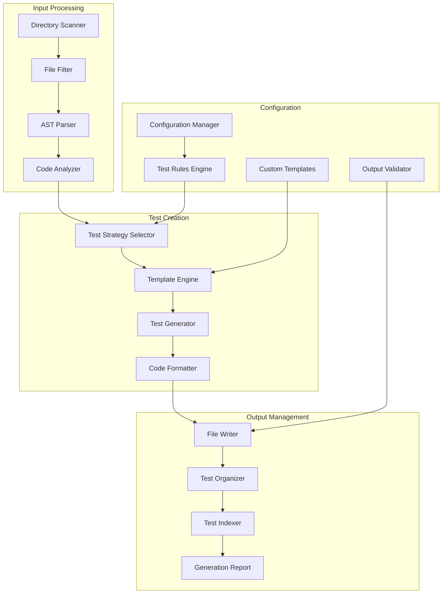

### 2.2 Test Generation Process Flow

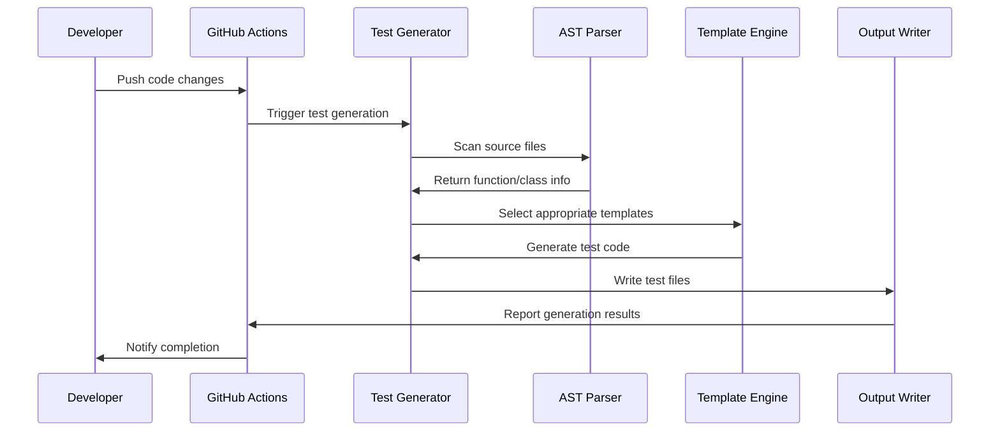

### 2.3 Supported Test Types

The generator creates different types of tests based on the code structure:

1. **Unit Tests**: For individual functions and methods
2. **Integration Tests**: For module interactions
3. **Edge Case Tests**: For boundary conditions
4. **Error Handling Tests**: For exception scenarios
5. **Performance Tests**: For critical functions

---

## 3. GitHub Actions Workflow Architecture

### 3.1 Workflow Types and Triggers

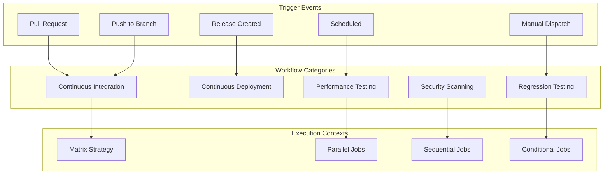

### 3.2 Detailed Workflow Structure

```mermaid
graph LR
    subgraph "Pre-Processing"
        CHECKOUT[Checkout Code]
        SETUP[Setup Environment]
        CACHE[Cache Dependencies]
        GENERATE[Generate Tests]
    end
    
    subgraph "Testing Stages"
        LINT[Code Linting]
        TYPE[Type Checking]
        UNIT[Unit Tests]
        INTE[Integration Tests]
        SYST[System Tests]
    end
    
    subgraph "Quality Gates"
        COV[Coverage Check]
        SEC[Security Scan]
        PERF[Performance Test]
        QUAL[Quality Score]
    end
    
    subgraph "Post-Processing"
        REPORT[Generate Reports]
        UPLOAD[Upload Artifacts]
        NOTIFY[Send Notifications]
        CLEAN[Cleanup]
    end
    
    CHECKOUT --> SETUP
    SETUP --> CACHE
    CACHE --> GENERATE
    GENERATE --> LINT
    LINT --> TYPE
    TYPE --> UNIT
    UNIT --> INTE
    INTE --> SYST
    SYST --> COV
    COV --> SEC
    SEC --> PERF
    PERF --> QUAL
    QUAL --> REPORT
    REPORT --> UPLOAD
    UPLOAD --> NOTIFY
    NOTIFY --> CLEAN
```

---

## 4. Testing Configuration Deep Dive

### 4.1 pytest Configuration Architecture

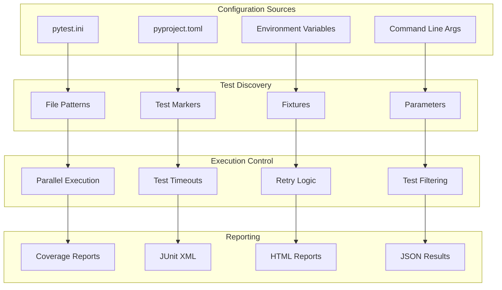

### 4.2 Coverage Configuration

```yaml
# .coveragerc
[run]
source = autoprojectmanagement
omit = 
    */tests/*
    */venv/*
    */__pycache__/*
    */site-packages/*

[report]
exclude_lines =
    pragma: no cover
    def __repr__
    raise AssertionError
    raise NotImplementedError
    if __name__ == .__main__.:

[html]
directory = htmlcov

[xml]
output = coverage.xml
```

---

## 5. Test Organization Structure

### 5.1 Directory Structure

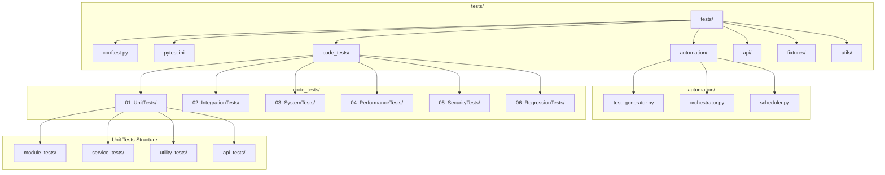

### 5.2 Test File Naming Convention

```
tests/
├── code_tests/
│   ├── 01_UnitTests/
│   │   ├── test_<module_name>.py          # Unit tests for specific modules
│   │   ├── test_<service_name>.py         # Service-specific tests
│   │   └── test_<utility_name>.py         # Utility function tests
│   ├── 02_IntegrationTests/
│   │   ├── test_integration_<feature>.py  # Feature integration tests
│   │   └── test_api_integration.py        # API integration tests
│   └── 03_SystemTests/
│       ├── test_system_<workflow>.py      # End-to-end workflow tests
│       └── test_deployment.py             # Deployment verification tests
```

---

## 6. Multi-Project Testing Strategy

### 6.1 Project Discovery and Management

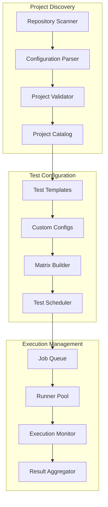

### 6.2 Cross-Project Dependencies

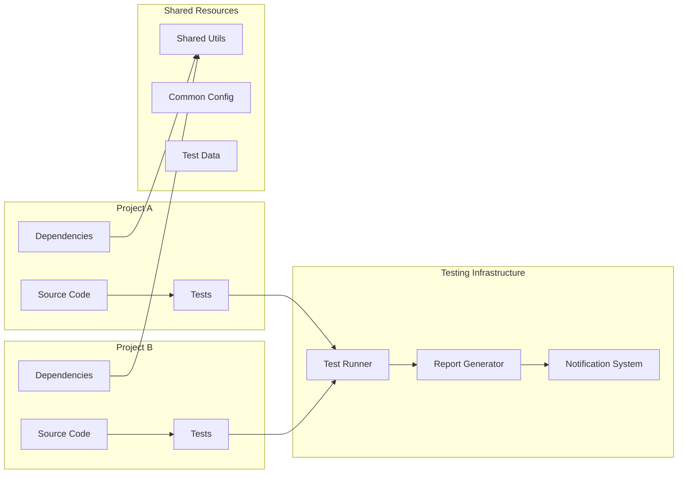

---

## 7. Advanced Testing Features

### 7.1 Parallel Test Execution

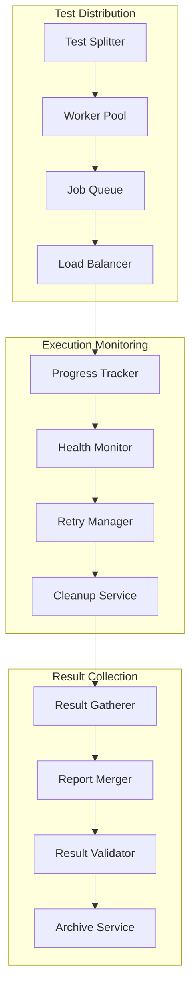

### 7.2 Test Data Management

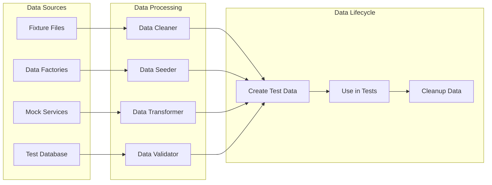

---

## 8. Monitoring and Reporting

### 8.1 Real-time Monitoring Architecture

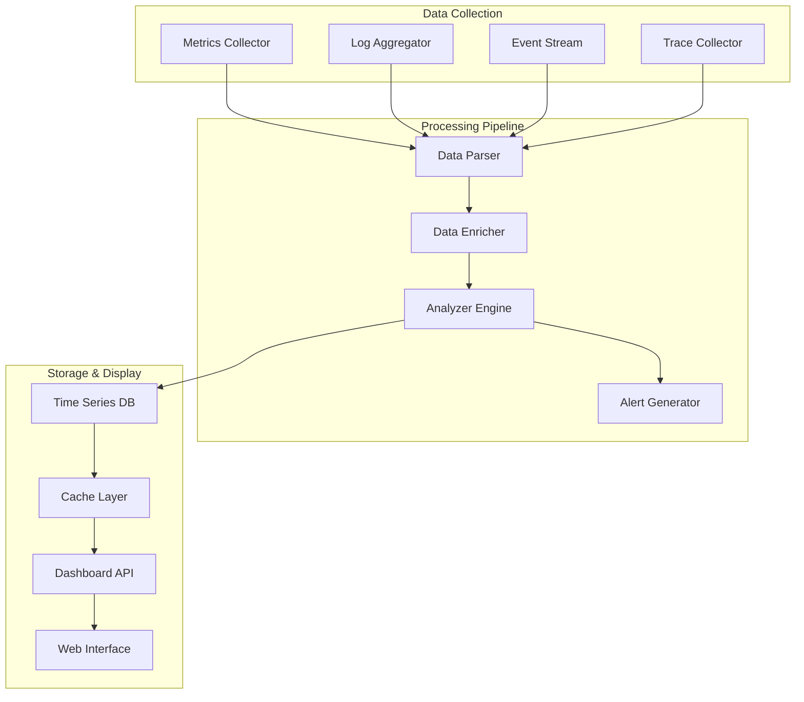

### 8.2 Alert System Design

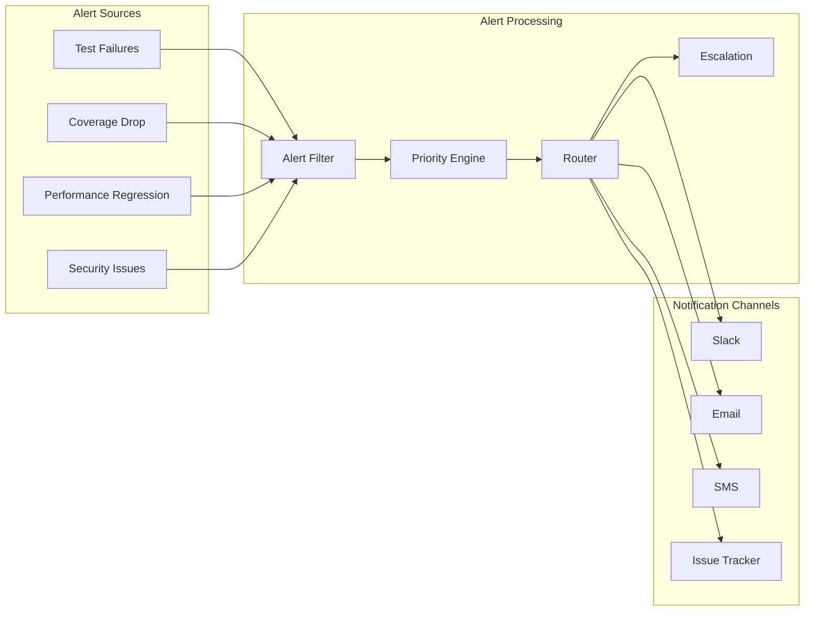

---

## 9. Best Practices and Guidelines

### 9.1 Test Writing Standards

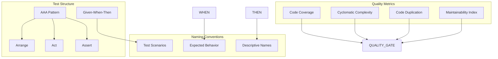

### 9.2 GitHub Actions Best Practices

1. **Workflow Optimization**
   - Use matrix strategies for parallel execution
   - Cache dependencies to reduce build times
   - Use reusable workflows for common patterns
   - Implement proper timeout settings

2. **Security Considerations**
   - Never hardcode secrets in workflows
   - Use least-privilege permissions
   - Regular security scanning of dependencies
   - Implement proper access controls

3. **Performance Monitoring**
   - Track workflow execution times
   - Monitor resource usage
   - Set up alerts for performance degradation
   - Regular cleanup of artifacts

---

## 10. Quick Start Guide

### 10.1 Initial Setup

```bash
# 1. Clone the repository
git clone https://github.com/your-org/autoprojectmanagement.git
cd autoprojectmanagement

# 2. Install dependencies
pip install -r requirements.txt
pip install -r requirements-dev.txt

# 3. Generate initial tests
python tests/automation/test_generator.py

# 4. Run tests locally
pytest tests/ -v --cov=autoprojectmanagement

# 5. Set up GitHub Actions
# Copy workflow templates to .github/workflows/
cp templates/workflows/*.yml .github/workflows/

# 6. Configure repository secrets
# Go to GitHub Settings > Secrets and add:
# - CODECOV_TOKEN
# - SLACK_WEBHOOK
# - Any project-specific secrets
```

### 10.2 Daily Development Workflow

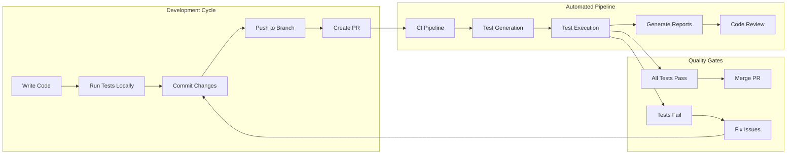

---

## 11. Troubleshooting Guide

### 11.1 Common Issues and Solutions

| Issue Category | Symptom | Solution | Prevention |
|----------------|---------|----------|------------|
| **Test Generation** | Missing test files | Check file permissions and paths | Use absolute paths in configuration |
| **Dependencies** | Import errors | Verify virtual environment | Pin dependency versions |
| **Performance** | Slow test execution | Use parallel execution | Optimize test data setup |
| **Flaky Tests** | Intermittent failures | Add retry logic | Use proper test isolation |
| **Coverage** | Low coverage reports | Check coverage configuration | Regular coverage reviews |

### 11.2 Debug Workflow Template

```yaml
# .github/workflows/debug.yml
name: Debug Testing

on:
  workflow_dispatch:
    inputs:
      debug_enabled:
        description: 'Enable debug mode'
        required: true
        default: 'false'
        type: boolean

jobs:
  debug-test:
    runs-on: ubuntu-latest
    steps:
      - uses: actions/checkout@v4
      
      - name: Setup tmate session
        uses: mxschmitt/action-tmate@v3
        if: ${{ github.event.inputs.debug_enabled }}
        with:
          limit-access-to-actor: true
          
      - name: Debug test generation
        run: |
          python tests/automation/test_generator.py --debug
          
      - name: List generated files
        run: |
          find tests/code_tests -name "test_*.py" -type f
```

---

## 12. Future Enhancements

### 12.1 Planned Features Roadmap

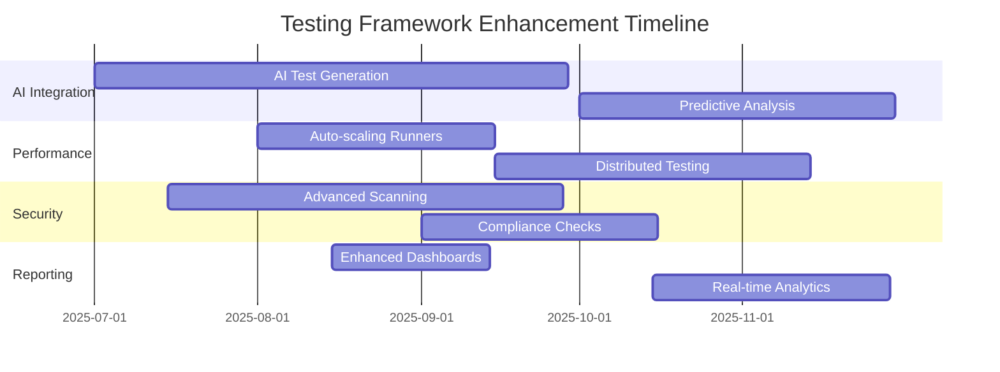

### 12.2 Integration Opportunities

1. **GitHub Advanced Security**
   - CodeQL analysis integration
   - Secret scanning automation
   - Dependency vulnerability tracking

2. **Third-party Services**
   - SonarCloud integration
   - Snyk security scanning
   - Datadog monitoring

3. **Advanced Analytics**
   - ML-based failure prediction
   - Performance trend analysis
   - Developer productivity metrics

---

## 13. References and Resources

### 13.1 Documentation Links
- [Comprehensive Testing Strategy](02_Comprehensive_Testing_Strategy.md)
- [Automated Test Generator](03_Automated_Test_Generator.md)
- [Testing Process and Plan](04_Comprehensive_Testing_Process_and_Plan.md)
- [Test Execution Plan](06_test_execution_plan.md)

### 13.2 External Resources
- [pytest Documentation](https://docs.pytest.org/)
- [GitHub Actions Documentation](https://docs.github.com/en/actions)
- [Python Testing Best Practices](https://realpython.com/python-testing/)
- [CI/CD Best Practices](https://docs.github.com/en/actions/learn-github-actions)

### 13.3 Support Channels
- **GitHub Issues**: Report bugs and feature requests
- **Discussions**: General questions and community support
- **Wiki**: Additional documentation and examples
- **Slack Channel**: Real-time developer support

---

**Next Document**: [Comprehensive Testing Strategy](02_Comprehensive_Testing_Strategy.md)
**Status**: ✅ Complete - Ready for implementation
