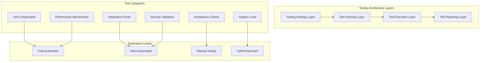
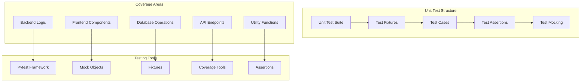

# Comprehensive Testing Strategy & Framework
## AutoProjectManagement System - Complete Testing Documentation

### Document Information
- **Version**: 2.0 (Revised Comprehensive Edition)
- **Last Updated**: 2025-01-28
- **Scope**: Complete testing framework for AI-driven project management system
- **Authors**: Testing Team & AI Systems Integration

---

## Executive Summary

This comprehensive testing documentation provides a complete framework for testing the AutoProjectManagement system - an AI-driven project management platform featuring automated Git integration, intelligent task prioritization, dynamic workflow automation, and comprehensive project analytics. The system includes multiple integrated modules, external API integrations, and complex data processing pipelines.

### System Overview
The AutoProjectManagement system consists of:
- **Core Engine**: AI-powered task management and prioritization
- **Git Integration**: Automated commit tracking and progress synchronization
- **Workflow Automation**: Dynamic task execution based on importance/urgency
- **Analytics Dashboard**: Real-time project progress visualization
- **Multi-platform Support**: Windows, macOS, and Linux compatibility
- **API Layer**: RESTful endpoints for external integrations

---

## 1. Testing Architecture & Strategy Framework

### 1.1 Overall Testing Architecture


### 1.2 Testing Strategy Framework

```mermaid
graph LR
    subgraph "Strategic Planning"
        SP[Strategy Development]
        RA[Risk Assessment]
        TP[Test Planning]
        TC[Test Case Design]
    end
    
    subgraph "Execution Framework"
        ES[Environment Setup]
        ET[Execution Tools]
        TM[Test Management]
        RM[Result Management]
    end
    
    subgraph "Quality Assurance"
        QA[Quality Gates]
        MR[Metrics & Reporting]
        CI[Continuous Improvement]
        FB[Feedback Loops]
    end
    
    SP --> RA
    RA --> TP
    TP --> TC
    TC --> ES
    ES --> ET
    ET --> TM
    TM --> RM
    RM --> QA
    QA --> MR
    MR --> CI
    CI --> FB
    FB --> SP
```


---

## 2. Detailed Testing Categories & Methodologies

### 2.1 Unit Testing Framework

#### 2.1.1 Unit Testing Architecture


#### 2.1.2 Backend Unit Testing Details

**Test Coverage Requirements**:
- **Code Coverage**: Minimum 85% line coverage
- **Branch Coverage**: Minimum 80% branch coverage
- **Function Coverage**: 100% for critical business logic
- **Integration Points**: All API endpoints and database operations

**Test Categories**:

1. **Service Layer Tests**
   - Individual service function validation
   - Business logic verification
   - Data transformation accuracy
   - Error handling and exception management

2. **Data Access Layer Tests**
   - Database query accuracy
   - Transaction integrity
   - Connection pooling validation
   - Migration script testing

3. **API Endpoint Tests**
   - Request/response validation
   - Authentication and authorization
   - Rate limiting and throttling
   - Error response formatting

4. **Utility Function Tests**
   - Date/time handling
   - File system operations
   - Configuration management
   - Logging and monitoring

#### 2.1.3 Frontend Unit Testing Details

**Component Testing Structure**:
```mermaid
graph LR
    subgraph "Component Test Flow"
        CI[Component Initialization]
        CR[Component Rendering]
        IN[User Interaction]
        ST[State Changes]
