# 🤖 ENHANCED Automated Test Generator Documentation
**Version 5.0 | AI-Powered Test Generation with Detailed Diagrams | Status: PRODUCTION-READY**

---

## 📋 Executive Summary

This enhanced automated test generator documentation provides a **complete, production-ready guide** for the AI-powered test generation system in the AutoProjectManagement system. It features detailed explanations, comprehensive diagrams, and step-by-step implementation guides for automatically generating unit tests using AST analysis.

### 🎯 Key Features
- **🤖 AI-Powered AST Analysis**: Intelligent parsing of Python code
- **📝 Comprehensive Test Templates**: Complete test suites with edge cases
- **🔄 CI/CD Integration**: Native GitHub Actions workflows
- **📊 Multi-Project Scalability**: Single framework for unlimited repositories
- **⚡ Performance Optimized**: Parallel execution with intelligent caching

---

## 🏗️ System Architecture Overview

### 1.1 High-Level Architecture Diagram

```mermaid
graph TB
    subgraph "🎯 Test Generation Pipeline"
        SRC[Python Source Code] --> AST[AST Parser]
        AST --> ANALYZE[Code Analysis]
        ANALYZE --> TEMPLATE[Test Templates]
        TEMPLATE --> GENERATE[Test Generation]
        GENERATE --> OUTPUT[Test Files]
    end
    
    subgraph "🔧 AST Analysis"
        FUN[Functions] --> ARGS[Arguments]
        CLS[Classes] --> METH[Methods]
        IMP[Imports] --> DEPS[Dependencies]
    end
    
    subgraph "📊 Test Categories"
        UTEST[Unit Tests] --> BASIC[Basic Tests]
        UTEST --> EDGE[Edge Cases]
        UTEST --> ERROR[Error Handling]
        UTEST --> MOCK[Mock Objects]
    end
    
    subgraph "🔄 CI/CD Integration"
        OUTPUT --> PYTEST[Pytest Runner]
        PYTEST --> COV[Coverage Reports]
        COV --> QUALITY[Quality Gates]
    end
```


### 1.2 Detailed Component Architecture

```mermaid
graph TD
    subgraph "📝 Source Code Analysis"
        SRC[Python Modules] --> AST[AST Parser]
        AST --> FUN[Function Discovery]
        AST --> CLS[Class Discovery]
        AST --> IMP[Import Discovery]
    end
    
    subgraph "🤖 Test Generation Engine"
        FUN --> TPL[Test Templates]
        CLS --> TPL
        IMP --> TPL
        TPL --> GEN[Test Generator]
    end
    
    subgraph "🧪 Test Suite Creation"
        GEN --> UTEST[Unit Tests]
        GEN --> INTEG[Integration Tests]
        GEN --> PERF[Performance Tests]
        GEN --> SEC[Security Tests]
    end
    
    subgraph "📊 Quality Assurance"
        UTEST --> COV[Coverage Analysis]
        INTEG --> REPORT[Test Reports]
        PERF --> BENCHMARK[Benchmarks]
        SEC --> SCAN[Security Scan]
    end
```


---

## 🛠️ Implementation Guide

### 2.1 Test Generator Architecture

#### 2.1.1 Core Components


### 2.2 Test Generator Implementation

#### 2.2.1 Complete Test Generator (`tests/automation/test_generator.py`)
```python
#!/usr/bin/env python3
"""
🤖 Enhanced Automated Test Generator for AutoProjectManagement System
AI-powered test generation with comprehensive AST analysis
"""

import ast
import os
import logging
from datetime import datetime
from pathlib import Path
from typing import List, Dict, Any, Optional
import json

# Configure logging
logging.basicConfig(
    level=logging.INFO,
    format='%(asctime)s - %(name)s - %(levelname)s - %(message)s'
)
logger = logging.getLogger(__name__)

class TestGenerator:
    """Advanced test generator with AI-powered AST analysis"""
    
    def __init__(self, 
                 source_dir: str = "autoprojectmanagement",
                 test_dir: str = "tests/code_tests/01_UnitTests",
                 config_file: str = "test_generator_config.json"):
        self.source_dir = Path(source_dir)
        self.test_dir = Path(test_dir)
        self.config_file = Path(config_file)
        self.config = self._load_config()
        self.logger = logger
        
    def _load_config(self) -> Dict[str, Any]:
        """📋 Load test generator configuration"""
        default_config = {
            "test_patterns": {
                "unit": {
                    "prefix": "test_",
                    "suffix": "_unit",
                    "template": "comprehensive"
                },
                "integration": {
                    "prefix": "test_",
                    "suffix": "_integration",
                    "template": "integration"
                }
            },
            "coverage_threshold": 85,
            "include_edge_cases": True,
            "include_error_handling": True,
            "include_performance_tests": True
        }
        
        if self.config_file.exists():
            with open(self.config_file, 'r') as f:
                user_config = json.load(f)
                default_config.update(user_config)
                
        return default_config
    
    def scan_modules(self) -> List[Path]:
        """🔍 Scan all Python modules in source directory"""
        python_files = []
        for py_file in self.source_dir.rglob("*.py"):
            if not py_file.name.startswith('__'):
                python_files.append(py_file)
        return python_files
    
    def analyze_ast(self, file_path: Path) -> Dict[str, Any]:
        """🔬 Perform comprehensive AST analysis"""
        try:
            with open(file_path, 'r', encoding='utf-8') as f:
                content = f.read()
                
            tree = ast.parse(content)
            
            analysis = {
                'file_path': str(file_path),
                'module_name': '.'.join(file_path.relative_to(self.source_dir).with_suffix('').parts),
                'functions': [],
                'classes': [],
                'imports': [],
                'complexity': 0,
                'lines_of_code': len(content.splitlines())
            }
            
            # Analyze functions
            for node in ast.walk(tree):
                if isinstance(node, ast.FunctionDef):
                    func_analysis = {
                        'name': node.name,
                        'args': [arg.arg for arg in node.args.args],
                        'defaults': len(node.args.defaults),
                        'decorators': [self._get_decorator_name(d) for d in node.decorator_list],
                        'docstring': ast.get_docstring(node),
                        'complexity': self._calculate_complexity(node),
                        'is_async': isinstance(node, ast.AsyncFunctionDef),
                        'return_type': self._get_return_annotation(node),
                        'line_number': node.lineno
                    }
                    analysis['functions'].append(func_analysis)
                    
                elif isinstance(node, ast.ClassDef):
                    class_analysis = {
                        'name': node.name,
