# Comprehensive Testing Process and Plan - Enhanced Edition
**Version 2.0 | Last Updated: 2025-07-27**

---

## Executive Summary

This enhanced comprehensive testing process document provides a complete, production-ready framework for implementing rigorous testing across the ProjectManagement system. It includes detailed workflows, decision trees, implementation templates, and practical guidance for ensuring software quality through systematic testing approaches.

---

## 1. Testing Process Architecture

### 1.1 Complete Testing Lifecycle

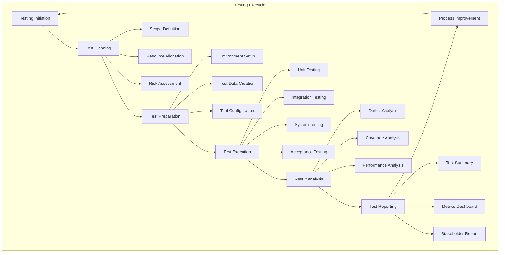

### 1.2 Testing Process Flow

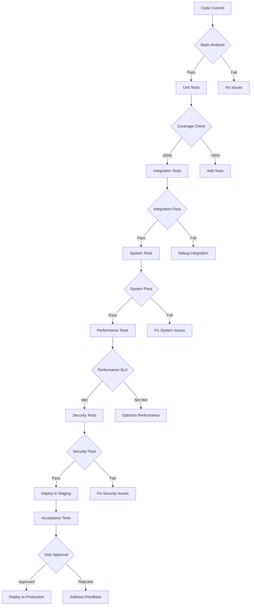

---

## 2. Detailed Testing Workflows

### 2.1 Unit Testing Workflow

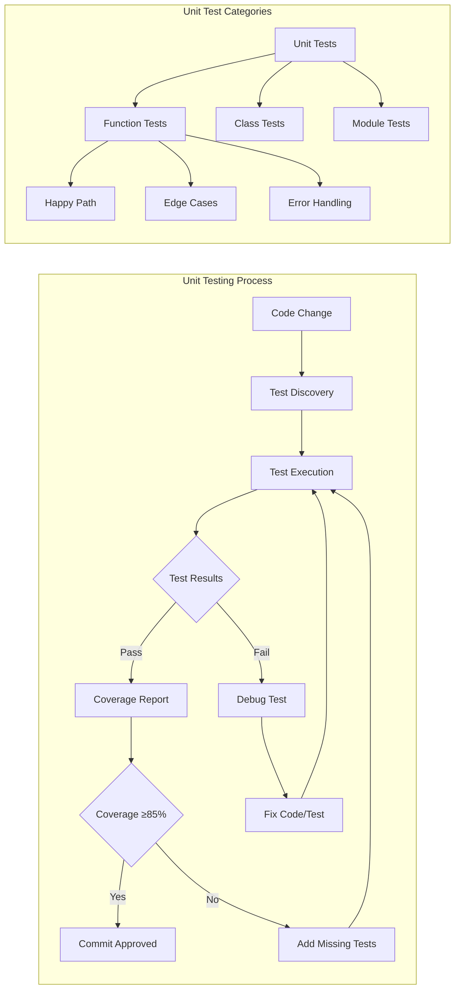

### 2.2 Integration Testing Workflow

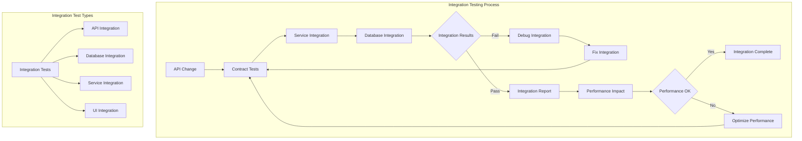

### 2.3 System Testing Workflow

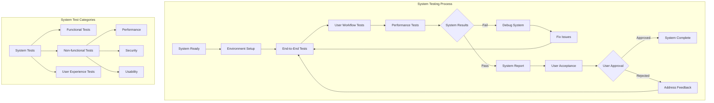

---

## 3. Test Planning & Preparation

### 3.1 Test Planning Matrix

| Planning Aspect | Details | Timeline | Responsible | Deliverables |
|-----------------|---------|----------|-------------|--------------|
| **Scope Definition** | Features to test | Day 1 | QA Lead | Test Scope Document |
| **Resource Planning** | Team allocation | Day 1 | PM | Resource Matrix |
| **Environment Setup** | Test environments | Day 1-2 | DevOps | Environment Ready |
| **Test Data** | Data requirements | Day 2 | QA Team | Test Data Set |
| **Tool Configuration** | Testing tools setup | Day 2 | QA Engineer | Tool Configuration |
| **Schedule Creation** | Testing timeline | Day 3 | QA Lead | Test Schedule |

### 3.2 Risk Assessment Framework

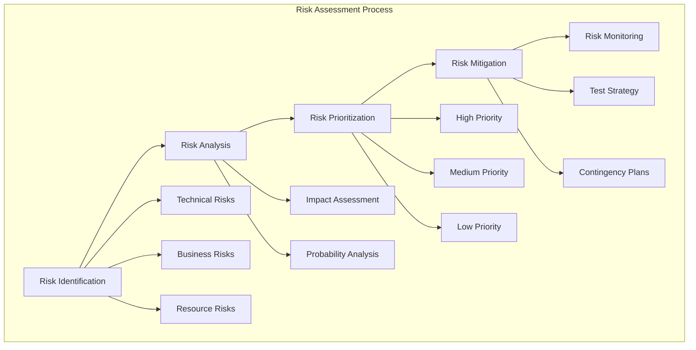

### 3.3 Test Environment Configuration

| Environment Type | Configuration | Purpose | Access Control | Data Refresh |
|------------------|---------------|---------|----------------|--------------|
| **Development** | Local Docker | Developer testing | Developer access | On demand |
| **Integration** | Shared staging | Integration testing | QA + Dev access | Daily |
| **System** | Production-like | System testing | QA Team only | Weekly |
| **Performance** | Scaled infrastructure | Load testing | Performance team | Before tests |
| **Security** | Isolated network | Security testing | Security team | Before tests |

---

## 4. Test Execution Strategies

### 4.1 Test Execution Matrix

| Test Type | Execution Method | Frequency | Parallel Execution | Reporting |
|-----------|------------------|-----------|-------------------|-----------|
| **Unit Tests** | Automated | Every commit | Yes | CI/CD reports |
| **Integration Tests** | Automated | Daily | Yes | Integration reports |
| **System Tests** | Semi-automated | Weekly | Partial | Test management tool |
| **Performance Tests** | Automated | Weekly | Yes | Performance dashboards |
| **Security Tests** | Automated + Manual | Monthly | No | Security reports |
| **Acceptance Tests** | Manual | Per release | No | User sign-off |

### 4.2 Test Execution Scheduling

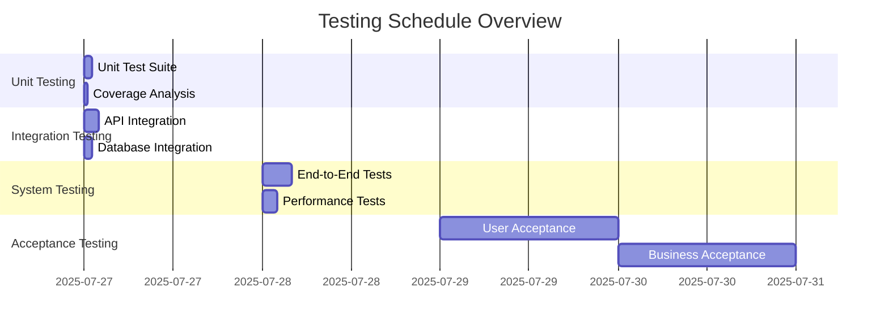

---

## 5. Test Data Management Strategy

### 5.1 Test Data Lifecycle

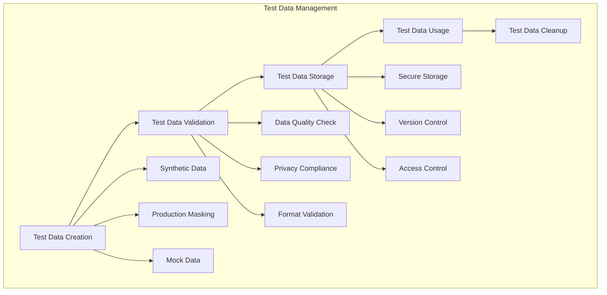

### 5.2 Data Privacy Compliance Matrix

| Data Category | Anonymization Method | Storage Location | Retention Period | Access Level |
|---------------|---------------------|------------------|------------------|--------------|
| **User PII** | Hashing + Masking | Secure Vault | 90 days | Restricted |
| **Financial Data** | Tokenization | Encrypted DB | 7 years | Audit Required |
| **Health Data** | Full Anonymization | Isolated Storage | 5 years | Compliance Team |
| **Test Credentials** | Environment Variables | Secret Manager | 30 days | DevOps Only |

---

## 6. Defect Management Process

### 6.1 Defect Lifecycle

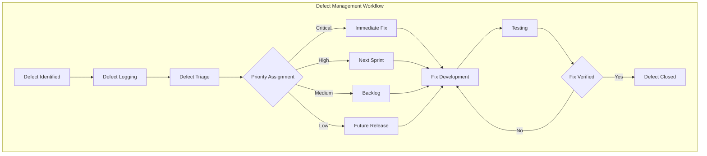

### 6.2 Defect Classification Matrix

| Severity | Business Impact | Technical Impact | Examples | Response Time |
|----------|-----------------|------------------|----------|---------------|
| **Critical** | System down | Data loss | Security breach | 2 hours |
| **High** | Major feature broken | Performance degraded | API failure | 8 hours |
| **Medium** | Minor feature issue | User inconvenience | UI bug | 24 hours |
| **Low** | Cosmetic issue | No functional impact | Spelling error | 7 days |

---

## 7. Test Reporting & Analytics

### 7.1 Test Report Structure

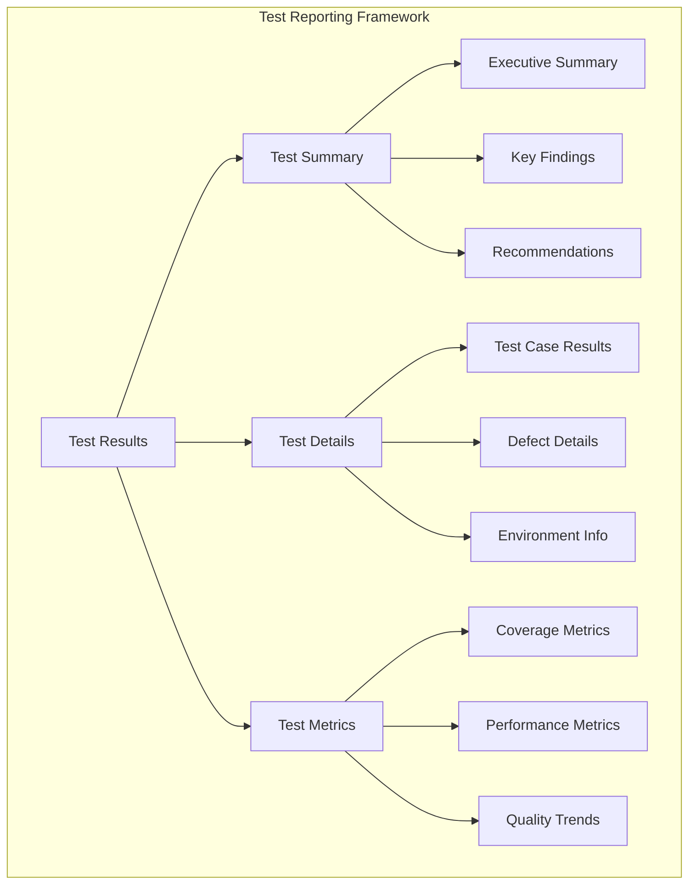

### 7.2 Test Metrics Dashboard

| Metric Category | KPI | Current Value | Target Value | Trend |
|-----------------|-----|---------------|--------------|--------|
| **Test Coverage** | Code Coverage | 78% | 85% | ↗️ |
| **Test Effectiveness** | Defect Detection Rate | 92% | 95% | ↗️ |
| **Test Efficiency** | Test Execution Time | 35 min | 30 min | ↘️ |
| **Quality Gate** | Build Success Rate | 94% | 98% | ↗️ |
| **Security** | Vulnerabilities Found | 3 | 0 | ↘️ |

---

## 8. Continuous Testing Integration

### 8.1 CI/CD Testing Pipeline

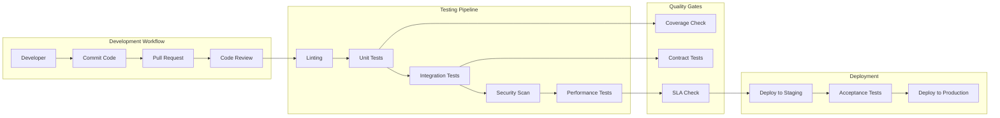

### 8.2 Shift-Left Testing Strategy

| Testing Activity | Traditional Approach | Shift-Left Approach | Benefits |
|------------------|---------------------|---------------------|----------|
| **Test Design** | After development | During requirements | Early defect detection |
| **Unit Testing** | After coding | During coding | Better code quality |
| **Integration Testing** | After unit testing | During development | Faster feedback |
| **Security Testing** | Before release | During development | Lower security risks |

---

## 9. Testing Tools & Infrastructure

### 9.1 Testing Tool Stack

| Category | Primary Tool | Secondary Tool | Purpose | Integration |
|----------|--------------|----------------|---------|-------------|
| **Unit Testing** | pytest | unittest | Python testing | CI/CD |
| **API Testing** | Postman | REST Assured | API validation | Newman |
| **Web Testing** | Selenium | Cypress | UI automation | Grid |
| **Performance** | JMeter | Locust | Load testing | Cloud |
| **Security** | OWASP ZAP | Bandit | Security scanning | CI/CD |
| **Reporting** | Allure | HTMLTestRunner | Test reports | Jenkins |

### 9.2 Infrastructure Requirements

| Component | Specification | Purpose | Scaling | Monitoring |
|-----------|---------------|---------|---------|------------|
| **Test Runner** | 8 CPU, 16GB RAM | Execute tests | Horizontal | CPU/Memory |
| **Database** | PostgreSQL 13 | Test data | Vertical | Query performance |
| **Browser Grid** | Selenium Grid | UI tests | Horizontal | Queue length |
| **Load Generator** | JMeter cluster | Performance | Horizontal | Response time |

---

## 10. Testing Best Practices

### 10.1 Test Design Principles

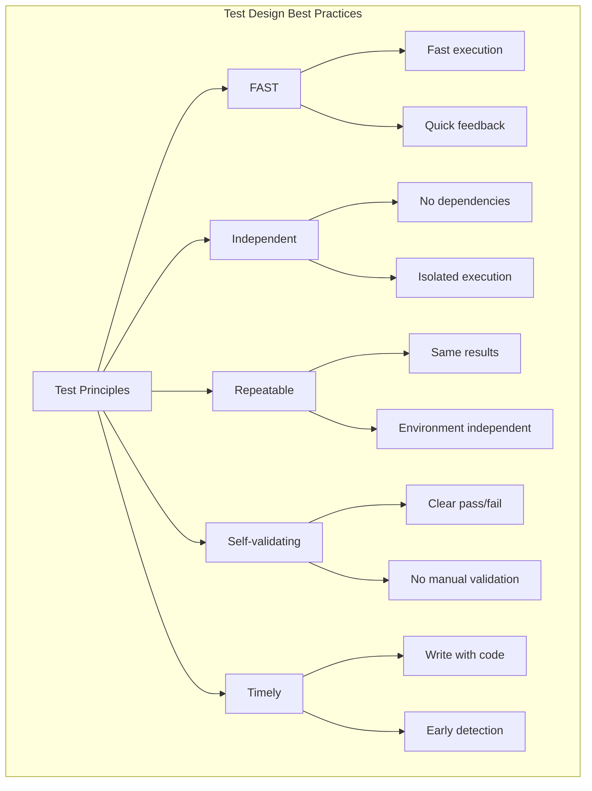

### 10.2 Testing Checklists

#### Pre-Testing Checklist
- [ ] Test environment is ready
- [ ] Test data is prepared
- [ ] Test cases are reviewed
- [ ] Tools are configured
- [ ] Team is trained

#### During Testing Checklist
- [ ] Execute tests as planned
- [ ] Document results immediately
- [ ] Report defects promptly
- [ ] Monitor system performance
- [ ] Maintain test evidence

#### Post-Testing Checklist
- [ ] Generate test reports
- [ ] Review test coverage
- [ ] Update test cases
- [ ] Archive test artifacts
- [ ] Conduct retrospective

---

## 11. Troubleshooting Guide

### 11.1 Common Issues & Solutions

| Issue | Symptoms | Root Cause | Solution | Prevention |
|-------|----------|------------|----------|------------|
| **Flaky Tests** | Intermittent failures | Timing issues | Add waits | Use explicit waits |
| **Environment Issues** | Tests fail in CI | Configuration drift | Environment parity | Infrastructure as code |
| **Data Issues** | Tests fail with data | Test data corruption | Reset data | Data isolation |
| **Performance Issues** | Slow test execution | Inefficient tests | Optimize tests | Regular profiling |

### 11.2 Debugging Workflow

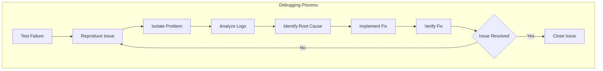

---

## 12. Continuous Improvement Framework

### 12.1 Testing Maturity Assessment

| Maturity Level | Characteristics | Current State | Target State | Actions |
|----------------|-----------------|---------------|--------------|---------|
| **Level 1** | Ad-hoc testing | ❌ | ✅ | Implement standards |
| **Level 2** | Managed testing | ✅ | ✅ | Improve processes |
| **Level 3** | Defined processes | ✅ | ✅ | Add automation |
| **Level 4** | Quantitatively managed | ❌ | ✅ | Implement metrics |
| **Level 5** | Optimizing | ❌ | ✅ | Continuous improvement |

### 12.2 Improvement Roadmap

| Quarter | Focus Area | Goals | Metrics | Success Criteria |
|---------|------------|--------|---------|------------------|
| **Q3 2025** | Test automation | 80% coverage | Coverage reports | Achieve 80% |
| **Q4 2025** | Performance testing | <30min execution | CI analytics | <30min achieved |
| **Q1 2026** | Security testing | Zero critical issues | Security scans | Zero critical |
| **Q2 2026** | User experience | 95% satisfaction | User surveys | 95% achieved |

---

## 13. Emergency Procedures

### 13.1 Incident Response Testing

| Incident Type | Response Time | Testing Scope | Approval Required | Communication |
|---------------|---------------|---------------|-------------------|---------------|
| **Critical** | 30 minutes | Full regression | CTO + QA Lead | Immediate |
| **High** | 2 hours | Affected modules | QA Lead | Within 1 hour |
| **Medium** | 8 hours | Targeted tests | Senior QA | Within 4 hours |
| **Low** | 24 hours | Smoke tests | QA Engineer | Daily summary |

### 13.2 Rollback Testing Strategy

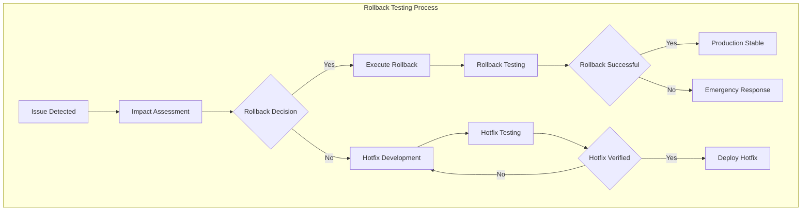

---

## 14. Conclusion & Next Steps

This comprehensive testing process document provides a complete framework for implementing world-class testing practices in the ProjectManagement system. Regular reviews and updates ensure alignment with evolving business needs and technological advancements.

### 14.1 Immediate Actions (Next 30 Days)
- [ ] Set up testing infrastructure
- [ ] Implement basic test automation
- [ ] Create initial test cases
- [ ] Train team on processes

### 14.2 Medium-term Goals (Next 90 Days)
- [ ] Achieve 80% test coverage
- [ ] Implement performance testing
- [ ] Set up monitoring dashboards
- [ ] Establish quality gates

### 14.3 Long-term Vision (Next 12 Months)
- [ ] Achieve 95% test coverage
- [ ] Implement chaos engineering
- [ ] Establish predictive analytics
- [ ] Achieve continuous testing

---

**Document Owner**: QA Team Lead  
**Review Schedule**: Bi-weekly  
**Next Review Date**: 2025-08-10  
**Change Control**: Git-based versioning with approval workflow

**Contact Information**:
- QA Team Lead: qa-lead@company.com
- DevOps Team: devops@company.com
- Emergency Hotline: +1-800-TEST-911
