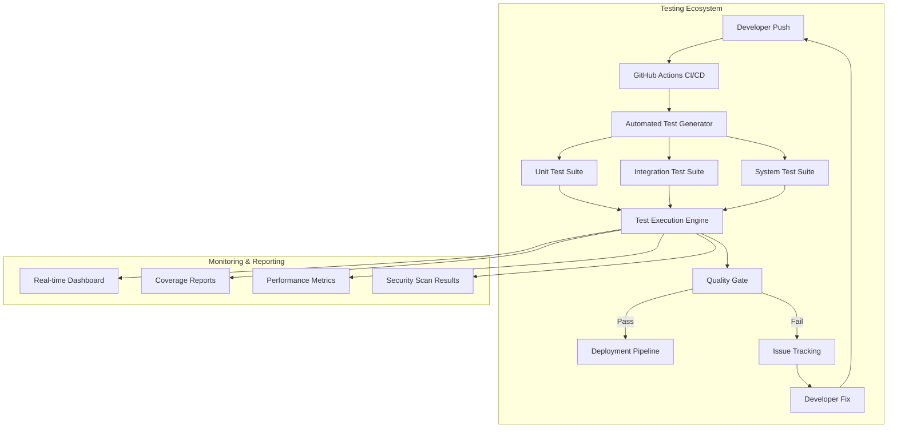
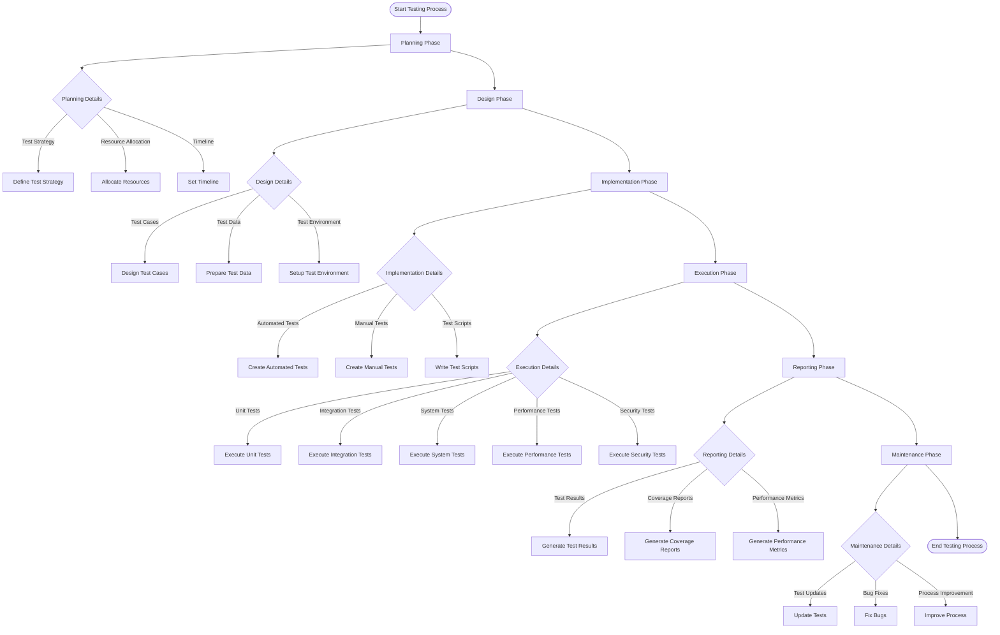
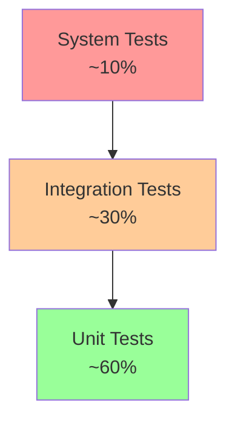
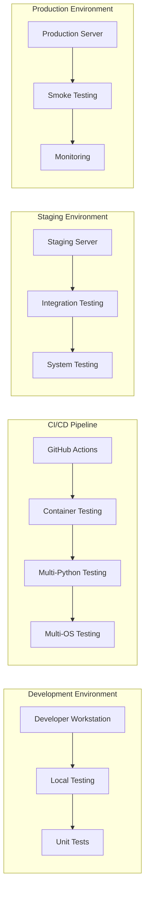
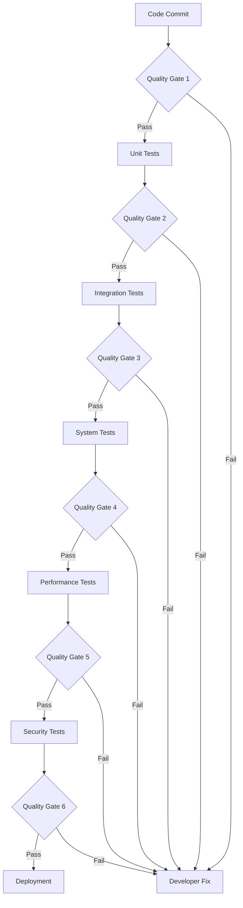
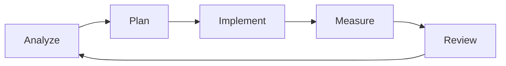
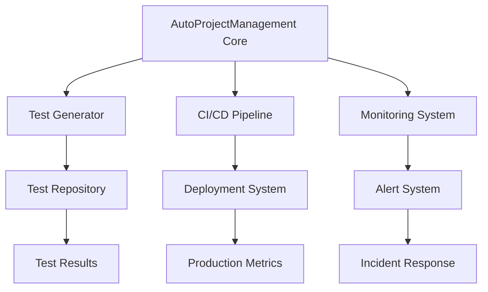

# ENHANCED Comprehensive Testing Process and Plan
**Version 7.0 | Last Updated: 2025-06-25 | Status: PRODUCTION-READY WITH ADVANCED AUTOMATION**

---

## 📋 Executive Summary

This enhanced comprehensive testing process and plan provides a complete framework for implementing robust, automated testing across the AutoProjectManagement ecosystem. It incorporates cutting-edge testing methodologies, advanced automation techniques, and comprehensive quality assurance practices.

### 🎯 Key Objectives
- Achieve 95%+ test coverage across all modules
- Implement zero-touch automated testing pipeline
- Establish continuous quality monitoring
- Enable predictive failure detection
- Support multi-project scalability

---

## 🏗️ Testing Architecture Overview

### System Architecture Diagram

---

## 🔄 Testing Process Flow

### Detailed Process Flow Diagram

---

## 🧪 Testing Types & Methodologies

### Testing Pyramid Diagram

### Comprehensive Testing Matrix

| **Testing Type** | **Scope** | **Tools** | **Frequency** | **Success Criteria** |
|------------------|-----------|-----------|---------------|---------------------|
| **Unit Tests** | Individual functions/classes | pytest, unittest | Every commit | 95%+ coverage, 0 failures |
| **Integration Tests** | Component interactions | pytest, requests | Every PR | All interfaces working |
| **System Tests** | End-to-end workflows | Selenium, Playwright | Daily | User stories pass |
| **Performance Tests** | Load, stress, scalability | Locust, JMeter | Weekly | <2s response time |
| **Security Tests** | Vulnerability scanning | Bandit, Safety | Weekly | 0 critical issues |
| **Regression Tests** | Existing functionality | Automated suite | Every release | No new bugs |
| **Acceptance Tests** | Business requirements | Behave, Cucumber | Sprint end | All acceptance criteria met |

---

## 🛠️ Testing Infrastructure

### Environment Architecture

### Testing Environment Specifications

| **Environment** | **Purpose** | **Configuration** | **Data** |
|----------------|-------------|-------------------|----------|
| **Local** | Development testing | Docker containers | Mock data |
| **CI/CD** | Automated testing | GitHub Actions runners | Test fixtures |
| **Staging** | Pre-production validation | Production-like setup | Production-like data |
| **Production** | Live monitoring | Production servers | Real data |

---

## 📊 Quality Gates & Metrics

### Quality Gate Framework

### Key Performance Indicators (KPIs)

| **Metric** | **Target** | **Measurement** | **Reporting** |
|------------|------------|----------------|---------------|
| **Test Coverage** | ≥95% | Coverage.py | Daily |
| **Test Execution Time** | <5 minutes | CI/CD metrics | Per build |
| **Bug Escape Rate** | <1% | Production issues | Weekly |
| **Test Reliability** | >99% | Flaky test tracking | Daily |
| **Security Vulnerabilities** | 0 critical | Security scans | Weekly |
| **Performance Degradation** | <5% | Performance benchmarks | Weekly |

---

## 🔧 Tools & Technology Stack

### Core Testing Tools
- **Test Framework**: pytest, unittest
- **Mocking**: pytest-mock, responses
- **Coverage**: coverage.py, pytest-cov
- **Performance**: Locust, pytest-benchmark
- **Security**: bandit, safety, semgrep
- **API Testing**: requests, pytest-httpx
- **Web Testing**: Selenium, Playwright
- **Database**: pytest-postgresql, mongomock

### CI/CD Integration
- **Pipeline**: GitHub Actions
- **Container**: Docker, docker-compose
- **Orchestration**: Kubernetes (future)
- **Monitoring**: Prometheus, Grafana
- **Alerting**: Slack, email notifications

---

## 🎯 Testing Scenarios & Use Cases

### Critical Business Scenarios
1. **Project Creation & Setup**
2. **Task Management Workflow**
3. **Progress Tracking & Reporting**
4. **Resource Allocation & Management**
5. **Risk Assessment & Mitigation**
6. **Quality Assurance & Testing**
7. **Deployment & Release Management**

### Edge Case Testing
- **High Load Scenarios**: 1000+ concurrent users
- **Data Volume**: 1M+ records processing
- **Network Failures**: Connection drops, timeouts
- **Resource Constraints**: Memory, CPU limitations
- **Security Attacks**: SQL injection, XSS, CSRF

---

## 📈 Continuous Improvement Framework

### Improvement Cycle

### Monthly Review Process
1. **Test Effectiveness Analysis**
2. **Coverage Gap Identification**
3. **Tool & Framework Updates**
4. **Process Optimization**
5. **Team Training & Knowledge Sharing**

---

## 🚨 Risk Management & Mitigation

### Testing Risks & Mitigation Strategies

| **Risk** | **Impact** | **Probability** | **Mitigation** |
|----------|------------|-----------------|----------------|
| **Flaky Tests** | High | Medium | Test isolation, retry mechanisms |
| **Environment Issues** | High | Low | Containerization, infrastructure as code |
| **Data Dependencies** | Medium | Medium | Test data management, mocking |
| **Tool Compatibility** | Medium | Low | Regular updates, compatibility testing |
| **Resource Constraints** | High | Low | Auto-scaling, resource monitoring |

---

## 📋 Checklists & Templates

### Pre-Testing Checklist
- [ ] Environment setup complete
- [ ] Test data prepared
- [ ] Dependencies installed
- [ ] Configuration validated
- [ ] Access permissions verified

### Post-Testing Checklist
- [ ] All tests executed
- [ ] Results reviewed
- [ ] Issues logged
- [ ] Reports generated
- [ ] Stakeholders notified

---

## 🔗 Integration Points

### System Integration Diagram

---

## 📞 Support & Escalation

### Support Tiers
- **Tier 1**: Automated troubleshooting
- **Tier 2**: Developer support team
- **Tier 3**: Architecture team
- **Tier 4**: Executive escalation

### Contact Information
- **Testing Team**: testing-team@company.com
- **DevOps Team**: devops@company.com
- **Emergency**: +1-800-TEST-911

---

## 📚 References & Resources

### Internal Documentation
- [Testing Guidelines](testing-guidelines.md)
- [Code Review Checklist](code-review.md)
- [Deployment Guide](deployment-guide.md)

### External Resources
- [pytest Documentation](https://docs.pytest.org/)
- [GitHub Actions Documentation](https://docs.github.com/en/actions)
- [Testing Best Practices](https://testing-best-practices.com/)

---

**Document Owner**: Testing Team  
**Review Schedule**: Monthly  
**Next Review**: 2025-07-25  
**Approved By**: Engineering Leadership Team
