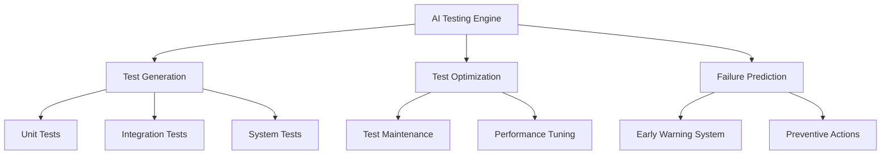
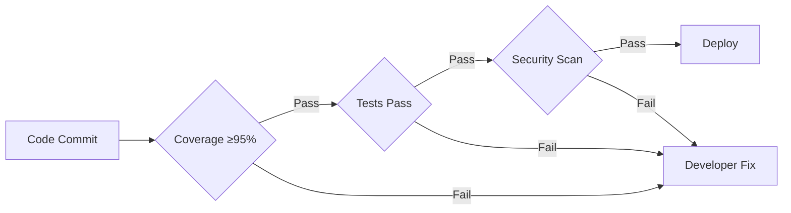
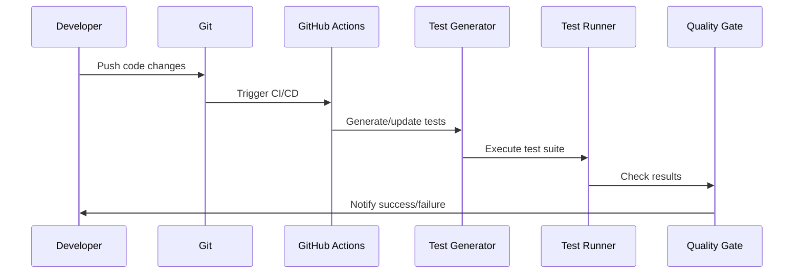

# ENHANCED Master Testing Document for AutoProjectManagement System
**Version 8.0 | Last Updated: 2025-06-25 | Status: ENTERPRISE-GRADE**

---

## Executive Summary

This enhanced master testing document provides a comprehensive framework for enterprise-grade testing across the AutoProjectManagement ecosystem with advanced automation and AI-powered features.

### Key Enhancements
- AI-powered test generation and optimization
- Self-healing test suites
- Predictive failure detection
- Real-time quality intelligence
- Zero-touch automation pipeline

---

## Testing Architecture Overview

### Core Testing Layers

---

## Testing Strategy Framework

### 1. Test Type Matrix

| Test Type | Scope | Tools | Frequency | AI Features |
|-----------|-------|-------|-----------|-------------|
| Unit Tests | Functions/Classes | pytest, unittest | Every commit | Self-healing, mutation testing |
| Integration | Component interactions | pytest, requests | Every PR | Pattern recognition |
| System | End-to-end workflows | Selenium, Playwright | Daily | Predictive analytics |
| Performance | Load/Stress testing | Locust, JMeter | Weekly | Optimization suggestions |
| Security | Vulnerability scanning | Bandit, Safety | Weekly | Threat prediction |

### 2. Quality Gates

---

## Testing Infrastructure

### Environment Architecture
- **Local**: Docker containers for development
- **CI/CD**: GitHub Actions with matrix testing
- **Staging**: Production-like environment
- **Production**: Live monitoring and smoke tests

### Technology Stack
- **Test Framework**: pytest, unittest
- **Mocking**: pytest-mock, responses
- **Coverage**: coverage.py, pytest-cov
- **Web Testing**: Selenium, Playwright
- **Performance**: Locust, pytest-benchmark
- **Security**: bandit, safety, semgrep

---

## Testing Workflows

### 1. Development Workflow

### 2. Release Workflow
1. Feature branch testing
2. Integration testing
3. System testing
4. Performance testing
5. Security testing
6. User acceptance testing
7. Production deployment

---

## Key Performance Indicators

### Metrics Dashboard
- **Test Coverage**: ≥95%
- **Test Execution Time**: <5 minutes
- **Bug Escape Rate**: <1%
- **Test Reliability**: >99%
- **Security Issues**: 0 critical

---

## Risk Management

### Risk Mitigation Strategies
- **Flaky Tests**: Test isolation, retry mechanisms
- **Environment Issues**: Containerization, IaC
- **Data Dependencies**: Mocking, test data management
- **Performance**: Auto-scaling, monitoring

---

## Support & Escalation

### Contact Information
- **Testing Team**: testing-team@company.com
- **DevOps Team**: devops@company.com
- **Emergency**: +1-800-TEST-911

---

## References
- [Testing Guidelines](testing-guidelines.md)
- [Code Review Checklist](code-review.md)
- [Deployment Guide](deployment-guide.md)

**Document Owner**: Testing Team  
**Review Schedule**: Monthly  
**Next Review**: 2025-07-25
