# ENHANCED Test Execution Plan
**Version 7.0 | Last Updated: 2025-06-25 | Status: ENTERPRISE-READY WITH ADVANCED AUTOMATION**

---

## Executive Summary

This enhanced test execution plan provides a comprehensive framework for executing tests across the AutoProjectManagement ecosystem with advanced automation, real-time monitoring, and intelligent orchestration.

---

## Test Execution Architecture

### High-Level Execution Flow

---

## Detailed Execution Phases

### Phase 1: Environment Preparation

#### Environment Checklist
- [ ] Docker containers running
- [ ] Dependencies installed
- [ ] Test data prepared
- [ ] Configuration validated
- [ ] Access permissions verified

### Phase 2: Test Generation & Update

#### Test Generation Process
1. **Code Analysis**: Scan for new/modified code
2. **Test Creation**: Generate appropriate test cases
3. **Test Validation**: Ensure tests are syntactically correct
4. **Test Optimization**: Remove duplicates, improve efficiency
5. **Test Registration**: Add to test suite

### Phase 3: Test Execution Pipeline

#### Unit Test Execution

**Unit Test Specifications**:
- **Scope**: Individual functions and classes
- **Tools**: pytest, unittest
- **Coverage Target**: 95%+
- **Execution Time**: <2 minutes
- **Parallel Execution**: Yes (4 workers)

#### Integration Test Execution

**Integration Test Specifications**:
- **Scope**: Component interactions
- **Tools**: pytest, requests, mongomock
- **Services**: All internal services
- **Databases**: MongoDB, PostgreSQL
- **Execution Time**: <5 minutes

#### System Test Execution

**System Test Specifications**:
- **Scope**: Complete user workflows
- **Tools**: Selenium, Playwright
- **Browsers**: Chrome, Firefox, Safari, Edge
- **Devices**: Desktop, tablet, mobile
- **Execution Time**: <10 minutes

#### Performance Test Execution

**Performance Test Specifications**:
- **Load**: 100-1000 concurrent users
- **Metrics**: Response time, throughput, error rate
- **Tools**: Locust, JMeter
- **Duration**: 15-30 minutes
- **Success Criteria**: <2s response time, <1% error rate

#### Security Test Execution

**Security Test Specifications**:
- **Scan Types**: SAST, DAST, dependency scanning
- **Tools**: Bandit, Safety, OWASP ZAP
- **Frequency**: Weekly + on every release
- **Success Criteria**: 0 critical vulnerabilities

---

## Execution Scheduling

### Daily Schedule

```mermaid
gantt
    title Daily Test Execution Schedule
    dateFormat HH:mm
    axisFormat %H:%M
    
    section Morning
    Unit Tests           :07:00, 30m
    Integration Tests    :07:30, 30m
    
    section Afternoon
    System Tests         :14:00, 30m
    Performance Tests    :14:30, 30m
    
    section Evening
    Security Tests       :20:00, 30m
    Report Generation    :20:30, 30m
```

### Weekly Schedule
| **Day** | **Focus** | **Tests** | **Duration** |
|---------|-----------|-----------|--------------|
| **Monday** | Unit & Integration | All unit + integration tests | 2 hours |
| **Tuesday** | System Testing | End-to-end workflows | 3 hours |
| **Wednesday** | Performance | Load & stress testing | 4 hours |
| **Thursday** | Security | Vulnerability scanning | 2 hours |
| **Friday** | Regression | Full regression suite | 3 hours |
| **Saturday** | Maintenance | Test maintenance | 2 hours |
| **Sunday** | Monitoring | Health checks | 1 hour |

---

## Monitoring & Alerting

### Real-time Monitoring Dashboard

### Alert Thresholds
| **Metric** | **Warning** | **Critical** | **Action** |
|------------|-------------|--------------|------------|
| **Test Failure Rate** | >5% | >10% | Immediate notification |
| **Test Execution Time** | >10 min | >15 min | Performance investigation |
| **Coverage Drop** | <90% | <85% | Code review required |
| **Security Issues** | >0 medium | >0 critical | Immediate fix required |

---

## Results Collection & Analysis

### Results Pipeline

### Report Types
1. **Daily Test Summary**: High-level overview
2. **Weekly Quality Report**: Detailed analysis
3. **Monthly Trend Report**: Historical analysis
4. **Release Readiness Report**: Go/no-go decision
5. **Security Assessment Report**: Security posture

---

## Issue Management

### Issue Lifecycle

### Issue Prioritization
| **Priority** | **Response Time** | **Resolution Time** | **Examples** |
|--------------|-------------------|---------------------|--------------|
| **P0 - Critical** | 15 minutes | 2 hours | Security vulnerabilities |
| **P1 - High** | 1 hour | 1 day | Test suite failures |
| **P2 - Medium** | 4 hours | 3 days | Performance degradation |
| **P3 - Low** | 1 day | 1 week | Minor test improvements |

---

## Continuous Improvement

### Improvement Cycle

### Monthly Review Process
1. **Test Effectiveness Analysis**
2. **Coverage Gap Identification**
3. **Tool & Framework Updates**
4. **Process Optimization**
5. **Team Training Sessions**

---

## Emergency Procedures

### Incident Response Plan

### Escalation Matrix
| **Level** | **Contact** | **Response Time** | **Escalation Criteria** |
|-----------|-------------|-------------------|------------------------|
| **L1** | Test Engineer | 15 min | Standard test failures |
| **L2** | Senior Developer | 30 min | Integration issues |
| **L3** | Engineering Manager | 1 hour | System-wide failures |
| **L4** | CTO | 2 hours | Production incidents |

---

## Tools & Resources

### Core Testing Tools
- **Test Framework**: pytest, unittest
- **Mocking**: pytest-mock, responses
- **Coverage**: coverage.py, pytest-cov
- **Performance**: Locust, pytest-benchmark
- **Security**: bandit, safety, semgrep
- **Web Testing**: Selenium, Playwright
- **API Testing**: requests, pytest-httpx

### Monitoring & Reporting
- **Dashboard**: Grafana, Kibana
- **Metrics**: Prometheus, InfluxDB
- **Alerting**: Slack, PagerDuty
- **Reporting**: Allure, ReportPortal

---

## Contact Information

### Team Contacts
- **Testing Team Lead**: testing-lead@company.com
- **DevOps Team**: devops@company.com
- **Emergency Hotline**: +1-800-TEST-911
- **Slack Channel**: #testing-alerts

### Documentation
- [Testing Guidelines](testing-guidelines.md)
- [Runbook](runbook.md)
- [Troubleshooting Guide](troubleshooting.md)

---

**Document Owner**: Testing Team  
**Review Schedule**: Bi-weekly  
**Next Review**: 2025-07-09  
**Approved By**: Engineering Leadership Team
