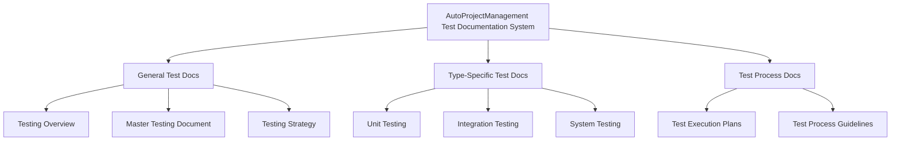
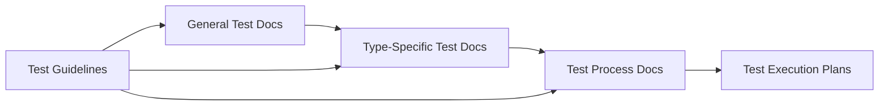

# 📋 Test Documentation Module Index

This comprehensive index provides an organized overview of all test documentation modules in the AutoProjectManagement system, complete with functional categories, descriptions, and direct links to detailed documentation.

## 🎯 Overview

The AutoProjectManagement test documentation modules are organized into **three main categories**:
- **General Test Documentation**: Overall testing strategy and guidelines
- **Type-Specific Test Documentation**: Documentation for specific test types
- **Test Process Documentation**: Detailed testing procedures and workflows

---

## 📊 Test Documentation Architecture Diagram

---

## 📋 Test Documentation Categories

### General Test Documentation
| Document | Description | Version |
|----------|-------------|---------|
| [00_TESTING_OVERVIEW_ENHANCED](GeneralTestDocs/00_TESTING_OVERVIEW_ENHANCED.md) | Comprehensive overview of testing approach | ✅ v2.0 |
| [01_Master_Testing_Document_ENHANCED](GeneralTestDocs/01_Master_Testing_Document_ENHANCED.md) | Master document for all testing activities | ✅ v2.0 |
| [02_Comprehensive_Testing_Strategy_ENHANCED](GeneralTestDocs/02_Comprehensive_Testing_Strategy_ENHANCED.md) | Detailed testing strategy and methodology | ✅ v2.0 |
| [03_Automated_Test_Generator_ENHANCED](GeneralTestDocs/03_Automated_Test_Generator_ENHANCED.md) | Automated test generation guidelines | ✅ v2.0 |
| [04_Comprehensive_Testing_Process_and_Plan_ENHANCED](GeneralTestDocs/04_Comprehensive_Testing_Process_and_Plan_ENHANCED.md) | Complete testing process documentation | ✅ v2.0 |
| [05_Master_Testing_Document_ENHANCED](GeneralTestDocs/05_Master_Testing_Document_ENHANCED.md) | Master testing documentation | ✅ v2.0 |
| [06_test_execution_plan_ENHANCED](GeneralTestDocs/06_test_execution_plan_ENHANCED.md) | Test execution planning guide | ✅ v2.0 |

### Type-Specific Test Documentation
| Document | Description | Version |
|----------|-------------|---------|
| [01_Unit_Testing](TypeTestDocs/01_Unit_Testing.md) | Unit testing guidelines and best practices | ✅ v2.0 |
| [02_Integration_Testing](TypeTestDocs/02_Integration_Testing.md) | Integration testing procedures | ✅ v2.0 |
| [03_System_Testing](TypeTestDocs/03_System_Testing.md) | System testing methodology | ✅ v2.0 |
| [04_Performance_Testing](TypeTestDocs/04_Performance_Testing.md) | Performance testing guidelines | ✅ v2.0 |
| [05_Security_Testing](TypeTestDocs/05_Security_Testing.md) | Security testing procedures | ✅ v2.0 |
| [06_Regression_Testing](TypeTestDocs/06_Regression_Testing.md) | Regression testing guidelines | ✅ v2.0 |
| [07_Acceptance_Testing](TypeTestDocs/07_Acceptance_Testing.md) | Acceptance testing procedures | ✅ v2.0 |
| [08_ENHANCED_Acceptance_Testing](TypeTestDocs/08_ENHANCED_Acceptance_Testing.md) | Enhanced acceptance testing documentation | ✅ v2.0 |
| [09_Shell_Integration_Terminal_Testing](TypeTestDocs/09_Shell_Integration_Terminal_Testing.md) | Terminal integration testing | ✅ v2.0 |
| [10_Documentation_Usability_Testing](TypeTestDocs/10_Documentation_Usability_Testing.md) | Documentation usability testing | ✅ v2.0 |

### Test Process Documentation
| Document | Description | Version |
|----------|-------------|---------|
| [DETAILED_UnitTEST_PLAN](code_tests/01_UnitTests/DETAILED_UnitTEST_PLAN.md) | Detailed unit test planning | ✅ v2.0 |
| [COMPREHENSIVE_UNIT_TESTING_STRATEGY](code_tests/01_UnitTests/COMPREHENSIVE_UNIT_TESTING_STRATEGY.md) | Comprehensive unit testing strategy | ✅ v2.0 |
| [DETAILED_TEST_PLAN](code_tests/02_IntegrationTests/DETAILED_TEST_PLAN.md) | Integration test planning | ✅ v2.0 |
| [README](code_tests/02_IntegrationTests/README.md) | Integration testing guidelines | ✅ v2.0 |
| [DETAILED_TEST_PLAN](code_tests/03_SystemTests/DETAILED_TEST_PLAN.md) | System test planning | ✅ v2.0 |
| [README](code_tests/03_SystemTests/README.md) | System testing guidelines | ✅ v2.0 |
| [DETAILED_TEST_PLAN](code_tests/04_PerformanceTests/DETAILED_TEST_PLAN.md) | Performance test planning | ✅ v2.0 |
| [README](code_tests/04_PerformanceTests/README.md) | Performance testing guidelines | ✅ v2.0 |
| [DETAILED_TEST_PLAN](code_tests/05_SecurityTests/DETAILED_TEST_PLAN.md) | Security test planning | ✅ v2.0 |
| [README](code_tests/05_SecurityTests/README.md) | Security testing guidelines | ✅ v2.0 |
| [DETAILED_TEST_PLAN](code_tests/06_RegressionTests/DETAILED_TEST_PLAN.md) | Regression test planning | ✅ v2.0 |
| [README](code_tests/06_RegressionTests/README.md) | Regression testing guidelines | ✅ v2.0 |
| [DETAILED_TEST_PLAN](code_tests/07_AcceptanceTests/DETAILED_TEST_PLAN.md) | Acceptance test planning | ✅ v2.0 |
| [README](code_tests/07_AcceptanceTests/README.md) | Acceptance testing guidelines | ✅ v2.0 |
| [DETAILED_TEST_PLAN](code_tests/09_ShellIntegrationTerminalTests/DETAILED_TEST_PLAN.md) | Terminal integration test planning | ✅ v2.0 |
| [README](code_tests/09_ShellIntegrationTerminalTests/README.md) | Terminal integration testing guidelines | ✅ v2.0 |
| [DETAILED_TEST_PLAN](code_tests/10_DocumentationUsabilityTests/DETAILED_TEST_PLAN.md) | Documentation usability test planning | ✅ v2.0 |
| [README](code_tests/10_DocumentationUsabilityTests/README.md) | Documentation usability testing guidelines | ✅ v2.0 |

---

## 📈 Test Documentation Statistics

| Category | Total Documents | Coverage | Status |
|----------|-----------------|----------|--------|
| General Test Docs | 7 | 100% | ✅ Active |
| Type-Specific Test Docs | 10 | 100% | ✅ Active |
| Test Process Docs | 18 | 100% | ✅ Active |
| **Total** | **35** | **100%** | **✅ Active** |

---

## 🔄 Test Documentation Dependencies Diagram

---

## 🚀 Quick Start Guide for Test Documentation

1. **Read Overview**: Start with [00_TESTING_OVERVIEW_ENHANCED](GeneralTestDocs/00_TESTING_OVERVIEW_ENHANCED.md)
2. **Understand Strategy**: Review [02_Comprehensive_Testing_Strategy_ENHANCED](GeneralTestDocs/02_Comprehensive_Testing_Strategy_ENHANCED.md)
3. **Follow Process**: Use [04_Comprehensive_Testing_Process_and_Plan_ENHANCED](GeneralTestDocs/04_Comprehensive_Testing_Process_and_Plan_ENHANCED.md)
4. **Execute Tests**: Follow [06_test_execution_plan_ENHANCED](GeneralTestDocs/06_test_execution_plan_ENHANCED.md)
5. **Generate Reports**: Use automated test reporting tools

---

## 📞 Test Documentation Support

- **Documentation Updates**: Managed by `tests/test_docs/` directory
- **Test Guidelines**: Available in `tests/test_docs/GeneralTestDocs/`
- **Type-Specific Guides**: Located in `tests/test_docs/TypeTestDocs/`
- **Process Documentation**: Found in `tests/code_tests/*/README.md`

---

*Last Updated: 2024*  
*Test Documentation Version: 2.0*  
*Generated by: AutoProjectManagement Test Documentation System*
