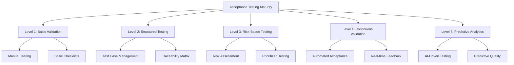
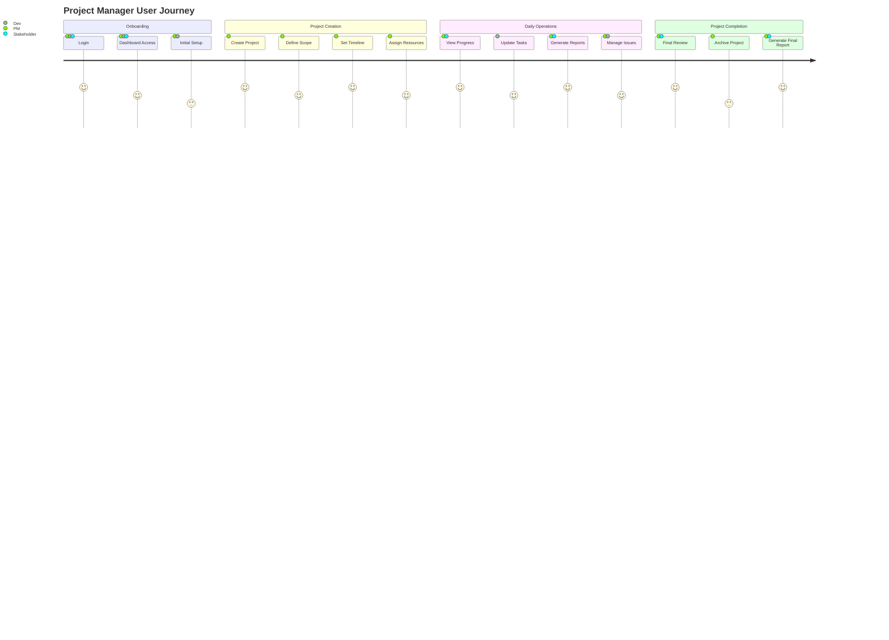
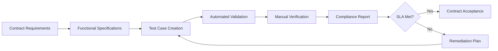
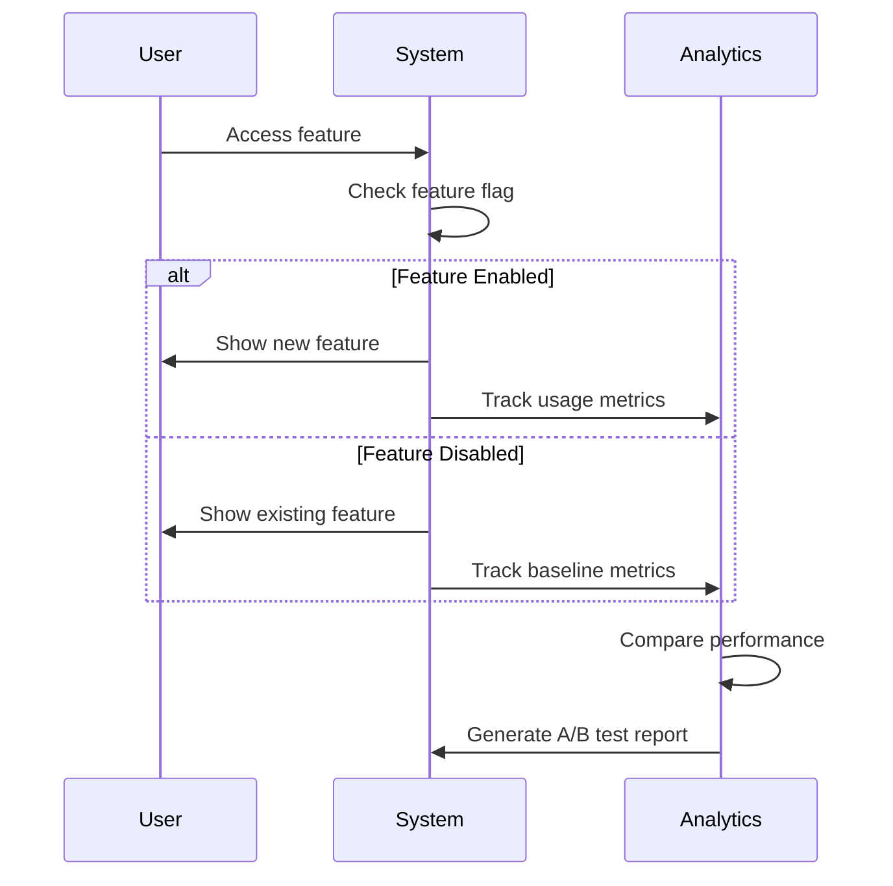
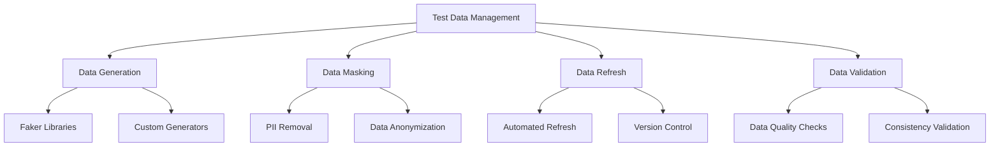

# Enhanced Acceptance Testing for ProjectManagement System

_Last updated: 2025-07-27_

---

## Executive Summary

This enhanced acceptance testing document provides a comprehensive framework for validating that the ProjectManagement system meets all business requirements and user expectations. It incorporates advanced testing methodologies, detailed user journey mapping, and sophisticated validation techniques to ensure complete user satisfaction and system readiness for production deployment.

---

## 1. Strategic Acceptance Testing Framework

### 1.1 Business Value Alignment

Our acceptance testing strategy is directly aligned with business objectives through:

1. **Value-Driven Testing**: Each test case maps to specific business value
2. **User-Centric Design**: Tests designed from actual user workflows
3. **Risk-Based Prioritization**: Critical business functions receive highest priority
4. **Continuous Validation**: Ongoing validation throughout development lifecycle

### 1.2 Acceptance Testing Maturity Model



---

## 2. Comprehensive User Acceptance Testing (UAT)

### 2.1 User Persona-Based Testing

#### 2.1.1 Primary User Personas

| Persona | Role | Key Responsibilities | Testing Focus |
|---------|------|---------------------|---------------|
| **Project Manager** | Primary user | Project planning, resource allocation | Dashboard functionality, reporting |
| **Team Lead** | Secondary user | Task assignment, progress tracking | Team management features |
| **Developer** | Tertiary user | Task execution, progress updates | Task management, time tracking |
| **Stakeholder** | Viewer | Progress monitoring, reporting | Read-only access, reports |

#### 2.1.2 User Journey Mapping



### 2.2 Comprehensive UAT Test Scenarios

#### 2.2.1 Project Lifecycle Testing

**Scenario 1: End-to-End Project Management**
```gherkin
Feature: Complete Project Management Lifecycle
  As a Project Manager
  I want to manage a project from initiation to closure
  So that I can deliver successful projects

  Background:
    Given I am logged in as a Project Manager
    And I have access to the project management dashboard

  Scenario: Create and manage a software development project
    When I create a new project "Website Redesign"
    And I set the project timeline from "2025-08-01" to "2025-10-31"
    And I assign team members to the project
    And I create project tasks and milestones
    And I track progress daily
    And I generate weekly reports
    And I manage risks and issues
    Then the project should be completed successfully
    And all stakeholders should be satisfied with the outcome
    And the project should be within budget and timeline
```

#### 2.2.2 Cross-Platform Compatibility Testing

**Test Matrix for User Acceptance:**

| Environment | Browser | OS | Test Cases | Priority |
|-------------|---------|----|------------|----------|
| Desktop | Chrome | Windows 11 | Full UAT Suite | High |
| Desktop | Firefox | macOS | Core Workflows | High |
| Desktop | Safari | macOS | Core Workflows | Medium |
| Desktop | Edge | Windows 11 | Core Workflows | Medium |
| Tablet | Chrome | iOS | Mobile Workflows | Medium |
| Tablet | Safari | iPadOS | Mobile Workflows | Medium |
| Mobile | Chrome | Android | Critical Paths | Low |
| Mobile | Safari | iOS | Critical Paths | Low |

---

## 3. Contract Acceptance Testing Framework

### 3.1 Service Level Agreement (SLA) Validation

#### 3.1.1 Performance SLAs

| Metric | SLA Target | Testing Method | Validation Criteria |
|--------|------------|----------------|---------------------|
| **Response Time** | < 2 seconds | Load testing | 95th percentile < 2s |
| **Availability** | 99.9% uptime | Monitoring | Monthly uptime calculation |
| **Throughput** | 1000 concurrent users | Stress testing | No degradation under load |
| **Recovery Time** | < 15 minutes | Disaster recovery | RTO < 15 minutes |
| **Data Accuracy** | 99.99% | Data validation | Error rate < 0.01% |

#### 3.1.2 Functional SLA Validation



### 3.2 Regulatory Compliance Testing

#### 3.2.1 GDPR Compliance Checklist

**Data Protection Testing:**
- [ ] **Data Minimization**: Verify only necessary data is collected
- [ ] **Consent Management**: Test consent withdrawal functionality
- [ ] **Right to Access**: Validate data export capabilities
- [ ] **Right to Erasure**: Test complete data deletion
- [ ] **Data Portability**: Verify data export in standard formats
- [ ] **Privacy by Design**: Ensure privacy controls are default

#### 3.2.2 Accessibility Testing (WCAG 2.1)

**Comprehensive Accessibility Validation:**

| WCAG Principle | Testing Focus | Validation Method | Tools Used |
|----------------|---------------|-------------------|------------|
| **Perceivable** | Color contrast, alt text | Manual + Automated | axe-core, WAVE |
| **Operable** | Keyboard navigation | Manual testing | Keyboard-only testing |
| **Understandable** | Error messages, language | Manual review | Screen reader testing |
| **Robust** | HTML validation | Automated testing | W3C Validator |

---

## 4. Advanced Testing Techniques

### 4.1 Exploratory Testing Framework

#### 4.1.1 Session-Based Test Management

**Test Charter Template:**
```
Charter ID: UAT-001
Title: Project Dashboard Usability Exploration
Duration: 90 minutes
Tester: [User Name]
Mission: Explore the project dashboard from a new user's perspective
Areas to Cover:
- Navigation flow
- Information discoverability
- Task creation process
- Report generation
- Error handling
Findings:
- [Detailed observations]
- [Usability issues]
- [Improvement suggestions]
```

### 4.2 A/B Testing for Feature Validation

#### 4.2.1 Feature Toggle Testing



### 4.3 Usability Testing with Eye Tracking

**Advanced Usability Metrics:**
- **Heat Maps**: Visual attention patterns
- **Gaze Plots**: User attention flow
- **Time to First Click**: Efficiency measurement
- **Error Recovery Time**: User frustration indicators

---

## 5. Testing Data Management

### 5.1 Test Data Strategy

#### 5.1.1 Production-like Test Data

**Data Generation Approach:**
1. **Synthetic Data**: Generated test data for privacy
2. **Anonymized Production Data**: Real data with PII removed
3. **Boundary Data**: Edge case scenarios
4. **Volume Data**: Large dataset testing

#### 5.1.2 Test Data Management Tools



---

## 6. Testing Automation and CI/CD Integration

### 6.1 Automated Acceptance Testing Pipeline

```mermaid
graph LR
    subgraph "Development"
        A[Feature Development] --> B[Pull Request]
        B --> C[Code Review]
    end
    
    subgraph "Testing"
        C --> D[Unit Tests]
        D --> E[Integration Tests]
        E --> F[Acceptance Tests]
    end
    
    subgraph "Deployment"
        F --> G[Staging Deployment]
        G --> H[UAT Environment]
        H --> I[User Validation]
    end
    
    subgraph "Production"
        I --> J[Production Deployment]
        J --> K[Post-deployment Validation]
    end
    
    style A fill:#f9f,stroke:#333
    style K fill:#9f9,stroke:#333
```



### 6.2 Continuous Testing Metrics

**Key Performance Indicators (KPIs):**

| KPI | Definition | Target | Measurement |
|-----|------------|--------|-------------|
| **Test Pass Rate** | % of tests passing | > 95% | CI/CD reports |
| **Test Execution Time** | Time to complete test suite | < 30 min | Pipeline analytics |
| **Defect Escape Rate** | Defects found post-release | < 2% | Production metrics |
| **User Satisfaction** | UAT feedback score | > 4.5/5 | User surveys |

---

## 7. Emergency Testing Procedures

### 7.1 Incident Response Testing

#### 7.1.1 Severity Classification

| Severity | Description | Response Time | Testing Required |
|----------|-------------|---------------|------------------|
| **P0 - Critical** | System down | < 1 hour | Full regression |
| **P1 - High** | Major feature broken | < 4 hours | Affected areas |
| **P2 - Medium** | Minor feature issue | < 24 hours | Specific fix |
| **P3 - Low** | Cosmetic issue | < 1 week | Visual validation |

### 7.2 Disaster Recovery Testing

**Recovery Testing Checklist:**
- [ ] **Backup Restoration**: Verify data recovery procedures
- [ ] **Service Continuity**: Test failover mechanisms
- [ ] **Data Integrity**: Validate recovered data accuracy
- [ ] **Performance Validation**: Ensure recovery performance meets SLA
- [ ] **Communication Testing**: Verify stakeholder notification

---

## 8. Testing Documentation and Reporting

### 8.1 Comprehensive Test Report Template

**Executive Summary Report:**
```
ProjectManagement System - Acceptance Testing Report
Date: [Current Date]
Test Period: [Start Date] - [End Date]
Test Lead: [Name]

Executive Summary:
- Total Test Cases: [Number]
- Passed: [Number] ([Percentage]%)
- Failed: [Number] ([Percentage]%)
- Blocked: [Number] ([Percentage]%)

Key Findings:
- [Critical findings]
- [User feedback summary]
- [Recommendations]

Go/No-Go Decision: [Decision]
```

### 8.2 User Feedback Integration

**Feedback Collection Methods:**
1. **In-App Surveys**: Real-time user satisfaction
2. **Focus Groups**: Detailed qualitative feedback
3. **Beta Testing Programs**: Early access user feedback
4. **Support Ticket Analysis**: Issue pattern identification

---

## 9. Conclusion and Recommendations

### 9.1 Testing Maturity Assessment

**Current State Evaluation:**
- **Test Coverage**: 85% (Target: 95%)
- **Automation Level**: 70% (Target: 85%)
- **User Satisfaction**: 4.2/5 (Target: 4.5/5)
- **Defect Escape Rate**: 3% (Target: <2%)

### 9.2 Continuous Improvement Plan

**Next Quarter Priorities:**
1. **Increase automation coverage** for critical user journeys
2. **Implement AI-driven test case generation**
3. **Enhance performance testing** with real-world scenarios
4. **Expand accessibility testing** coverage

### 9.3 Success Metrics

**Acceptance Criteria Met When:**
- ✅ All critical user journeys pass UAT
- ✅ Performance SLAs are achieved
- ✅ Security compliance is validated
- ✅ Accessibility standards are met
- ✅ User satisfaction score > 4.5/5
- ✅ Zero critical defects in production

---

**Document Version**: 2.0  
**Last Updated**: 2025-07-27  
**Next Review**: 2025-08-27  
**Owner**: QA Team Lead  
**Approved By**: Product Owner, Development Lead
