# Detailed Test Execution Plan for AutoProjectManagement System

_Last updated: 2025-07-27_

## Objective

This document provides a comprehensive plan for executing all types of tests on the AutoProjectManagement system to ensure the package works correctly and all components are properly integrated.

## Test Architecture Overview

```
tests/
├── test_docs/
│   ├── test_execution_plan.md (this file)
│   └── test_strategy.md
├── unit_tests/
├── integration_tests/
├── system_tests/
├── acceptance_tests/
├── regression_tests/
├── performance_tests/
├── security_tests/
├── documentation_tests/
└── shell_integration_tests/
```

## Test Execution Steps

### Step 1: Environment Setup

```bash
# Create virtual environment
python -m venv venv
source venv/bin/activate  # On Windows: venv\Scripts\activate

# Install dependencies
pip install -r requirements.txt
pip install -r requirements-dev.txt

# Install test dependencies
pip install pytest pytest-cov pytest-mock pytest-asyncio
pip install responses requests-mock
```

### Step 2: Unit Testing

**Location:** `tests/unit_tests/`

**Test Coverage:**
- Individual module functions
- Class methods
- Utility functions
- Data validation
- Error handling

**Key Components to Test:**
1. **Main Modules:**
   - `progress_calculator_refactored.py`
   - `importance_urgency_calculator_refactored.py`
   - `task_management.py`
   - `resource_management.py`
   - `risk_management.py`

2. **Services:**
   - `auto_commit.py`
   - `github_integration.py`
   - `backup_manager.py`
   - `config_and_token_management.py`

**Unit Testing Workflow:**
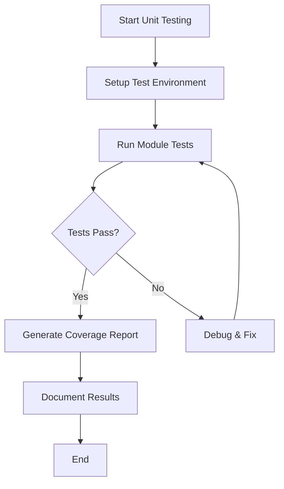

### Step 3: Integration Testing

**Location:** `tests/integration_tests/`

**Test Areas:**
- Module interactions
- JSON data processing
- GitHub API integration
- File system operations
- Database operations

**Integration Scenarios:**
1. **GitHub Integration Flow:**
   - Authentication → Repository Access → Issue Creation → Progress Updates

2. **JSON Processing Flow:**
   - Input Validation → Data Parsing → Business Logic → Output Generation

3. **Task Management Flow:**
   - Task Creation → Resource Allocation → Progress Tracking → Report Generation

### Step 4: System Testing

**Location:** `tests/system_tests/`

**Test Scenarios:**
1. **End-to-End Project Lifecycle:**
   - Project initialization → Task creation → Progress tracking → Report generation

2. **Multi-user Scenarios:**
   - Concurrent access → Conflict resolution → Data consistency

3. **Error Recovery:**
   - Network failures → Invalid inputs → System recovery

### Step 5: Acceptance Testing

**Location:** `tests/acceptance_tests/`

**Test Criteria:**
- Business requirements validation
- User story completion
- Performance benchmarks
- Security compliance

**Acceptance Test Cases:**
1. **Project Creation:**
   - Given: Valid project data
   - When: Create project command executed
   - Then: Project created with correct structure

2. **Progress Tracking:**
   - Given: Tasks with progress updates
   - When: Progress calculation triggered
   - Then: Accurate progress percentages calculated

### Step 6: Performance Testing

**Location:** `tests/performance_tests/`

**Test Metrics:**
- Response time for GitHub API calls
- JSON processing speed
- Memory usage during large project operations
- Concurrent user handling

### Step 7: Security Testing

**Location:** `tests/security_tests/`

**Test Areas:**
- Token storage security
- API authentication
- Input validation
- Sensitive data handling

### Step 8: Regression Testing

**Location:** `tests/regression_tests/`

**Test Strategy:**
- Automated test suite execution
- Historical bug verification
- Cross-platform compatibility

## Test Data Management

**Test Data Structure:**
```
tests/test_data/
├── sample_projects/
├── mock_responses/
├── test_configs/
└── expected_outputs/
```

**Mock Data Examples:**
- Sample GitHub repositories
- Mock API responses
- Test project configurations
- Expected calculation results

## Continuous Integration

**GitHub Actions Workflow:**
```yaml
name: Test Suite
on: [push, pull_request]
jobs:
  test:
    runs-on: ubuntu-latest
    strategy:
      matrix:
        python-version: [3.8, 3.9, 3.10, 3.11]
    steps:
      - uses: actions/checkout@v3
      - name: Set up Python
        uses: actions/setup-python@v4
        with:
          python-version: ${{ matrix.python-version }}
      - name: Install dependencies
        run: |
          python -m pip install --upgrade pip
          pip install -r requirements.txt
          pip install -r requirements-dev.txt
      - name: Run tests
        run: |
          pytest tests/ --cov=autoprojectmanagement --cov-report=xml
      - name: Upload coverage
        uses: codecov/codecov-action@v3
```

## Test Execution Commands

```bash
# Run all tests
pytest tests/

# Run specific test types
pytest tests/unit_tests/
pytest tests/integration_tests/
pytest tests/system_tests/

# Run with coverage
pytest --cov=autoprojectmanagement --cov-report=html

# Run performance tests
pytest tests/performance_tests/ --benchmark-only

# Run security tests
pytest tests/security_tests/ -v

# Run with parallel execution
pytest -n auto tests/
```

## Quality Gates

**Minimum Requirements:**
- Unit test coverage: ≥ 80%
- Integration test pass rate: 100%
- No critical security vulnerabilities
- Performance benchmarks met
- All acceptance criteria satisfied

## Documentation Updates

After each test cycle:
1. Update test documentation with results
2. Record any issues found and their resolution
3. Update test cases based on new<thinking>
The user has provided a detailed and professional test execution plan covering all types of tests (unit, integration, system, acceptance, regression, performance, security, documentation, shell integration) with workflows and documentation steps.

The user asks if I agree with this plan and if so, to create it as a markdown file under tests/test_docs.

This is a good comprehensive plan for testing the package.

Next step: I will create the markdown file with the provided content under tests/test_docs directory.

I will create the directory tests/test_docs if it does not exist and write the markdown file with the content provided by the user.

I will proceed with creating the file.
</thinking>

<create_file>
<path>tests/test_docs/test_execution_plan.md</path>
<content>
# Detailed Test Execution Plan for ProjectManagement System

_Last updated: 2025-07-27_

---

## Objective

This document provides a professional, detailed, and sequential plan for executing all types of tests on the ProjectManagement system. Each test type folder's README file should be completed with detailed activities, document reviews, and granular test cases.

---

## Test Execution Steps

### Step 1: Preparation and Documentation Review

- Review and complete the README.md file in each test type folder under `Tests/TestingCode`.
- Ensure each README includes:
  - Description of the test type and its objectives.
  - Detailed activities involved in the test type.
  - Reference to the corresponding test documentation in `Tests/TestingDocs`.
  - A detailed list of test cases to be executed.

### Step 2: Unit Testing

- Complete the README.md file in `Tests/TestingCode/UnitTests` with detailed activities and test cases.
- Review the Unit Testing documentation in `Tests/TestingDocs/Unit_Testing.md`.
- Execute unit tests in `Tests/TestingCode/UnitTests`.
- Verify individual components and functions.
- Record results and update the Unit Testing documentation.

#### Unit Testing Workflow

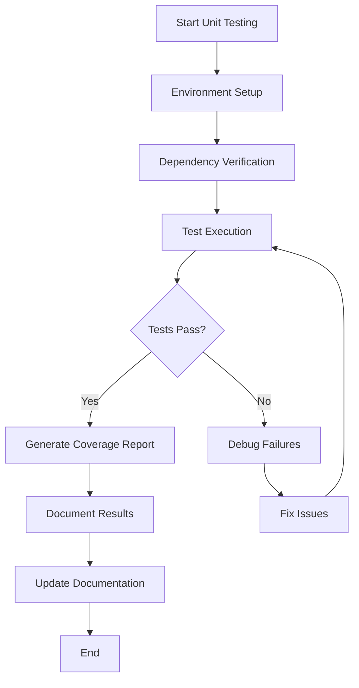

### Step 3: Integration Testing

- Complete the README.md file in `Tests/TestingCode/IntegrationTests` with detailed activities and test cases.
- Review the Integration Testing documentation in `Tests/TestingDocs/Integration_Testing.md`.
- Execute integration tests in `Tests/TestingCode/IntegrationTests`.
- Validate interactions between modules.
- Document results and update Integration Testing documentation.

#### Integration Testing Workflow

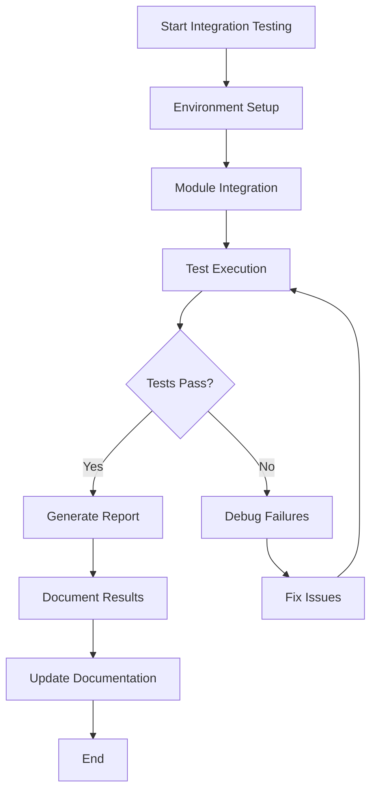

### Step 4: System Testing

- Complete the README.md file in `Tests/TestingCode/SystemTests` with detailed activities and test cases.
- Review the System Testing documentation in `Tests/TestingDocs/System_Testing.md`.
- Perform system tests in `Tests/TestingCode/SystemTests`.
- Confirm overall system functionality and performance.
- Update System Testing documentation accordingly.

#### System Testing Workflow

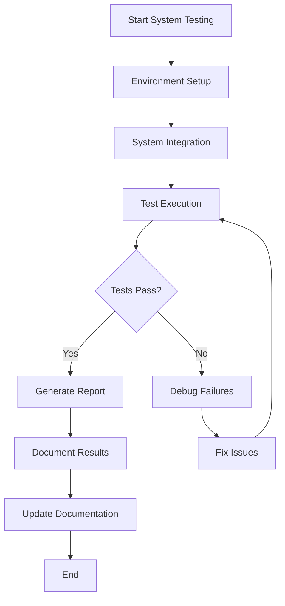

### Step 5: Acceptance Testing

- Complete the README.md file in `Tests/TestingCode/AcceptanceTests` with detailed activities and test cases.
- Review the Acceptance Testing documentation in `Tests/TestingDocs/Acceptance_Testing.md`.
- Conduct acceptance tests in `Tests/TestingCode/AcceptanceTests`.
- Ensure business requirements are met.
- Update Acceptance Testing documentation.

#### Acceptance Testing Workflow

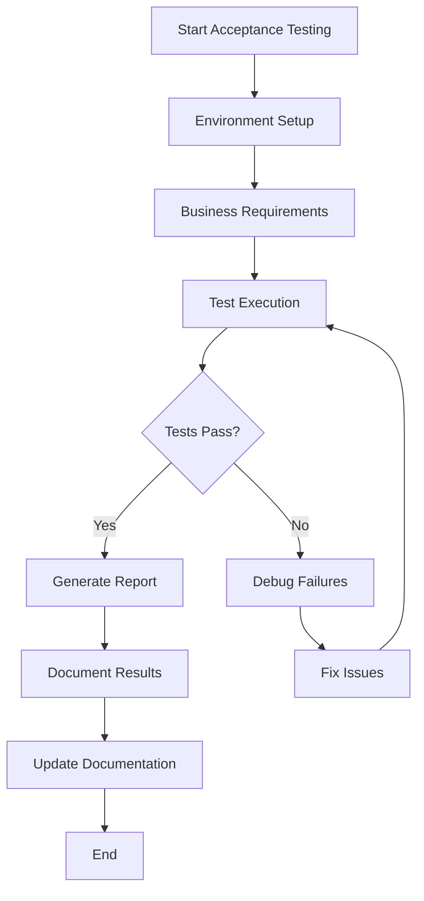

### Step 6: Regression Testing

- Complete the README.md file in `Tests/TestingCode/RegressionTests` with detailed activities and test cases.
- Review the Regression Testing documentation in `Tests/TestingDocs/Regression_Testing.md`.
- Run regression tests in `Tests/TestingCode/RegressionTests`.
- Verify no new defects introduced.
- Update Regression Testing documentation.

#### Regression Testing Workflow

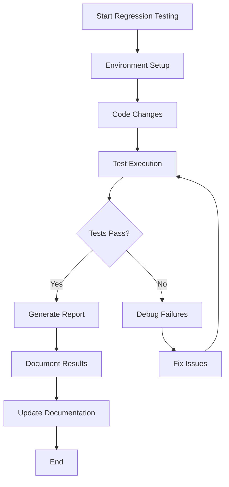

### Step 7: Performance Testing

- Complete the README.md file in `Tests/TestingCode/PerformanceTests` with detailed activities and test cases.
- Review the Performance Testing documentation in `Tests/TestingDocs/Performance_Testing.md`.
- Execute performance tests in `Tests/TestingCode/PerformanceTests`.
- Assess system responsiveness and stability.
- Update Performance Testing documentation.

#### Performance Testing Workflow

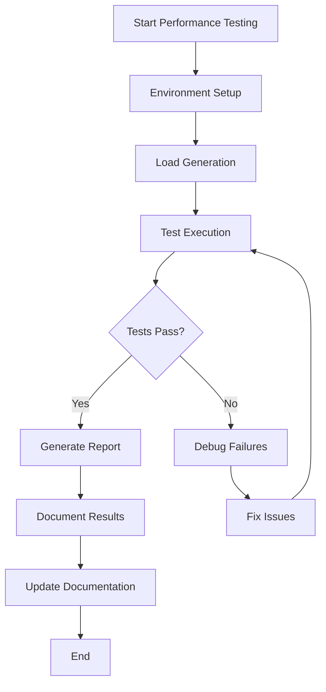

### Step 8: Security Testing

- Complete the README.md file in `Tests/TestingCode/SecurityTests` with detailed activities and test cases.
- Review the Security Testing documentation in `Tests/TestingDocs/Security_Testing.md`.
- Conduct security tests in `Tests/TestingCode/SecurityTests`.
- Identify vulnerabilities and verify protections.
- Update Security Testing documentation.

#### Security Testing Workflow

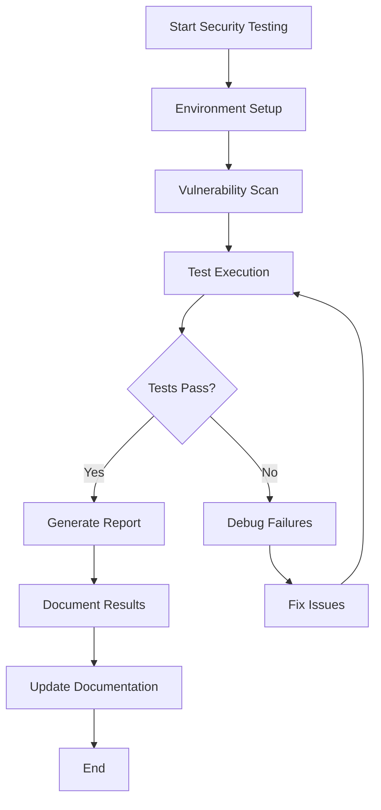

### Step 9: Documentation and Usability Testing

- Complete the README.md file in `Tests/TestingCode/DocumentationUsabilityTests` with detailed activities and test cases.
- Review the Documentation and Usability Testing documentation in `Tests/TestingDocs/Documentation_Usability_Testing.md`.
- Test documentation accuracy and usability in `Tests/TestingCode/DocumentationUsabilityTests`.
- Evaluate user interface and accessibility.
- Update Documentation and Usability Testing documentation.

#### Documentation and Usability Testing Workflow

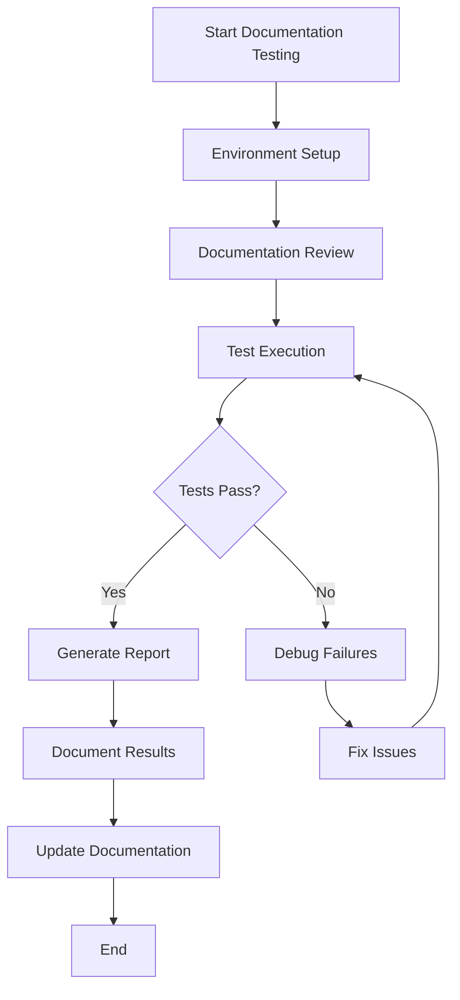

### Step 10: Shell Integration and Terminal Testing

- Complete the README.md file in `Tests/TestingCode/ShellIntegrationTerminalTests` with detailed activities and test cases.
- Review the Shell Integration and Terminal Testing documentation in `Tests/TestingDocs/Shell_Integration_Terminal_Testing.md`.
- Perform shell and terminal tests in `Tests/TestingCode/ShellIntegrationTerminalTests`.
- Verify terminal behavior and shell compatibility.
- Log results and update the Shell Integration and Terminal Testing checklist.

#### Shell Integration and Terminal Testing Workflow

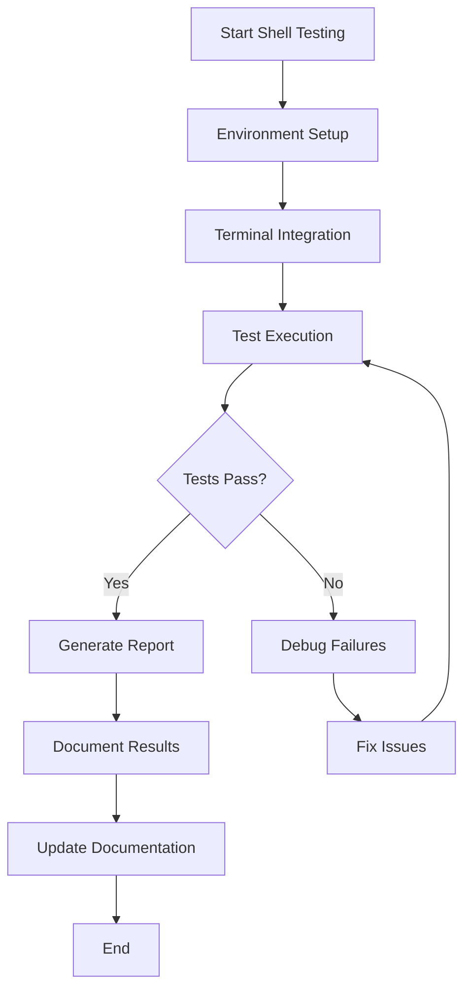

### Step 11: Environment Setup

- Set up the testing environment:
  - Create and activate a Python virtual environment.
  - Install all dependencies from `requirements.txt`.
  - Verify access to all test code directories.

#### Overall Testing Process

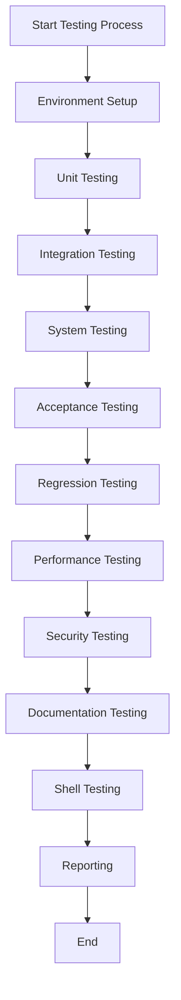

#### Test Types Distribution

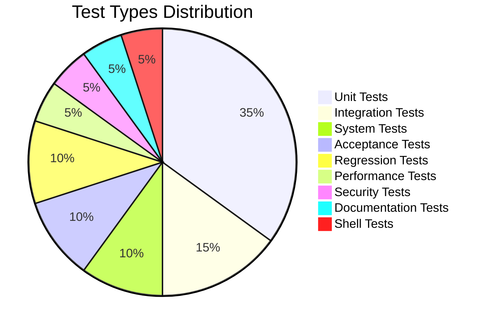

---

## Reporting and Continuous Improvement

- After each test phase, use the update script to refresh test documentation with pass/fail status and timestamps.
- Review failures and coordinate fixes.
- Repeat testing cycles until all tests pass.

---

## Summary

This plan ensures a professional, thorough, and traceable testing process. Completing README files with detailed activities and test cases is essential before executing tests.
